# READ-ME
The process presented bellow was used to transform data of all INMET Meteorological Stations.
Here, it can be seen the results exemplified for one of them (the station of Mangaratiba).

Since the problems found in data (see section 2) are specific for each dataset, the decision-making process is 
individualized, so that the pipeline cannot be completely automated.
Though, the process is similar for all stations, so it is not necessary to show a separate file for each one.

# Setup

```python
import pytz
import pandas as pd
import numpy as np
from datetime import date, datetime, time, timedelta, timezone
from matplotlib import pyplot as plt
import seaborn as sns
import glob
import math
from dateutil import parser
```

```python
# Customized functions
import Setup_INMET as stp 
```

# 1. Import data

```python
# List of files
path = '.\marambaia' # path for folder with the source files
lista_arq = glob.glob(path + "/*.csv")

len(lista_arq)
```

> **Output:**
> 23

```python
# Generate dataset with standard variable names
nomes = ['Dt_Hr', 'Precip', 'Pres_Atm', 'Pres_Atm_max', 'Pres_Atm_min', 'Rad', 'Temp_Amb', 'Pto_Orv', 'Temp_Amb_max', 'Temp_Amb_min', 'Pto_Orv_max',
        'Pto_Orv_min', 'Umidade_max', 'Umidade_min', 'Umidade', 'Vento_dir', 'Vento_raj', 'Vento_vel']
local = ['LATITUDE:', 'LONGITUDE:', 'ALTITUDE:']
dataset = concat_dfs(lista_arq, skip=8, colunas=nomes, loc_cols = local, verb=True)
dataset.head()
```

<table border="1" class="dataframe">
  <thead>
    <tr style="text-align: right;">
      <th></th>
      <th>Dt_Hr</th>
      <th>timestamp</th>
      <th>Lat</th>
      <th>Long</th>
      <th>Alt</th>
      <th>Precip</th>
      <th>Pres_Atm</th>
      <th>Pres_Atm_max</th>
      <th>Pres_Atm_min</th>
      <th>Rad</th>
      <th>...</th>
      <th>Temp_Amb_max</th>
      <th>Temp_Amb_min</th>
      <th>Pto_Orv_max</th>
      <th>Pto_Orv_min</th>
      <th>Umidade_max</th>
      <th>Umidade_min</th>
      <th>Umidade</th>
      <th>Vento_dir</th>
      <th>Vento_raj</th>
      <th>Vento_vel</th>
    </tr>
  </thead>
  <tbody>
    <tr>
      <th>0</th>
      <td>2002-11-08 00:00:00+00:00</td>
      <td>1.036714e+09</td>
      <td>-23.05</td>
      <td>-43.6</td>
      <td>9.7</td>
      <td>0.0</td>
      <td>1021.4</td>
      <td>1021.4</td>
      <td>1021.1</td>
      <td>-9999.0</td>
      <td>...</td>
      <td>18.2</td>
      <td>18.0</td>
      <td>15.8</td>
      <td>15.4</td>
      <td>86.0</td>
      <td>85.0</td>
      <td>86.0</td>
      <td>28.0</td>
      <td>3.8</td>
      <td>2.0</td>
    </tr>
    <tr>
      <th>1</th>
      <td>2002-11-08 01:00:00+00:00</td>
      <td>1.036717e+09</td>
      <td>-23.05</td>
      <td>-43.6</td>
      <td>9.7</td>
      <td>0.0</td>
      <td>1021.9</td>
      <td>1022.0</td>
      <td>1021.4</td>
      <td>-9999.0</td>
      <td>...</td>
      <td>18.6</td>
      <td>18.2</td>
      <td>16.3</td>
      <td>15.7</td>
      <td>87.0</td>
      <td>85.0</td>
      <td>87.0</td>
      <td>348.0</td>
      <td>5.9</td>
      <td>2.5</td>
    </tr>
    <tr>
      <th>2</th>
      <td>2002-11-08 02:00:00+00:00</td>
      <td>1.036721e+09</td>
      <td>-23.05</td>
      <td>-43.6</td>
      <td>9.7</td>
      <td>3.6</td>
      <td>1021.7</td>
      <td>1022.5</td>
      <td>1021.7</td>
      <td>-9999.0</td>
      <td>...</td>
      <td>18.5</td>
      <td>17.6</td>
      <td>16.4</td>
      <td>15.4</td>
      <td>89.0</td>
      <td>86.0</td>
      <td>89.0</td>
      <td>17.0</td>
      <td>6.1</td>
      <td>2.5</td>
    </tr>
    <tr>
      <th>3</th>
      <td>2002-11-08 03:00:00+00:00</td>
      <td>1.036724e+09</td>
      <td>-23.05</td>
      <td>-43.6</td>
      <td>9.7</td>
      <td>0.0</td>
      <td>1020.9</td>
      <td>1021.7</td>
      <td>1020.9</td>
      <td>-9999.0</td>
      <td>...</td>
      <td>17.8</td>
      <td>17.4</td>
      <td>15.9</td>
      <td>15.7</td>
      <td>90.0</td>
      <td>89.0</td>
      <td>90.0</td>
      <td>29.0</td>
      <td>3.0</td>
      <td>1.8</td>
    </tr>
    <tr>
      <th>4</th>
      <td>2002-11-08 04:00:00+00:00</td>
      <td>1.036728e+09</td>
      <td>-23.05</td>
      <td>-43.6</td>
      <td>9.7</td>
      <td>0.0</td>
      <td>1020.3</td>
      <td>1020.8</td>
      <td>1020.3</td>
      <td>-9999.0</td>
      <td>...</td>
      <td>17.4</td>
      <td>17.2</td>
      <td>15.8</td>
      <td>15.6</td>
      <td>91.0</td>
      <td>90.0</td>
      <td>91.0</td>
      <td>2.0</td>
      <td>3.9</td>
      <td>2.4</td>
    </tr>
  </tbody>
</table>
<p>5 rows × 22 columns</p>


Note: unsing `verb=True` in `concat_dfs` would produce outputs like:

    0 :  marambaia\INMET_SE_RJ_A602_MARAMBAIA_2002.csv linhas:  1296 colunas:  21
    Index(['Dt_Hr', 'Lat', 'Long', 'Alt', 'Precip', 'Pres_Atm', 'Pres_Atm_max',
           'Pres_Atm_min', 'Rad', 'Temp_Amb', 'Pto_Orv', 'Temp_Amb_max',
           'Temp_Amb_min', 'Pto_Orv_max', 'Pto_Orv_min', 'Umidade_max',
           'Umidade_min', 'Umidade', 'Vento_dir', 'Vento_raj', 'Vento_vel'],
          dtype='object')

```python
# Inspecting variable types

dataset.dtypes
```

> **Output:**

    Dt_Hr           datetime64[ns, UTC]
    timestamp                   float64
    Lat                         float64
    Long                        float64
    Alt                         float64
    Precip                      float64
    Pres_Atm                    float64
    Pres_Atm_max                float64
    Pres_Atm_min                float64
    Rad                         float64
    Temp_Amb                    float64
    Pto_Orv                     float64
    Temp_Amb_max                float64
    Temp_Amb_min                float64
    Pto_Orv_max                 float64
    Pto_Orv_min                 float64
    Umidade_max                 float64
    Umidade_min                 float64
    Umidade                     float64
    Vento_dir                   float64
    Vento_raj                   float64
    Vento_vel                   float64
    dtype: object

# 2. Exploratory Analysis and Data Treatment

## 2.1 Initial analysis

```python
# Statistical Properties
stats = dataset.describe(include='all').T
var_princip = ['Precip', 'Pres_Atm', 'Rad', 'Temp_Amb','Pto_Orv', 'Umidade', 'Vento_dir', 'Vento_vel']
stats.loc[var_princip]
```

<table border="1" class="dataframe">
  <thead>
    <tr style="text-align: right;">
      <th></th>
      <th>count</th>
      <th>mean</th>
      <th>min</th>
      <th>25%</th>
      <th>50%</th>
      <th>75%</th>
      <th>max</th>
      <th>std</th>
    </tr>
  </thead>
  <tbody>
    <tr>
      <th>Precip</th>
      <td>191391.0</td>
      <td>-818.858278</td>
      <td>-9999.0</td>
      <td>0.0</td>
      <td>0.0</td>
      <td>0.0</td>
      <td>97.2</td>
      <td>2741.976692</td>
    </tr>
    <tr>
      <th>Pres_Atm</th>
      <td>193010.0</td>
      <td>145.85012</td>
      <td>-9999.0</td>
      <td>1009.7</td>
      <td>1013.1</td>
      <td>1016.9</td>
      <td>1031.5</td>
      <td>2967.723874</td>
    </tr>
    <tr>
      <th>Rad</th>
      <td>169838.0</td>
      <td>-2858.267495</td>
      <td>-9999.0</td>
      <td>-9999.0</td>
      <td>56.6</td>
      <td>1374.3</td>
      <td>6990.0</td>
      <td>5449.154662</td>
    </tr>
    <tr>
      <th>Temp_Amb</th>
      <td>192872.0</td>
      <td>-804.958546</td>
      <td>-9999.0</td>
      <td>19.9</td>
      <td>22.5</td>
      <td>25.1</td>
      <td>41.4</td>
      <td>2759.33466</td>
    </tr>
    <tr>
      <th>Pto_Orv</th>
      <td>175660.0</td>
      <td>-1721.174251</td>
      <td>-9999.0</td>
      <td>14.6</td>
      <td>18.4</td>
      <td>20.7</td>
      <td>37.4</td>
      <td>3795.236506</td>
    </tr>
    <tr>
      <th>Umidade</th>
      <td>175681.0</td>
      <td>-1143.664927</td>
      <td>-9999.0</td>
      <td>64.0</td>
      <td>80.0</td>
      <td>89.0</td>
      <td>100.0</td>
      <td>3289.996962</td>
    </tr>
    <tr>
      <th>Vento_dir</th>
      <td>184085.0</td>
      <td>-950.123628</td>
      <td>-9999.0</td>
      <td>23.0</td>
      <td>109.0</td>
      <td>216.0</td>
      <td>360.0</td>
      <td>3156.899476</td>
    </tr>
    <tr>
      <th>Vento_vel</th>
      <td>184083.0</td>
      <td>-1082.043166</td>
      <td>-9999.0</td>
      <td>1.3</td>
      <td>2.6</td>
      <td>4.5</td>
      <td>18.7</td>
      <td>3111.061898</td>
    </tr>
  </tbody>
</table>


```python
# Inspect dataset for missing values 
stp.cont_NA(dataset)
```

> **Output:**

    Dt_Hr 0
    timestamp 0
    Lat 0
    Long 0
    Alt 0
    Precip 17701
    Pres_Atm 15621
    Pres_Atm_max 15724
    Pres_Atm_min 15724
    Rad 84987
    Temp_Amb 16481
    Pto_Orv 48267
    Temp_Amb_max 16507
    Temp_Amb_min 16507
    Pto_Orv_max 47841
    Pto_Orv_min 48560
    Umidade_max 37248
    Umidade_min 37978
    Umidade 39043
    Vento_dir 29285
    Vento_raj 29551
    Vento_vel 29309

### Handling error/non-valid values

```python
#  Imputing NaN for non-valid observations
subst = -9999.000000
dataset.replace(subst, np.nan, inplace=True)
```

## 2.2 Analyzing statistical properties

```python
# Statistical properties after initial error handling 

stats = dataset.describe(include='all').T
var_princip = ['Precip', 'Pres_Atm', 'Rad', 'Temp_Amb','Pto_Orv', 'Umidade', 'Vento_dir', 'Vento_vel']
stats.loc[var_princip]
```

<table border="1" class="dataframe">
  <thead>
    <tr style="text-align: right;">
      <th></th>
      <th>count</th>
      <th>mean</th>
      <th>min</th>
      <th>25%</th>
      <th>50%</th>
      <th>75%</th>
      <th>max</th>
      <th>std</th>
    </tr>
  </thead>
  <tbody>
    <tr>
      <th>Precip</th>
      <td>175715.0</td>
      <td>0.126451</td>
      <td>0.0</td>
      <td>0.0</td>
      <td>0.0</td>
      <td>0.0</td>
      <td>97.2</td>
      <td>1.053491</td>
    </tr>
    <tr>
      <th>Pres_Atm</th>
      <td>177795.0</td>
      <td>1014.006674</td>
      <td>997.3</td>
      <td>1010.6</td>
      <td>1013.6</td>
      <td>1017.2</td>
      <td>1031.5</td>
      <td>4.801182</td>
    </tr>
    <tr>
      <th>Rad</th>
      <td>108429.0</td>
      <td>1185.901891</td>
      <td>0.0</td>
      <td>105.4</td>
      <td>874.6</td>
      <td>2093.0</td>
      <td>6990.0</td>
      <td>1129.709719</td>
    </tr>
    <tr>
      <th>Temp_Amb</th>
      <td>176935.0</td>
      <td>23.172907</td>
      <td>-2.8</td>
      <td>20.7</td>
      <td>22.9</td>
      <td>25.3</td>
      <td>41.4</td>
      <td>3.819237</td>
    </tr>
    <tr>
      <th>Pto_Orv</th>
      <td>145149.0</td>
      <td>18.863513</td>
      <td>-10.0</td>
      <td>16.9</td>
      <td>19.2</td>
      <td>21.1</td>
      <td>37.4</td>
      <td>3.250226</td>
    </tr>
    <tr>
      <th>Umidade</th>
      <td>154373.0</td>
      <td>78.630939</td>
      <td>7.0</td>
      <td>71.0</td>
      <td>82.0</td>
      <td>90.0</td>
      <td>100.0</td>
      <td>14.270434</td>
    </tr>
    <tr>
      <th>Vento_dir</th>
      <td>164131.0</td>
      <td>149.98104</td>
      <td>1.0</td>
      <td>50.0</td>
      <td>132.0</td>
      <td>225.0</td>
      <td>360.0</td>
      <td>112.324074</td>
    </tr>
    <tr>
      <th>Vento_vel</th>
      <td>164107.0</td>
      <td>3.377503</td>
      <td>0.0</td>
      <td>1.7</td>
      <td>3.0</td>
      <td>4.7</td>
      <td>18.7</td>
      <td>2.197674</td>
    </tr>
  </tbody>
</table>


```python
# Plotting Probability Distribuition Function 

rotulos = ['Precipitação (mm/h)', 'Pressão Atmosférica (mbar)', 'Radiação (kJ/m²)', 'Temperatuta Ambiente (°C)',
           'Ponto de Orvalho (°C)', 'Umidade Relativa (%)', 'Direção do Vento (graus)', 'Velocidade do Vento (m/s)']
ngrafs = len(var_princip)
l, c = 4, 2 
fig, axes = plt.subplots(l, c, figsize=(20,1.5*ngrafs))
for lin in range(l):
    for col in range(c):
        plt.sca(axes[lin, col])
        i = int(c*(lin+col/c))
        S = dataset[var_princip[i]]
        nome = S.name
        min_, max_ = stats.loc[nome,'min'], stats.loc[nome,'max']
        sns.kdeplot(S)
        plt.gca().set_xlabel(rotulos[i], fontsize=12)
        plt.gca().set_ylabel("Densidade", fontsize=12)
  
        plt.plot(min_,0, 'bo', label='min: '+str(min_))
        plt.plot(max_,0, 'ro', label='max: '+str(max_))
        plt.legend()
        plt.subplots_adjust(hspace=0.3)
  
```

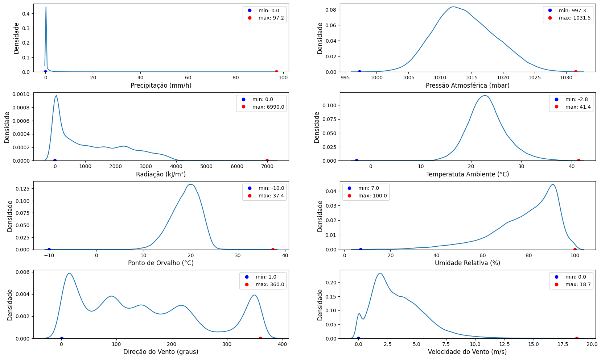

```python
#Trend plots

ngrafs = len(var_princip)
l, c = 4, 2 
fig, axes = plt.subplots(l, c, figsize=(20,1.5*ngrafs))
for lin in range(l):
    for col in range(c):
        plt.sca(axes[lin, col])
        i = int(c*(lin+col/c))
        S = dataset[var_princip[i]]
        nome = S.name
   
        plt.plot(dataset.Dt_Hr, S, ':', linewidth=0.5)
        plt.gca().set_ylabel(rotulos[i], fontsize=12)
  
        plt.legend()
        plt.subplots_adjust(hspace=0.3)
```

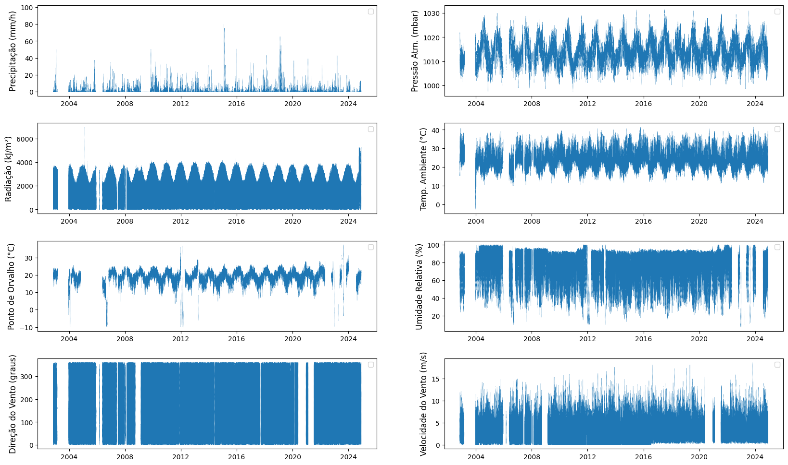

## 2.3 Data Handling (by attribute)

### 2.3.1 Solar Radiation

```python
# Seasonal variation: by day of year (1 - 365)/ by Hour(0 - 24)

Dia_do_ano =  pd.Series(map(lambda t: t.day_of_year, dataset.Dt_Hr)) # day of year (1 to 365)
Hora_do_dia =  pd.Series(map(lambda t: (t.hour-3)%24, dataset.Dt_Hr)) # hour of day (0 to 24, ajusted from UTC to local time)

df_rad = pd.concat([dataset.Dt_Hr, Dia_do_ano, Hora_do_dia, dataset.Rad], axis=1, )
df_rad.columns = ['Data', 'Dia', 'Hora', 'Rad']

fig, ax = plt.subplots(1,2, figsize=(12,5))
ax[0].plot(Dia_do_ano, dataset.Rad, '.',  markersize=0.3)
ax[0].set_title("Radiação por dia do ano")
ax[0].set_xlabel("Dia do ano")
ax[0].set_ylabel("Radiação (kJ/m²)")

ax[1].plot(Hora_do_dia, dataset.Rad, '.', markersize=0.5)
ax[1].set_title("Radiação por hora do dia")
ax[1].set_xlabel("Hora do dia")
ax[1].set_ylabel("Radiação (kJ/m²)")
plt.subplots_adjust(wspace=0.2)
plt.show()
```

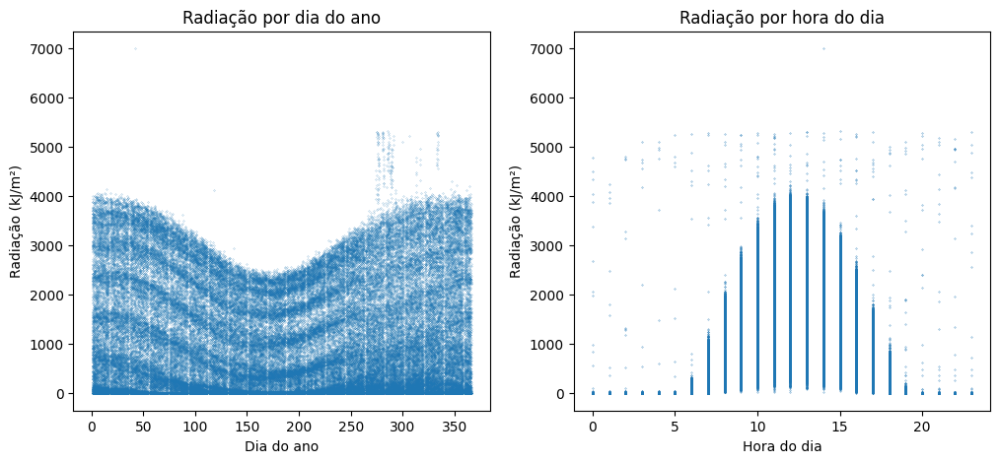

Outliers can be observed in both plots, even in periods of the day when radiation is not expected (before 5 A.M. and after 8 P.M.)

```python
#  Assessing radiation typical values and outliers for different periods of day

# Date range
d1 = str(dataset.Dt_Hr.iloc[0]) 
d2 = '2024-09-20'

# Column names
c_Data = 'Data'
c_Hora = 'Hora'
c_Y = 'Rad'

# Periods of day
h1, h2 = 20, 24  # nigth
h3, h4 = 0, 5  # early morning
h5,h6 = 5,20 # day

dado = df_rad.copy()

stp.graf_fltro_data(dado, c_Y, c_Data, d1, d2, c_Hora, h1, h2)
plt.show()
stp.graf_fltro_data(dado, c_Y, c_Data, d1, d2, c_Hora, h3, h4)
plt.show()
stp.graf_fltro_data(dado, c_Y, c_Data, d1, d2, c_Hora, h5, h6)
plt.show()
```

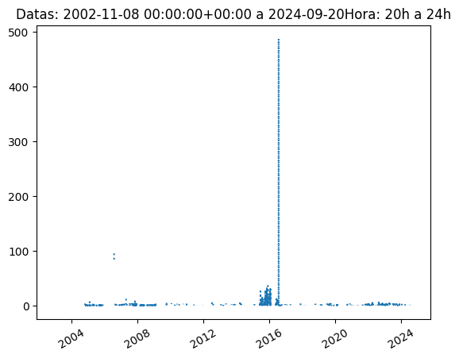

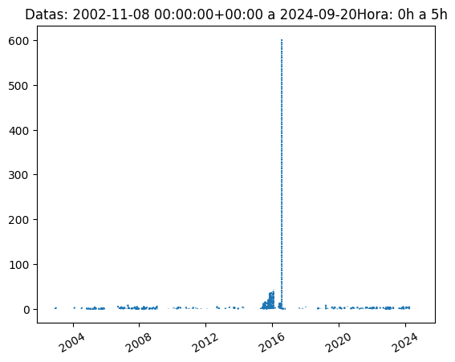

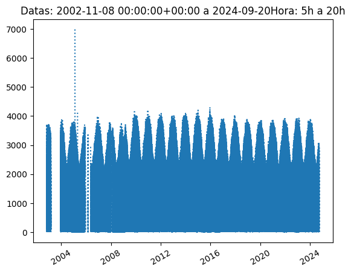

```python
# Plotting PDF (before handlig outilers), each 2 hours of day
# Function 'dist_hora' computes the 98th percentile nad maximu by period. 
# The values are  higlighted in each plot.
# 98th percentiles are also returned as a dict.


step =2
col_h = 'Hora'
col_dado='Rad'
Percentis, Filtros = stp.dist_hora(dado, col_h, col_dado, step=2)
print(Percentis)  
```

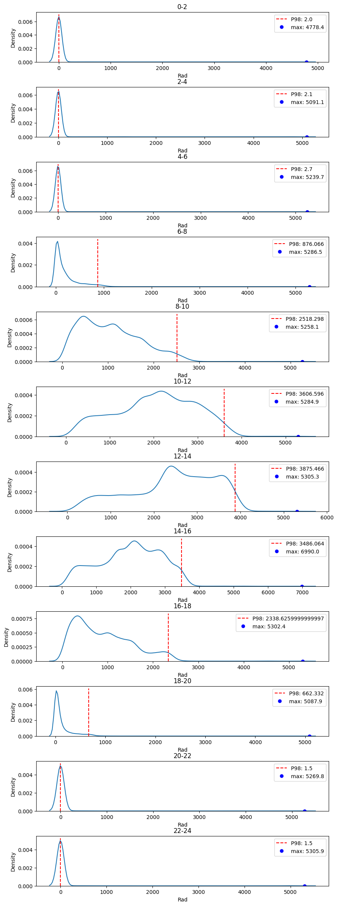

> **Outputs: **   
>     {'0-2': 2.0, '2-4': 2.1, '4-6': 2.7, '6-8': 876.066, '8-10': 2518.298, '10-12': 3606.596, '12-14': 3875.466, '14-16': 3486.064, '16-18': 2338.6259999999997, '18-20': 662.332, '20-22': 1.5, '22-24': 1.5}

```python
# Trend plots (before handling outilers)
# Orange lines show  the 98th percentiles

stp.Trend_percent_periodo(Percentis, Filtros)
```

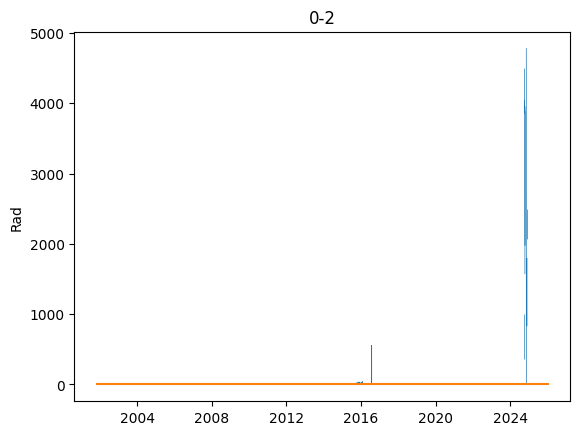

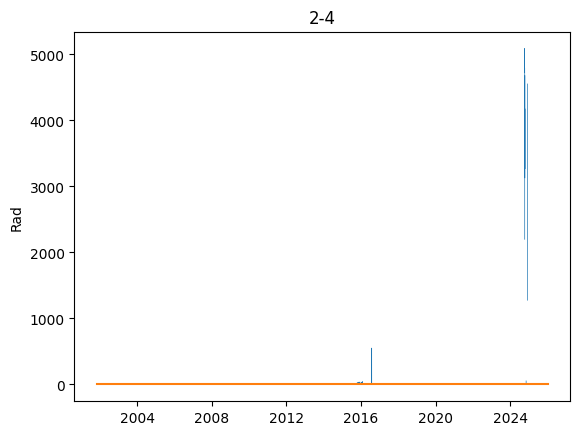

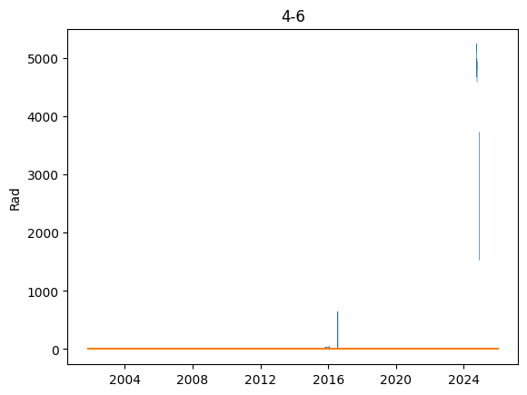

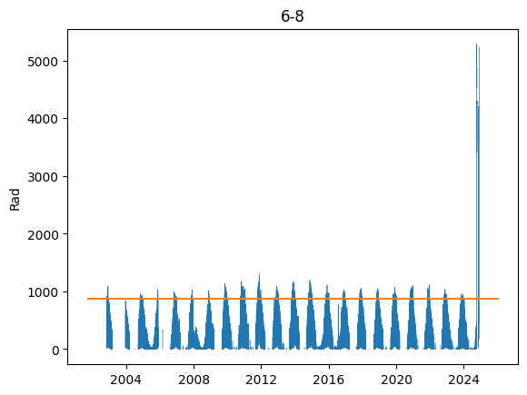

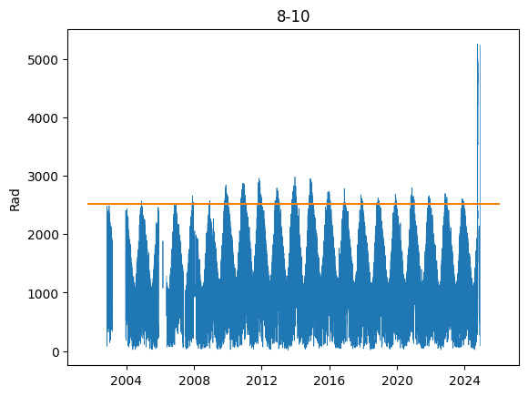

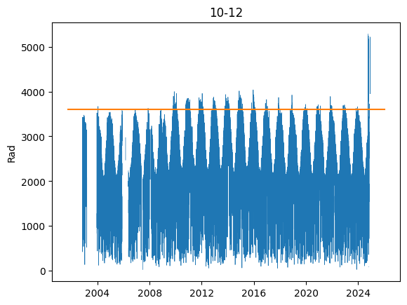

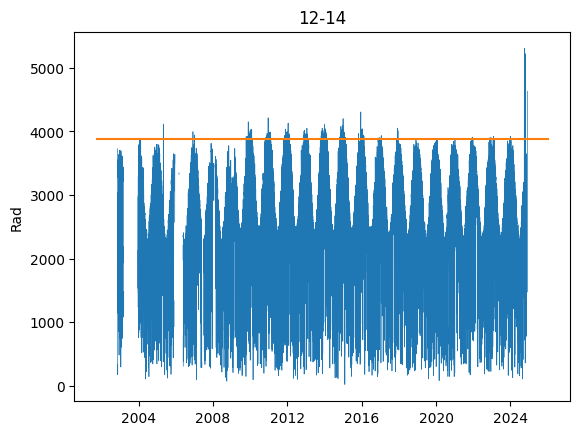

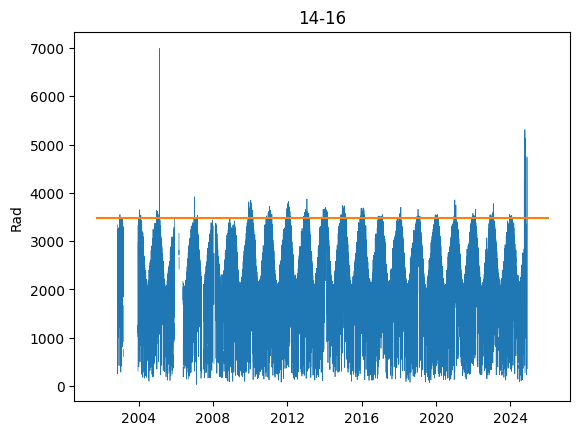

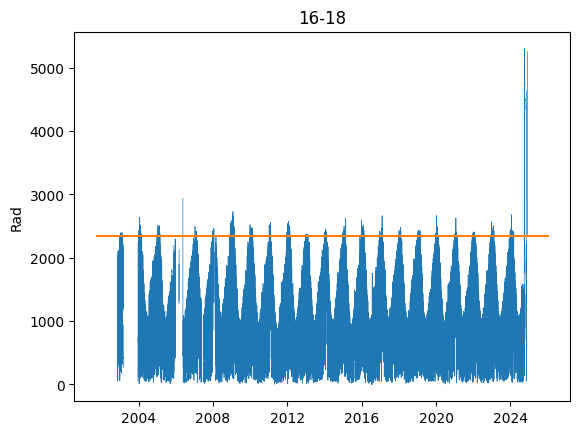

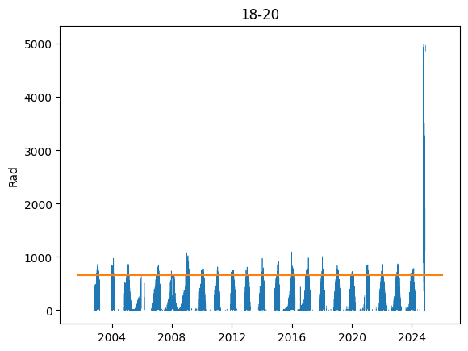

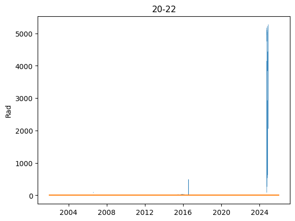

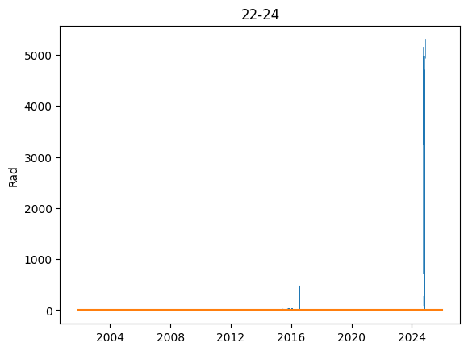

#### Decisions:

 Clean values above p98 for the following periods:

- 1: '2024-09-30' to '2024-12-01'
- 2: '2015-05-01' to '2017-02-01' (0-6h and 20-24h)
- 3: Other outilers, by period

**1st step: '2024-09-30' to '2024-12-01'**

```python
ds_corrig = df_rad.copy()
d1 = '2024-09-30'
d2 = '2024-12-01'
stp.limpar_periodo(ds_corrig, 'Hora', 'Data', 'Rad',d1, d2, Percentis, hi=0, hf=24, step=2)
```

**2nd step: '2015-05-01', '2017-02-01' h: 0-6, 20-24**

```python
d3 = '2015-05-01'
d4 = '2017-02-01'

stp.limpar_periodo(ds_corrig, 'Hora', 'Data', 'Rad', d3, d4, Percentis2, hi=0, hf=6)
stp.limpar_periodo(ds_corrig, 'Hora', 'Data', 'Rad',d3, d4, Percentis, hi=20, hf=24, step=2)
```

**3rd setp: Verify outliers by period**

Decision:
After carefully inspecting specifc dates (using 'graf_fltro_data') for periods:

- 14h to 16h;
- 16h to 18h and
- 18h to 20h,

values > p98 to be cleaned at dates:

- 2005-02-11, 14-16,
- 2006-05-17, 16-18,
- 2006-08-05/06, 20-22

```python
d5, d6 = '2005-02-11' , '2005-02-12'
stp.limpar_periodo(ds_corrig, 'Hora', 'Data', 'Rad', d5, d6, Percentis3, hi=14, hf=16)
d7, d8 = '2006-05-17', '2006-05-18'
stp.limpar_periodo(ds_corrig, 'Hora', 'Data', 'Rad', d7, d8, Percentis3, hi=16, hf=18)
d7, d8 = '2006-08-05', '2006-08-07'
stp.limpar_periodo(ds_corrig, 'Hora', 'Data', 'Rad', d7, d8, Percentis3, hi=20, hf=22)
```

```python
# PDF by period after handling outliers

Percentis4, Filtros4 = stp.dist_hora(ds_corrig, col_h, col_dado, step=2)
```

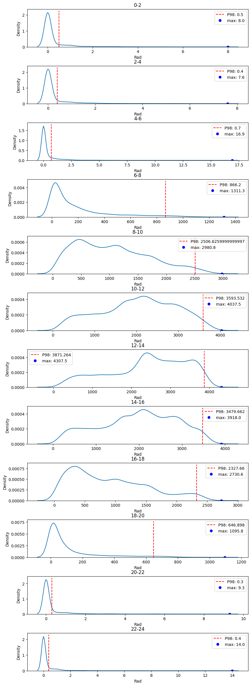

```python
# Trend  afterhandling outliers

plt.plot(ds_corrig.Data, ds_corrig.Rad, ':', linewidth=0.5)
```

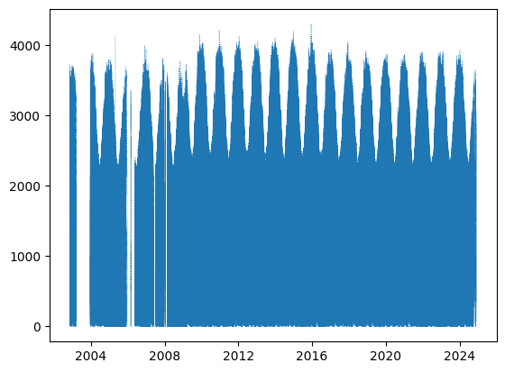

```python
# Upddating dataset
dataset.Rad = ds_corrig.Rad
```

### 2.3.2 Temperature

```python
# Seasonal variation: by day of year (1 - 365)/ by Hour(0 - 24)

df_temp = pd.concat([dataset.Dt_Hr, Dia_do_ano, Hora_do_dia, dataset.Pto_Orv, dataset.Temp_Amb, dataset.Umidade], axis=1)
df_temp.columns = ['Data', 'Dia', 'Hora', 'Pto_Orv', 'Temp_Amb','Umidade']

fig, ax = plt.subplots(1,2, figsize=(12,5))

ax[0].plot(Dia_do_ano, dataset.Temp_Amb, '.',  markersize=0.3)
ax[0].set_title("Tenperatura Ambiente por dia do ano")
ax[0].set_xlabel("Dia do ano")
ax[0].set_ylabel("Temperatura (°C)")


ax[1].plot(df_temp.Hora, df_temp.Temp_Amb, '.', markersize=0.5)
ax[1].set_title("Tenperatura Ambiente por hora do dia")
ax[1].set_xlabel("Hora do dia")
ax[1].set_ylabel("Temperatura (°C)")
plt.subplots_adjust(wspace=0.2)
plt.show()
```

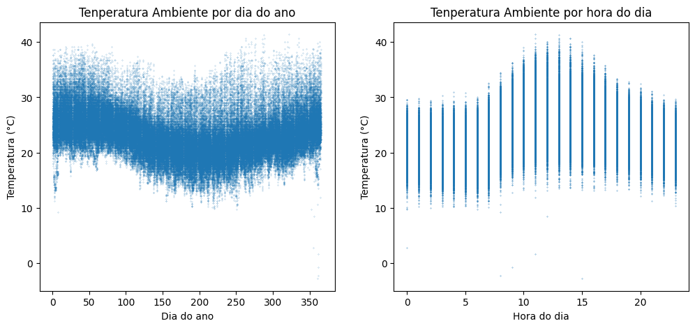

```python
#  Assessing temperature typical values and outliers for different periods of day

d1 = str(dataset.Dt_Hr.iloc[0]) #'2017-01-01'
d2 = str(dataset.Dt_Hr.iloc[-1]) #'2024-12-01'
#d2 = '2024-09-20'

c_Data = 'Data'
c_Hora = 'Hora'
c_Y = 'Temp_Amb'

h1, h2 = 0,6 
h3, h4 = 6,18 
h5,h6 = 18,24

dado = df_temp

stp.graf_fltro_data(dado, c_Y, c_Data, d1, d2, c_Hora, h1, h2)
plt.show()
stp.graf_fltro_data(dado, c_Y, c_Data, d1, d2, c_Hora, h3, h4)
plt.show()
stp.graf_fltro_data(dado, c_Y, c_Data, d1, d2, c_Hora, h5, h6)
plt.show()
```

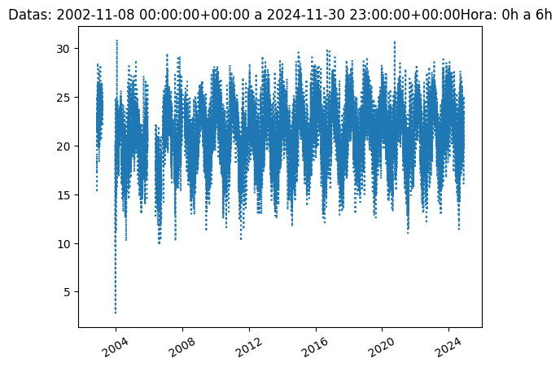

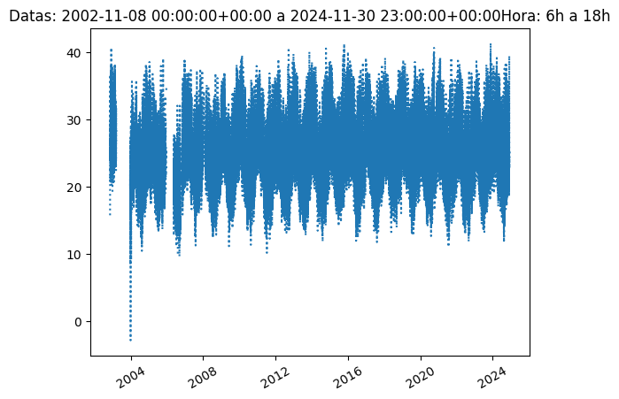

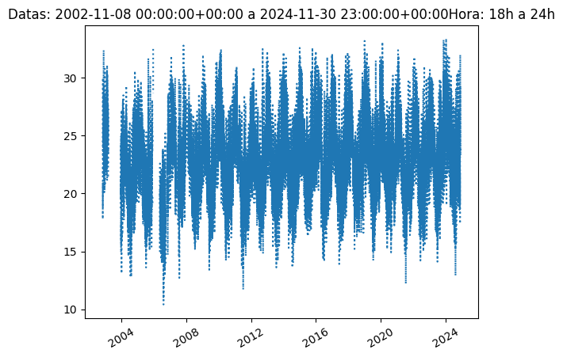

```python
# Plotting PDF (before handlig outilers), each 2 hours of day

step =4
dado = df_temp
col_h = 'Hora'
col_dado='Temp_Amb'
Percentis, Filtros = stp.dist_hora(dado, col_h, col_dado, step=step, p =0.5, max_=False)
print(Percentis)  
```

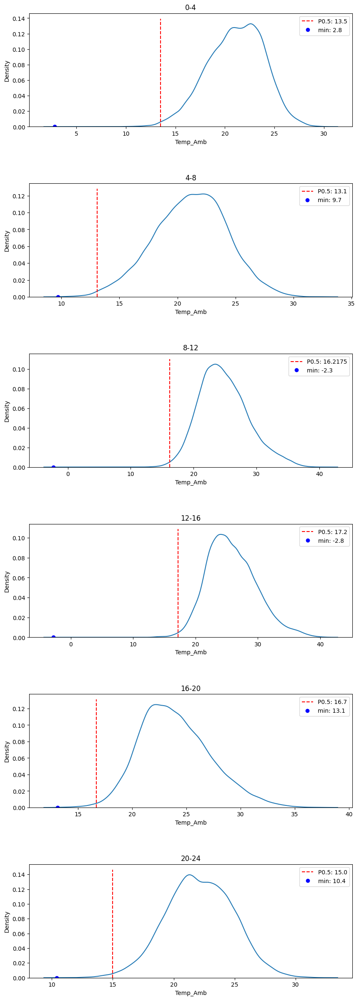

> **Outputs:**
> {'0-4': 13.5, '4-8': 13.1, '8-12': 16.2175, '12-16': 17.2, '16-20': 16.7, '20-24': 15.0}

```python
# Trend plots befor handling outliers
stp.Trend_percent_periodo(Percentis, Filtros, cDado='Temp_Amb')
```

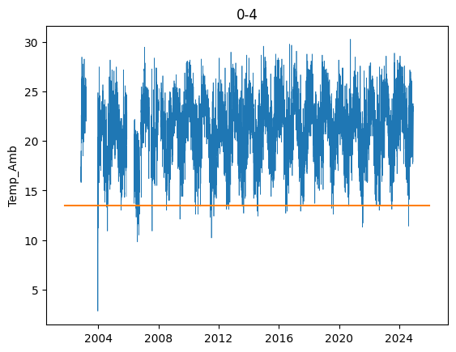

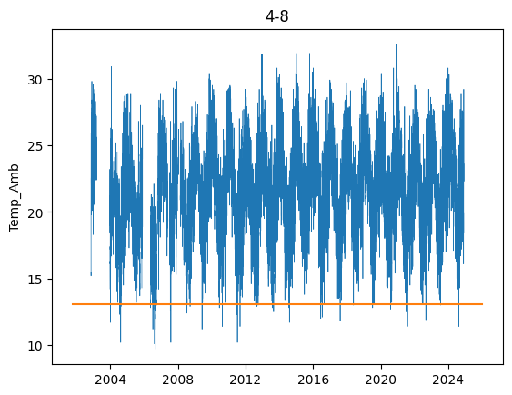

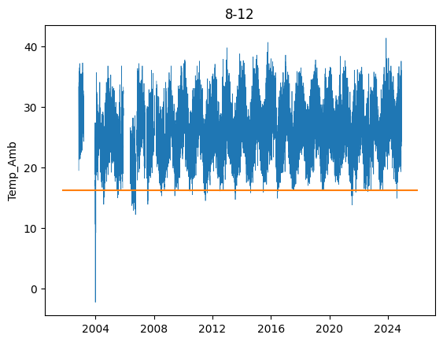

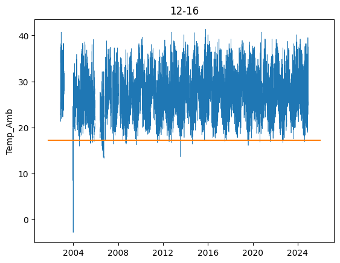

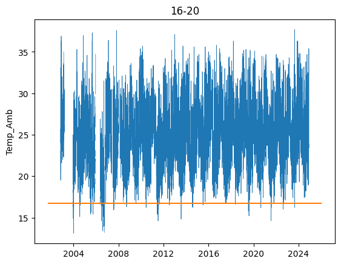

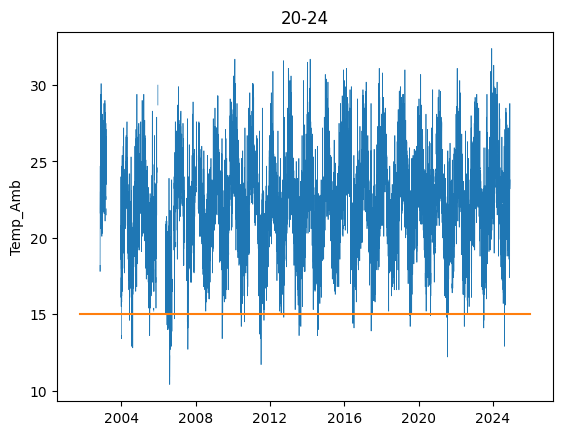

Decision:
Clean velues < 10°C from 2003-12-18 to 2004-01-09

```python
# Plotting the selected period -- with 0.5 percentiles by period (oragnge line)
d1, d2 = '2003-12-18', '2004-01-10'
c_Y = 'Temp_Amb'

stp.graf_fltro_data(dado, c_Y, c_Data, d1,d2, c_Hora,0,24, endplot=False, form='.', label='Temp. Ambiente', markersize=1.5)

c1=dado.Data>=datetime.fromisoformat(d1).replace(tzinfo=tz)
c2=dado.Data<datetime.fromisoformat(d2).replace(tzinfo=tz)
filtro = dado[c1&c2]

P = stp.coluna_percentis(Percentis, filtro.Hora, step=4)
plt.plot(filtro.Data, P, label = "Percentil 0.5", linewidth=1)
X = plt.gca().get_xlim()
plt.plot(X, 2*[10], 'k:', label = 'Critério de corte') # 10°C threshould
plt.ylabel('Temperatura (°C)')
plt.legend(loc='lower right')
plt.title('')

```

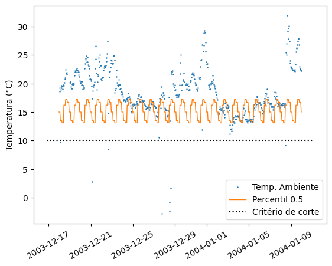

```python
# Handling outliers

c3 =dado.Temp_Amb<10
D_Temp = df_temp.Temp_Amb.copy()
D_Temp.loc[c1&c2&c3] = np.nan
```

```python
# Updating dataset and plotting trend after handling outliers

dataset.Temp_Amb=D_Temp
plt.plot(Temp_old, linewidth=0.2)
plt.show()
plt.plot(dataset.Temp_Amb, linewidth=0.2)
```

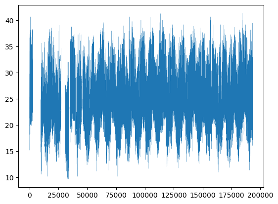

```python
#PDF plot after handling outliers

sns.kdeplot(D_Temp)
```

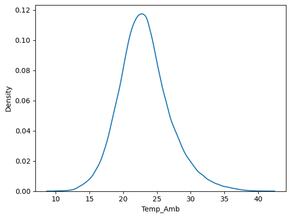

### 2.3.3 Dew point and Relative Humidity

**Decesions:**

- Since there are a large amount of missing values and outliers, the original dew point data will not be used.
  Dew point to be calculated as a function of temperature and relative humidity (after data imputation step).
- The relative humidity dat has been keeped as original

# Export

```python
# Export dataset (stage 1: initial preprocessing)
Arquivo = 'Mangaratiba_stage1.csv'
dataset.to_csv(Arquivo)