# READ-ME
The process presented bellow was used to transform data of all GeoRio Meteorological Stations.
Here, it can be seen the results exemplified for one of them (the station of Sao Cristovao).

Since the problems found in data (see section 2) are specific for each dataset, the decision-making process is 
individualized, so that the pipeline cannot be completely automated.
Though, the process is similar for all stations, so it is not necessary to show a separate file for each one.

# Setup

```python
import pytz
import pandas as pd
import numpy as np
from datetime import date, datetime, time, timedelta, timezone
from matplotlib import pyplot as plt
import seaborn as sns
import glob
import math
```

```python
# Customized functions (find file in ..\utils folder)
import Setup_Met_Stations as stp
```

# 1. Import data

```python
# Files list
path = '.\sao_cristovao' # path for folder with the source files
lista_arq = glob.glob(path + "/*.txt") # list of files

len(lista_arq)
```
> **Output:**   
> 290

```python
# Generate dataset with standard variable names
nomes = ['Dt_Orig', 'HBV_cor','HBV', 'Precip', 'Vento_dir', 'Vento_vel', 'Temp_Amb', 'Pres_Atm', 'Umidade']         

# Coordinates (lat., long., alt.)
localizacao = [-22.89667,-43.22167, 25]

# Dataset generation:
# Concatenates GeoRio files ia a single DataFrame with standard variables names
# - Column names (variables) definition 
# - Date/Hour formatting
# - Numerical values formatting (to decimal '.')
# - Include coordinates metadata (lat./long./alt.)
# - Correct information of Brazilian Daylight Saving Time (HBV)
dataset = stp.concat_dfs_GeoRio(lista_arq, skip=4, colunas=nomes, dados_loc = localizacao, verb=False)
```
Note: Using `verb=True` in `concat_dfs_GeoRio` would produce outputs like:

`0 :  sao_cristovao\sao_cristovao_200008_Met.txt linhas:  1248 colunas:  12
    Index(['Dt_Orig', 'HBV_cor', 'HBV', 'Lat', 'Long', 'Alt', 'Precip',
           'Vento_dir', 'Vento_vel', 'Temp_Amb', 'Pres_Atm', 'Umidade'], 
          dtype='object')`
   
```python    
dataset.head()
```
<table border="1" class="dataframe">
  <thead>
    <tr style="text-align: right;">
      <th></th>
      <th>Dt_Orig</th>
      <th>HBV_cor</th>
      <th>HBV</th>
      <th>Lat</th>
      <th>Long</th>
      <th>Alt</th>
      <th>Precip</th>
      <th>Vento_dir</th>
      <th>Vento_vel</th>
      <th>Temp_Amb</th>
      <th>Pres_Atm</th>
      <th>Umidade</th>
    </tr>
  </thead>
  <tbody>
    <tr>
      <th>0</th>
      <td>2000-08-19 00:00:00</td>
      <td>False</td>
      <td>NaN</td>
      <td>-22.89667</td>
      <td>-43.22167</td>
      <td>25</td>
      <td>ND</td>
      <td>ND</td>
      <td>ND</td>
      <td>ND</td>
      <td>1008.8</td>
      <td>ND</td>
    </tr>
    <tr>
      <th>1</th>
      <td>2000-08-19 00:15:00</td>
      <td>False</td>
      <td>NaN</td>
      <td>-22.89667</td>
      <td>-43.22167</td>
      <td>25</td>
      <td>0.0</td>
      <td>ND</td>
      <td>ND</td>
      <td>ND</td>
      <td>1008.7</td>
      <td>ND</td>
    </tr>
    <tr>
      <th>2</th>
      <td>2000-08-19 00:30:00</td>
      <td>False</td>
      <td>NaN</td>
      <td>-22.89667</td>
      <td>-43.22167</td>
      <td>25</td>
      <td>0.0</td>
      <td>ND</td>
      <td>ND</td>
      <td>ND</td>
      <td>1008.7</td>
      <td>ND</td>
    </tr>
    <tr>
      <th>3</th>
      <td>2000-08-19 00:45:00</td>
      <td>False</td>
      <td>NaN</td>
      <td>-22.89667</td>
      <td>-43.22167</td>
      <td>25</td>
      <td>0.0</td>
      <td>ND</td>
      <td>ND</td>
      <td>ND</td>
      <td>1008.7</td>
      <td>ND</td>
    </tr>
    <tr>
      <th>4</th>
      <td>2000-08-19 01:00:00</td>
      <td>False</td>
      <td>NaN</td>
      <td>-22.89667</td>
      <td>-43.22167</td>
      <td>25</td>
      <td>0.0</td>
      <td>ND</td>
      <td>ND</td>
      <td>ND</td>
      <td>1008.7</td>
      <td>ND</td>
    </tr>
  </tbody>
</table>


```python
# Verify data types
dataset.dtypes
```
> **Output:**   
>
   Dt_Orig      datetime64[ns]
    HBV_cor                bool
    HBV                  object
    Lat                 float64
    Long                float64
    Alt                   int64
    Precip               object
    Vento_dir            object
    Vento_vel            object
    Temp_Amb             object
    Pres_Atm             object
    Umidade              object
    dtype: object
    


# 2. Exploratory Analysis and Data Treatment

## 2.1 Date/Hour: conversion to UTC

### Initial analysis


```python
# HBV (Brazilian Daylight Saving Time) column unique values (search for errors and null values)
dataset.HBV.unique()
```
> **Output:**   
> array([nan, 'ND', 'HBV'], dtype=object)


```python
# Differentiation of Date values 
# Helps to identify changes in time intervals (HBV star/end) and large periods without data
dif = stp.difer_time(dataset.Dt_Orig)
```
  
Finding intervals of interest:

GeoRio data is sampled in a 15 minutes interval.  
- When HBV starts, the clock is moved forward by 60 minutes; so, a 75 (60+15) minutes interval is expected
- When HBV ends, the clock is moved back by 60 minutes; so, a -45 (-60+15) minutes interval is expected

```python
# Comparing intervals between HBV original data and HBV corrected data
c1 = dataset.HBV_cor
c2 =dataset.HBV=='HBV'

# Plot 1: HBV markers (original vs. corrected)
fig, axs = plt.subplots(2,1, figsize=(8,8), sharex='all')
plt.sca(axs[0])
plt.plot(c1,'g--', label='corrigido', linewidth=1)
plt.plot(c2, ':', label='original')
plt.legend()
plt.title("HBV")


# Plot 2: Intervals (d(t)) of interest
c3 = (dif/60)>=75 # HBV starts
c4 = (dif/60)<=-45 # HBV ends
c5 =(dif/3600)>24 # Missing data (jumps grater than 1 day)

plt.sca(axs[1])
plt.plot(c3&~c5, ':', label='1h < d(t) < 1d)')
plt.plot(c4, ':', label=' d(t) <= -45min')
plt.plot(c5, 'k:', label='d(t) > 1d)')
plt.title("Saltos")
plt.legend()
```    

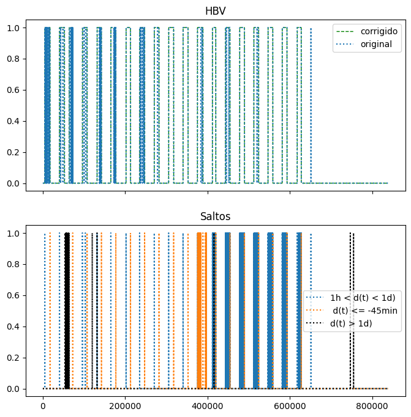
    

```python
#Insert column wit delta(t) information
dataset.insert(1,'delta_t', dif)
```


```python
# Instances with delta << -45min 
c6= (dif/60)<-45
dataset[c6]
```

<table border="1" class="dataframe">
  <thead>
    <tr style="text-align: right;">
      <th></th>
      <th>Dt_Orig</th>
      <th>delta_t</th>
      <th>HBV_cor</th>
      <th>HBV</th>
      <th>Lat</th>
      <th>Long</th>
      <th>Alt</th>
      <th>Precip</th>
      <th>Vento_dir</th>
      <th>Vento_vel</th>
      <th>Temp_Amb</th>
      <th>Pres_Atm</th>
      <th>Umidade</th>
    </tr>
  </thead>
  <tbody>
    <tr>
      <th>375952</th>
      <td>2011-10-20 08:00:00</td>
      <td>-6300.0</td>
      <td>True</td>
      <td>HBV</td>
      <td>-22.89667</td>
      <td>-43.22167</td>
      <td>25</td>
      <td>0.0</td>
      <td>-</td>
      <td>0.0</td>
      <td>20.2</td>
      <td>1016.5</td>
      <td>75</td>
    </tr>
    <tr>
      <th>375961</th>
      <td>2011-10-20 08:15:00</td>
      <td>-6300.0</td>
      <td>True</td>
      <td>HBV</td>
      <td>-22.89667</td>
      <td>-43.22167</td>
      <td>25</td>
      <td>0.0</td>
      <td>067</td>
      <td>1.5</td>
      <td>20.5</td>
      <td>1016.4</td>
      <td>78</td>
    </tr>
    <tr>
      <th>376352</th>
      <td>2011-10-24 08:00:00</td>
      <td>-6300.0</td>
      <td>True</td>
      <td>HBV</td>
      <td>-22.89667</td>
      <td>-43.22167</td>
      <td>25</td>
      <td>0.0</td>
      <td>080</td>
      <td>1.5</td>
      <td>24.3</td>
      <td>1014.6</td>
      <td>66</td>
    </tr>
    <tr>
      <th>376560</th>
      <td>2011-10-26 10:00:00</td>
      <td>-6300.0</td>
      <td>True</td>
      <td>HBV</td>
      <td>-22.89667</td>
      <td>-43.22167</td>
      <td>25</td>
      <td>0.0</td>
      <td>044</td>
      <td>0.1</td>
      <td>33.1</td>
      <td>1004.7</td>
      <td>43</td>
    </tr>
    <tr>
      <th>376629</th>
      <td>2011-10-27 01:15:00</td>
      <td>-6300.0</td>
      <td>True</td>
      <td>HBV</td>
      <td>-22.89667</td>
      <td>-43.22167</td>
      <td>25</td>
      <td>0.0</td>
      <td>037</td>
      <td>1.6</td>
      <td>25.1</td>
      <td>1006.0</td>
      <td>69</td>
    </tr>
    <tr>
      <th>...</th>
      <td>...</td>
      <td>...</td>
      <td>...</td>
      <td>...</td>
      <td>...</td>
      <td>...</td>
      <td>...</td>
      <td>...</td>
      <td>...</td>
      <td>...</td>
      <td>...</td>
      <td>...</td>
      <td>...</td>
    </tr>
    <tr>
      <th>396809</th>
      <td>2012-05-16 23:15:00</td>
      <td>-9900.0</td>
      <td>False</td>
      <td>NaN</td>
      <td>-22.89667</td>
      <td>-43.22167</td>
      <td>25</td>
      <td>0.2</td>
      <td>-</td>
      <td>0.0</td>
      <td>19.2</td>
      <td>1015.4</td>
      <td>ND</td>
    </tr>
    <tr>
      <th>396917</th>
      <td>2012-05-17 23:15:00</td>
      <td>-9900.0</td>
      <td>False</td>
      <td>NaN</td>
      <td>-22.89667</td>
      <td>-43.22167</td>
      <td>25</td>
      <td>0</td>
      <td>089</td>
      <td>2.3</td>
      <td>20.2</td>
      <td>1016.0</td>
      <td>99</td>
    </tr>
    <tr>
      <th>397025</th>
      <td>2012-05-18 23:15:00</td>
      <td>-9900.0</td>
      <td>False</td>
      <td>NaN</td>
      <td>-22.89667</td>
      <td>-43.22167</td>
      <td>25</td>
      <td>0</td>
      <td>-</td>
      <td>0.0</td>
      <td>20.4</td>
      <td>1016.9</td>
      <td>99</td>
    </tr>
    <tr>
      <th>397133</th>
      <td>2012-05-19 23:15:00</td>
      <td>-9900.0</td>
      <td>False</td>
      <td>NaN</td>
      <td>-22.89667</td>
      <td>-43.22167</td>
      <td>25</td>
      <td>0</td>
      <td>095</td>
      <td>1.4</td>
      <td>20.5</td>
      <td>1017.2</td>
      <td>90</td>
    </tr>
    <tr>
      <th>397241</th>
      <td>2012-05-20 23:15:00</td>
      <td>-9900.0</td>
      <td>False</td>
      <td>NaN</td>
      <td>-22.89667</td>
      <td>-43.22167</td>
      <td>25</td>
      <td>0</td>
      <td>084</td>
      <td>2.5</td>
      <td>21.6</td>
      <td>1018.0</td>
      <td>93</td>
    </tr>
  </tbody>
</table>
<p>88 rows × 13 columns</p>


```python
# Exploring a specific instance
i=375952
dataset.iloc[i-10:i+10]
```

<table border="1" class="dataframe">
  <thead>
    <tr style="text-align: right;">
      <th></th>
      <th>Dt_Orig</th>
      <th>delta_t</th>
      <th>HBV_cor</th>
      <th>HBV</th>
      <th>Lat</th>
      <th>Long</th>
      <th>Alt</th>
      <th>Precip</th>
      <th>Vento_dir</th>
      <th>Vento_vel</th>
      <th>Temp_Amb</th>
      <th>Pres_Atm</th>
      <th>Umidade</th>
    </tr>
  </thead>
  <tbody>
    <tr>
      <th>375942</th>
      <td>2011-10-20 07:30:00</td>
      <td>900.0</td>
      <td>True</td>
      <td>HBV</td>
      <td>-22.89667</td>
      <td>-43.22167</td>
      <td>25</td>
      <td>0.0</td>
      <td>-</td>
      <td>0.0</td>
      <td>19.1</td>
      <td>1016.1</td>
      <td>70</td>
    </tr>
    <tr>
      <th>375943</th>
      <td>2011-10-20 07:45:00</td>
      <td>900.0</td>
      <td>True</td>
      <td>HBV</td>
      <td>-22.89667</td>
      <td>-43.22167</td>
      <td>25</td>
      <td>0.0</td>
      <td>-</td>
      <td>0.0</td>
      <td>19.4</td>
      <td>1016.4</td>
      <td>69</td>
    </tr>
    <tr>
      <th>375944</th>
      <td>2011-10-20 08:00:00</td>
      <td>900.0</td>
      <td>True</td>
      <td>HBV</td>
      <td>-22.89667</td>
      <td>-43.22167</td>
      <td>25</td>
      <td>0.0</td>
      <td>-</td>
      <td>0.0</td>
      <td>20.2</td>
      <td>1016.5</td>
      <td>75</td>
    </tr>
    <tr>
      <th>375945</th>
      <td>2011-10-20 08:15:00</td>
      <td>900.0</td>
      <td>True</td>
      <td>HBV</td>
      <td>-22.89667</td>
      <td>-43.22167</td>
      <td>25</td>
      <td>0.0</td>
      <td>067</td>
      <td>1.5</td>
      <td>20.5</td>
      <td>1016.4</td>
      <td>78</td>
    </tr>
    <tr>
      <th>375946</th>
      <td>2011-10-20 08:30:00</td>
      <td>900.0</td>
      <td>True</td>
      <td>HBV</td>
      <td>-22.89667</td>
      <td>-43.22167</td>
      <td>25</td>
      <td>0.0</td>
      <td>-</td>
      <td>0.0</td>
      <td>19.9</td>
      <td>1016.6</td>
      <td>77</td>
    </tr>
    <tr>
      <th>375947</th>
      <td>2011-10-20 08:45:00</td>
      <td>900.0</td>
      <td>True</td>
      <td>HBV</td>
      <td>-22.89667</td>
      <td>-43.22167</td>
      <td>25</td>
      <td>0.0</td>
      <td>-</td>
      <td>0.0</td>
      <td>20.5</td>
      <td>1016.7</td>
      <td>76</td>
    </tr>
    <tr>
      <th>375948</th>
      <td>2011-10-20 09:00:00</td>
      <td>900.0</td>
      <td>True</td>
      <td>HBV</td>
      <td>-22.89667</td>
      <td>-43.22167</td>
      <td>25</td>
      <td>0.0</td>
      <td>041</td>
      <td>1.4</td>
      <td>20.9</td>
      <td>1017.0</td>
      <td>74</td>
    </tr>
    <tr>
      <th>375949</th>
      <td>2011-10-20 09:15:00</td>
      <td>900.0</td>
      <td>True</td>
      <td>HBV</td>
      <td>-22.89667</td>
      <td>-43.22167</td>
      <td>25</td>
      <td>0.0</td>
      <td>054</td>
      <td>0.7</td>
      <td>21.3</td>
      <td>1016.7</td>
      <td>69</td>
    </tr>
    <tr>
      <th>375950</th>
      <td>2011-10-20 09:30:00</td>
      <td>900.0</td>
      <td>True</td>
      <td>HBV</td>
      <td>-22.89667</td>
      <td>-43.22167</td>
      <td>25</td>
      <td>0.0</td>
      <td>103</td>
      <td>1.4</td>
      <td>21.4</td>
      <td>1016.7</td>
      <td>60</td>
    </tr>
    <tr>
      <th>375951</th>
      <td>2011-10-20 09:45:00</td>
      <td>900.0</td>
      <td>True</td>
      <td>HBV</td>
      <td>-22.89667</td>
      <td>-43.22167</td>
      <td>25</td>
      <td>0.0</td>
      <td>048</td>
      <td>2.6</td>
      <td>22.9</td>
      <td>1016.7</td>
      <td>57</td>
    </tr>
    <tr>
      <th>375952</th>
      <td>2011-10-20 08:00:00</td>
      <td>-6300.0</td>
      <td>True</td>
      <td>HBV</td>
      <td>-22.89667</td>
      <td>-43.22167</td>
      <td>25</td>
      <td>0.0</td>
      <td>-</td>
      <td>0.0</td>
      <td>20.2</td>
      <td>1016.5</td>
      <td>75</td>
    </tr>
    <tr>
      <th>375953</th>
      <td>2011-10-20 08:15:00</td>
      <td>900.0</td>
      <td>True</td>
      <td>HBV</td>
      <td>-22.89667</td>
      <td>-43.22167</td>
      <td>25</td>
      <td>0.0</td>
      <td>067</td>
      <td>1.5</td>
      <td>20.5</td>
      <td>1016.4</td>
      <td>78</td>
    </tr>
    <tr>
      <th>375954</th>
      <td>2011-10-20 08:30:00</td>
      <td>900.0</td>
      <td>True</td>
      <td>HBV</td>
      <td>-22.89667</td>
      <td>-43.22167</td>
      <td>25</td>
      <td>0.0</td>
      <td>-</td>
      <td>0.0</td>
      <td>19.9</td>
      <td>1016.6</td>
      <td>77</td>
    </tr>
    <tr>
      <th>375955</th>
      <td>2011-10-20 08:45:00</td>
      <td>900.0</td>
      <td>True</td>
      <td>HBV</td>
      <td>-22.89667</td>
      <td>-43.22167</td>
      <td>25</td>
      <td>0.0</td>
      <td>-</td>
      <td>0.0</td>
      <td>20.5</td>
      <td>1016.7</td>
      <td>76</td>
    </tr>
    <tr>
      <th>375956</th>
      <td>2011-10-20 09:00:00</td>
      <td>900.0</td>
      <td>True</td>
      <td>HBV</td>
      <td>-22.89667</td>
      <td>-43.22167</td>
      <td>25</td>
      <td>0.0</td>
      <td>041</td>
      <td>1.4</td>
      <td>20.9</td>
      <td>1017.0</td>
      <td>74</td>
    </tr>
    <tr>
      <th>375957</th>
      <td>2011-10-20 09:15:00</td>
      <td>900.0</td>
      <td>True</td>
      <td>HBV</td>
      <td>-22.89667</td>
      <td>-43.22167</td>
      <td>25</td>
      <td>0.0</td>
      <td>054</td>
      <td>0.7</td>
      <td>21.3</td>
      <td>1016.7</td>
      <td>69</td>
    </tr>
    <tr>
      <th>375958</th>
      <td>2011-10-20 09:30:00</td>
      <td>900.0</td>
      <td>True</td>
      <td>HBV</td>
      <td>-22.89667</td>
      <td>-43.22167</td>
      <td>25</td>
      <td>0.0</td>
      <td>103</td>
      <td>1.4</td>
      <td>21.4</td>
      <td>1016.7</td>
      <td>60</td>
    </tr>
    <tr>
      <th>375959</th>
      <td>2011-10-20 09:45:00</td>
      <td>900.0</td>
      <td>True</td>
      <td>HBV</td>
      <td>-22.89667</td>
      <td>-43.22167</td>
      <td>25</td>
      <td>0.0</td>
      <td>048</td>
      <td>2.6</td>
      <td>22.9</td>
      <td>1016.7</td>
      <td>57</td>
    </tr>
    <tr>
      <th>375960</th>
      <td>2011-10-20 10:00:00</td>
      <td>900.0</td>
      <td>True</td>
      <td>HBV</td>
      <td>-22.89667</td>
      <td>-43.22167</td>
      <td>25</td>
      <td>0.0</td>
      <td>073</td>
      <td>2.7</td>
      <td>22.3</td>
      <td>1016.5</td>
      <td>56</td>
    </tr>
    <tr>
      <th>375961</th>
      <td>2011-10-20 08:15:00</td>
      <td>-6300.0</td>
      <td>True</td>
      <td>HBV</td>
      <td>-22.89667</td>
      <td>-43.22167</td>
      <td>25</td>
      <td>0.0</td>
      <td>067</td>
      <td>1.5</td>
      <td>20.5</td>
      <td>1016.4</td>
      <td>78</td>
    </tr>
  </tbody>
</table>


Notes: 
1) Some duplicate data was found, witch explains big negative time intervals. These instances will be removed
2) Corrected 'HBV' marker will be used to convert time labels to UTC


### Removing duplicates


```python
dataset_bruto = dataset.copy()
```


```python
# Generate new dataset without duplicates

dataset_drop_dup= dataset.drop(columns='delta_t').drop_duplicates()
dif2 = stp.difer_time(list(dataset_drop_dup.Dt_Orig))
dataset_drop_dup.insert(1,'delta_t', dif2)

len(dataset), len(dataset_drop_dup)
```
> **Output:**   
> (838515, 837728)


```python
#Verify the new dataset for instances with delta << -45min (no instances found!)
c6= (dif2/60)<-45
dataset_drop_dup[c6]
```


<table border="1" class="dataframe">
  <thead>
    <tr style="text-align: right;">
      <th></th>
      <th>Dt_Orig</th>
      <th>delta_t</th>
      <th>HBV_cor</th>
      <th>HBV</th>
      <th>Lat</th>
      <th>Long</th>
      <th>Alt</th>
      <th>Precip</th>
      <th>Vento_dir</th>
      <th>Vento_vel</th>
      <th>Temp_Amb</th>
      <th>Pres_Atm</th>
      <th>Umidade</th>
    </tr>
  </thead>
  <tbody>
  </tbody>
</table>


```python
# Dataset updating
dataset = dataset_drop_dup
```

### Converting time labels to UTC

```python
# Inputting timezone to original dates

tz = pytz.timezone('Etc/GMT+3')
Dt_Orig_tz = dataset.Dt_Orig.apply(tz.localize)
Dt_Orig_tz[0]
```
> **Output:**   
>  Timestamp('2000-08-19 00:00:00-0300', tz='Etc/GMT+3')


Comparison of markers of HBV (original and corrected)

```python
# Instances marked with HBV_corrected, but without original HBV

#filters:
c1 = dataset.HBV_cor
c2 = dataset.HBV=='HBV'

print(dataset[c1&~c2].delta_t.unique())
dataset[c1&~c2]
```
> **Output:**   
> [900.]
  
<table border="1" class="dataframe">
  <thead>
    <tr style="text-align: right;">
      <th></th>
      <th>Dt_Orig</th>
      <th>delta_t</th>
      <th>HBV_cor</th>
      <th>HBV</th>
      <th>Lat</th>
      <th>Long</th>
      <th>Alt</th>
      <th>Precip</th>
      <th>Vento_dir</th>
      <th>Vento_vel</th>
      <th>Temp_Amb</th>
      <th>Pres_Atm</th>
      <th>Umidade</th>
    </tr>
  </thead>
  <tbody>
    <tr>
      <th>5029</th>
      <td>2000-10-10 10:15:00</td>
      <td>900.0</td>
      <td>True</td>
      <td>ND</td>
      <td>-22.89667</td>
      <td>-43.22167</td>
      <td>25</td>
      <td>ND</td>
      <td>ND</td>
      <td>ND</td>
      <td>ND</td>
      <td>ND</td>
      <td>ND</td>
    </tr>
    <tr>
      <th>5030</th>
      <td>2000-10-10 10:30:00</td>
      <td>900.0</td>
      <td>True</td>
      <td>ND</td>
      <td>-22.89667</td>
      <td>-43.22167</td>
      <td>25</td>
      <td>ND</td>
      <td>ND</td>
      <td>ND</td>
      <td>ND</td>
      <td>ND</td>
      <td>ND</td>
    </tr>
    <tr>
      <th>5031</th>
      <td>2000-10-10 10:45:00</td>
      <td>900.0</td>
      <td>True</td>
      <td>ND</td>
      <td>-22.89667</td>
      <td>-43.22167</td>
      <td>25</td>
      <td>ND</td>
      <td>ND</td>
      <td>ND</td>
      <td>ND</td>
      <td>ND</td>
      <td>ND</td>
    </tr>
    <tr>
      <th>5047</th>
      <td>2000-10-10 14:45:00</td>
      <td>900.0</td>
      <td>True</td>
      <td>ND</td>
      <td>-22.89667</td>
      <td>-43.22167</td>
      <td>25</td>
      <td>ND</td>
      <td>ND</td>
      <td>ND</td>
      <td>ND</td>
      <td>ND</td>
      <td>ND</td>
    </tr>
    <tr>
      <th>5048</th>
      <td>2000-10-10 15:00:00</td>
      <td>900.0</td>
      <td>True</td>
      <td>ND</td>
      <td>-22.89667</td>
      <td>-43.22167</td>
      <td>25</td>
      <td>ND</td>
      <td>ND</td>
      <td>ND</td>
      <td>ND</td>
      <td>ND</td>
      <td>ND</td>
    </tr>
    <tr>
      <th>...</th>
      <td>...</td>
      <td>...</td>
      <td>...</td>
      <td>...</td>
      <td>...</td>
      <td>...</td>
      <td>...</td>
      <td>...</td>
      <td>...</td>
      <td>...</td>
      <td>...</td>
      <td>...</td>
      <td>...</td>
    </tr>
    <tr>
      <th>445675</th>
      <td>2013-11-11 23:45:00</td>
      <td>900.0</td>
      <td>True</td>
      <td>ND</td>
      <td>-22.89667</td>
      <td>-43.22167</td>
      <td>25</td>
      <td>ND</td>
      <td>ND</td>
      <td>ND</td>
      <td>ND</td>
      <td>ND</td>
      <td>ND</td>
    </tr>
    <tr>
      <th>445676</th>
      <td>2013-11-12 00:00:00</td>
      <td>900.0</td>
      <td>True</td>
      <td>ND</td>
      <td>-22.89667</td>
      <td>-43.22167</td>
      <td>25</td>
      <td>ND</td>
      <td>ND</td>
      <td>ND</td>
      <td>ND</td>
      <td>ND</td>
      <td>ND</td>
    </tr>
    <tr>
      <th>445686</th>
      <td>2013-11-12 02:30:00</td>
      <td>900.0</td>
      <td>True</td>
      <td>ND</td>
      <td>-22.89667</td>
      <td>-43.22167</td>
      <td>25</td>
      <td>ND</td>
      <td>ND</td>
      <td>ND</td>
      <td>ND</td>
      <td>ND</td>
      <td>ND</td>
    </tr>
    <tr>
      <th>451717</th>
      <td>2014-01-16 14:15:00</td>
      <td>900.0</td>
      <td>True</td>
      <td>ND</td>
      <td>-22.89667</td>
      <td>-43.22167</td>
      <td>25</td>
      <td>ND</td>
      <td>ND</td>
      <td>ND</td>
      <td>ND</td>
      <td>ND</td>
      <td>ND</td>
    </tr>
    <tr>
      <th>520299</th>
      <td>2016-01-10 16:45:00</td>
      <td>900.0</td>
      <td>True</td>
      <td>ND</td>
      <td>-22.89667</td>
      <td>-43.22167</td>
      <td>25</td>
      <td>ND</td>
      <td>ND</td>
      <td>ND</td>
      <td>ND</td>
      <td>ND</td>
      <td>ND</td>
    </tr>
  </tbody>
</table>
<p>3532 rows × 13 columns</p>


```python
# Instances marked with original HBV, but without HBV_corrected
print(dataset[~c1&c2].delta_t.value_counts())
dataset[~c1&c2]
```

> **Output:**   


    delta_t
    900.0     182
    4500.0      2
    Name: count, dtype: int64
    


<table border="1" class="dataframe">
  <thead>
    <tr style="text-align: right;">
      <th></th>
      <th>Dt_Orig</th>
      <th>delta_t</th>
      <th>HBV_cor</th>
      <th>HBV</th>
      <th>Lat</th>
      <th>Long</th>
      <th>Alt</th>
      <th>Precip</th>
      <th>Vento_dir</th>
      <th>Vento_vel</th>
      <th>Temp_Amb</th>
      <th>Pres_Atm</th>
      <th>Umidade</th>
    </tr>
  </thead>
  <tbody>
    <tr>
      <th>617701</th>
      <td>2018-11-02 03:15:00</td>
      <td>4500.0</td>
      <td>False</td>
      <td>HBV</td>
      <td>-22.89667</td>
      <td>-43.22167</td>
      <td>25</td>
      <td>0</td>
      <td>-</td>
      <td>0.0</td>
      <td>25.1</td>
      <td>1008.2</td>
      <td>60</td>
    </tr>
    <tr>
      <th>617702</th>
      <td>2018-11-02 03:30:00</td>
      <td>900.0</td>
      <td>False</td>
      <td>HBV</td>
      <td>-22.89667</td>
      <td>-43.22167</td>
      <td>25</td>
      <td>0</td>
      <td>-</td>
      <td>0.0</td>
      <td>25.1</td>
      <td>1008.2</td>
      <td>61</td>
    </tr>
    <tr>
      <th>617703</th>
      <td>2018-11-02 03:45:00</td>
      <td>900.0</td>
      <td>False</td>
      <td>HBV</td>
      <td>-22.89667</td>
      <td>-43.22167</td>
      <td>25</td>
      <td>0</td>
      <td>-</td>
      <td>0.0</td>
      <td>24.8</td>
      <td>1008.0</td>
      <td>61</td>
    </tr>
    <tr>
      <th>617704</th>
      <td>2018-11-02 04:00:00</td>
      <td>900.0</td>
      <td>False</td>
      <td>HBV</td>
      <td>-22.89667</td>
      <td>-43.22167</td>
      <td>25</td>
      <td>0</td>
      <td>-</td>
      <td>0.0</td>
      <td>25.1</td>
      <td>1008.0</td>
      <td>61</td>
    </tr>
    <tr>
      <th>617705</th>
      <td>2018-11-02 04:15:00</td>
      <td>900.0</td>
      <td>False</td>
      <td>HBV</td>
      <td>-22.89667</td>
      <td>-43.22167</td>
      <td>25</td>
      <td>0</td>
      <td>-</td>
      <td>0.0</td>
      <td>24.7</td>
      <td>1008.0</td>
      <td>68</td>
    </tr>
    <tr>
      <th>...</th>
      <td>...</td>
      <td>...</td>
      <td>...</td>
      <td>...</td>
      <td>...</td>
      <td>...</td>
      <td>...</td>
      <td>...</td>
      <td>...</td>
      <td>...</td>
      <td>...</td>
      <td>...</td>
      <td>...</td>
    </tr>
    <tr>
      <th>651184</th>
      <td>2019-10-20 01:00:00</td>
      <td>4500.0</td>
      <td>False</td>
      <td>HBV</td>
      <td>-22.89667</td>
      <td>-43.22167</td>
      <td>25</td>
      <td>0</td>
      <td>-</td>
      <td>0.0</td>
      <td>24.8</td>
      <td>1010.4</td>
      <td>71</td>
    </tr>
    <tr>
      <th>651185</th>
      <td>2019-10-20 01:15:00</td>
      <td>900.0</td>
      <td>False</td>
      <td>HBV</td>
      <td>-22.89667</td>
      <td>-43.22167</td>
      <td>25</td>
      <td>0</td>
      <td>-</td>
      <td>0.0</td>
      <td>24.6</td>
      <td>1010.2</td>
      <td>70</td>
    </tr>
    <tr>
      <th>651186</th>
      <td>2019-10-20 01:30:00</td>
      <td>900.0</td>
      <td>False</td>
      <td>HBV</td>
      <td>-22.89667</td>
      <td>-43.22167</td>
      <td>25</td>
      <td>0</td>
      <td>-</td>
      <td>0.0</td>
      <td>24.9</td>
      <td>1010.2</td>
      <td>70</td>
    </tr>
    <tr>
      <th>651187</th>
      <td>2019-10-20 01:45:00</td>
      <td>900.0</td>
      <td>False</td>
      <td>HBV</td>
      <td>-22.89667</td>
      <td>-43.22167</td>
      <td>25</td>
      <td>0</td>
      <td>-</td>
      <td>0.0</td>
      <td>24.7</td>
      <td>1009.9</td>
      <td>70</td>
    </tr>
    <tr>
      <th>651188</th>
      <td>2019-10-20 02:00:00</td>
      <td>900.0</td>
      <td>False</td>
      <td>HBV</td>
      <td>-22.89667</td>
      <td>-43.22167</td>
      <td>25</td>
      <td>0</td>
      <td>-</td>
      <td>0.0</td>
      <td>24.8</td>
      <td>1009.9</td>
      <td>71</td>
    </tr>
  </tbody>
</table>
<p>184 rows × 13 columns</p>


Note:
- All instances with HBV_corrected and no original HBV have a 15 minutes interval. When converting these instances to UTC, a discount of 1 hour will be applied.  
- Two instances with original HBV and no HBV_corrected present a 75 minutes interval. 
This means that the original timestamps was incorrectly changed to HBV. So, when converting them to UTC, a discount of 1 hour will also be applied.


```python
# Conversion to UTC (applying 1 hour discount when necessary)

HBV = c1|c2
Dt_Hr_UTC = list(map(lambda d, hbv: (d-timedelta(hours=hbv)).astimezone(timezone.utc), Dt_Orig_tz, HBV))
dataset.insert(loc=0, column='Dt_Hr', value=Dt_Hr_UTC)
dataset.head()
```


<style scoped>
    .dataframe tbody tr th:only-of-type {
        vertical-align: middle;
    }

    .dataframe tbody tr th {
        vertical-align: top;
    }

    .dataframe thead th {
        text-align: right;
    }
</style>
<table border="1" class="dataframe">
  <thead>
    <tr style="text-align: right;">
      <th></th>
      <th>Dt_Hr</th>
      <th>Dt_Orig</th>
      <th>delta_t</th>
      <th>HBV_cor</th>
      <th>HBV</th>
      <th>Lat</th>
      <th>Long</th>
      <th>Alt</th>
      <th>Precip</th>
      <th>Vento_dir</th>
      <th>Vento_vel</th>
      <th>Temp_Amb</th>
      <th>Pres_Atm</th>
      <th>Umidade</th>
    </tr>
  </thead>
  <tbody>
    <tr>
      <th>0</th>
      <td>2000-08-19 03:00:00+00:00</td>
      <td>2000-08-19 00:00:00</td>
      <td>0.0</td>
      <td>False</td>
      <td>NaN</td>
      <td>-22.89667</td>
      <td>-43.22167</td>
      <td>25</td>
      <td>ND</td>
      <td>ND</td>
      <td>ND</td>
      <td>ND</td>
      <td>1008.8</td>
      <td>ND</td>
    </tr>
    <tr>
      <th>1</th>
      <td>2000-08-19 03:15:00+00:00</td>
      <td>2000-08-19 00:15:00</td>
      <td>900.0</td>
      <td>False</td>
      <td>NaN</td>
      <td>-22.89667</td>
      <td>-43.22167</td>
      <td>25</td>
      <td>0.0</td>
      <td>ND</td>
      <td>ND</td>
      <td>ND</td>
      <td>1008.7</td>
      <td>ND</td>
    </tr>
    <tr>
      <th>2</th>
      <td>2000-08-19 03:30:00+00:00</td>
      <td>2000-08-19 00:30:00</td>
      <td>900.0</td>
      <td>False</td>
      <td>NaN</td>
      <td>-22.89667</td>
      <td>-43.22167</td>
      <td>25</td>
      <td>0.0</td>
      <td>ND</td>
      <td>ND</td>
      <td>ND</td>
      <td>1008.7</td>
      <td>ND</td>
    </tr>
    <tr>
      <th>3</th>
      <td>2000-08-19 03:45:00+00:00</td>
      <td>2000-08-19 00:45:00</td>
      <td>900.0</td>
      <td>False</td>
      <td>NaN</td>
      <td>-22.89667</td>
      <td>-43.22167</td>
      <td>25</td>
      <td>0.0</td>
      <td>ND</td>
      <td>ND</td>
      <td>ND</td>
      <td>1008.7</td>
      <td>ND</td>
    </tr>
    <tr>
      <th>4</th>
      <td>2000-08-19 04:00:00+00:00</td>
      <td>2000-08-19 01:00:00</td>
      <td>900.0</td>
      <td>False</td>
      <td>NaN</td>
      <td>-22.89667</td>
      <td>-43.22167</td>
      <td>25</td>
      <td>0.0</td>
      <td>ND</td>
      <td>ND</td>
      <td>ND</td>
      <td>1008.7</td>
      <td>ND</td>
    </tr>
  </tbody>
</table>


```python
# Computing Delta(t) based on new timestamps (UTC)

dataset.rename(columns={'delta_t': 'delta_t_HBV'}, inplace=True)
dif_utc = stp.difer_time(list(dataset.Dt_Hr))
dataset.insert(2,'delta_t_UTC', dif_utc)

dataset.describe(include='all').T
```


<style scoped>
    .dataframe tbody tr th:only-of-type {
        vertical-align: middle;
    }

    .dataframe tbody tr th {
        vertical-align: top;
    }

    .dataframe thead th {
        text-align: right;
    }
</style>
<table border="1" class="dataframe">
  <thead>
    <tr style="text-align: right;">
      <th></th>
      <th>count</th>
      <th>unique</th>
      <th>top</th>
      <th>freq</th>
      <th>mean</th>
      <th>min</th>
      <th>25%</th>
      <th>50%</th>
      <th>75%</th>
      <th>max</th>
      <th>std</th>
    </tr>
  </thead>
  <tbody>
    <tr>
      <th>Dt_Hr</th>
      <td>837728</td>
      <td>NaN</td>
      <td>NaN</td>
      <td>NaN</td>
      <td>2013-01-17 11:52:55.713119488+00:00</td>
      <td>2000-08-19 03:00:00+00:00</td>
      <td>2007-01-19 22:41:15+00:00</td>
      <td>2013-02-12 21:37:30+00:00</td>
      <td>2019-03-03 21:33:45+00:00</td>
      <td>2024-12-23 05:00:00+00:00</td>
      <td>NaN</td>
    </tr>
    <tr>
      <th>Dt_Orig</th>
      <td>837728</td>
      <td>NaN</td>
      <td>NaN</td>
      <td>NaN</td>
      <td>2013-01-17 09:08:16.048120064</td>
      <td>2000-08-19 00:00:00</td>
      <td>2007-01-19 20:41:15</td>
      <td>2013-02-12 19:37:30</td>
      <td>2019-03-03 18:33:45</td>
      <td>2024-12-23 02:00:00</td>
      <td>NaN</td>
    </tr>
    <tr>
      <th>delta_t_UTC</th>
      <td>837728.0</td>
      <td>NaN</td>
      <td>NaN</td>
      <td>NaN</td>
      <td>917.094809</td>
      <td>0.0</td>
      <td>900.0</td>
      <td>900.0</td>
      <td>900.0</td>
      <td>4018500.0</td>
      <td>7776.929562</td>
    </tr>
    <tr>
      <th>delta_t_HBV</th>
      <td>837728.0</td>
      <td>NaN</td>
      <td>NaN</td>
      <td>NaN</td>
      <td>917.094809</td>
      <td>-2700.0</td>
      <td>900.0</td>
      <td>900.0</td>
      <td>900.0</td>
      <td>4018500.0</td>
      <td>7777.783411</td>
    </tr>
    <tr>
      <th>HBV_cor</th>
      <td>837728</td>
      <td>2</td>
      <td>False</td>
      <td>623748</td>
      <td>NaN</td>
      <td>NaN</td>
      <td>NaN</td>
      <td>NaN</td>
      <td>NaN</td>
      <td>NaN</td>
      <td>NaN</td>
    </tr>
    <tr>
      <th>HBV</th>
      <td>214950</td>
      <td>2</td>
      <td>HBV</td>
      <td>210632</td>
      <td>NaN</td>
      <td>NaN</td>
      <td>NaN</td>
      <td>NaN</td>
      <td>NaN</td>
      <td>NaN</td>
      <td>NaN</td>
    </tr>
    <tr>
      <th>Lat</th>
      <td>837728.0</td>
      <td>NaN</td>
      <td>NaN</td>
      <td>NaN</td>
      <td>-22.89667</td>
      <td>-22.89667</td>
      <td>-22.89667</td>
      <td>-22.89667</td>
      <td>-22.89667</td>
      <td>-22.89667</td>
      <td>0.0</td>
    </tr>
    <tr>
      <th>Long</th>
      <td>837728.0</td>
      <td>NaN</td>
      <td>NaN</td>
      <td>NaN</td>
      <td>-43.22167</td>
      <td>-43.22167</td>
      <td>-43.22167</td>
      <td>-43.22167</td>
      <td>-43.22167</td>
      <td>-43.22167</td>
      <td>0.0</td>
    </tr>
    <tr>
      <th>Alt</th>
      <td>837728.0</td>
      <td>NaN</td>
      <td>NaN</td>
      <td>NaN</td>
      <td>25.0</td>
      <td>25.0</td>
      <td>25.0</td>
      <td>25.0</td>
      <td>25.0</td>
      <td>25.0</td>
      <td>0.0</td>
    </tr>
    <tr>
      <th>Precip</th>
      <td>837728.0</td>
      <td>198.0</td>
      <td>0.0</td>
      <td>531938.0</td>
      <td>NaN</td>
      <td>NaN</td>
      <td>NaN</td>
      <td>NaN</td>
      <td>NaN</td>
      <td>NaN</td>
      <td>NaN</td>
    </tr>
    <tr>
      <th>Vento_dir</th>
      <td>837728</td>
      <td>363</td>
      <td>-</td>
      <td>307872</td>
      <td>NaN</td>
      <td>NaN</td>
      <td>NaN</td>
      <td>NaN</td>
      <td>NaN</td>
      <td>NaN</td>
      <td>NaN</td>
    </tr>
    <tr>
      <th>Vento_vel</th>
      <td>837728</td>
      <td>240</td>
      <td>0.0</td>
      <td>307873</td>
      <td>NaN</td>
      <td>NaN</td>
      <td>NaN</td>
      <td>NaN</td>
      <td>NaN</td>
      <td>NaN</td>
      <td>NaN</td>
    </tr>
    <tr>
      <th>Temp_Amb</th>
      <td>837728</td>
      <td>380</td>
      <td>ND</td>
      <td>56230</td>
      <td>NaN</td>
      <td>NaN</td>
      <td>NaN</td>
      <td>NaN</td>
      <td>NaN</td>
      <td>NaN</td>
      <td>NaN</td>
    </tr>
    <tr>
      <th>Pres_Atm</th>
      <td>837728</td>
      <td>386</td>
      <td>1009.2</td>
      <td>8873</td>
      <td>NaN</td>
      <td>NaN</td>
      <td>NaN</td>
      <td>NaN</td>
      <td>NaN</td>
      <td>NaN</td>
      <td>NaN</td>
    </tr>
    <tr>
      <th>Umidade</th>
      <td>837728</td>
      <td>91</td>
      <td>ND</td>
      <td>76818</td>
      <td>NaN</td>
      <td>NaN</td>
      <td>NaN</td>
      <td>NaN</td>
      <td>NaN</td>
      <td>NaN</td>
      <td>NaN</td>
    </tr>
  </tbody>
</table>


```python
# Timestamp column

ts =  dataset.Dt_Hr.apply(datetime.timestamp)
dataset.insert(loc=1, column='timestamp', value=ts)
```


```python
# Dropping  non used columns
dataset.drop(columns=['Dt_Orig',  'delta_t_HBV', 'HBV_cor', 'HBV'], inplace=True)
dataset.rename(columns={'delta_t_UTC': 'dt'}, inplace=True)
```


```python
dataset.head()
```


<table border="1" class="dataframe">
  <thead>
    <tr style="text-align: right;">
      <th></th>
      <th>Dt_Hr</th>
      <th>timestamp</th>
      <th>dt</th>
      <th>Lat</th>
      <th>Long</th>
      <th>Alt</th>
      <th>Precip</th>
      <th>Vento_dir</th>
      <th>Vento_vel</th>
      <th>Temp_Amb</th>
      <th>Pres_Atm</th>
      <th>Umidade</th>
    </tr>
  </thead>
  <tbody>
    <tr>
      <th>0</th>
      <td>2000-08-19 03:00:00+00:00</td>
      <td>966654000.0</td>
      <td>0.0</td>
      <td>-22.89667</td>
      <td>-43.22167</td>
      <td>25</td>
      <td>ND</td>
      <td>ND</td>
      <td>ND</td>
      <td>ND</td>
      <td>1008.8</td>
      <td>ND</td>
    </tr>
    <tr>
      <th>1</th>
      <td>2000-08-19 03:15:00+00:00</td>
      <td>966654900.0</td>
      <td>900.0</td>
      <td>-22.89667</td>
      <td>-43.22167</td>
      <td>25</td>
      <td>0.0</td>
      <td>ND</td>
      <td>ND</td>
      <td>ND</td>
      <td>1008.7</td>
      <td>ND</td>
    </tr>
    <tr>
      <th>2</th>
      <td>2000-08-19 03:30:00+00:00</td>
      <td>966655800.0</td>
      <td>900.0</td>
      <td>-22.89667</td>
      <td>-43.22167</td>
      <td>25</td>
      <td>0.0</td>
      <td>ND</td>
      <td>ND</td>
      <td>ND</td>
      <td>1008.7</td>
      <td>ND</td>
    </tr>
    <tr>
      <th>3</th>
      <td>2000-08-19 03:45:00+00:00</td>
      <td>966656700.0</td>
      <td>900.0</td>
      <td>-22.89667</td>
      <td>-43.22167</td>
      <td>25</td>
      <td>0.0</td>
      <td>ND</td>
      <td>ND</td>
      <td>ND</td>
      <td>1008.7</td>
      <td>ND</td>
    </tr>
    <tr>
      <th>4</th>
      <td>2000-08-19 04:00:00+00:00</td>
      <td>966657600.0</td>
      <td>900.0</td>
      <td>-22.89667</td>
      <td>-43.22167</td>
      <td>25</td>
      <td>0.0</td>
      <td>ND</td>
      <td>ND</td>
      <td>ND</td>
      <td>1008.7</td>
      <td>ND</td>
    </tr>
  </tbody>
</table>


## 2.2 Data cleaning (non-numeric values)


```python
# Inspectibg column values
stp.Unicos(dataset)
```
> **Output:**   
>


    {'Dt_Hr': array([Timestamp('2000-08-19 03:00:00+0000', tz='UTC'),
            Timestamp('2000-08-19 03:15:00+0000', tz='UTC'),
            Timestamp('2000-08-19 03:30:00+0000', tz='UTC'), ...,
            Timestamp('2024-12-23 04:30:00+0000', tz='UTC'),
            Timestamp('2024-12-23 04:45:00+0000', tz='UTC'),
            Timestamp('2024-12-23 05:00:00+0000', tz='UTC')], dtype=object),
     'timestamp': array([9.6665400e+08, 9.6665490e+08, 9.6665580e+08, ..., 1.7349282e+09,
            1.7349291e+09, 1.7349300e+09]),
     'dt': array([0.0000e+00, 3.0000e+02, 6.0000e+02, 9.0000e+02, 1.8000e+03,
            2.7000e+03, 4.5000e+03, 3.2400e+04, 1.1610e+05, 6.1650e+05,
            1.4778e+06, 1.4814e+06, 1.4832e+06, 1.4913e+06, 1.5012e+06,
            2.6793e+06, 4.0185e+06]),
     'Lat': array([-22.89667]),
     'Long': array([-43.22167]),
     'Alt': array([25], dtype=int64),
     'Precip': array(['0', '0.0', '0.2', '0.2', '0.4', '0.4', '0.6', '0.6', '0.8', '0.8',
            '1', '1.0', '1.2', '1.2', '1.4', '1.4', '1.6', '1.6', '1.8', '1.8',
            '10', '10.0', '10.2', '10.2', '10.4', '10.4', '10.6', '10.6',
            '10.8', '10.8', '11', '11.0', '11.2', '11.2', '11.4', '11.4',
            '11.6', '11.6', '11.8', '11.8', '12', '12.0', '12.2', '12.2',
            '12.4', '12.4', '12.6', '12.6', '12.8', '13', '13.0', '13.2',
            '13.2', '13.4', '13.4', '13.6', '13.8', '14', '14.0', '14.2',
            '14.2', '14.4', '14.4', '14.6', '14.8', '15', '15.2', '15.4',
            '15.4', '15.6', '15.6', '15.8', '16', '16.0', '16.2', '16.6',
            '16.8', '17', '17.2', '17.4', '17.4', '17.8', '18.2', '18.4',
            '18.4', '18.6', '18.8', '19', '19.2', '19.2', '19.6', '19.8', '2',
            '2.0', '2.2', '2.2', '2.4', '2.4', '2.6', '2.6', '2.8', '2.8',
            '20', '20.4', '20.6', '21.2', '21.2', '21.4', '21.6', '22', '22.2',
            '22.4', '22.6', '22.8', '23.6', '23.6', '23.8', '23.8', '24.2',
            '24.4', '25', '27.0', '3', '3.0', '3.2', '3.2', '3.4', '3.4',
            '3.6', '3.6', '3.8', '3.8', '32', '32.2', '33.0', '35.6', '36.4',
            '4', '4.0', '4.2', '4.2', '4.4', '4.4', '4.6', '4.6', '4.8', '4.8',
            '5', '5.0', '5.2', '5.2', '5.4', '5.4', '5.6', '5.6', '5.8', '5.8',
            '6', '6.0', '6.2', '6.2', '6.4', '6.4', '6.6', '6.6', '6.8', '6.8',
            '7', '7.0', '7.2', '7.2', '7.4', '7.4', '7.6', '7.6', '7.8', '7.8',
            '8', '8.0', '8.2', '8.2', '8.4', '8.4', '8.6', '8.6', '8.8', '8.8',
            '9', '9.0', '9.2', '9.2', '9.4', '9.4', '9.6', '9.6', '9.8', '9.8',
            'ND'], dtype='<U32'),
     'Vento_dir': array(['-', '000', '001', '002', '003', '004', '005', '006', '007', '008',
            '009', '010', '011', '012', '013', '014', '015', '016', '017',
            '018', '019', '020', '021', '022', '023', '024', '025', '026',
            '027', '028', '029', '030', '031', '032', '033', '034', '035',
            '036', '037', '038', '039', '040', '041', '042', '043', '044',
            '045', '046', '047', '048', '049', '050', '051', '052', '053',
            '054', '055', '056', '057', '058', '059', '060', '061', '062',
            '063', '064', '065', '066', '067', '068', '069', '070', '071',
            '072', '073', '074', '075', '076', '077', '078', '079', '080',
            '081', '082', '083', '084', '085', '086', '087', '088', '089',
            '090', '091', '092', '093', '094', '095', '096', '097', '098',
            '099', '100', '101', '102', '103', '104', '105', '106', '107',
            '108', '109', '110', '111', '112', '113', '114', '115', '116',
            '117', '118', '119', '120', '121', '122', '123', '124', '125',
            '126', '127', '128', '129', '130', '131', '132', '133', '134',
            '135', '136', '137', '138', '139', '140', '141', '142', '143',
            '144', '145', '146', '147', '148', '149', '150', '151', '152',
            '153', '154', '155', '156', '157', '158', '159', '160', '161',
            '162', '163', '164', '165', '166', '167', '168', '169', '170',
            '171', '172', '173', '174', '175', '176', '177', '178', '179',
            '180', '181', '182', '183', '184', '185', '186', '187', '188',
            '189', '190', '191', '192', '193', '194', '195', '196', '197',
            '198', '199', '200', '201', '202', '203', '204', '205', '206',
            '207', '208', '209', '210', '211', '212', '213', '214', '215',
            '216', '217', '218', '219', '220', '221', '222', '223', '224',
            '225', '226', '227', '228', '229', '230', '231', '232', '233',
            '234', '235', '236', '237', '238', '239', '240', '241', '242',
            '243', '244', '245', '246', '247', '248', '249', '250', '251',
            '252', '253', '254', '255', '256', '257', '258', '259', '260',
            '261', '262', '263', '264', '265', '266', '267', '268', '269',
            '270', '271', '272', '273', '274', '275', '276', '277', '278',
            '279', '280', '281', '282', '283', '284', '285', '286', '287',
            '288', '289', '290', '291', '292', '293', '294', '295', '296',
            '297', '298', '299', '300', '301', '302', '303', '304', '305',
            '306', '307', '308', '309', '310', '311', '312', '313', '314',
            '315', '316', '317', '318', '319', '320', '321', '322', '323',
            '324', '325', '326', '327', '328', '329', '330', '331', '332',
            '333', '334', '335', '336', '337', '338', '339', '340', '341',
            '342', '343', '344', '345', '346', '347', '348', '349', '350',
            '351', '352', '353', '354', '355', '356', '357', '358', '359',
            '360', 'ND'], dtype='<U3'),
     'Vento_vel': array(['0.0', '0.1', '0.2', '0.3', '0.4', '0.5', '0.6', '0.7', '0.8',
            '0.9', '1.0', '1.1', '1.2', '1.3', '1.4', '1.5', '1.6', '1.7',
            '1.8', '1.9', '10.0', '10.1', '10.2', '10.3', '10.4', '10.5',
            '10.6', '10.7', '10.8', '10.9', '11.0', '11.1', '11.2', '11.3',
            '11.4', '11.5', '11.6', '11.7', '11.8', '11.9', '112.2', '12.0',
            '12.1', '12.2', '12.3', '12.4', '12.5', '12.6', '12.7', '12.8',
            '13.0', '13.1', '13.2', '13.4', '13.5', '13.8', '13.9', '14.0',
            '14.1', '14.2', '14.4', '14.5', '14.8', '15.2', '15.4', '15.5',
            '15.9', '16.2', '16.5', '16.6', '16.9', '17.3', '17.6', '18.0',
            '18.3', '18.7', '19.1', '19.4', '19.8', '2.0', '2.1', '2.2', '2.3',
            '2.4', '2.5', '2.6', '2.7', '2.8', '2.9', '20.1', '20.5', '20.8',
            '21.2', '21.5', '21.9', '22.2', '22.6', '22.9', '23.0', '23.3',
            '23.6', '24.0', '24.3', '24.7', '25.0', '25.4', '25.8', '25.9',
            '26.1', '26.5', '26.8', '27.2', '27.5', '27.9', '28.2', '28.6',
            '28.8', '28.9', '29.3', '29.6', '3.0', '3.1', '3.2', '3.3', '3.4',
            '3.5', '3.6', '3.7', '3.8', '3.9', '30.0', '30.3', '30.7', '31.0',
            '31.4', '31.6', '31.8', '32.1', '32.5', '32.8', '33.2', '33.5',
            '33.9', '34.2', '34.5', '34.6', '34.9', '35.3', '35.6', '36.0',
            '36.3', '36.7', '37.0', '37.4', '37.7', '38.1', '38.5', '38.8',
            '39.2', '39.5', '4.0', '4.1', '4.2', '4.3', '4.4', '4.5', '4.6',
            '4.7', '4.8', '4.9', '40.2', '40.6', '40.9', '41.3', '44.1',
            '44.5', '45.5', '46.0', '46.6', '47.6', '48.7', '48.9', '49.7',
            '5.0', '5.1', '5.2', '5.3', '5.4', '5.5', '5.6', '5.7', '5.8',
            '5.9', '51.8', '58.6', '6.0', '6.1', '6.2', '6.3', '6.4', '6.5',
            '6.6', '6.7', '6.8', '6.9', '60.4', '63.3', '67.0', '7.0', '7.1',
            '7.2', '7.3', '7.4', '7.5', '7.6', '7.7', '7.8', '7.9', '76.9',
            '8.0', '8.1', '8.2', '8.3', '8.4', '8.5', '8.6', '8.7', '8.8',
            '8.9', '9.0', '9.1', '9.2', '9.3', '9.4', '9.5', '9.6', '9.7',
            '9.8', '9.9', 'ND'], dtype='<U5'),
     'Temp_Amb': array(['0.0', '0.2', '0.5', '0.9', '1.0', '1.3', '1.4', '1.5', '1.9',
            '10.0', '10.1', '10.2', '10.3', '10.4', '10.5', '10.7', '10.8',
            '10.9', '11.0', '11.1', '11.3', '11.4', '11.5', '11.6', '11.8',
            '11.9', '12.0', '12.1', '12.2', '12.4', '12.5', '12.6', '12.7',
            '12.9', '13.0', '13.1', '13.2', '13.3', '13.5', '13.6', '13.7',
            '13.8', '14.0', '14.1', '14.2', '14.3', '14.4', '14.6', '14.7',
            '14.8', '14.9', '15.0', '15.1', '15.2', '15.3', '15.4', '15.5',
            '15.6', '15.7', '15.8', '15.9', '16.0', '16.1', '16.2', '16.3',
            '16.4', '16.5', '16.6', '16.7', '16.8', '16.9', '17.0', '17.1',
            '17.2', '17.3', '17.4', '17.5', '17.6', '17.7', '17.8', '17.9',
            '18.0', '18.1', '18.2', '18.3', '18.4', '18.5', '18.6', '18.7',
            '18.8', '18.9', '19.0', '19.1', '19.2', '19.3', '19.4', '19.5',
            '19.6', '19.7', '19.8', '19.9', '2.0', '2.1', '2.4', '2.7', '2.8',
            '20.0', '20.1', '20.2', '20.3', '20.4', '20.5', '20.6', '20.7',
            '20.8', '20.9', '21.0', '21.1', '21.2', '21.3', '21.4', '21.5',
            '21.6', '21.7', '21.8', '21.9', '22.0', '22.1', '22.2', '22.3',
            '22.4', '22.5', '22.6', '22.7', '22.8', '22.9', '23.0', '23.1',
            '23.2', '23.3', '23.4', '23.5', '23.6', '23.7', '23.8', '23.9',
            '24.0', '24.1', '24.2', '24.3', '24.4', '24.5', '24.6', '24.7',
            '24.8', '24.9', '25.0', '25.1', '25.2', '25.3', '25.4', '25.5',
            '25.6', '25.7', '25.8', '25.9', '26.0', '26.1', '26.2', '26.3',
            '26.4', '26.5', '26.6', '26.7', '26.8', '26.9', '27.0', '27.1',
            '27.2', '27.3', '27.4', '27.5', '27.6', '27.7', '27.8', '27.9',
            '28.0', '28.1', '28.2', '28.3', '28.4', '28.5', '28.6', '28.7',
            '28.8', '28.9', '29.0', '29.1', '29.2', '29.3', '29.4', '29.5',
            '29.6', '29.7', '29.8', '29.9', '3.0', '3.1', '3.3', '30.0',
            '30.1', '30.2', '30.3', '30.4', '30.5', '30.6', '30.7', '30.8',
            '30.9', '31.0', '31.1', '31.2', '31.3', '31.4', '31.5', '31.6',
            '31.7', '31.8', '31.9', '32.0', '32.1', '32.2', '32.3', '32.4',
            '32.5', '32.6', '32.7', '32.8', '32.9', '33.0', '33.1', '33.2',
            '33.3', '33.4', '33.5', '33.6', '33.7', '33.8', '33.9', '34.0',
            '34.1', '34.2', '34.3', '34.4', '34.5', '34.6', '34.7', '34.8',
            '34.9', '35.0', '35.1', '35.2', '35.3', '35.4', '35.5', '35.6',
            '35.7', '35.8', '35.9', '36.0', '36.1', '36.2', '36.3', '36.4',
            '36.5', '36.6', '36.7', '36.8', '36.9', '37.0', '37.1', '37.2',
            '37.3', '37.4', '37.5', '37.6', '37.7', '37.8', '37.9', '38.0',
            '38.1', '38.2', '38.3', '38.4', '38.5', '38.6', '38.7', '38.8',
            '38.9', '39.0', '39.1', '39.2', '39.3', '39.4', '39.5', '39.6',
            '39.7', '39.8', '39.9', '4.1', '4.2', '4.3', '4.7', '40.0', '40.1',
            '40.2', '40.3', '40.4', '40.5', '40.6', '40.7', '40.8', '40.9',
            '41.0', '41.1', '41.2', '41.3', '41.4', '41.5', '41.7', '41.8',
            '41.9', '42.0', '42.2', '42.3', '42.4', '42.5', '42.6', '42.8',
            '43.4', '43.5', '43.6', '43.7', '43.9', '44.0', '44.1', '44.2',
            '44.7', '45.3', '45.6', '46.1', '46.4', '46.5', '47.8', '47.9',
            '5.3', '5.4', '5.5', '5.7', '5.9', '6.0', '6.5', '7.1', '7.2',
            '7.4', '7.6', '7.7', '8.1', '8.2', '8.3', '8.6', '9.0', '9.1',
            '9.3', '9.4', '9.6', '9.7', '9.8', '9.9', 'ND'], dtype='<U4'),
     'Pres_Atm': array(['1000.0', '1000.1', '1000.3', '1000.4', '1000.5', '1000.6',
            '1000.8', '1000.9', '1001.0', '1001.1', '1001.2', '1001.4',
            '1001.5', '1001.6', '1001.7', '1001.9', '1002.0', '1002.1',
            '1002.2', '1002.3', '1002.5', '1002.6', '1002.7', '1002.8',
            '1003.0', '1003.1', '1003.2', '1003.3', '1003.4', '1003.6',
            '1003.7', '1003.8', '1003.9', '1004.1', '1004.2', '1004.3',
            '1004.4', '1004.5', '1004.7', '1004.8', '1004.9', '1005.0',
            '1005.2', '1005.3', '1005.4', '1005.5', '1005.6', '1005.8',
            '1005.9', '1006.0', '1006.1', '1006.2', '1006.4', '1006.5',
            '1006.6', '1006.7', '1006.9', '1007.0', '1007.1', '1007.2',
            '1007.3', '1007.5', '1007.6', '1007.7', '1007.8', '1008.0',
            '1008.1', '1008.2', '1008.3', '1008.4', '1008.6', '1008.7',
            '1008.8', '1008.9', '1009.1', '1009.2', '1009.3', '1009.4',
            '1009.5', '1009.7', '1009.8', '1009.9', '1010.0', '1010.2',
            '1010.3', '1010.4', '1010.5', '1010.6', '1010.8', '1010.9',
            '1011.0', '1011.1', '1011.3', '1011.4', '1011.5', '1011.6',
            '1011.7', '1011.9', '1012.0', '1012.1', '1012.2', '1012.4',
            '1012.5', '1012.6', '1012.7', '1012.8', '1013.0', '1013.1',
            '1013.2', '1013.3', '1013.5', '1013.6', '1013.7', '1013.8',
            '1013.9', '1014.1', '1014.2', '1014.3', '1014.4', '1014.6',
            '1014.7', '1014.8', '1014.9', '1015.0', '1015.2', '1015.3',
            '1015.4', '1015.5', '1015.6', '1015.8', '1015.9', '1016.0',
            '1016.1', '1016.3', '1016.4', '1016.5', '1016.6', '1016.7',
            '1016.9', '1017.0', '1017.1', '1017.2', '1017.4', '1017.5',
            '1017.6', '1017.7', '1017.8', '1018.0', '1018.1', '1018.2',
            '1018.3', '1018.5', '1018.6', '1018.7', '1018.8', '1018.9',
            '1019.1', '1019.2', '1019.3', '1019.4', '1019.6', '1019.7',
            '1019.8', '1019.9', '1020.0', '1020.2', '1020.3', '1020.4',
            '1020.5', '1020.7', '1020.8', '1020.9', '1021.0', '1021.1',
            '1021.3', '1021.4', '1021.5', '1021.6', '1021.8', '1021.9',
            '1022.0', '1022.1', '1022.2', '1022.4', '1022.5', '1022.6',
            '1022.7', '1022.9', '1023.0', '1023.1', '1023.2', '1023.3',
            '1023.5', '1023.6', '1023.7', '1023.8', '1024.0', '1024.1',
            '1024.2', '1024.3', '1024.4', '1024.6', '1024.7', '1024.8',
            '1024.9', '1025.0', '1025.2', '1025.3', '1025.4', '1025.5',
            '1025.7', '1025.8', '1025.9', '1026.0', '1026.1', '1026.3',
            '1026.4', '1026.5', '1026.6', '1026.8', '1026.9', '1027.0',
            '1027.1', '1027.2', '1027.4', '1027.5', '1027.6', '1027.7',
            '1027.9', '1028.0', '1028.1', '1028.2', '1028.3', '1028.5',
            '1028.6', '1028.7', '1028.8', '1029.0', '1029.1', '1029.2',
            '1029.3', '1029.4', '1029.6', '1029.7', '1029.8', '1030.1',
            '1030.2', '1030.3', '1030.4', '1030.5', '1030.7', '1030.8',
            '1030.9', '1031.2', '1031.3', '1031.4', '1031.5', '1031.6',
            '1031.8', '1031.9', '1032.0', '1032.3', '1032.4', '1032.5',
            '1032.6', '1033.0', '1033.1', '1033.3', '1033.5', '1033.6',
            '1033.7', '1033.8', '1034.0', '1034.1', '1034.2', '1034.3',
            '1034.4', '1035.2', '1035.4', '1035.7', '1035.8', '1036.2',
            '1036.3', '1036.4', '1036.5', '1036.6', '1036.8', '1036.9',
            '1037.5', '1037.6', '1037.7', '1038.1', '1038.2', '1038.4',
            '1038.5', '1038.6', '1038.7', '1039.1', '1039.2', '1039.3',
            '1039.6', '1039.8', '1039.9', '990.0', '990.1', '990.3', '990.4',
            '990.5', '990.6', '990.7', '990.9', '991.0', '991.1', '991.2',
            '991.4', '991.5', '991.6', '991.7', '991.8', '992.0', '992.1',
            '992.2', '992.3', '992.5', '992.6', '992.7', '992.8', '992.9',
            '993.1', '993.2', '993.3', '993.4', '993.6', '993.7', '993.8',
            '993.9', '994.0', '994.2', '994.3', '994.4', '994.5', '994.7',
            '994.8', '994.9', '995.0', '995.1', '995.3', '995.4', '995.5',
            '995.6', '995.8', '995.9', '996.0', '996.1', '996.2', '996.4',
            '996.5', '996.6', '996.7', '996.9', '997.0', '997.1', '997.2',
            '997.3', '997.5', '997.6', '997.7', '997.8', '997.9', '998.1',
            '998.2', '998.3', '998.4', '998.6', '998.7', '998.8', '998.9',
            '999.0', '999.2', '999.3', '999.4', '999.5', '999.7', '999.8',
            '999.9', 'ND'], dtype='<U6'),
     'Umidade': array(['100', '11', '12', '13', '14', '15', '16', '17', '18', '19', '20',
            '21', '22', '23', '24', '25', '26', '27', '28', '29', '30', '31',
            '32', '33', '34', '35', '36', '37', '38', '39', '40', '41', '42',
            '43', '44', '45', '46', '47', '48', '49', '50', '51', '52', '53',
            '54', '55', '56', '57', '58', '59', '60', '61', '62', '63', '64',
            '65', '66', '67', '68', '69', '70', '71', '72', '73', '74', '75',
            '76', '77', '78', '79', '80', '81', '82', '83', '84', '85', '86',
            '87', '88', '89', '90', '91', '92', '93', '94', '95', '96', '97',
            '98', '99', 'ND'], dtype='<U3')}


```python
# Type conversion and treatment of non-numeric values

dataset_limp = dataset.copy()

#'ND' and '-'replaced with NaN
dataset_limp2 = dataset_limp.iloc[:,6:].apply(pd.to_numeric, errors='coerce')
dataset_limp = pd.concat([dataset_limp.iloc[:,:6], dataset_limp2], axis=1)

dataset_limp.dtypes
```
> **Output:**   
>


    Dt_Hr        datetime64[ns, UTC]
    timestamp                float64
    dt                       float64
    Lat                      float64
    Long                     float64
    Alt                        int64
    Precip                   float64
    Vento_dir                float64
    Vento_vel                float64
    Temp_Amb                 float64
    Pres_Atm                 float64
    Umidade                  float64
    dtype: object


```python
# Counting NaN values
stp.cont_NA(dataset_limp)
```
> **Output:**   
>

    Dt_Hr 0
    timestamp 0
    dt 0
    Lat 0
    Long 0
    Alt 0
    Precip 9264
    Vento_dir 370922
    Vento_vel 63046
    Temp_Amb 56230
    Pres_Atm 7349
    Umidade 76818
    


```python
# Updating original dataset
dataset = dataset_limp.copy()
```

## 2.3 Data cleaning (error values/outliers)


```python
# Statistics

stats = dataset.describe(include='all').T
stats
```


<table border="1" class="dataframe">
  <thead>
    <tr style="text-align: right;">
      <th></th>
      <th>count</th>
      <th>mean</th>
      <th>min</th>
      <th>25%</th>
      <th>50%</th>
      <th>75%</th>
      <th>max</th>
      <th>std</th>
    </tr>
  </thead>
  <tbody>
    <tr>
      <th>Dt_Hr</th>
      <td>837728</td>
      <td>2013-01-17 11:52:55.713119488+00:00</td>
      <td>2000-08-19 03:00:00+00:00</td>
      <td>2007-01-19 22:41:15+00:00</td>
      <td>2013-02-12 21:37:30+00:00</td>
      <td>2019-03-03 21:33:45+00:00</td>
      <td>2024-12-23 05:00:00+00:00</td>
      <td>NaN</td>
    </tr>
    <tr>
      <th>timestamp</th>
      <td>837728.0</td>
      <td>1358423575.713119</td>
      <td>966654000.0</td>
      <td>1169246475.0</td>
      <td>1360705050.0</td>
      <td>1551648825.0</td>
      <td>1734930000.0</td>
      <td>220670455.191404</td>
    </tr>
    <tr>
      <th>dt</th>
      <td>837728.0</td>
      <td>917.094809</td>
      <td>0.0</td>
      <td>900.0</td>
      <td>900.0</td>
      <td>900.0</td>
      <td>4018500.0</td>
      <td>7776.929562</td>
    </tr>
    <tr>
      <th>Lat</th>
      <td>837728.0</td>
      <td>-22.89667</td>
      <td>-22.89667</td>
      <td>-22.89667</td>
      <td>-22.89667</td>
      <td>-22.89667</td>
      <td>-22.89667</td>
      <td>0.0</td>
    </tr>
    <tr>
      <th>Long</th>
      <td>837728.0</td>
      <td>-43.22167</td>
      <td>-43.22167</td>
      <td>-43.22167</td>
      <td>-43.22167</td>
      <td>-43.22167</td>
      <td>-43.22167</td>
      <td>0.0</td>
    </tr>
    <tr>
      <th>Alt</th>
      <td>837728.0</td>
      <td>25.0</td>
      <td>25.0</td>
      <td>25.0</td>
      <td>25.0</td>
      <td>25.0</td>
      <td>25.0</td>
      <td>0.0</td>
    </tr>
    <tr>
      <th>Precip</th>
      <td>828464.0</td>
      <td>0.029549</td>
      <td>0.0</td>
      <td>0.0</td>
      <td>0.0</td>
      <td>0.0</td>
      <td>36.4</td>
      <td>0.345814</td>
    </tr>
    <tr>
      <th>Vento_dir</th>
      <td>466806.0</td>
      <td>175.962096</td>
      <td>0.0</td>
      <td>107.0</td>
      <td>163.0</td>
      <td>250.0</td>
      <td>360.0</td>
      <td>93.005136</td>
    </tr>
    <tr>
      <th>Vento_vel</th>
      <td>774682.0</td>
      <td>2.251196</td>
      <td>0.0</td>
      <td>0.0</td>
      <td>1.1</td>
      <td>2.9</td>
      <td>112.2</td>
      <td>3.501691</td>
    </tr>
    <tr>
      <th>Temp_Amb</th>
      <td>781498.0</td>
      <td>24.952594</td>
      <td>0.0</td>
      <td>22.1</td>
      <td>24.6</td>
      <td>27.4</td>
      <td>47.9</td>
      <td>4.022384</td>
    </tr>
    <tr>
      <th>Pres_Atm</th>
      <td>830379.0</td>
      <td>1010.324298</td>
      <td>990.0</td>
      <td>1006.9</td>
      <td>1010.3</td>
      <td>1013.9</td>
      <td>1039.9</td>
      <td>5.416151</td>
    </tr>
    <tr>
      <th>Umidade</th>
      <td>760910.0</td>
      <td>70.570537</td>
      <td>11.0</td>
      <td>62.0</td>
      <td>73.0</td>
      <td>81.0</td>
      <td>100.0</td>
      <td>14.289691</td>
    </tr>
  </tbody>
</table>


### 2.3.1 Handling error/non-valid values

Note: Other datasets of GeoRio may present values inputted as '-9999.000000' for non-valid annotations.
In these cases, the values must be replaced with NaN for further treatment (data imputation):

```pyhon
subst = -9999.000000
dataset.replace(subst, np.nan, inplace=True)
```
This condition was not observed in the dataset for São Cristovão station.

### 2.3.2 Analysing Probability Density Function (PDF) Plots


```python
# PDF Plots

var_princip = ['Precip', 'Pres_Atm', 'Temp_Amb','Umidade', 'Vento_dir', 'Vento_vel']
rotulos = ['Precipitação (mm/h)', 'Pressão Atmosférica (mbar)', 'Temperatuta Ambiente (°C)', 'Umidade Relativa (%)', 'Direção do Vento (graus)', 'Velocidade do Vento (m/s)']

ngrafs = len(var_princip)
l, c = 3, 2 
fig, axes = plt.subplots(l, c, figsize=(20,1.5*ngrafs))
for lin in range(l):
    for col in range(c):
        plt.sca(axes[lin, col])
        i = int(c*(lin+col/c))
        S = dataset[var_princip[i]]
        nome = S.name
        min_, max_ = stats.loc[nome,'min'], stats.loc[nome,'max']
        sns.kdeplot(S)
        plt.gca().set_xlabel(rotulos[i], fontsize=12)
        plt.gca().set_ylabel("Densidade", fontsize=12)
        
        plt.plot(min_,0, 'bo', label='min: '+str(min_))
        plt.plot(max_,0, 'ro', label='max: '+str(max_))
        plt.legend()
        plt.subplots_adjust(hspace=0.3)
```

    
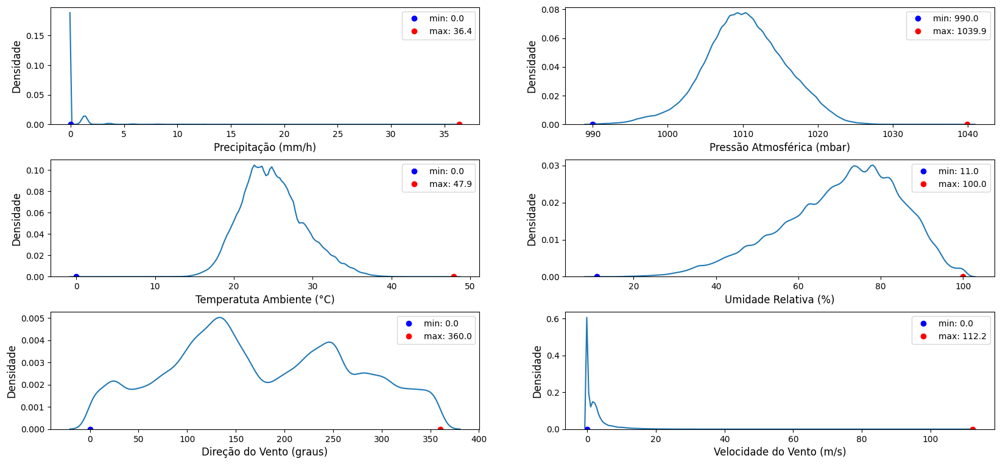
   
```python
# Trend Plots
ngrafs = len(var_princip)
l, c = 3, 2 
fig, axes = plt.subplots(l, c, figsize=(20,1.5*ngrafs))
for lin in range(l):
    for col in range(c):
        plt.sca(axes[lin, col])
        i = int(c*(lin+col/c))
        S = dataset[var_princip[i]]
        nome = S.name
        min_, max_ = stats.loc[nome,'min'], stats.loc[nome,'max']
        plt.plot(dataset.Dt_Hr , S, ':', linewidth=0.5)
        plt.gca().set_ylabel(rotulos[i], fontsize=11)
        plt.subplots_adjust(hspace=0.3)
```

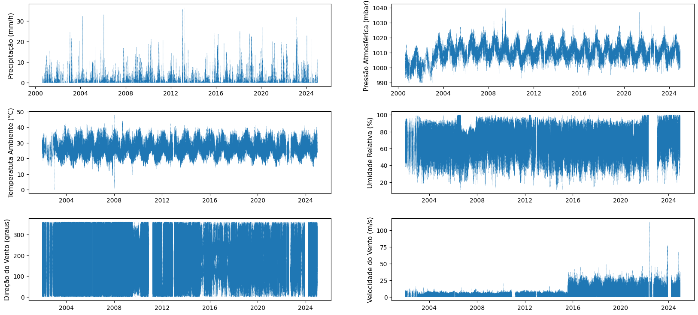
 

### 2.3.3 Correcting values

Decisions:
- Wind velocity: unity conversion (from Km/h to m/s) for values after August/2015
- Temperature: analyze extreme values
- Atmospheric pressure: analyze outliers
- time resolution: sample dataset for 1 sample per hour, to equalize resolution of INMET datasets 

#### 2.3.3.1 Wind velocity


```python
# Date filter
d0 = datetime.fromisoformat('2015-08-01') # tz naive
ts0 = datetime.timestamp(d0)
c_dt = dataset.timestamp>=ts0
dataset[col][c_dt]
```
> **Output:**   
>

    505012    0.0
    505013    0.0
    505014    7.1
    505015    6.0
    505016    3.9
             ... 
    838510    4.6
    838511    0.0
    838512    0.0
    838513    4.6
    838514    0.0
    Name: Vento_vel, Length: 333503, dtype: float64


```python
# Convert values (from Km/h to m/s)
dataset[col][c_dt]=dataset[col][c_dt]/3.6
dataset[col][c_dt]
```

```python
dataset[col].describe()
```
> **Output:**   
>

    count    774682.000000
    mean          1.323539
    std           1.516289
    min           0.000000
    25%           0.000000
    50%           0.972222
    75%           2.250000
    max          31.166667
    Name: Vento_vel, dtype: float64


```python
# PDF after correction

S = dataset[col]
label = S.name
min_, max_ = S.min(), S.max()
sns.kdeplot(S)
plt.plot(min_,0, 'bo', label='min: '+str(min_))
plt.plot(max_,0, 'ro', label='max: '+str(max_))
plt.legend()
plt.subplots_adjust(hspace=0.5)
```
    
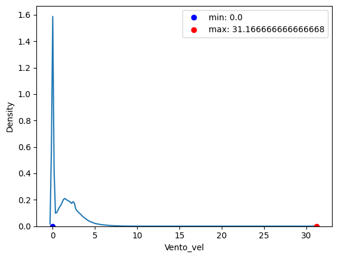


```python
# Trend after correction
plt.plot(dataset.Dt_Hr , dataset[col], ':', linewidth=0.5)
#plt.gca().set_xlim(d1,d2)
plt.xticks(rotation=45)
plt.title(col)
plt.show()
```
    
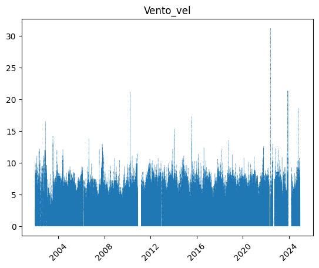
    


#### 2.3.3.2 Temperature


```python
# Temperature variation by day of year (1 to 365)
Dia_do_ano =  pd.Series(map(lambda t: t.day_of_year, dataset.Dt_Hr)) # day-of-year
Dia_do_ano.index=dataset.index
plt.plot(Dia_do_ano, dataset.Temp_Amb, '.',  markersize=0.3)
```
    
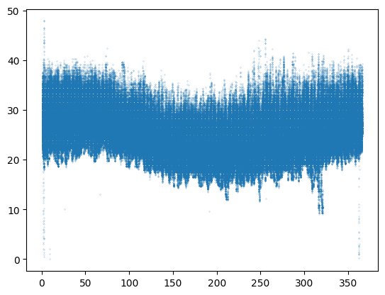
    

Some outliers can be observed in the figure above, for both low and high temperatures


```python
# Seasonal variation (hourly - 0 to 24)

Hora_do_dia =  pd.Series(map(lambda t: (t.hour-3)%24, dataset.Dt_Hr)) # Hour (coorercted form UTC to local time)
Hora_do_dia.index=dataset.index
df_pov = pd.concat([dataset.Dt_Hr, Dia_do_ano, Hora_do_dia, dataset.Temp_Amb, dataset.Umidade], axis=1)
df_pov.columns = ['Data', 'Dia', 'Hora', 'Temp_Amb','Umidade']

plt.plot(df_pov.Hora, df_pov.Temp_Amb, '.', markersize=0.5)

stats = df_pov.Temp_Amb.describe()
med = stats['mean']
dev = stats['std']
p75 = stats['75%']

plt.plot([0,24], [med, med])
plt.plot([0,24], [p75, p75])
plt.title("Radiação por hora do dia")
```
    
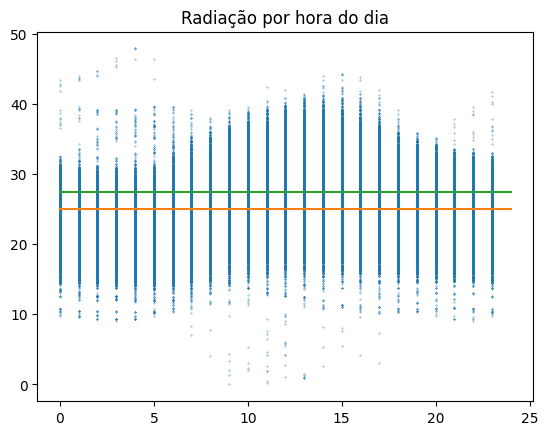
    

```python
#Plotting for different periods of year: days 0-120, 120-240, 240-365

df =  df_pov
c_dia = 'Dia'
c_dado='Temp_Amb'
c_hora = 'Hora'

dia_ini, dia_fim = 300, 60
stp.plot_por_hora_fitro_dias(df, c_dado, c_dia, c_hora, markersize=0.5)
plt.show()
dia_ini, dia_fim = 60, 180
stp.plot_por_hora_fitro_dias(df, c_dado, c_dia, c_hora, markersize=0.5)
plt.show()
dia_ini, dia_fim = 180, 300
stp.plot_por_hora_fitro_dias(df, c_dado, c_dia, c_hora, markersize=0.5)
plt.show()
```
    
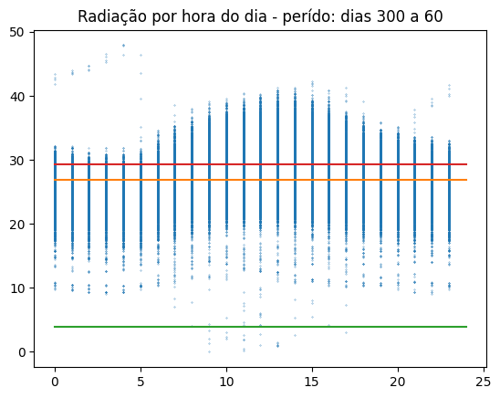
    
    
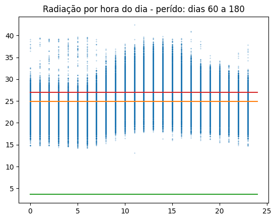
    
    
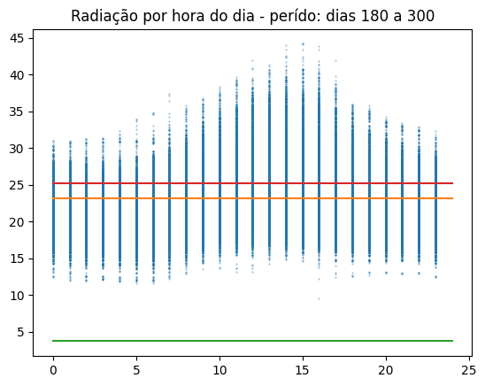
    


```python
# Verifying outliers

d1 = str(dataset.Dt_Hr.iloc[0]) #'2017-01-01'
d2 = str(dataset.Dt_Hr.iloc[-1]) #'2024-12-01'
#d2 = '2024-09-20'

c_Data = 'Data'
c_Hora = 'Hora'
c_Y = 'Temp_Amb'

h1, h2 = 0,6 
h3, h4 = 6,18 
h5,h6 = 18,24

dado = df_pov

stp.graf_fltro_data(dado, c_Y, c_Data, d1, d2, c_Hora, h1, h2)
plt.show()
stp.graf_fltro_data(dado, c_Y, c_Data, d1, d2, c_Hora, h3, h4)
plt.show()
stp.graf_fltro_data(dado, c_Y, c_Data, d1, d2, c_Hora, h5, h6)
plt.show()
```
    
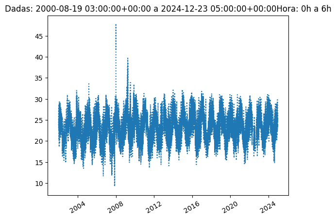
    
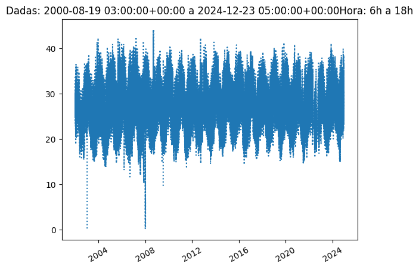
      
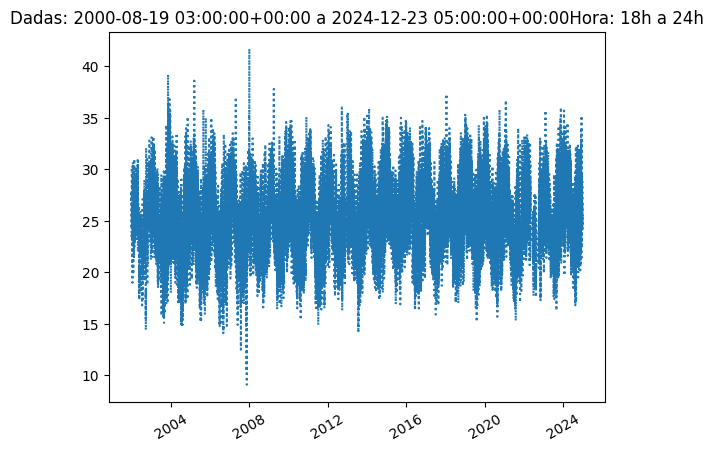
    

```python
# PDF plots along day (4 hours periods), before correction
step =4
col_h = 'Hora'
col_dado='Temp_Amb'
Percentis, Filtros = stp.dist_hora(df_pov, col_h, col_dado, step=step, p =0.5, max_=False) # Percentile 0.5 along day, by periods of 4 hours
print(Percentis)    
```
    
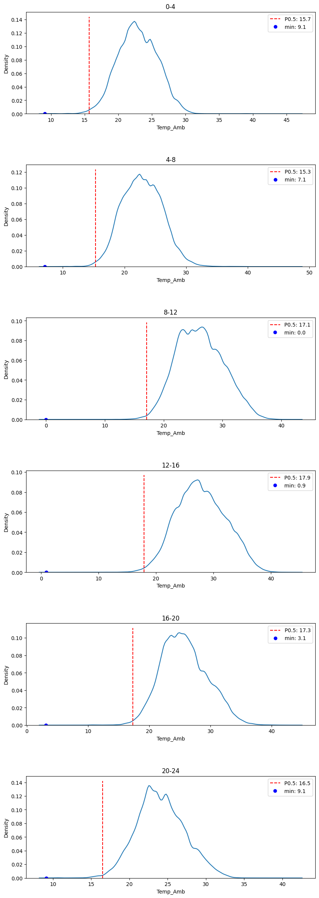

> **Output:**   
>  {'0-4': 15.7, '4-8': 15.3, '8-12': 17.1, '12-16': 17.9, '16-20': 17.3, '20-24': 16.5}
    

```python
# Percentile for T = 12°C
stp.nanpercentile_inv(df_pov.Temp_Amb, 10)
```
> **Output:**   
> 0.012540035342426138

```python
# Trend plots along day (4 hours periods), before correction
Trend_percent_periodo(Percentis, Filtros, cDado='Temp_Amb')
```
    
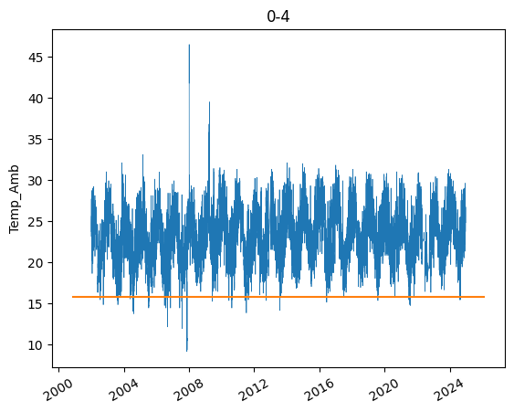
    
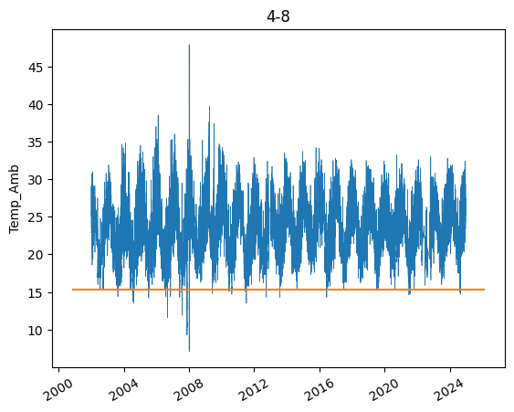
    
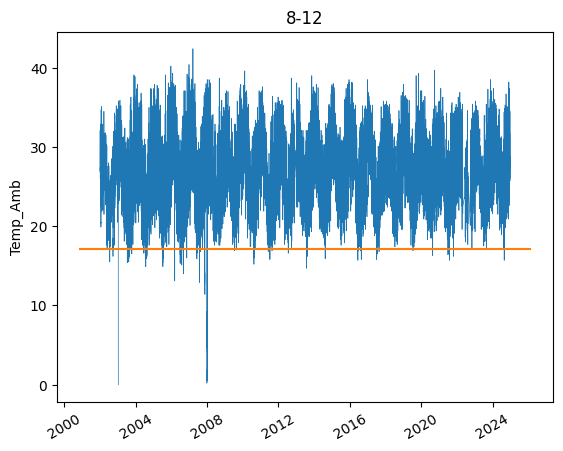
    
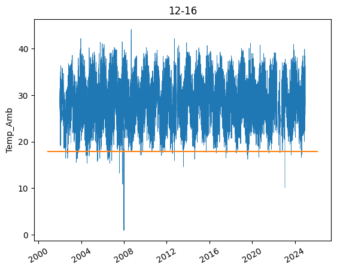
    
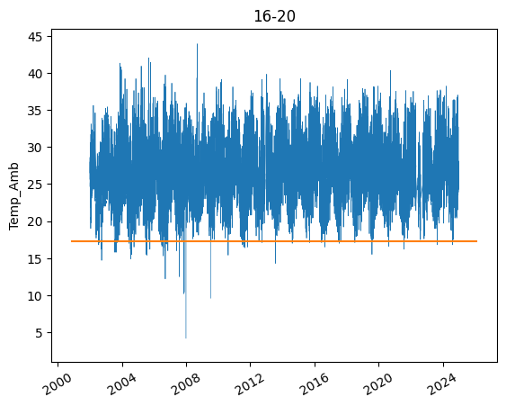
    
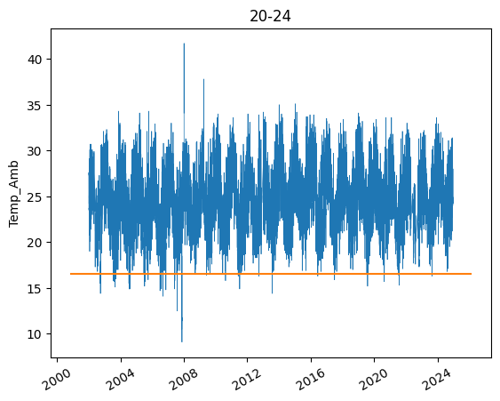
    

Decision: evaluate specific periods with outliers


```python
# Instances with T < 8°C 

df_pov[df_pov.Temp_Amb<8]
```


<style scoped>
    .dataframe tbody tr th:only-of-type {
        vertical-align: middle;
    }

    .dataframe tbody tr th {
        vertical-align: top;
    }

    .dataframe thead th {
        text-align: right;
    }
</style>
<table border="1" class="dataframe">
  <thead>
    <tr style="text-align: right;">
      <th></th>
      <th>Data</th>
      <th>Dia</th>
      <th>Hora</th>
      <th>Temp_Amb</th>
      <th>Umidade</th>
    </tr>
  </thead>
  <tbody>
    <tr>
      <th>69021</th>
      <td>2003-01-09 12:15:00+00:00</td>
      <td>9</td>
      <td>9</td>
      <td>2.1</td>
      <td>37.0</td>
    </tr>
    <tr>
      <th>69022</th>
      <td>2003-01-09 12:30:00+00:00</td>
      <td>9</td>
      <td>9</td>
      <td>0.0</td>
      <td>33.0</td>
    </tr>
    <tr>
      <th>69038</th>
      <td>2003-01-09 16:30:00+00:00</td>
      <td>9</td>
      <td>13</td>
      <td>1.0</td>
      <td>30.0</td>
    </tr>
    <tr>
      <th>242321</th>
      <td>2007-12-28 13:00:00+00:00</td>
      <td>362</td>
      <td>10</td>
      <td>2.4</td>
      <td>18.0</td>
    </tr>
    <tr>
      <th>242325</th>
      <td>2007-12-28 14:00:00+00:00</td>
      <td>362</td>
      <td>11</td>
      <td>2.7</td>
      <td>NaN</td>
    </tr>
    <tr>
      <th>242326</th>
      <td>2007-12-28 14:15:00+00:00</td>
      <td>362</td>
      <td>11</td>
      <td>0.2</td>
      <td>25.0</td>
    </tr>
    <tr>
      <th>242327</th>
      <td>2007-12-28 14:30:00+00:00</td>
      <td>362</td>
      <td>11</td>
      <td>4.2</td>
      <td>26.0</td>
    </tr>
    <tr>
      <th>242328</th>
      <td>2007-12-28 14:45:00+00:00</td>
      <td>362</td>
      <td>11</td>
      <td>1.9</td>
      <td>24.0</td>
    </tr>
    <tr>
      <th>242329</th>
      <td>2007-12-28 15:00:00+00:00</td>
      <td>362</td>
      <td>12</td>
      <td>2.8</td>
      <td>23.0</td>
    </tr>
    <tr>
      <th>242332</th>
      <td>2007-12-28 15:45:00+00:00</td>
      <td>362</td>
      <td>12</td>
      <td>1.0</td>
      <td>25.0</td>
    </tr>
    <tr>
      <th>242333</th>
      <td>2007-12-28 16:00:00+00:00</td>
      <td>362</td>
      <td>13</td>
      <td>1.3</td>
      <td>25.0</td>
    </tr>
    <tr>
      <th>242334</th>
      <td>2007-12-28 16:15:00+00:00</td>
      <td>362</td>
      <td>13</td>
      <td>1.0</td>
      <td>25.0</td>
    </tr>
    <tr>
      <th>242335</th>
      <td>2007-12-28 16:30:00+00:00</td>
      <td>362</td>
      <td>13</td>
      <td>0.9</td>
      <td>26.0</td>
    </tr>
    <tr>
      <th>242336</th>
      <td>2007-12-28 16:45:00+00:00</td>
      <td>362</td>
      <td>13</td>
      <td>1.5</td>
      <td>25.0</td>
    </tr>
    <tr>
      <th>242338</th>
      <td>2007-12-28 17:15:00+00:00</td>
      <td>362</td>
      <td>14</td>
      <td>2.7</td>
      <td>25.0</td>
    </tr>
    <tr>
      <th>242339</th>
      <td>2007-12-28 17:30:00+00:00</td>
      <td>362</td>
      <td>14</td>
      <td>5.3</td>
      <td>26.0</td>
    </tr>
    <tr>
      <th>242342</th>
      <td>2007-12-28 18:15:00+00:00</td>
      <td>362</td>
      <td>15</td>
      <td>7.6</td>
      <td>25.0</td>
    </tr>
    <tr>
      <th>242343</th>
      <td>2007-12-28 18:30:00+00:00</td>
      <td>362</td>
      <td>15</td>
      <td>5.5</td>
      <td>24.0</td>
    </tr>
    <tr>
      <th>242345</th>
      <td>2007-12-28 19:00:00+00:00</td>
      <td>362</td>
      <td>16</td>
      <td>4.2</td>
      <td>25.0</td>
    </tr>
    <tr>
      <th>242349</th>
      <td>2007-12-28 20:00:00+00:00</td>
      <td>362</td>
      <td>17</td>
      <td>7.4</td>
      <td>24.0</td>
    </tr>
    <tr>
      <th>242448</th>
      <td>2007-12-29 20:45:00+00:00</td>
      <td>363</td>
      <td>17</td>
      <td>3.1</td>
      <td>36.0</td>
    </tr>
    <tr>
      <th>242799</th>
      <td>2008-01-02 12:30:00+00:00</td>
      <td>2</td>
      <td>9</td>
      <td>4.3</td>
      <td>34.0</td>
    </tr>
    <tr>
      <th>242800</th>
      <td>2008-01-02 12:45:00+00:00</td>
      <td>2</td>
      <td>9</td>
      <td>3.3</td>
      <td>34.0</td>
    </tr>
    <tr>
      <th>242801</th>
      <td>2008-01-02 13:00:00+00:00</td>
      <td>2</td>
      <td>10</td>
      <td>3.0</td>
      <td>32.0</td>
    </tr>
    <tr>
      <th>242802</th>
      <td>2008-01-02 13:15:00+00:00</td>
      <td>2</td>
      <td>10</td>
      <td>5.4</td>
      <td>33.0</td>
    </tr>
    <tr>
      <th>242803</th>
      <td>2008-01-02 13:30:00+00:00</td>
      <td>2</td>
      <td>10</td>
      <td>2.0</td>
      <td>31.0</td>
    </tr>
    <tr>
      <th>242805</th>
      <td>2008-01-02 14:00:00+00:00</td>
      <td>2</td>
      <td>11</td>
      <td>4.7</td>
      <td>32.0</td>
    </tr>
    <tr>
      <th>242806</th>
      <td>2008-01-02 14:15:00+00:00</td>
      <td>2</td>
      <td>11</td>
      <td>7.2</td>
      <td>34.0</td>
    </tr>
    <tr>
      <th>242808</th>
      <td>2008-01-02 14:45:00+00:00</td>
      <td>2</td>
      <td>11</td>
      <td>7.6</td>
      <td>34.0</td>
    </tr>
    <tr>
      <th>242809</th>
      <td>2008-01-02 15:00:00+00:00</td>
      <td>2</td>
      <td>12</td>
      <td>6.0</td>
      <td>31.0</td>
    </tr>
    <tr>
      <th>242810</th>
      <td>2008-01-02 15:15:00+00:00</td>
      <td>2</td>
      <td>12</td>
      <td>5.9</td>
      <td>32.0</td>
    </tr>
    <tr>
      <th>242887</th>
      <td>2008-01-03 10:30:00+00:00</td>
      <td>3</td>
      <td>7</td>
      <td>7.1</td>
      <td>35.0</td>
    </tr>
    <tr>
      <th>242889</th>
      <td>2008-01-03 11:00:00+00:00</td>
      <td>3</td>
      <td>8</td>
      <td>7.7</td>
      <td>35.0</td>
    </tr>
    <tr>
      <th>242890</th>
      <td>2008-01-03 11:15:00+00:00</td>
      <td>3</td>
      <td>8</td>
      <td>4.1</td>
      <td>31.0</td>
    </tr>
    <tr>
      <th>242896</th>
      <td>2008-01-03 12:45:00+00:00</td>
      <td>3</td>
      <td>9</td>
      <td>1.4</td>
      <td>25.0</td>
    </tr>
    <tr>
      <th>242902</th>
      <td>2008-01-03 14:15:00+00:00</td>
      <td>3</td>
      <td>11</td>
      <td>0.5</td>
      <td>26.0</td>
    </tr>
    <tr>
      <th>242903</th>
      <td>2008-01-03 14:30:00+00:00</td>
      <td>3</td>
      <td>11</td>
      <td>1.9</td>
      <td>27.0</td>
    </tr>
    <tr>
      <th>242904</th>
      <td>2008-01-03 14:45:00+00:00</td>
      <td>3</td>
      <td>11</td>
      <td>6.5</td>
      <td>30.0</td>
    </tr>
    <tr>
      <th>242905</th>
      <td>2008-01-03 15:00:00+00:00</td>
      <td>3</td>
      <td>12</td>
      <td>5.7</td>
      <td>31.0</td>
    </tr>
    <tr>
      <th>242906</th>
      <td>2008-01-03 15:15:00+00:00</td>
      <td>3</td>
      <td>12</td>
      <td>5.5</td>
      <td>30.0</td>
    </tr>
    <tr>
      <th>242907</th>
      <td>2008-01-03 15:30:00+00:00</td>
      <td>3</td>
      <td>12</td>
      <td>4.2</td>
      <td>29.0</td>
    </tr>
    <tr>
      <th>242908</th>
      <td>2008-01-03 15:45:00+00:00</td>
      <td>3</td>
      <td>12</td>
      <td>4.2</td>
      <td>29.0</td>
    </tr>
    <tr>
      <th>242909</th>
      <td>2008-01-03 16:00:00+00:00</td>
      <td>3</td>
      <td>13</td>
      <td>0.9</td>
      <td>26.0</td>
    </tr>
  </tbody>
</table>


```python
# Row indices (slices) to clean

r1 = [69021, 69038] 
r2 = [242321, 242909]
```


```python
# Example: Plotting a period, comparing with 0.5 percentile along day (orange line)
d1,d2 = '2007-12-20 00:00:00+00:00', '2008-01-10 00:00:00+00:00'

stp.graf_fltro_data(dado, c_Y, c_Data, d1,d2, c_Hora,0,24, endplot=False, form='-.')

c1=dado.Data>=datetime.fromisoformat(d1)
c2=dado.Data<datetime.fromisoformat(d2)
filtro = dado[c1&c2]
P = stp.coluna_percentis(Percentis, filtro.Hora, step=4)
plt.plot(filtro.Data, P)
X = plt.gca().get_xlim()
plt.plot(X, 2*[8], 'k:')

```
    
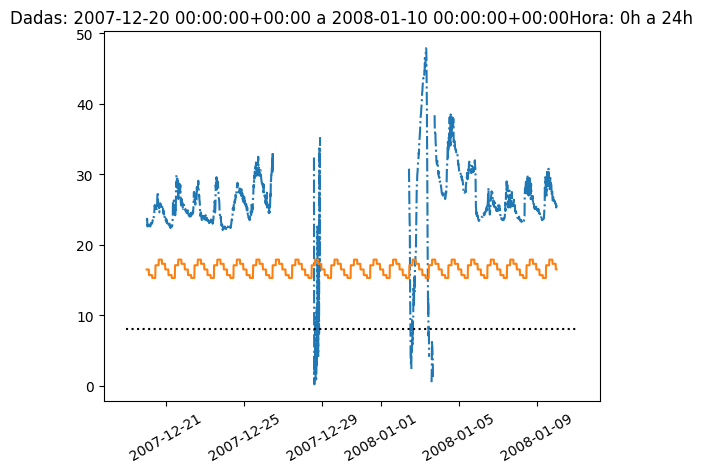


```python
# Cleaning lowest values

c1 =dado.Temp_Amb<10
D_Temp = df_pov.Temp_Amb.copy()

D_Temp.loc[r1[0]:r1[1]][c1]=np.nan
D_Temp.loc[r2[0]:r2[1]][c1]=np.nan
plt.plot(D_Temp)
```
    
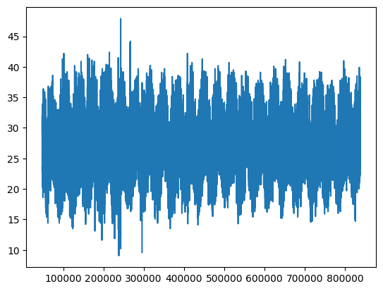


```python
# PDF plots: inspection of max outliers
Percentis2, Filtros2 = stp.dist_hora(df_pov, col_h, col_dado, step=step, p =98)
```
    
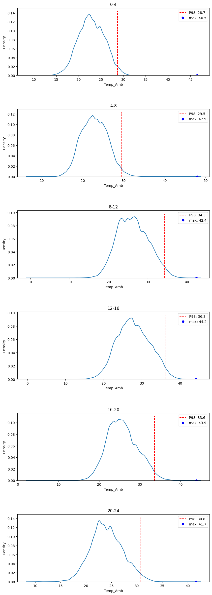
    

```python
# Instances with T > 40°C 

df_pov[df_pov.Temp_Amb>40][df_pov.Hora<10]
```


<table border="1" class="dataframe">
  <thead>
    <tr style="text-align: right;">
      <th></th>
      <th>Data</th>
      <th>Dia</th>
      <th>Hora</th>
      <th>Temp_Amb</th>
      <th>Umidade</th>
    </tr>
  </thead>
  <tbody>
    <tr>
      <th>242857</th>
      <td>2008-01-03 03:00:00+00:00</td>
      <td>3</td>
      <td>0</td>
      <td>41.8</td>
      <td>63.0</td>
    </tr>
    <tr>
      <th>242858</th>
      <td>2008-01-03 03:15:00+00:00</td>
      <td>3</td>
      <td>0</td>
      <td>42.5</td>
      <td>63.0</td>
    </tr>
    <tr>
      <th>242859</th>
      <td>2008-01-03 03:30:00+00:00</td>
      <td>3</td>
      <td>0</td>
      <td>42.8</td>
      <td>64.0</td>
    </tr>
    <tr>
      <th>242860</th>
      <td>2008-01-03 03:45:00+00:00</td>
      <td>3</td>
      <td>0</td>
      <td>43.4</td>
      <td>64.0</td>
    </tr>
    <tr>
      <th>242861</th>
      <td>2008-01-03 04:00:00+00:00</td>
      <td>3</td>
      <td>1</td>
      <td>43.4</td>
      <td>64.0</td>
    </tr>
    <tr>
      <th>242862</th>
      <td>2008-01-03 04:15:00+00:00</td>
      <td>3</td>
      <td>1</td>
      <td>43.7</td>
      <td>64.0</td>
    </tr>
    <tr>
      <th>242863</th>
      <td>2008-01-03 04:30:00+00:00</td>
      <td>3</td>
      <td>1</td>
      <td>43.6</td>
      <td>64.0</td>
    </tr>
    <tr>
      <th>242864</th>
      <td>2008-01-03 04:45:00+00:00</td>
      <td>3</td>
      <td>1</td>
      <td>44.0</td>
      <td>64.0</td>
    </tr>
    <tr>
      <th>242865</th>
      <td>2008-01-03 05:00:00+00:00</td>
      <td>3</td>
      <td>2</td>
      <td>44.0</td>
      <td>64.0</td>
    </tr>
    <tr>
      <th>242866</th>
      <td>2008-01-03 05:15:00+00:00</td>
      <td>3</td>
      <td>2</td>
      <td>44.1</td>
      <td>65.0</td>
    </tr>
    <tr>
      <th>242867</th>
      <td>2008-01-03 05:30:00+00:00</td>
      <td>3</td>
      <td>2</td>
      <td>44.7</td>
      <td>65.0</td>
    </tr>
    <tr>
      <th>242868</th>
      <td>2008-01-03 05:45:00+00:00</td>
      <td>3</td>
      <td>2</td>
      <td>44.7</td>
      <td>65.0</td>
    </tr>
    <tr>
      <th>242869</th>
      <td>2008-01-03 06:00:00+00:00</td>
      <td>3</td>
      <td>3</td>
      <td>46.5</td>
      <td>66.0</td>
    </tr>
    <tr>
      <th>242870</th>
      <td>2008-01-03 06:15:00+00:00</td>
      <td>3</td>
      <td>3</td>
      <td>46.1</td>
      <td>66.0</td>
    </tr>
    <tr>
      <th>242871</th>
      <td>2008-01-03 06:30:00+00:00</td>
      <td>3</td>
      <td>3</td>
      <td>45.3</td>
      <td>66.0</td>
    </tr>
    <tr>
      <th>242872</th>
      <td>2008-01-03 06:45:00+00:00</td>
      <td>3</td>
      <td>3</td>
      <td>45.6</td>
      <td>66.0</td>
    </tr>
    <tr>
      <th>242873</th>
      <td>2008-01-03 07:00:00+00:00</td>
      <td>3</td>
      <td>4</td>
      <td>46.4</td>
      <td>67.0</td>
    </tr>
    <tr>
      <th>242874</th>
      <td>2008-01-03 07:15:00+00:00</td>
      <td>3</td>
      <td>4</td>
      <td>47.9</td>
      <td>68.0</td>
    </tr>
    <tr>
      <th>242875</th>
      <td>2008-01-03 07:30:00+00:00</td>
      <td>3</td>
      <td>4</td>
      <td>47.9</td>
      <td>68.0</td>
    </tr>
    <tr>
      <th>242876</th>
      <td>2008-01-03 07:45:00+00:00</td>
      <td>3</td>
      <td>4</td>
      <td>47.8</td>
      <td>68.0</td>
    </tr>
    <tr>
      <th>242877</th>
      <td>2008-01-03 08:00:00+00:00</td>
      <td>3</td>
      <td>5</td>
      <td>46.4</td>
      <td>68.0</td>
    </tr>
    <tr>
      <th>242878</th>
      <td>2008-01-03 08:15:00+00:00</td>
      <td>3</td>
      <td>5</td>
      <td>43.5</td>
      <td>66.0</td>
    </tr>
  </tbody>
</table>


```python
# Example: Plotting a period, comparing with 98 percentile along day (orange line)
d1,d2 = '2007-12-01 00:00:00+00:00', '2008-02-05 00:00:00+00:00'

stp.graf_fltro_data(dado, c_Y, c_Data, d1,d2, c_Hora,0,24, endplot=False, form='-.')

c1=dado.Data>=datetime.fromisoformat(d1)
c2=dado.Data<datetime.fromisoformat(d2)
filtro = dado[c1&c2]
P = coluna_percentis(Percentis2, filtro.Hora, step=4)
plt.plot(filtro.Data, P)
X = plt.gca().get_xlim()
plt.plot(X, 2*[40], 'k:')
```
    
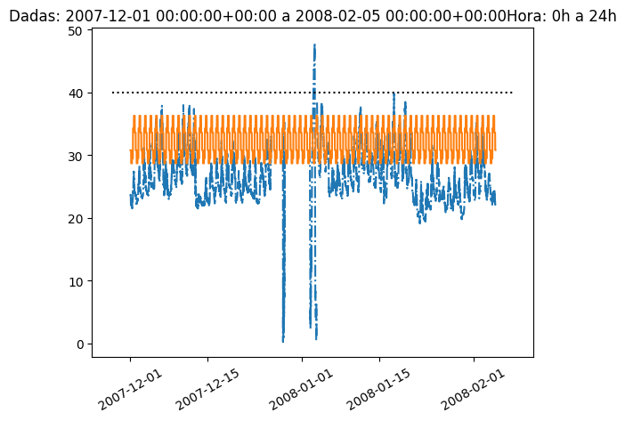
    

```python
# Cleaning highest values
i1, i2 = 242857, 242878
c2 =dado.Temp_Amb>40
D_Temp.loc[i1:i2][c2]=np.nan
```


```python
# Trend plot after treatment
dataset.Temp_Amb=D_Temp
df_pov.Temp_Amb=D_Temp
plt.plot(dataset.Dt_Hr, dataset.Temp_Amb, linewidth=0.2)
```
    
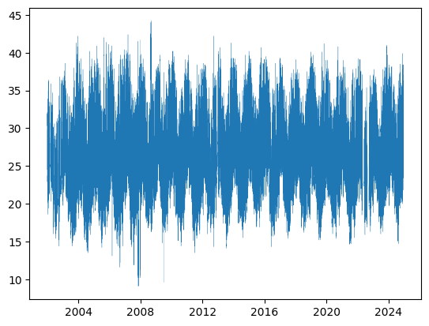
    

#### 2.3.3.3  Atmospheric Pressure


```python
# Seasonal variation of Atm. Pressure along the year (day 1 to 365)
plt.plot(Dia_do_ano, dataset.Pres_Atm, '.',  markersize=0.3)

```
    
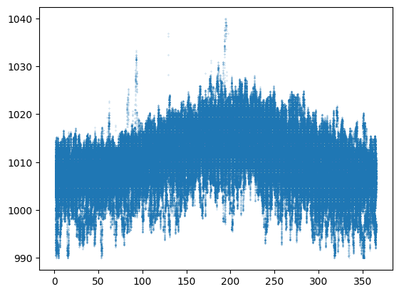
    

```python
# Variation of Atm. Pressure along the day (hour 0 to 24)
plt.plot(Hora_do_dia, dataset.Pres_Atm, '.',  markersize=0.3)
```
    
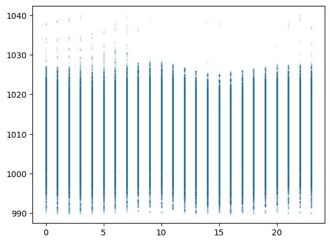
    

Note: the dataset of São Cristovão station presents a period (between 2000 and 2003) where atm. pressure is lower than the rest of the data.  
It could be caused by instrument calibration issues (see the trend plot bellow).
Statistic properties are analyzed in order to correct this period.


```python
str_hr_ISO = '03:00:00+00:00'

d1 = str(dataset.Dt_Hr.iloc[0])
d2 = '2003-02-01 '+ str_hr_ISO
d3 =  str(dataset.Dt_Hr.iloc[-1])

titulo = 'Pressão atmosférica (hPa) (Estação São Cristóvão)'

graf_fltro_data (dataset, 'Pres_Atm', 'Dt_Hr', d1, d2, endplot=False, linewidth=0.5, color='gray')
graf_fltro_data (dataset, 'Pres_Atm', 'Dt_Hr', d2, d3, Titulo=titulo, linewidth=0.5)

```
    
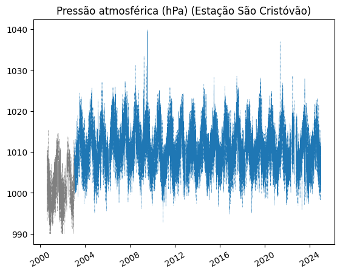
    

```python
# Comparing statistical properties
c1 = dataset.Dt_Hr<d2

P1 = dataset.Pres_Atm[c1]
P2 = dataset.Pres_Atm[~c1]

statsP = pd.concat([P1.describe(), P2.describe()], axis=1)
statsP.columns=['P1','P2']
statsP
```


<table border="1" class="dataframe">
  <thead>
    <tr style="text-align: right;">
      <th></th>
      <th>P1</th>
      <th>P2</th>
    </tr>
  </thead>
  <tbody>
    <tr>
      <th>count</th>
      <td>67515.000000</td>
      <td>762864.000000</td>
    </tr>
    <tr>
      <th>mean</th>
      <td>1002.030835</td>
      <td>1011.058286</td>
    </tr>
    <tr>
      <th>std</th>
      <td>4.638403</td>
      <td>4.837431</td>
    </tr>
    <tr>
      <th>min</th>
      <td>990.000000</td>
      <td>992.800000</td>
    </tr>
    <tr>
      <th>25%</th>
      <td>998.700000</td>
      <td>1007.600000</td>
    </tr>
    <tr>
      <th>50%</th>
      <td>1001.900000</td>
      <td>1010.800000</td>
    </tr>
    <tr>
      <th>75%</th>
      <td>1005.300000</td>
      <td>1014.300000</td>
    </tr>
    <tr>
      <th>max</th>
      <td>1015.300000</td>
      <td>1039.900000</td>
    </tr>
  </tbody>
</table>


```python
stats_dif = (statsP['P2']-statsP['P1'])
stats_dif
```
> **Output:**   
>
    count    695349.000000
    mean          9.027451
    std           0.199029
    min           2.800000
    25%           8.900000
    50%           8.900000
    75%           9.000000
    max          24.600000
    dtype: float64


Both periods presents similar standard deviation, the but mean and percentiles 25, 50 and 75 are distant about 9 hPa.  
To correct the initial period, this difference will be added to the values.


```python
P1_mod = P1+stats_dif['mean']
P1_mod.describe()
```
> **Output:**   
>
    count    67515.000000
    mean      1011.058286
    std          4.638403
    min        999.027451
    25%       1007.727451
    50%       1010.927451
    75%       1014.327451
    max       1024.327451
    Name: Pres_Atm, dtype: float64


```python
P3 = pd.concat([P1_mod, P2])
P3.describe()
```
> **Output:**   
>
    count    830379.000000
    mean       1011.058286
    std           4.821553
    min         992.800000
    25%        1007.600000
    50%        1010.800000
    75%        1014.300000
    max        1039.900000
    Name: Pres_Atm, dtype: float64


```python
# Trend plot after correction
plt.plot(dataset.Dt_Hr, P3, ':',linewidth=0.5)
```
    
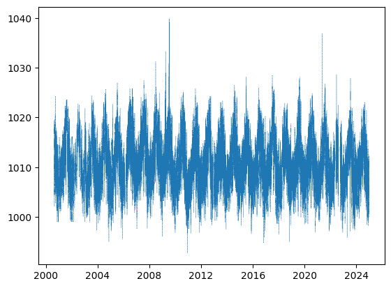
    

##### Analyzing max outliers


```python
dataset[P3>1039]
```


<table border="1" class="dataframe">
  <thead>
    <tr style="text-align: right;">
      <th></th>
      <th>Dt_Hr</th>
      <th>timestamp</th>
      <th>dt</th>
      <th>Lat</th>
      <th>Long</th>
      <th>Alt</th>
      <th>Precip</th>
      <th>Vento_dir</th>
      <th>Vento_vel</th>
      <th>Temp_Amb</th>
      <th>Pres_Atm</th>
      <th>Umidade</th>
    </tr>
  </thead>
  <tbody>
    <tr>
      <th>296322</th>
      <td>2009-07-13 01:15:00+00:00</td>
      <td>1.247448e+09</td>
      <td>900.0</td>
      <td>-22.89667</td>
      <td>-43.22167</td>
      <td>25</td>
      <td>0.0</td>
      <td>104.0</td>
      <td>1.5</td>
      <td>26.5</td>
      <td>1039.1</td>
      <td>81.0</td>
    </tr>
    <tr>
      <th>296323</th>
      <td>2009-07-13 01:30:00+00:00</td>
      <td>1.247449e+09</td>
      <td>900.0</td>
      <td>-22.89667</td>
      <td>-43.22167</td>
      <td>25</td>
      <td>0.0</td>
      <td>159.0</td>
      <td>1.3</td>
      <td>26.5</td>
      <td>1039.3</td>
      <td>82.0</td>
    </tr>
    <tr>
      <th>296324</th>
      <td>2009-07-13 01:45:00+00:00</td>
      <td>1.247450e+09</td>
      <td>900.0</td>
      <td>-22.89667</td>
      <td>-43.22167</td>
      <td>25</td>
      <td>0.0</td>
      <td>159.0</td>
      <td>0.6</td>
      <td>26.7</td>
      <td>1039.9</td>
      <td>83.0</td>
    </tr>
    <tr>
      <th>296360</th>
      <td>2009-07-13 10:45:00+00:00</td>
      <td>1.247482e+09</td>
      <td>900.0</td>
      <td>-22.89667</td>
      <td>-43.22167</td>
      <td>25</td>
      <td>0.0</td>
      <td>98.0</td>
      <td>1.1</td>
      <td>25.9</td>
      <td>1039.8</td>
      <td>85.0</td>
    </tr>
    <tr>
      <th>296435</th>
      <td>2009-07-14 05:30:00+00:00</td>
      <td>1.247549e+09</td>
      <td>900.0</td>
      <td>-22.89667</td>
      <td>-43.22167</td>
      <td>25</td>
      <td>0.0</td>
      <td>145.0</td>
      <td>0.5</td>
      <td>26.7</td>
      <td>1039.2</td>
      <td>NaN</td>
    </tr>
    <tr>
      <th>296436</th>
      <td>2009-07-14 05:45:00+00:00</td>
      <td>1.247550e+09</td>
      <td>900.0</td>
      <td>-22.89667</td>
      <td>-43.22167</td>
      <td>25</td>
      <td>0.0</td>
      <td>NaN</td>
      <td>0.0</td>
      <td>26.7</td>
      <td>1039.1</td>
      <td>NaN</td>
    </tr>
    <tr>
      <th>296437</th>
      <td>2009-07-14 06:00:00+00:00</td>
      <td>1.247551e+09</td>
      <td>900.0</td>
      <td>-22.89667</td>
      <td>-43.22167</td>
      <td>25</td>
      <td>0.0</td>
      <td>NaN</td>
      <td>0.0</td>
      <td>26.7</td>
      <td>1039.3</td>
      <td>NaN</td>
    </tr>
    <tr>
      <th>296438</th>
      <td>2009-07-14 06:15:00+00:00</td>
      <td>1.247552e+09</td>
      <td>900.0</td>
      <td>-22.89667</td>
      <td>-43.22167</td>
      <td>25</td>
      <td>0.0</td>
      <td>NaN</td>
      <td>0.0</td>
      <td>26.8</td>
      <td>1039.6</td>
      <td>NaN</td>
    </tr>
    <tr>
      <th>296439</th>
      <td>2009-07-14 06:30:00+00:00</td>
      <td>1.247553e+09</td>
      <td>900.0</td>
      <td>-22.89667</td>
      <td>-43.22167</td>
      <td>25</td>
      <td>0.0</td>
      <td>NaN</td>
      <td>0.0</td>
      <td>26.9</td>
      <td>1039.9</td>
      <td>NaN</td>
    </tr>
    <tr>
      <th>296455</th>
      <td>2009-07-14 10:30:00+00:00</td>
      <td>1.247567e+09</td>
      <td>900.0</td>
      <td>-22.89667</td>
      <td>-43.22167</td>
      <td>25</td>
      <td>0.0</td>
      <td>111.0</td>
      <td>0.2</td>
      <td>25.3</td>
      <td>1039.1</td>
      <td>NaN</td>
    </tr>
  </tbody>
</table>


```python
# Plot showing period with maximum value

i1 = 296322-24*4*10

i2 = 296455+24*4*10

plt.plot(dataset.Dt_Hr.loc[i1:i2], dataset.Pres_Atm.loc[i1:i2], ':.', linewidth=0.5, markersize=1)
plt.xticks(rotation=45)
plt.ylabel('Pressão Atmosférica (hPa)', fontsize=11)
plt.title('Tendência - Pressão Atmosférica')
plt.show()
```
  
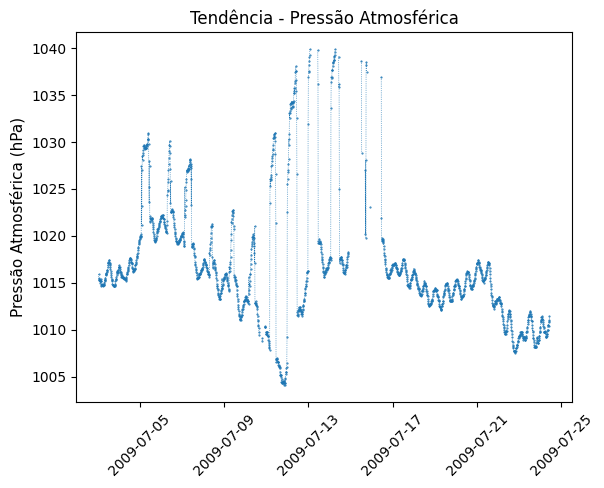
    


Atm. pressure in the above plot presents many local maxima.
In this case, the strategy used for temperature (using a threshold based on a percentile to clean data) is not suitable.

instead, relative differentiation (return type 1) will be used to identify and clear the outliers.


```python
#  Atm. pressure shows a seasonal behavior, with a period of approximately 12 hours (a lag of 48 points in the dataset). 
# So, the differences are computed for a lag of 12h, helping to identify atypical values.

lag=48
difP = pd.Series(stp.ret1(list(P3),lag), index=P3.index)
```


```python
# Trend plot for Return (Type 1) of Atm.Pressure.

# Plot 1: all dataset
plt.plot(dataset.Dt_Hr, difP, linewidth=0.5)
plt.xticks(rotation=45)
plt.ylabel('Retorno Tipo 1', fontsize=11)
plt.title('Tendência - Retorno Tipo 1')
plt.show()

# Plot 2: period containing maximum value of atm. pressure
plt.plot(dataset.Dt_Hr.iloc[i1:i2], abs(difP[i1:i2]), ':.', linewidth=0.5, markersize=1)
plt.xticks(rotation=45)
plt.ylabel('Retorno Tipo 1', fontsize=11)
plt.title('Tendência - Retorno Tipo 1')
plt.show()
```
    
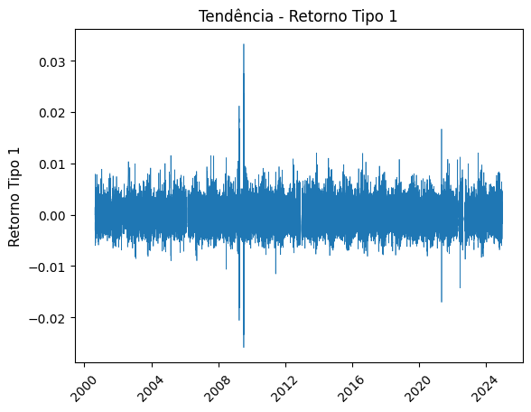   

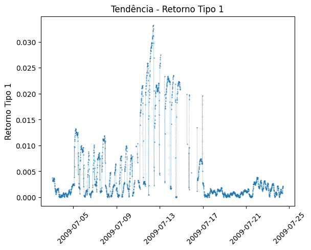
    

```python
# Data will be cleaned when relative difference is greater than 0.004

P4 = P3.copy()
cond=abs(difP)>0.004

P4[i1:i2][cond[i1:i2]]=np.nan
```

```python
# Plotting period before and after cleaning

lim = 0.004

fig, ax = plt.subplots(1,3, figsize=(15,5))

ax[0].plot(dataset.Dt_Hr.loc[i1:i2], dataset.Pres_Atm.loc[i1:i2], ':.', linewidth=0.5, markersize=1)
ax[0].tick_params(axis='x',rotation=45)
# ax[0].set_ylabel('Pressão Atmosférica (hPa)', fontsize=11)
yl= ax[0].get_ylim()
ax[0].set_xlabel('(a)', fontsize=11)
ax[0].set_title('Pressão Atmosférica (hPa)')


ax[1].plot(dataset.Dt_Hr.iloc[i1:i2], abs(difP[i1:i2]), ':.', linewidth=0.5, markersize=1)
ax[1].tick_params(axis='x',rotation=45)
# ax[1].set_ylabel('Retorno Tipo 1', fontsize=11)
ax[1].set_xlabel('(b)', fontsize=11)
ax[1].set_title('Retorno Tipo 1')
xl= ax[1].get_xlim()
ax[1].plot(xl, 2*[lim], 'k:', linewidth=1)


ax[2].plot(dataset.Dt_Hr.iloc[i1:i2], P4[i1:i2], ':o', linewidth=1, markersize=1)
ax[2].tick_params(axis='x',rotation=45)
ax[2].set_ylim(yl)
# ax[2].set_ylabel('Pressão Atmosférica (hPa)', fontsize=11)
ax[2].set_xlabel('(c)', fontsize=11)
ax[2].set_title('Pressão Atmosférica (hPa) - após limpeza')

plt.subplots_adjust(wspace=0.3)
```
  
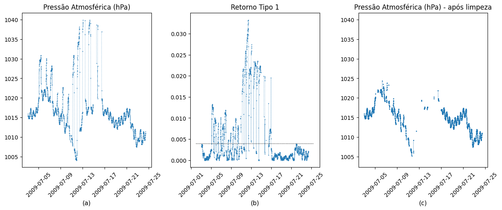
    

```python
# Apply the strategy in the hole dataset

P5= P3.copy()
P5[cond]=np.nan

plt.plot(P5, '-', linewidth=0.5)
```
    
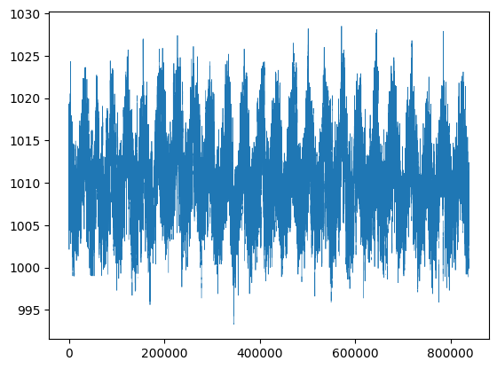
    
```python
# Updating dataset
dataset.Pres_Atm=P5
```

## 2.4 Data sampling

Data sampling to adjust temporal resolution to a granularity of one sample per hour (as the INMET dataset)

Notes: 

- Samples will be taken for timestamps with minute equal to zero (same timestamps of INMET datsets).
- INMET datasets presents precipitation in mm/h, while for GeoRio datasets, precipitation in mm/15minutes.
Therefore, sampling is done by accumulating (summing) the last hour.
Since there are missing values in timestamp, Delta(t) is used to verify the appropriate interval for accumulation.
For other attributes, instant values are taken.


```python
# Define 'minute' atribute
 
minuto = dataset.Dt_Hr.apply(lambda t:t.minute)
df = dataset.reset_index(drop=True)
df['minuto']=list(minuto)
```

```python
# Process accumulated values for precipitation

Prec_ac=[]

delta_perc = round(len(df)*0.01/100) #0.01%
for i in df.index:
    percent=round(100*i/len(df),2)
    if df.minuto[i]==0:
        acm=df.Precip.loc[i]
        delta= df.dt[i]
        j=i
        while delta<3600 and j>0:
            j-=1
            acm+=df.Precip.loc[j]
            delta+= df.dt[j]
        if (i%delta_perc==0): print(f'\r {i} Processamento: {percent}%', end ='', flush=True)
    else: acm=np.nan   
    Prec_ac.append(acm)

df['Precip_ac']=Prec_ac    
```
> **Output:**   
>  829080 Processamento: 100.00%


```python
# Sampling

dataset_amos = df[df.minuto==0]
dataset_amos.reset_index(inplace=True,drop=True)
dataset_amos.head()
```


<table border="1" class="dataframe">
  <thead>
    <tr style="text-align: right;">
      <th></th>
      <th>Dt_Hr</th>
      <th>timestamp</th>
      <th>dt</th>
      <th>Lat</th>
      <th>Long</th>
      <th>Alt</th>
      <th>Precip</th>
      <th>Vento_dir</th>
      <th>Vento_vel</th>
      <th>Temp_Amb</th>
      <th>Pres_Atm</th>
      <th>Umidade</th>
      <th>POv_Calc</th>
      <th>minuto</th>
      <th>Precip_ac</th>
    </tr>
  </thead>
  <tbody>
    <tr>
      <th>0</th>
      <td>2000-08-19 03:00:00+00:00</td>
      <td>966654000.0</td>
      <td>0.0</td>
      <td>-22.89667</td>
      <td>-43.22167</td>
      <td>25</td>
      <td>NaN</td>
      <td>NaN</td>
      <td>NaN</td>
      <td>NaN</td>
      <td>1017.827451</td>
      <td>NaN</td>
      <td>NaN</td>
      <td>0</td>
      <td>NaN</td>
    </tr>
    <tr>
      <th>1</th>
      <td>2000-08-19 04:00:00+00:00</td>
      <td>966657600.0</td>
      <td>900.0</td>
      <td>-22.89667</td>
      <td>-43.22167</td>
      <td>25</td>
      <td>0.0</td>
      <td>NaN</td>
      <td>NaN</td>
      <td>NaN</td>
      <td>1017.727451</td>
      <td>NaN</td>
      <td>NaN</td>
      <td>0</td>
      <td>0.0</td>
    </tr>
    <tr>
      <th>2</th>
      <td>2000-08-19 05:00:00+00:00</td>
      <td>966661200.0</td>
      <td>900.0</td>
      <td>-22.89667</td>
      <td>-43.22167</td>
      <td>25</td>
      <td>0.0</td>
      <td>NaN</td>
      <td>NaN</td>
      <td>NaN</td>
      <td>1017.427451</td>
      <td>NaN</td>
      <td>NaN</td>
      <td>0</td>
      <td>0.0</td>
    </tr>
    <tr>
      <th>3</th>
      <td>2000-08-19 06:00:00+00:00</td>
      <td>966664800.0</td>
      <td>900.0</td>
      <td>-22.89667</td>
      <td>-43.22167</td>
      <td>25</td>
      <td>0.0</td>
      <td>NaN</td>
      <td>NaN</td>
      <td>NaN</td>
      <td>1017.127451</td>
      <td>NaN</td>
      <td>NaN</td>
      <td>0</td>
      <td>0.0</td>
    </tr>
    <tr>
      <th>4</th>
      <td>2000-08-19 07:00:00+00:00</td>
      <td>966668400.0</td>
      <td>900.0</td>
      <td>-22.89667</td>
      <td>-43.22167</td>
      <td>25</td>
      <td>0.0</td>
      <td>NaN</td>
      <td>NaN</td>
      <td>NaN</td>
      <td>1017.027451</td>
      <td>NaN</td>
      <td>NaN</td>
      <td>0</td>
      <td>0.0</td>
    </tr>
  </tbody>
</table>


```python
dataset_amos.drop(columns=['dt', 'Precip', 'minuto'], inplace=True)
dataset_amos.describe(include='all').T
```


<table border="1" class="dataframe">
  <thead>
    <tr style="text-align: right;">
      <th></th>
      <th>count</th>
      <th>mean</th>
      <th>min</th>
      <th>25%</th>
      <th>50%</th>
      <th>75%</th>
      <th>max</th>
      <th>std</th>
    </tr>
  </thead>
  <tbody>
    <tr>
      <th>Dt_Hr</th>
      <td>206119</td>
      <td>2012-11-24 05:46:13.211590912+00:00</td>
      <td>2000-08-19 03:00:00+00:00</td>
      <td>2006-12-16 14:30:00+00:00</td>
      <td>2012-11-02 03:00:00+00:00</td>
      <td>2018-11-17 09:30:00+00:00</td>
      <td>2024-12-23 05:00:00+00:00</td>
      <td>NaN</td>
    </tr>
    <tr>
      <th>timestamp</th>
      <td>206119.0</td>
      <td>1353735973.211591</td>
      <td>966654000.0</td>
      <td>1166279400.0</td>
      <td>1351825200.0</td>
      <td>1542447000.0</td>
      <td>1734930000.0</td>
      <td>219195369.059919</td>
    </tr>
    <tr>
      <th>Lat</th>
      <td>206119.0</td>
      <td>-22.89667</td>
      <td>-22.89667</td>
      <td>-22.89667</td>
      <td>-22.89667</td>
      <td>-22.89667</td>
      <td>-22.89667</td>
      <td>0.0</td>
    </tr>
    <tr>
      <th>Long</th>
      <td>206119.0</td>
      <td>-43.22167</td>
      <td>-43.22167</td>
      <td>-43.22167</td>
      <td>-43.22167</td>
      <td>-43.22167</td>
      <td>-43.22167</td>
      <td>0.0</td>
    </tr>
    <tr>
      <th>Alt</th>
      <td>206119.0</td>
      <td>25.0</td>
      <td>25.0</td>
      <td>25.0</td>
      <td>25.0</td>
      <td>25.0</td>
      <td>25.0</td>
      <td>0.0</td>
    </tr>
    <tr>
      <th>Vento_dir</th>
      <td>115493.0</td>
      <td>175.724511</td>
      <td>0.0</td>
      <td>107.0</td>
      <td>163.0</td>
      <td>250.0</td>
      <td>360.0</td>
      <td>93.055166</td>
    </tr>
    <tr>
      <th>Vento_vel</th>
      <td>190525.0</td>
      <td>1.331261</td>
      <td>0.0</td>
      <td>0.0</td>
      <td>0.972222</td>
      <td>2.3</td>
      <td>21.361111</td>
      <td>1.514612</td>
    </tr>
    <tr>
      <th>Temp_Amb</th>
      <td>192049.0</td>
      <td>24.95997</td>
      <td>9.1</td>
      <td>22.1</td>
      <td>24.6</td>
      <td>27.4</td>
      <td>44.2</td>
      <td>4.019787</td>
    </tr>
    <tr>
      <th>Pres_Atm</th>
      <td>194042.0</td>
      <td>1011.090596</td>
      <td>993.3</td>
      <td>1007.7</td>
      <td>1010.8</td>
      <td>1014.3</td>
      <td>1028.5</td>
      <td>4.778033</td>
    </tr>
    <tr>
      <th>Umidade</th>
      <td>187283.0</td>
      <td>70.511515</td>
      <td>14.0</td>
      <td>61.0</td>
      <td>72.0</td>
      <td>81.0</td>
      <td>100.0</td>
      <td>14.268384</td>
    </tr>
    <tr>
      <th>POv_Calc</th>
      <td>187101.0</td>
      <td>18.865752</td>
      <td>-12.51027</td>
      <td>16.878961</td>
      <td>19.11971</td>
      <td>21.100573</td>
      <td>36.916204</td>
      <td>3.029396</td>
    </tr>
    <tr>
      <th>Precip_ac</th>
      <td>203562.0</td>
      <td>0.119944</td>
      <td>0.0</td>
      <td>0.0</td>
      <td>0.0</td>
      <td>0.0</td>
      <td>88.8</td>
      <td>1.085582</td>
    </tr>
  </tbody>
</table>


# Export


```python
# Export dataset (stage 1: initial preprocessing)
Arquivo = 'SaoCristovao_stage1.csv'
dataset_amos.to_csv(Arquivo)

```
