# Setup

```python
import pandas as pd
import numpy as np
from datetime import datetime, timedelta
import pytz
import matplotlib.pyplot as plt
import seaborn as sns
```

# 1 Importing Data/ Initial data handling

## 1.1 Load data and set column names

### Buoy RJ-4

```python

arquivo = 'SIMCOSTA_RJ-4.csv'

# Coordinates: 
# lat = -22.983083
# long = -43.174472

colunas = ['Ano', 'Mes', 'Dia', 'hora', 'minuto', 'segundo', 'Alt_Onda_sig', 'Alt_Onda_max', 'Period_Onda_pico', 'Temp1', 'Temp2', 'Salinidade', 'Spread', 'Spread_N',
           'Dir_Onda', 'Dir_Onda_N', 'C_Avg_Spd', 'C_Avg_Dir', 'C_Avg_Dir_N', 'M_Decl', 'Avg_Turb','Avg_Chl', 'ZCN', 'HM0', 'TAvg', 'Tp5', 'T10', 'H10', 'Tz', 'Alt_Onda_med', 'Period_Onda_sig']

# Read file (skip metadata rows)         
data = pd.read_csv(arquivo, skiprows=37)

# Set column names
data.columns = colunas
data
```


<table border="1" class="dataframe">
  <thead>
    <tr style="text-align: right;">
      <th></th>
      <th>Ano</th>
      <th>Mes</th>
      <th>Dia</th>
      <th>hora</th>
      <th>minuto</th>
      <th>segundo</th>
      <th>Alt_Onda_sig</th>
      <th>Alt_Onda_max</th>
      <th>Period_Onda_pico</th>
      <th>Temp1</th>
      <th>...</th>
      <th>Avg_Chl</th>
      <th>ZCN</th>
      <th>HM0</th>
      <th>TAvg</th>
      <th>Tp5</th>
      <th>T10</th>
      <th>H10</th>
      <th>Tz</th>
      <th>Alt_Onda_med</th>
      <th>Period_Onda_sig</th>
    </tr>
  </thead>
  <tbody>
    <tr>
      <th>0</th>
      <td>2017</td>
      <td>8</td>
      <td>28</td>
      <td>13</td>
      <td>25</td>
      <td>0</td>
      <td>0.94</td>
      <td>1.78</td>
      <td>NaN</td>
      <td>NaN</td>
      <td>...</td>
      <td>NaN</td>
      <td>195.0</td>
      <td>0.97</td>
      <td>NaN</td>
      <td>7.6</td>
      <td>6.9</td>
      <td>1.17</td>
      <td>5.5</td>
      <td>NaN</td>
      <td>7.0</td>
    </tr>
    <tr>
      <th>1</th>
      <td>2017</td>
      <td>8</td>
      <td>28</td>
      <td>13</td>
      <td>55</td>
      <td>0</td>
      <td>0.96</td>
      <td>1.45</td>
      <td>NaN</td>
      <td>NaN</td>
      <td>...</td>
      <td>NaN</td>
      <td>NaN</td>
      <td>NaN</td>
      <td>NaN</td>
      <td>NaN</td>
      <td>NaN</td>
      <td>NaN</td>
      <td>NaN</td>
      <td>NaN</td>
      <td>NaN</td>
    </tr>
    <tr>
      <th>2</th>
      <td>2017</td>
      <td>8</td>
      <td>28</td>
      <td>14</td>
      <td>55</td>
      <td>0</td>
      <td>0.89</td>
      <td>1.45</td>
      <td>NaN</td>
      <td>NaN</td>
      <td>...</td>
      <td>NaN</td>
      <td>NaN</td>
      <td>NaN</td>
      <td>NaN</td>
      <td>NaN</td>
      <td>NaN</td>
      <td>NaN</td>
      <td>NaN</td>
      <td>NaN</td>
      <td>NaN</td>
    </tr>
    <tr>
      <th>3</th>
      <td>2017</td>
      <td>8</td>
      <td>28</td>
      <td>15</td>
      <td>25</td>
      <td>0</td>
      <td>0.90</td>
      <td>1.39</td>
      <td>NaN</td>
      <td>NaN</td>
      <td>...</td>
      <td>NaN</td>
      <td>217.0</td>
      <td>0.97</td>
      <td>NaN</td>
      <td>9.7</td>
      <td>7.5</td>
      <td>1.11</td>
      <td>4.9</td>
      <td>NaN</td>
      <td>7.2</td>
    </tr>
    <tr>
      <th>4</th>
      <td>2017</td>
      <td>8</td>
      <td>28</td>
      <td>15</td>
      <td>55</td>
      <td>0</td>
      <td>0.91</td>
      <td>1.68</td>
      <td>NaN</td>
      <td>NaN</td>
      <td>...</td>
      <td>NaN</td>
      <td>NaN</td>
      <td>NaN</td>
      <td>NaN</td>
      <td>NaN</td>
      <td>NaN</td>
      <td>NaN</td>
      <td>NaN</td>
      <td>NaN</td>
      <td>NaN</td>
    </tr>
    <tr>
      <th>...</th>
      <td>...</td>
      <td>...</td>
      <td>...</td>
      <td>...</td>
      <td>...</td>
      <td>...</td>
      <td>...</td>
      <td>...</td>
      <td>...</td>
      <td>...</td>
      <td>...</td>
      <td>...</td>
      <td>...</td>
      <td>...</td>
      <td>...</td>
      <td>...</td>
      <td>...</td>
      <td>...</td>
      <td>...</td>
      <td>...</td>
      <td>...</td>
    </tr>
    <tr>
      <th>95355</th>
      <td>2025</td>
      <td>1</td>
      <td>22</td>
      <td>15</td>
      <td>21</td>
      <td>40</td>
      <td>0.46</td>
      <td>0.80</td>
      <td>NaN</td>
      <td>20.85</td>
      <td>...</td>
      <td>3.59</td>
      <td>197.0</td>
      <td>0.50</td>
      <td>NaN</td>
      <td>13.0</td>
      <td>10.3</td>
      <td>0.60</td>
      <td>6.7</td>
      <td>NaN</td>
      <td>8.6</td>
    </tr>
    <tr>
      <th>95356</th>
      <td>2025</td>
      <td>1</td>
      <td>22</td>
      <td>15</td>
      <td>51</td>
      <td>40</td>
      <td>0.47</td>
      <td>0.91</td>
      <td>NaN</td>
      <td>20.34</td>
      <td>...</td>
      <td>2.88</td>
      <td>201.0</td>
      <td>0.54</td>
      <td>NaN</td>
      <td>13.6</td>
      <td>9.2</td>
      <td>0.59</td>
      <td>6.5</td>
      <td>NaN</td>
      <td>7.8</td>
    </tr>
    <tr>
      <th>95357</th>
      <td>2025</td>
      <td>1</td>
      <td>22</td>
      <td>16</td>
      <td>21</td>
      <td>40</td>
      <td>0.49</td>
      <td>0.79</td>
      <td>NaN</td>
      <td>24.43</td>
      <td>...</td>
      <td>34.71</td>
      <td>193.0</td>
      <td>0.54</td>
      <td>NaN</td>
      <td>13.5</td>
      <td>10.6</td>
      <td>0.62</td>
      <td>6.8</td>
      <td>NaN</td>
      <td>8.7</td>
    </tr>
    <tr>
      <th>95358</th>
      <td>2025</td>
      <td>1</td>
      <td>22</td>
      <td>16</td>
      <td>51</td>
      <td>40</td>
      <td>0.50</td>
      <td>0.89</td>
      <td>NaN</td>
      <td>27.12</td>
      <td>...</td>
      <td>3.27</td>
      <td>178.0</td>
      <td>0.55</td>
      <td>NaN</td>
      <td>13.5</td>
      <td>10.7</td>
      <td>0.64</td>
      <td>7.0</td>
      <td>NaN</td>
      <td>9.1</td>
    </tr>
    <tr>
      <th>95359</th>
      <td>2025</td>
      <td>1</td>
      <td>22</td>
      <td>17</td>
      <td>21</td>
      <td>40</td>
      <td>0.46</td>
      <td>0.73</td>
      <td>NaN</td>
      <td>26.89</td>
      <td>...</td>
      <td>3.04</td>
      <td>195.0</td>
      <td>0.52</td>
      <td>NaN</td>
      <td>12.8</td>
      <td>10.4</td>
      <td>0.57</td>
      <td>6.6</td>
      <td>NaN</td>
      <td>8.5</td>
    </tr>
  </tbody>
</table>
<p>95360 rows × 31 columns</p>


```python
# Subset with Sea Surface Temperatures (Temp1, Temp2)
variaveis =  ['Ano', 'Mes', 'Dia', 'hora', 'minuto', 'segundo', 'Temp1', 'Temp2']
df = data[variaveis]
df
```

<table border="1" class="dataframe">
  <thead>
    <tr style="text-align: right;">
      <th></th>
      <th>Ano</th>
      <th>Mes</th>
      <th>Dia</th>
      <th>hora</th>
      <th>minuto</th>
      <th>segundo</th>
      <th>Temp1</th>
      <th>Temp2</th>
    </tr>
  </thead>
  <tbody>
    <tr>
      <th>0</th>
      <td>2017</td>
      <td>8</td>
      <td>28</td>
      <td>13</td>
      <td>25</td>
      <td>0</td>
      <td>NaN</td>
      <td>18.48</td>
    </tr>
    <tr>
      <th>1</th>
      <td>2017</td>
      <td>8</td>
      <td>28</td>
      <td>13</td>
      <td>55</td>
      <td>0</td>
      <td>NaN</td>
      <td>18.34</td>
    </tr>
    <tr>
      <th>2</th>
      <td>2017</td>
      <td>8</td>
      <td>28</td>
      <td>14</td>
      <td>55</td>
      <td>0</td>
      <td>NaN</td>
      <td>18.77</td>
    </tr>
    <tr>
      <th>3</th>
      <td>2017</td>
      <td>8</td>
      <td>28</td>
      <td>15</td>
      <td>25</td>
      <td>0</td>
      <td>NaN</td>
      <td>18.58</td>
    </tr>
    <tr>
      <th>4</th>
      <td>2017</td>
      <td>8</td>
      <td>28</td>
      <td>15</td>
      <td>55</td>
      <td>0</td>
      <td>NaN</td>
      <td>18.34</td>
    </tr>
    <tr>
      <th>...</th>
      <td>...</td>
      <td>...</td>
      <td>...</td>
      <td>...</td>
      <td>...</td>
      <td>...</td>
      <td>...</td>
      <td>...</td>
    </tr>
    <tr>
      <th>95355</th>
      <td>2025</td>
      <td>1</td>
      <td>22</td>
      <td>15</td>
      <td>21</td>
      <td>40</td>
      <td>20.85</td>
      <td>20.85</td>
    </tr>
    <tr>
      <th>95356</th>
      <td>2025</td>
      <td>1</td>
      <td>22</td>
      <td>15</td>
      <td>51</td>
      <td>40</td>
      <td>20.34</td>
      <td>20.22</td>
    </tr>
    <tr>
      <th>95357</th>
      <td>2025</td>
      <td>1</td>
      <td>22</td>
      <td>16</td>
      <td>21</td>
      <td>40</td>
      <td>24.43</td>
      <td>23.68</td>
    </tr>
    <tr>
      <th>95358</th>
      <td>2025</td>
      <td>1</td>
      <td>22</td>
      <td>16</td>
      <td>51</td>
      <td>40</td>
      <td>27.12</td>
      <td>26.87</td>
    </tr>
    <tr>
      <th>95359</th>
      <td>2025</td>
      <td>1</td>
      <td>22</td>
      <td>17</td>
      <td>21</td>
      <td>40</td>
      <td>26.89</td>
      <td>27.01</td>
    </tr>
  </tbody>
</table>
<p>95360 rows × 8 columns</p>


### Buoy RJ-3

```python

arquivo = 'SIMCOSTA_RJ-3.csv'

# Coordinates:  
# lat2 = -22.983083
# long2 = -43.174472

colunas = ['Ano', 'Mes', 'Dia', 'hora', 'minuto', 'segundo', 'Alt_Onda_sig', 'Alt_Onda_max', 'Period_Onda_pico', 'Temp1', 
           'Temp2', 'Salinidade', 'Spread', 'Spread_N', 'Dir_Onda', 'Dir_Onda_N', 'C_Avg_Spd', 'C_Avg_Dir', 'C_Avg_Dir_N', 'M_Decl', 
           'ZCN', 'HM0', 'TAvg', 'Tp5', 'T10', 'H10', 'Tz', 'Alt_Onda_med', 'Period_Onda_sig']

# Read file (skip metadata rows)           
data2 = pd.read_csv(arquivo, skiprows=35)

# Set column names
data2.columns = colunas
data2
```

<table border="1" class="dataframe">
  <thead>
    <tr style="text-align: right;">
      <th></th>
      <th>Ano</th>
      <th>Mes</th>
      <th>Dia</th>
      <th>hora</th>
      <th>minuto</th>
      <th>segundo</th>
      <th>Alt_Onda_sig</th>
      <th>Alt_Onda_max</th>
      <th>Period_Onda_pico</th>
      <th>Temp1</th>
      <th>...</th>
      <th>M_Decl</th>
      <th>ZCN</th>
      <th>HM0</th>
      <th>TAvg</th>
      <th>Tp5</th>
      <th>T10</th>
      <th>H10</th>
      <th>Tz</th>
      <th>Alt_Onda_med</th>
      <th>Period_Onda_sig</th>
    </tr>
  </thead>
  <tbody>
    <tr>
      <th>0</th>
      <td>2016</td>
      <td>7</td>
      <td>15</td>
      <td>0</td>
      <td>25</td>
      <td>0</td>
      <td>0.06</td>
      <td>0.10</td>
      <td>NaN</td>
      <td>NaN</td>
      <td>...</td>
      <td>-22.63</td>
      <td>NaN</td>
      <td>NaN</td>
      <td>NaN</td>
      <td>NaN</td>
      <td>NaN</td>
      <td>NaN</td>
      <td>NaN</td>
      <td>NaN</td>
      <td>NaN</td>
    </tr>
    <tr>
      <th>1</th>
      <td>2016</td>
      <td>7</td>
      <td>15</td>
      <td>1</td>
      <td>25</td>
      <td>0</td>
      <td>0.08</td>
      <td>0.17</td>
      <td>NaN</td>
      <td>NaN</td>
      <td>...</td>
      <td>-22.63</td>
      <td>NaN</td>
      <td>NaN</td>
      <td>NaN</td>
      <td>NaN</td>
      <td>NaN</td>
      <td>NaN</td>
      <td>NaN</td>
      <td>NaN</td>
      <td>NaN</td>
    </tr>
    <tr>
      <th>2</th>
      <td>2016</td>
      <td>7</td>
      <td>15</td>
      <td>2</td>
      <td>25</td>
      <td>0</td>
      <td>0.05</td>
      <td>0.10</td>
      <td>NaN</td>
      <td>NaN</td>
      <td>...</td>
      <td>-22.63</td>
      <td>NaN</td>
      <td>NaN</td>
      <td>NaN</td>
      <td>NaN</td>
      <td>NaN</td>
      <td>NaN</td>
      <td>NaN</td>
      <td>NaN</td>
      <td>NaN</td>
    </tr>
    <tr>
      <th>3</th>
      <td>2016</td>
      <td>7</td>
      <td>15</td>
      <td>3</td>
      <td>25</td>
      <td>0</td>
      <td>0.09</td>
      <td>0.16</td>
      <td>NaN</td>
      <td>NaN</td>
      <td>...</td>
      <td>-22.63</td>
      <td>NaN</td>
      <td>NaN</td>
      <td>NaN</td>
      <td>NaN</td>
      <td>NaN</td>
      <td>NaN</td>
      <td>NaN</td>
      <td>NaN</td>
      <td>NaN</td>
    </tr>
    <tr>
      <th>4</th>
      <td>2016</td>
      <td>7</td>
      <td>15</td>
      <td>4</td>
      <td>25</td>
      <td>0</td>
      <td>0.08</td>
      <td>0.12</td>
      <td>NaN</td>
      <td>NaN</td>
      <td>...</td>
      <td>-22.63</td>
      <td>NaN</td>
      <td>NaN</td>
      <td>NaN</td>
      <td>NaN</td>
      <td>NaN</td>
      <td>NaN</td>
      <td>NaN</td>
      <td>NaN</td>
      <td>NaN</td>
    </tr>
    <tr>
      <th>...</th>
      <td>...</td>
      <td>...</td>
      <td>...</td>
      <td>...</td>
      <td>...</td>
      <td>...</td>
      <td>...</td>
      <td>...</td>
      <td>...</td>
      <td>...</td>
      <td>...</td>
      <td>...</td>
      <td>...</td>
      <td>...</td>
      <td>...</td>
      <td>...</td>
      <td>...</td>
      <td>...</td>
      <td>...</td>
      <td>...</td>
      <td>...</td>
    </tr>
    <tr>
      <th>71802</th>
      <td>2024</td>
      <td>1</td>
      <td>7</td>
      <td>8</td>
      <td>21</td>
      <td>40</td>
      <td>NaN</td>
      <td>NaN</td>
      <td>NaN</td>
      <td>24.06</td>
      <td>...</td>
      <td>-23.07</td>
      <td>NaN</td>
      <td>NaN</td>
      <td>NaN</td>
      <td>NaN</td>
      <td>NaN</td>
      <td>NaN</td>
      <td>NaN</td>
      <td>NaN</td>
      <td>NaN</td>
    </tr>
    <tr>
      <th>71803</th>
      <td>2024</td>
      <td>1</td>
      <td>7</td>
      <td>8</td>
      <td>51</td>
      <td>40</td>
      <td>NaN</td>
      <td>NaN</td>
      <td>NaN</td>
      <td>24.03</td>
      <td>...</td>
      <td>-23.07</td>
      <td>NaN</td>
      <td>NaN</td>
      <td>NaN</td>
      <td>NaN</td>
      <td>NaN</td>
      <td>NaN</td>
      <td>NaN</td>
      <td>NaN</td>
      <td>NaN</td>
    </tr>
    <tr>
      <th>71804</th>
      <td>2024</td>
      <td>1</td>
      <td>7</td>
      <td>9</td>
      <td>21</td>
      <td>40</td>
      <td>NaN</td>
      <td>NaN</td>
      <td>NaN</td>
      <td>23.95</td>
      <td>...</td>
      <td>-23.07</td>
      <td>NaN</td>
      <td>NaN</td>
      <td>NaN</td>
      <td>NaN</td>
      <td>NaN</td>
      <td>NaN</td>
      <td>NaN</td>
      <td>NaN</td>
      <td>NaN</td>
    </tr>
    <tr>
      <th>71805</th>
      <td>2024</td>
      <td>1</td>
      <td>7</td>
      <td>9</td>
      <td>51</td>
      <td>40</td>
      <td>NaN</td>
      <td>NaN</td>
      <td>NaN</td>
      <td>24.03</td>
      <td>...</td>
      <td>-23.07</td>
      <td>NaN</td>
      <td>NaN</td>
      <td>NaN</td>
      <td>NaN</td>
      <td>NaN</td>
      <td>NaN</td>
      <td>NaN</td>
      <td>NaN</td>
      <td>NaN</td>
    </tr>
    <tr>
      <th>71806</th>
      <td>2024</td>
      <td>1</td>
      <td>7</td>
      <td>10</td>
      <td>21</td>
      <td>40</td>
      <td>NaN</td>
      <td>NaN</td>
      <td>NaN</td>
      <td>24.07</td>
      <td>...</td>
      <td>-23.07</td>
      <td>NaN</td>
      <td>NaN</td>
      <td>NaN</td>
      <td>NaN</td>
      <td>NaN</td>
      <td>NaN</td>
      <td>NaN</td>
      <td>NaN</td>
      <td>NaN</td>
    </tr>
  </tbody>
</table>
<p>71807 rows × 29 columns</p>


```python
# Subset with Sea Surface Temperatures (Temp1, Temp2)
df2= data2[variaveis]
df2
```

<table border="1" class="dataframe">
  <thead>
    <tr style="text-align: right;">
      <th></th>
      <th>Ano</th>
      <th>Mes</th>
      <th>Dia</th>
      <th>hora</th>
      <th>minuto</th>
      <th>segundo</th>
      <th>Temp1</th>
      <th>Temp2</th>
    </tr>
  </thead>
  <tbody>
    <tr>
      <th>0</th>
      <td>2016</td>
      <td>7</td>
      <td>15</td>
      <td>0</td>
      <td>25</td>
      <td>0</td>
      <td>NaN</td>
      <td>24.09</td>
    </tr>
    <tr>
      <th>1</th>
      <td>2016</td>
      <td>7</td>
      <td>15</td>
      <td>1</td>
      <td>25</td>
      <td>0</td>
      <td>NaN</td>
      <td>23.38</td>
    </tr>
    <tr>
      <th>2</th>
      <td>2016</td>
      <td>7</td>
      <td>15</td>
      <td>2</td>
      <td>25</td>
      <td>0</td>
      <td>NaN</td>
      <td>22.95</td>
    </tr>
    <tr>
      <th>3</th>
      <td>2016</td>
      <td>7</td>
      <td>15</td>
      <td>3</td>
      <td>25</td>
      <td>0</td>
      <td>NaN</td>
      <td>22.52</td>
    </tr>
    <tr>
      <th>4</th>
      <td>2016</td>
      <td>7</td>
      <td>15</td>
      <td>4</td>
      <td>25</td>
      <td>0</td>
      <td>NaN</td>
      <td>22.10</td>
    </tr>
    <tr>
      <th>...</th>
      <td>...</td>
      <td>...</td>
      <td>...</td>
      <td>...</td>
      <td>...</td>
      <td>...</td>
      <td>...</td>
      <td>...</td>
    </tr>
    <tr>
      <th>71802</th>
      <td>2024</td>
      <td>1</td>
      <td>7</td>
      <td>8</td>
      <td>21</td>
      <td>40</td>
      <td>24.06</td>
      <td>24.07</td>
    </tr>
    <tr>
      <th>71803</th>
      <td>2024</td>
      <td>1</td>
      <td>7</td>
      <td>8</td>
      <td>51</td>
      <td>40</td>
      <td>24.03</td>
      <td>24.05</td>
    </tr>
    <tr>
      <th>71804</th>
      <td>2024</td>
      <td>1</td>
      <td>7</td>
      <td>9</td>
      <td>21</td>
      <td>40</td>
      <td>23.95</td>
      <td>23.98</td>
    </tr>
    <tr>
      <th>71805</th>
      <td>2024</td>
      <td>1</td>
      <td>7</td>
      <td>9</td>
      <td>51</td>
      <td>40</td>
      <td>24.03</td>
      <td>24.04</td>
    </tr>
    <tr>
      <th>71806</th>
      <td>2024</td>
      <td>1</td>
      <td>7</td>
      <td>10</td>
      <td>21</td>
      <td>40</td>
      <td>24.07</td>
      <td>24.08</td>
    </tr>
  </tbody>
</table>
<p>71807 rows × 8 columns</p>


## 1.2 Date/Hour formating

```python
# Date/Hour RJ-4
x

Dt_Hr= pd.to_datetime(dict(year=df.Ano, month=df.Mes, day=df.Dia, hour=df.hora, minute=df.minuto, second=df.segundo)).dt.tz_localize(tz)
df.insert(0,'Dt_Hr', Dt_Hr)

df
```

<table border="1" class="dataframe">
  <thead>
    <tr style="text-align: right;">
      <th></th>
      <th>Dt_Hr</th>
      <th>Ano</th>
      <th>Mes</th>
      <th>Dia</th>
      <th>hora</th>
      <th>minuto</th>
      <th>segundo</th>
      <th>Temp1</th>
      <th>Temp2</th>
    </tr>
  </thead>
  <tbody>
    <tr>
      <th>0</th>
      <td>2017-08-28 13:25:00+00:00</td>
      <td>2017</td>
      <td>8</td>
      <td>28</td>
      <td>13</td>
      <td>25</td>
      <td>0</td>
      <td>NaN</td>
      <td>18.48</td>
    </tr>
    <tr>
      <th>1</th>
      <td>2017-08-28 13:55:00+00:00</td>
      <td>2017</td>
      <td>8</td>
      <td>28</td>
      <td>13</td>
      <td>55</td>
      <td>0</td>
      <td>NaN</td>
      <td>18.34</td>
    </tr>
    <tr>
      <th>2</th>
      <td>2017-08-28 14:55:00+00:00</td>
      <td>2017</td>
      <td>8</td>
      <td>28</td>
      <td>14</td>
      <td>55</td>
      <td>0</td>
      <td>NaN</td>
      <td>18.77</td>
    </tr>
    <tr>
      <th>3</th>
      <td>2017-08-28 15:25:00+00:00</td>
      <td>2017</td>
      <td>8</td>
      <td>28</td>
      <td>15</td>
      <td>25</td>
      <td>0</td>
      <td>NaN</td>
      <td>18.58</td>
    </tr>
    <tr>
      <th>4</th>
      <td>2017-08-28 15:55:00+00:00</td>
      <td>2017</td>
      <td>8</td>
      <td>28</td>
      <td>15</td>
      <td>55</td>
      <td>0</td>
      <td>NaN</td>
      <td>18.34</td>
    </tr>
    <tr>
      <th>...</th>
      <td>...</td>
      <td>...</td>
      <td>...</td>
      <td>...</td>
      <td>...</td>
      <td>...</td>
      <td>...</td>
      <td>...</td>
      <td>...</td>
    </tr>
    <tr>
      <th>95355</th>
      <td>2025-01-22 15:21:40+00:00</td>
      <td>2025</td>
      <td>1</td>
      <td>22</td>
      <td>15</td>
      <td>21</td>
      <td>40</td>
      <td>20.85</td>
      <td>20.85</td>
    </tr>
    <tr>
      <th>95356</th>
      <td>2025-01-22 15:51:40+00:00</td>
      <td>2025</td>
      <td>1</td>
      <td>22</td>
      <td>15</td>
      <td>51</td>
      <td>40</td>
      <td>20.34</td>
      <td>20.22</td>
    </tr>
    <tr>
      <th>95357</th>
      <td>2025-01-22 16:21:40+00:00</td>
      <td>2025</td>
      <td>1</td>
      <td>22</td>
      <td>16</td>
      <td>21</td>
      <td>40</td>
      <td>24.43</td>
      <td>23.68</td>
    </tr>
    <tr>
      <th>95358</th>
      <td>2025-01-22 16:51:40+00:00</td>
      <td>2025</td>
      <td>1</td>
      <td>22</td>
      <td>16</td>
      <td>51</td>
      <td>40</td>
      <td>27.12</td>
      <td>26.87</td>
    </tr>
    <tr>
      <th>95359</th>
      <td>2025-01-22 17:21:40+00:00</td>
      <td>2025</td>
      <td>1</td>
      <td>22</td>
      <td>17</td>
      <td>21</td>
      <td>40</td>
      <td>26.89</td>
      <td>27.01</td>
    </tr>
  </tbody>
</table>
<p>95360 rows × 9 columns</p>

```python
# Date/Hour RJ-3 
Dt_Hr2= pd.to_datetime(dict(year=df2.Ano, month=df2.Mes, day=df2.Dia, hour=df2.hora, minute=df2.minuto, second=df2.segundo)).dt.tz_localize(tz)
df2.insert(0,'Dt_Hr', Dt_Hr2)

df2
```

<table border="1" class="dataframe">
  <thead>
    <tr style="text-align: right;">
      <th></th>
      <th>Dt_Hr</th>
      <th>Ano</th>
      <th>Mes</th>
      <th>Dia</th>
      <th>hora</th>
      <th>minuto</th>
      <th>segundo</th>
      <th>Temp1</th>
      <th>Temp2</th>
    </tr>
  </thead>
  <tbody>
    <tr>
      <th>0</th>
      <td>2016-07-15 00:25:00+00:00</td>
      <td>2016</td>
      <td>7</td>
      <td>15</td>
      <td>0</td>
      <td>25</td>
      <td>0</td>
      <td>NaN</td>
      <td>24.09</td>
    </tr>
    <tr>
      <th>1</th>
      <td>2016-07-15 01:25:00+00:00</td>
      <td>2016</td>
      <td>7</td>
      <td>15</td>
      <td>1</td>
      <td>25</td>
      <td>0</td>
      <td>NaN</td>
      <td>23.38</td>
    </tr>
    <tr>
      <th>2</th>
      <td>2016-07-15 02:25:00+00:00</td>
      <td>2016</td>
      <td>7</td>
      <td>15</td>
      <td>2</td>
      <td>25</td>
      <td>0</td>
      <td>NaN</td>
      <td>22.95</td>
    </tr>
    <tr>
      <th>3</th>
      <td>2016-07-15 03:25:00+00:00</td>
      <td>2016</td>
      <td>7</td>
      <td>15</td>
      <td>3</td>
      <td>25</td>
      <td>0</td>
      <td>NaN</td>
      <td>22.52</td>
    </tr>
    <tr>
      <th>4</th>
      <td>2016-07-15 04:25:00+00:00</td>
      <td>2016</td>
      <td>7</td>
      <td>15</td>
      <td>4</td>
      <td>25</td>
      <td>0</td>
      <td>NaN</td>
      <td>22.10</td>
    </tr>
    <tr>
      <th>...</th>
      <td>...</td>
      <td>...</td>
      <td>...</td>
      <td>...</td>
      <td>...</td>
      <td>...</td>
      <td>...</td>
      <td>...</td>
      <td>...</td>
    </tr>
    <tr>
      <th>71802</th>
      <td>2024-01-07 08:21:40+00:00</td>
      <td>2024</td>
      <td>1</td>
      <td>7</td>
      <td>8</td>
      <td>21</td>
      <td>40</td>
      <td>24.06</td>
      <td>24.07</td>
    </tr>
    <tr>
      <th>71803</th>
      <td>2024-01-07 08:51:40+00:00</td>
      <td>2024</td>
      <td>1</td>
      <td>7</td>
      <td>8</td>
      <td>51</td>
      <td>40</td>
      <td>24.03</td>
      <td>24.05</td>
    </tr>
    <tr>
      <th>71804</th>
      <td>2024-01-07 09:21:40+00:00</td>
      <td>2024</td>
      <td>1</td>
      <td>7</td>
      <td>9</td>
      <td>21</td>
      <td>40</td>
      <td>23.95</td>
      <td>23.98</td>
    </tr>
    <tr>
      <th>71805</th>
      <td>2024-01-07 09:51:40+00:00</td>
      <td>2024</td>
      <td>1</td>
      <td>7</td>
      <td>9</td>
      <td>51</td>
      <td>40</td>
      <td>24.03</td>
      <td>24.04</td>
    </tr>
    <tr>
      <th>71806</th>
      <td>2024-01-07 10:21:40+00:00</td>
      <td>2024</td>
      <td>1</td>
      <td>7</td>
      <td>10</td>
      <td>21</td>
      <td>40</td>
      <td>24.07</td>
      <td>24.08</td>
    </tr>
  </tbody>
</table>
<p>71807 rows × 9 columns</p>

```python
# Timestamp 

# RJ-4
ts =  df.Dt_Hr.apply(datetime.timestamp)
df.insert(loc=1, column='timestamp', value=ts)

# RJ-3
ts2 =  df2.Dt_Hr.apply(datetime.timestamp)
df2.insert(loc=1, column='timestamp', value=ts2)
```

```python
# Drop columns 
variaveis = ['Dt_Hr', 'timestamp', 'Temp1', 'Temp2']

df =df[variaveis]
df2 = df2[variaveis]
display(df, df2)
```

<table border="1" class="dataframe">
  <thead>
    <tr style="text-align: right;">
      <th></th>
      <th>Dt_Hr</th>
      <th>timestamp</th>
      <th>Temp1</th>
      <th>Temp2</th>
    </tr>
  </thead>
  <tbody>
    <tr>
      <th>0</th>
      <td>2017-08-28 13:25:00+00:00</td>
      <td>1.503927e+09</td>
      <td>NaN</td>
      <td>18.48</td>
    </tr>
    <tr>
      <th>1</th>
      <td>2017-08-28 13:55:00+00:00</td>
      <td>1.503928e+09</td>
      <td>NaN</td>
      <td>18.34</td>
    </tr>
    <tr>
      <th>2</th>
      <td>2017-08-28 14:55:00+00:00</td>
      <td>1.503932e+09</td>
      <td>NaN</td>
      <td>18.77</td>
    </tr>
    <tr>
      <th>3</th>
      <td>2017-08-28 15:25:00+00:00</td>
      <td>1.503934e+09</td>
      <td>NaN</td>
      <td>18.58</td>
    </tr>
    <tr>
      <th>4</th>
      <td>2017-08-28 15:55:00+00:00</td>
      <td>1.503936e+09</td>
      <td>NaN</td>
      <td>18.34</td>
    </tr>
    <tr>
      <th>...</th>
      <td>...</td>
      <td>...</td>
      <td>...</td>
      <td>...</td>
    </tr>
    <tr>
      <th>95355</th>
      <td>2025-01-22 15:21:40+00:00</td>
      <td>1.737559e+09</td>
      <td>20.85</td>
      <td>20.85</td>
    </tr>
    <tr>
      <th>95356</th>
      <td>2025-01-22 15:51:40+00:00</td>
      <td>1.737561e+09</td>
      <td>20.34</td>
      <td>20.22</td>
    </tr>
    <tr>
      <th>95357</th>
      <td>2025-01-22 16:21:40+00:00</td>
      <td>1.737563e+09</td>
      <td>24.43</td>
      <td>23.68</td>
    </tr>
    <tr>
      <th>95358</th>
      <td>2025-01-22 16:51:40+00:00</td>
      <td>1.737565e+09</td>
      <td>27.12</td>
      <td>26.87</td>
    </tr>
    <tr>
      <th>95359</th>
      <td>2025-01-22 17:21:40+00:00</td>
      <td>1.737566e+09</td>
      <td>26.89</td>
      <td>27.01</td>
    </tr>
  </tbody>
</table>
<p>95360 rows × 4 columns</p>


<table border="1" class="dataframe">
  <thead>
    <tr style="text-align: right;">
      <th></th>
      <th>Dt_Hr</th>
      <th>timestamp</th>
      <th>Temp1</th>
      <th>Temp2</th>
    </tr>
  </thead>
  <tbody>
    <tr>
      <th>0</th>
      <td>2016-07-15 00:25:00+00:00</td>
      <td>1.468542e+09</td>
      <td>NaN</td>
      <td>24.09</td>
    </tr>
    <tr>
      <th>1</th>
      <td>2016-07-15 01:25:00+00:00</td>
      <td>1.468546e+09</td>
      <td>NaN</td>
      <td>23.38</td>
    </tr>
    <tr>
      <th>2</th>
      <td>2016-07-15 02:25:00+00:00</td>
      <td>1.468550e+09</td>
      <td>NaN</td>
      <td>22.95</td>
    </tr>
    <tr>
      <th>3</th>
      <td>2016-07-15 03:25:00+00:00</td>
      <td>1.468553e+09</td>
      <td>NaN</td>
      <td>22.52</td>
    </tr>
    <tr>
      <th>4</th>
      <td>2016-07-15 04:25:00+00:00</td>
      <td>1.468557e+09</td>
      <td>NaN</td>
      <td>22.10</td>
    </tr>
    <tr>
      <th>...</th>
      <td>...</td>
      <td>...</td>
      <td>...</td>
      <td>...</td>
    </tr>
    <tr>
      <th>71802</th>
      <td>2024-01-07 08:21:40+00:00</td>
      <td>1.704616e+09</td>
      <td>24.06</td>
      <td>24.07</td>
    </tr>
    <tr>
      <th>71803</th>
      <td>2024-01-07 08:51:40+00:00</td>
      <td>1.704618e+09</td>
      <td>24.03</td>
      <td>24.05</td>
    </tr>
    <tr>
      <th>71804</th>
      <td>2024-01-07 09:21:40+00:00</td>
      <td>1.704619e+09</td>
      <td>23.95</td>
      <td>23.98</td>
    </tr>
    <tr>
      <th>71805</th>
      <td>2024-01-07 09:51:40+00:00</td>
      <td>1.704621e+09</td>
      <td>24.03</td>
      <td>24.04</td>
    </tr>
    <tr>
      <th>71806</th>
      <td>2024-01-07 10:21:40+00:00</td>
      <td>1.704623e+09</td>
      <td>24.07</td>
      <td>24.08</td>
    </tr>
  </tbody>
</table>
<p>71807 rows × 4 columns</p>


# 2 Exploratory Analysis and temperature data handling

## 2.1 Statistics, Distribution, Trends

```python
# Statistics
temps = ['Temp1', 'Temp2']
stats, stats2 = df[temps].describe().T, df2[temps].describe().T

print('RJ-4\n')
display(stats)

print('RJ-3\n')
dispaly(stats2)
```
>**Output:**   
> RJ-4
<table border="1" class="dataframe">
  <thead>
    <tr style="text-align: right;">
      <th></th>
      <th>count</th>
      <th>mean</th>
      <th>std</th>
      <th>min</th>
      <th>25%</th>
      <th>50%</th>
      <th>75%</th>
      <th>max</th>
    </tr>
  </thead>
  <tbody>
    <tr>
      <th>Temp1</th>
      <td>63990.0</td>
      <td>22.431082</td>
      <td>1.875816</td>
      <td>14.36</td>
      <td>21.66</td>
      <td>22.60</td>
      <td>23.65</td>
      <td>29.25</td>
    </tr>
    <tr>
      <th>Temp2</th>
      <td>90125.0</td>
      <td>22.581240</td>
      <td>2.201914</td>
      <td>14.45</td>
      <td>21.56</td>
      <td>22.55</td>
      <td>23.85</td>
      <td>30.14</td>
    </tr>
  </tbody>
</table>

> RJ-3

<table border="1" class="dataframe">
  <thead>
    <tr style="text-align: right;">
      <th></th>
      <th>count</th>
      <th>mean</th>
      <th>std</th>
      <th>min</th>
      <th>25%</th>
      <th>50%</th>
      <th>75%</th>
      <th>max</th>
    </tr>
  </thead>
  <tbody>
    <tr>
      <th>Temp1</th>
      <td>56837.0</td>
      <td>23.326666</td>
      <td>2.248119</td>
      <td>12.07</td>
      <td>21.87</td>
      <td>22.85</td>
      <td>24.62</td>
      <td>30.80</td>
    </tr>
    <tr>
      <th>Temp2</th>
      <td>63047.0</td>
      <td>23.113516</td>
      <td>2.285022</td>
      <td>15.49</td>
      <td>21.71</td>
      <td>22.67</td>
      <td>24.41</td>
      <td>30.71</td>
    </tr>
  </tbody>
</table>


```python
# Pollting Probability Density FUnction (PDF)

ylb = 'Densidade'
ngrafs = 2*len(stats)
fig, axes = plt.subplots(2, len(stats), figsize=(20,1.5*ngrafs))

boia = ' RJ-3 '
for l in range(len(stats2)):
    xlb = 'Temperatura - T' + str(l+1) + boia +'(°C)'
    plt.sca(axes[0][l])
    label = stats2.iloc[l].name
    S = df2[label]
    min_, max_ = stats2.loc[label,'min'], stats2.loc[label,'max']
    sns.kdeplot(S)
    plt.plot(min_,0, 'bo', label='min: '+str(min_))
    plt.plot(max_,0, 'ro', label='max: '+str(max_))
    plt.xlabel(xlb, fontsize=12)
    plt.ylabel(ylb, fontsize=12)
    plt.legend()

boia = ' RJ-4 '
for l in range(len(stats)):
    xlb = 'Temperatura - T' + str(l+1) + boia +'(°C)'
    plt.sca(axes[1][l])
    label = stats.iloc[l].name
    S = df[label]
    min_, max_ = stats.loc[label,'min'], stats.loc[label,'max']
    sns.kdeplot(S)
    plt.plot(min_,0, 'bo', label='min: '+str(min_))
    plt.plot(max_,0, 'ro', label='max: '+str(max_))
    plt.xlabel(xlb, fontsize=12)
    plt.ylabel(ylb, fontsize=12)
    plt.legend()

plt.subplots_adjust(hspace=0.3, wspace=0.15)
```

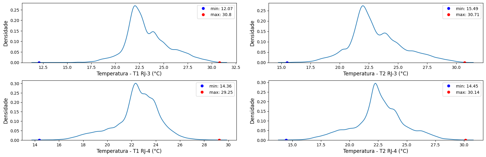

```python
# Trend Plots

ngrafs = 4
fig, axes = plt.subplots(2, len(stats), figsize=(20,1.5*ngrafs))

boia = ' RJ-3 '
for l in range(len(stats2)):
    ylb = 'T' + str(l+1) + boia +'(°C)'
    plt.sca(axes[0][l])
    label = stats2.iloc[l].name
    S = df2[label]
    plt.plot(df2.Dt_Hr, S, ':', linewidth=0.5)  
    plt.ylabel(ylb, fontsize=12)

boia = ' RJ-4 '
for l in range(len(stats)):
    ylb = 'T' + str(l+1) + boia +'(°C)'
    plt.sca(axes[1][l])
    label = stats.iloc[l].name
    S = df[label]
    plt.plot(df.Dt_Hr, S, ':', linewidth=0.5)
    plt.ylabel(ylb, fontsize=12)

plt.subplots_adjust(hspace=0.3, wspace=0.15)
plt.show()
```

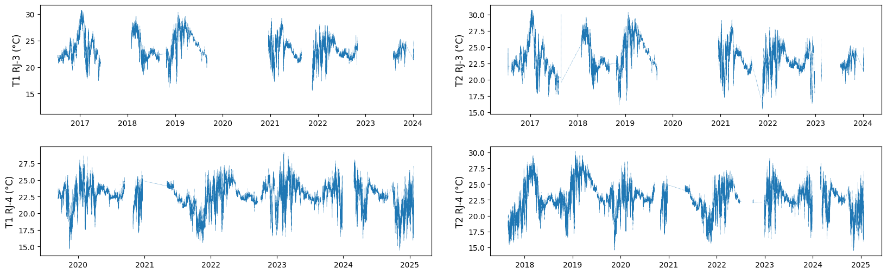

## 2.2 Assessing differences between temperature sensors (T1 e T2)

### 2.2.1 Initial assessment
```python
# Trend plot (RJ4)
plt.plot(df.Dt_Hr, df.Temp1, '-', linewidth=0.5) # blue: T1 
plt.plot(df.Dt_Hr, df.Temp2, 'g.', markersize=0.5) # green: T2

difT = abs(df.Temp1-df.Temp2)
plt.plot(df.Dt_Hr, difT) # orange: T1-T2
```

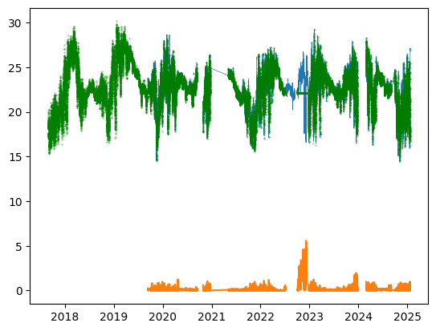

```python
# Trend plot  (RJ3)
plt.plot(df2.Dt_Hr, df2.Temp1, '-', linewidth=0.5)  # blue: T1 
plt.plot(df2.Dt_Hr, df2.Temp2, 'g.', markersize=0.5) # green: T2

difT2 = abs(df2.Temp1-df2.Temp2)
plt.plot(df2.Dt_Hr, difT2, '.', markersize=1)  # orange: T1-T2
```

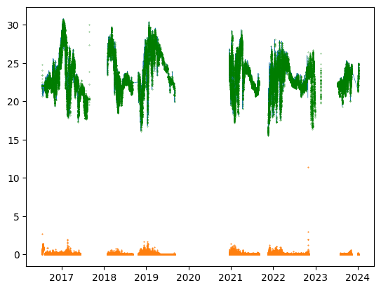

```python
# T1-t2 (statistics)

print('RJ-4: T1-T2:\n')
difT.describe(), 

print('\nRJ-3: T1-T2:\n')
difT2.describe()
```
>**Output:**   
  
    RJ-4: T1-T2:    
    count    60466.000000
     mean         0.134680
     std          0.377905
     min          0.000000
     25%          0.020000
     50%          0.060000
     75%          0.110000
     max          5.590000
     dtype: float64

    RJ-3: T1-T2:    
     count    56504.000000
     mean         0.067730
     std          0.109088
     min          0.000000
     25%          0.020000
     50%          0.050000
     75%          0.080000
     max         11.440000
     dtype: float64

**Note:** Maximum differnces betwwen sennsors reach 5.59°C (RJ-4) and 11.44 (RJ-3).
Differences greater than 1.0°C require attention.

### 2.2.2 Handling RJ-4 issues:

```python
# Filtering instances with T1-T2 > 1°C
lim = 1
Flag  = difT>lim # boolean mask for limit exceeding points 
filtro = df[Flag]
filtro
```

<table border="1" class="dataframe">
  <thead>
    <tr style="text-align: right;">
      <th></th>
      <th>Dt_Hr</th>
      <th>timestamp</th>
      <th>Temp1</th>
      <th>Temp2</th>
    </tr>
  </thead>
  <tbody>
    <tr>
      <th>38957</th>
      <td>2020-04-23 14:55:00+00:00</td>
      <td>1.587654e+09</td>
      <td>23.32</td>
      <td>24.57</td>
    </tr>
    <tr>
      <th>47056</th>
      <td>2020-11-30 16:25:00+00:00</td>
      <td>1.606754e+09</td>
      <td>22.62</td>
      <td>21.57</td>
    </tr>
    <tr>
      <th>54595</th>
      <td>2021-11-18 14:21:40+00:00</td>
      <td>1.637245e+09</td>
      <td>17.91</td>
      <td>16.90</td>
    </tr>
    <tr>
      <th>56241</th>
      <td>2022-01-26 09:21:40+00:00</td>
      <td>1.643189e+09</td>
      <td>19.89</td>
      <td>18.79</td>
    </tr>
    <tr>
      <th>57104</th>
      <td>2022-03-03 16:21:40+00:00</td>
      <td>1.646324e+09</td>
      <td>19.89</td>
      <td>18.70</td>
    </tr>
    <tr>
      <th>...</th>
      <td>...</td>
      <td>...</td>
      <td>...</td>
      <td>...</td>
    </tr>
    <tr>
      <th>80733</th>
      <td>2023-12-15 19:21:40+00:00</td>
      <td>1.702668e+09</td>
      <td>20.87</td>
      <td>19.82</td>
    </tr>
    <tr>
      <th>80989</th>
      <td>2023-12-21 15:21:40+00:00</td>
      <td>1.703172e+09</td>
      <td>23.01</td>
      <td>21.24</td>
    </tr>
    <tr>
      <th>81000</th>
      <td>2023-12-21 21:21:40+00:00</td>
      <td>1.703194e+09</td>
      <td>21.25</td>
      <td>20.20</td>
    </tr>
    <tr>
      <th>81077</th>
      <td>2023-12-23 17:21:40+00:00</td>
      <td>1.703352e+09</td>
      <td>22.79</td>
      <td>21.69</td>
    </tr>
    <tr>
      <th>81165</th>
      <td>2023-12-25 14:21:40+00:00</td>
      <td>1.703514e+09</td>
      <td>22.28</td>
      <td>20.95</td>
    </tr>
  </tbody>
</table>
<p>1743 rows × 4 columns</p>


Plotting periods (15 days range) where (T1-T2) > 1°C

```python
# Filter dates
datas = filtro.Dt_Hr.unique()

d1= d2=0
delta = 15 # 15 days range

# Plots:
# The loop iterates through 'datas' plotting a 15 day range trend.
# An 'x' marker (set to 30) flags points where (T1-T2) > 1°C

for d in datas:
    if d not in pd.date_range(d1, d2, freq='5min'):
        d1, d2 = d-timedelta(days=delta), d+timedelta(days=delta)
        c1 = df.Dt_Hr>=d1
        c2 = df.Dt_Hr<=d2
        X, Y, Z = df[c1&c2].Dt_Hr, df.Temp1[c1&c2], df.Temp2[c1&c2]
      
        plt.plot(X, Y, ':.', linewidth=1, markersize=1)
        plt.plot(X, Z, ':.', linewidth=1, markersize=1)
        plt.plot(X, 30*Flag[c1&c2], 'rx')
        plt.xticks(rotation=45)
        plt.show()
```

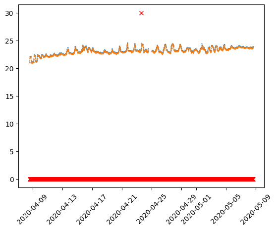

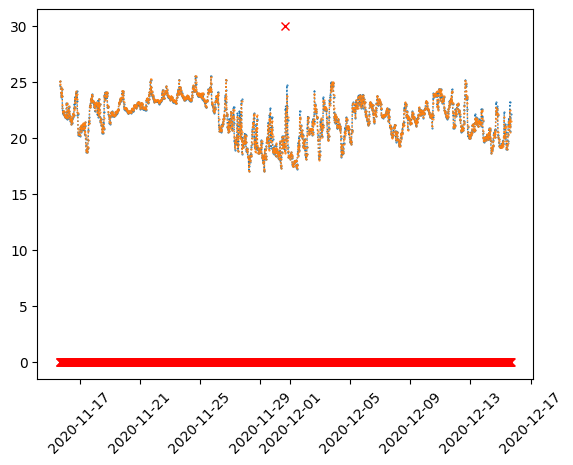

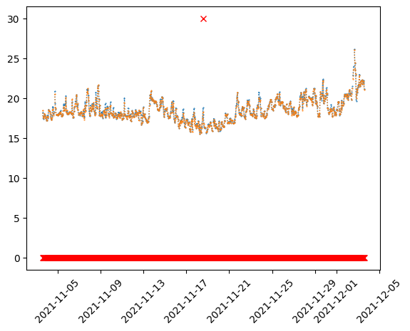

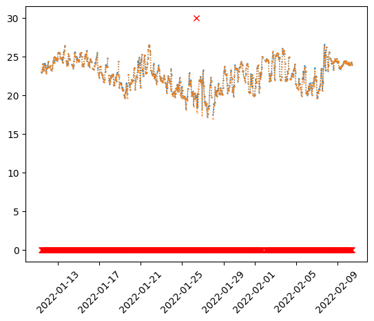

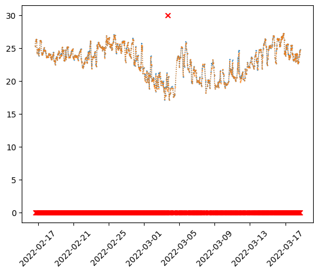

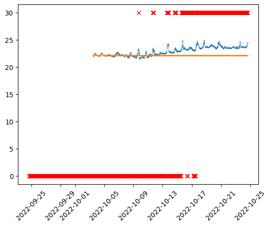

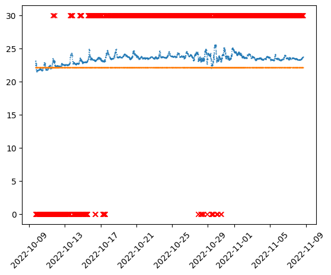

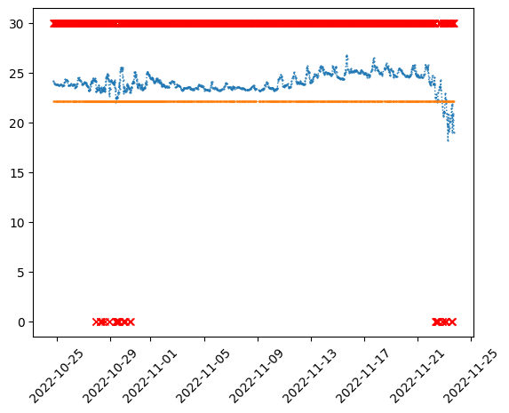

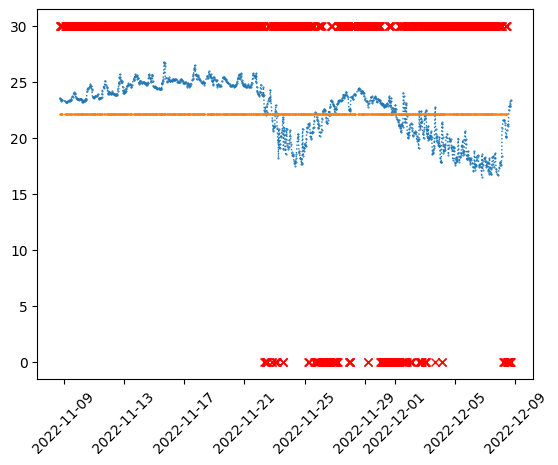

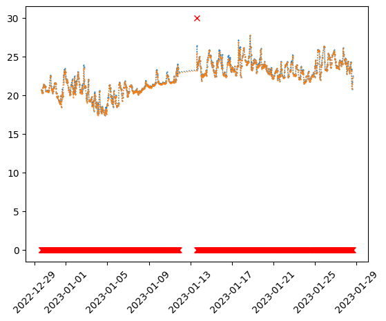

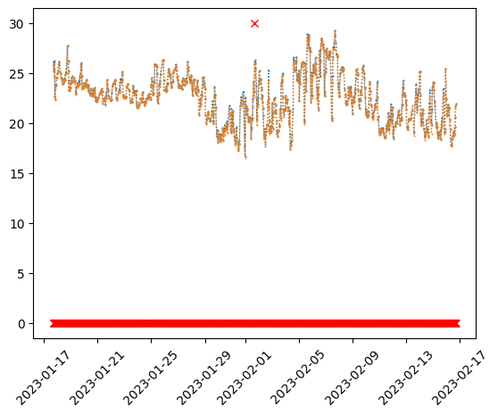

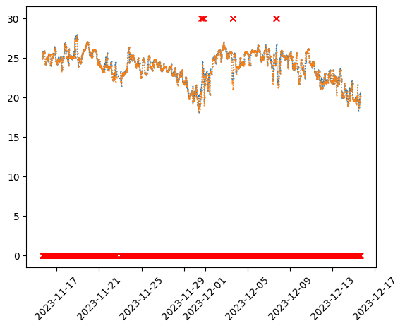

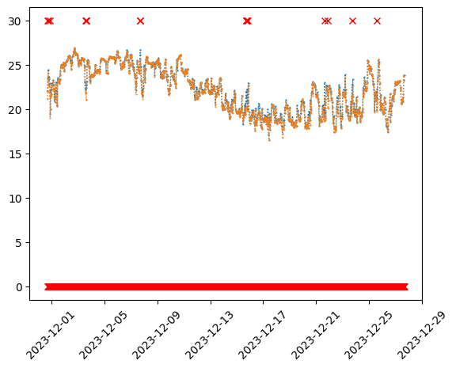

**Note:** See in plots from 2022-10-01 to 2022-12-09 that T2 values (orange dots) remain contant (a possible indication of sensor failure).

Other intances where (T1-T2) > 1°C are not representative (regarding  temperature trends) and are not considered an issue.

Decision: cleaning of T2 values: from 2022-10-01 to 2022-12-09.

```python
# Cleaning (RJ4 - T2) (1/10/22 a 9/12/22)
d1, d2 = datetime.fromisoformat('2022-10-01'), datetime.fromisoformat('2022-12-09')
c1 = df.Dt_Hr>=tz.localize(d1)
c2 = df.Dt_Hr<=tz.localize(d2)
Temp2_limp = df.Temp2.copy()
Temp2_limp[c1&c2]=np.nan

# Plot after cleaning
plt.plot(df.Dt_Hr, Temp2_limp)

```

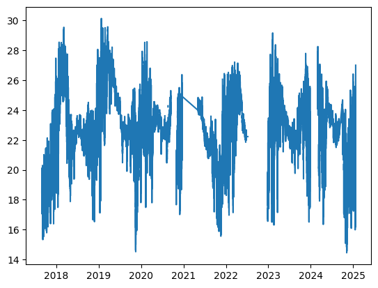

After error handling, the average of sensors T1 and T2 is computed.
NaN values are disregarded.

```python
# Average temperature RJ-4
def media_cond(a, b):
    if pd.isna(a):
        if pd.isna(b): return np.nan
        else: return b  
    if pd.isna(b):
        if pd.isna(a): return np.nan
        else: return a
    else: return np.mean([a,b])

Tmed = pd.Series(map(lambda a, b: media_cond(a, b), df.Temp1, Temp2_limp))
plt.plot(df.Dt_Hr, Tmed, '.', markersize=1)
```

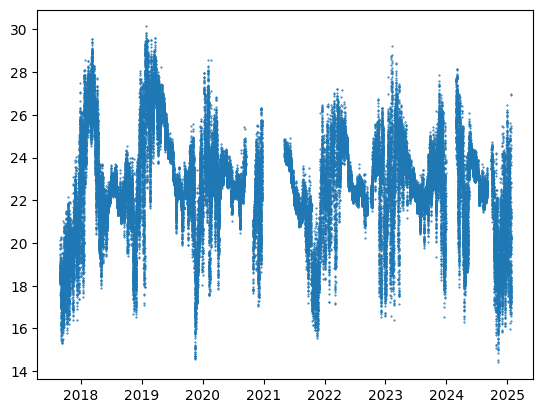


```python
# Dataset with avarage temp.
df['Tmed'] = Tmed
df.describe()
```

<table border="1" class="dataframe">
  <thead>
    <tr style="text-align: right;">
      <th></th>
      <th>timestamp</th>
      <th>Temp1</th>
      <th>Temp2</th>
      <th>Tmed</th>
    </tr>
  </thead>
  <tbody>
    <tr>
      <th>count</th>
      <td>9.536000e+04</td>
      <td>63990.000000</td>
      <td>90125.000000</td>
      <td>93649.000000</td>
    </tr>
    <tr>
      <th>mean</th>
      <td>1.618446e+09</td>
      <td>22.431082</td>
      <td>22.581240</td>
      <td>22.592077</td>
    </tr>
    <tr>
      <th>std</th>
      <td>7.090464e+07</td>
      <td>1.875816</td>
      <td>2.201914</td>
      <td>2.199429</td>
    </tr>
    <tr>
      <th>min</th>
      <td>1.503927e+09</td>
      <td>14.360000</td>
      <td>14.450000</td>
      <td>14.405000</td>
    </tr>
    <tr>
      <th>25%</th>
      <td>1.555541e+09</td>
      <td>21.660000</td>
      <td>21.560000</td>
      <td>21.550000</td>
    </tr>
    <tr>
      <th>50%</th>
      <td>1.607876e+09</td>
      <td>22.600000</td>
      <td>22.550000</td>
      <td>22.590000</td>
    </tr>
    <tr>
      <th>75%</th>
      <td>1.684728e+09</td>
      <td>23.650000</td>
      <td>23.850000</td>
      <td>23.870000</td>
    </tr>
    <tr>
      <th>max</th>
      <td>1.737566e+09</td>
      <td>29.250000</td>
      <td>30.140000</td>
      <td>30.140000</td>
    </tr>
  </tbody>
</table>

### 2.2.3 Handling RJ-3 issues:

```python
# Filtering instances with T1-T2 > 1°C
lim = 1
Flag  = difT2>lim
filtro = df2[Flag]
filtro
```

<table border="1" class="dataframe">
  <thead>
    <tr style="text-align: right;">
      <th></th>
      <th>Dt_Hr</th>
      <th>timestamp</th>
      <th>Temp1</th>
      <th>Temp2</th>
    </tr>
  </thead>
  <tbody>
    <tr>
      <th>11</th>
      <td>2016-07-15 13:25:00+00:00</td>
      <td>1.468589e+09</td>
      <td>22.17</td>
      <td>24.83</td>
    </tr>
    <tr>
      <th>116</th>
      <td>2016-07-20 00:25:00+00:00</td>
      <td>1.468974e+09</td>
      <td>20.92</td>
      <td>22.07</td>
    </tr>
    <tr>
      <th>117</th>
      <td>2016-07-20 01:25:00+00:00</td>
      <td>1.468978e+09</td>
      <td>20.88</td>
      <td>22.07</td>
    </tr>
    <tr>
      <th>118</th>
      <td>2016-07-20 02:25:00+00:00</td>
      <td>1.468982e+09</td>
      <td>20.87</td>
      <td>22.07</td>
    </tr>
    <tr>
      <th>119</th>
      <td>2016-07-20 03:25:00+00:00</td>
      <td>1.468985e+09</td>
      <td>20.87</td>
      <td>22.07</td>
    </tr>
    <tr>
      <th>...</th>
      <td>...</td>
      <td>...</td>
      <td>...</td>
      <td>...</td>
    </tr>
    <tr>
      <th>55578</th>
      <td>2022-10-26 08:21:40+00:00</td>
      <td>1.666772e+09</td>
      <td>12.07</td>
      <td>23.51</td>
    </tr>
    <tr>
      <th>55600</th>
      <td>2022-10-26 22:51:40+00:00</td>
      <td>1.666825e+09</td>
      <td>21.55</td>
      <td>23.50</td>
    </tr>
    <tr>
      <th>55601</th>
      <td>2022-10-26 23:21:40+00:00</td>
      <td>1.666826e+09</td>
      <td>21.65</td>
      <td>23.59</td>
    </tr>
    <tr>
      <th>55641</th>
      <td>2022-10-28 02:21:40+00:00</td>
      <td>1.666924e+09</td>
      <td>20.48</td>
      <td>23.43</td>
    </tr>
    <tr>
      <th>55644</th>
      <td>2022-10-28 03:51:40+00:00</td>
      <td>1.666929e+09</td>
      <td>22.01</td>
      <td>23.24</td>
    </tr>
  </tbody>
</table>
<p>108 rows × 4 columns</p>

```python
# Filter dates
datas = filtro.Dt_Hr.unique()

# Plotting
d1= d2=0
delta = 15
for d in datas:
    if d not in pd.date_range(d1, d2, freq='5min'):
        d1, d2 = d-timedelta(days=delta), d+timedelta(days=delta)
        c1 = df2.Dt_Hr>=d1
        c2 = df2.Dt_Hr<=d2
        X, Y, Z = df2[c1&c2].Dt_Hr, df2.Temp1[c1&c2], df2.Temp2[c1&c2]
      
        plt.plot(X, Y, ':.', linewidth=1, markersize=1)
        plt.plot(X, Z, ':.', linewidth=1, markersize=1)
        plt.plot(X, 30*Flag[c1&c2], 'rx')
        plt.xticks(rotation=45)
        plt.show()
```

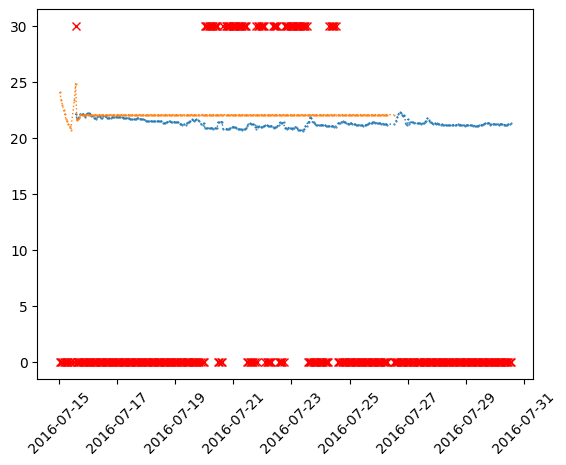

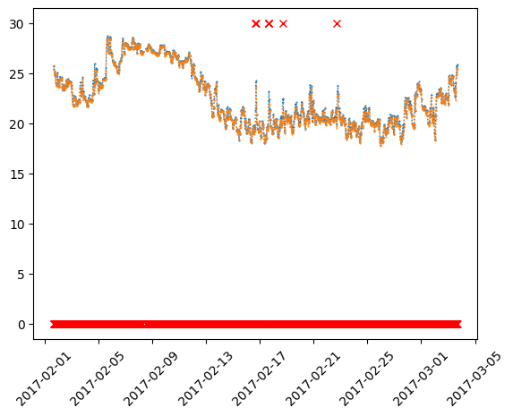

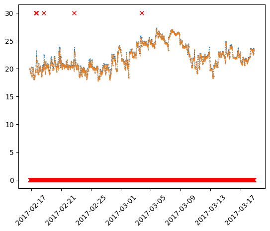

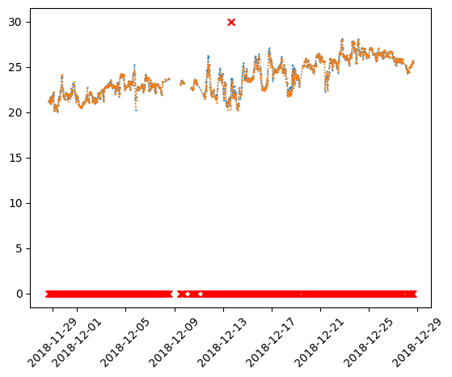

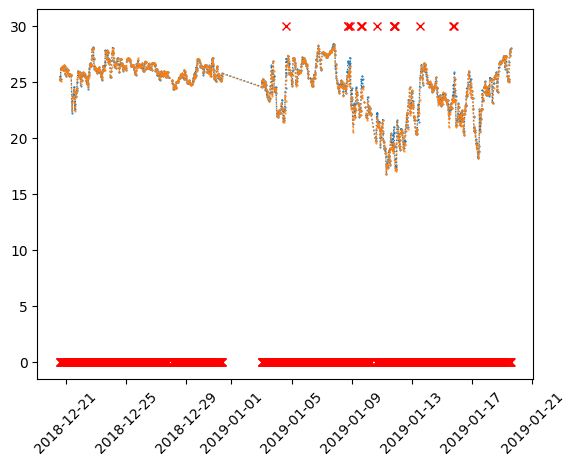

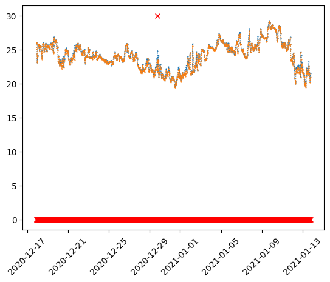

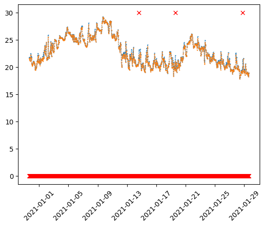

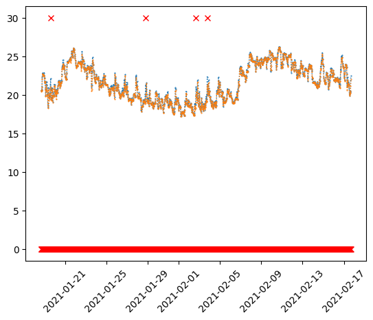

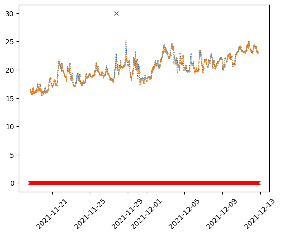

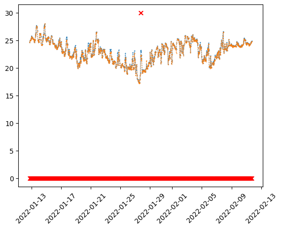

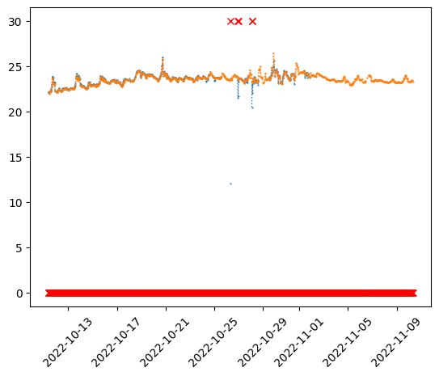

**Issues:**
- 'Freezing' of T2 from 2016-07-15 to 2016-07-26
- T1 outliers from 2022-10-26 to 2022-10-29
- T2 freezing/outlers form 2017-08-10 to 2017-08-26

```python
# T1 outliers
d1, d2 = datetime.fromisoformat('2022-10-26'), datetime.fromisoformat('2022-10-29')
plt.plot(df2.Dt_Hr, df2.Temp1, '.')
plt.plot(df2.Dt_Hr, df2.Temp2, '.')
plt.gca().set_xlim(d1,d2)
plt.xticks(rotation=45)
plt.show()
```

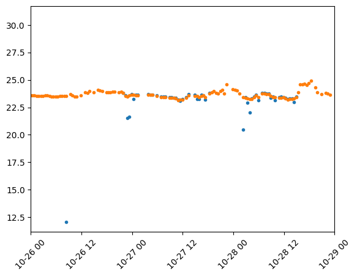

```python
# T2 outliers
d1, d2 = datetime.fromisoformat('2017-08-10'), datetime.fromisoformat('2017-08-26')
plt.plot(df2.Dt_Hr, df2.Temp1, '.')
plt.plot(df2.Dt_Hr, df2.Temp2, '.')
plt.gca().set_xlim(d1,d2)
plt.xticks(rotation=45)
plt.show()
```

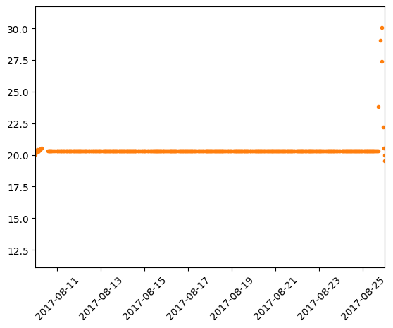

```python
# Handling RJ3 T2 (freezing/outliers)
d1, d2 = datetime.fromisoformat('2016-07-15 17:25'), datetime.fromisoformat('2016-07-26 12:25')
d3, d4 = datetime.fromisoformat('2017-08-10 12:00'), datetime.fromisoformat('2017-08-25 16:30')

c1 = df2.Dt_Hr>=tz.localize(d1)
c2 = df2.Dt_Hr<=tz.localize(d2)

c3 = df2.Dt_Hr>=tz.localize(d3)
c4 = df2.Dt_Hr<=tz.localize(d4)

Temp2_limp2 = df2.Temp2.copy()
Temp2_limp2[c1&c2]=np.nan
Temp2_limp2[c3&c4]=np.nan

```

```python
# Plot T2 after cleaning
plt.plot(df2.Dt_Hr, Temp2_limp2, '.', markersize=1)
```


```python
# Handling RJ3 T1 outliers

d1, d2 = datetime.fromisoformat('2022-10-26'), datetime.fromisoformat('2022-10-29')
c1 = df2.Dt_Hr>=tz.localize(d1)
c2 = df2.Dt_Hr<=tz.localize(d2)
c3 = df2.Temp1 < 22.5 # cleaning low values
Temp1_limp = df2.Temp1.copy()
Temp1_limp[c1&c2&c3]=np.nan
```

```python
# Plot T1 after cleaning
plt.plot(df2.Dt_Hr, Temp1_limp)

```
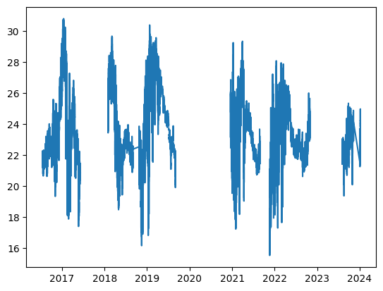

```python
# Taking the average temp. for RJ-3
Tmed2 = pd.Series(map(lambda a, b: media_cond(a, b), Temp2_limp2, Temp1_limp))
plt.plot(df2.Dt_Hr, Tmed2, '.', markersize=1)
```

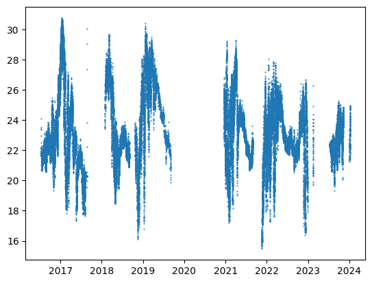

```python
# Updating dataset
df2['Tmed'] = Tmed2
df2.describe()
```

<table border="1" class="dataframe">
  <thead>
    <tr style="text-align: right;">
      <th></th>
      <th>timestamp</th>
      <th>Temp1</th>
      <th>Temp2</th>
      <th>Tmed</th>
    </tr>
  </thead>
  <tbody>
    <tr>
      <th>count</th>
      <td>7.180700e+04</td>
      <td>56837.000000</td>
      <td>63047.000000</td>
      <td>63380.000000</td>
    </tr>
    <tr>
      <th>mean</th>
      <td>1.591550e+09</td>
      <td>23.326666</td>
      <td>23.113516</td>
      <td>23.124323</td>
    </tr>
    <tr>
      <th>std</th>
      <td>7.732983e+07</td>
      <td>2.248119</td>
      <td>2.285022</td>
      <td>2.280750</td>
    </tr>
    <tr>
      <th>min</th>
      <td>1.468542e+09</td>
      <td>12.070000</td>
      <td>15.490000</td>
      <td>15.505000</td>
    </tr>
    <tr>
      <th>25%</th>
      <td>1.522339e+09</td>
      <td>21.870000</td>
      <td>21.710000</td>
      <td>21.710000</td>
    </tr>
    <tr>
      <th>50%</th>
      <td>1.615348e+09</td>
      <td>22.850000</td>
      <td>22.670000</td>
      <td>22.680000</td>
    </tr>
    <tr>
      <th>75%</th>
      <td>1.662889e+09</td>
      <td>24.620000</td>
      <td>24.410000</td>
      <td>24.430000</td>
    </tr>
    <tr>
      <th>max</th>
      <td>1.704623e+09</td>
      <td>30.800000</td>
      <td>30.710000</td>
      <td>30.750000</td>
    </tr>
  </tbody>
</table>

```python
# Setting timestamps as index
df.set_index(keys='timestamp', inplace=True)
df2.set_index(keys='timestamp', inplace=True)
```

# 3 Concatenating data

## 3.1 Joining DataFrames 

```python
# Merging
df3 = pd.merge(df, df2, how='outer', on=['timestamp', 'Dt_Hr'], suffixes=['_RJ4','_RJ3'])
df3
```

<table border="1" class="dataframe">
  <thead>
    <tr style="text-align: right;">
      <th></th>
      <th>Dt_Hr</th>
      <th>Temp1_RJ4</th>
      <th>Temp2_RJ4</th>
      <th>Tmed_RJ4</th>
      <th>Temp1_RJ3</th>
      <th>Temp2_RJ3</th>
      <th>Tmed_RJ3</th>
    </tr>
    <tr>
      <th>timestamp</th>
      <th></th>
      <th></th>
      <th></th>
      <th></th>
      <th></th>
      <th></th>
      <th></th>
    </tr>
  </thead>
  <tbody>
    <tr>
      <th>1.468542e+09</th>
      <td>2016-07-15 00:25:00+00:00</td>
      <td>NaN</td>
      <td>NaN</td>
      <td>NaN</td>
      <td>NaN</td>
      <td>24.09</td>
      <td>24.09</td>
    </tr>
    <tr>
      <th>1.468546e+09</th>
      <td>2016-07-15 01:25:00+00:00</td>
      <td>NaN</td>
      <td>NaN</td>
      <td>NaN</td>
      <td>NaN</td>
      <td>23.38</td>
      <td>23.38</td>
    </tr>
    <tr>
      <th>1.468550e+09</th>
      <td>2016-07-15 02:25:00+00:00</td>
      <td>NaN</td>
      <td>NaN</td>
      <td>NaN</td>
      <td>NaN</td>
      <td>22.95</td>
      <td>22.95</td>
    </tr>
    <tr>
      <th>1.468553e+09</th>
      <td>2016-07-15 03:25:00+00:00</td>
      <td>NaN</td>
      <td>NaN</td>
      <td>NaN</td>
      <td>NaN</td>
      <td>22.52</td>
      <td>22.52</td>
    </tr>
    <tr>
      <th>1.468557e+09</th>
      <td>2016-07-15 04:25:00+00:00</td>
      <td>NaN</td>
      <td>NaN</td>
      <td>NaN</td>
      <td>NaN</td>
      <td>22.10</td>
      <td>22.10</td>
    </tr>
    <tr>
      <th>...</th>
      <td>...</td>
      <td>...</td>
      <td>...</td>
      <td>...</td>
      <td>...</td>
      <td>...</td>
      <td>...</td>
    </tr>
    <tr>
      <th>1.737559e+09</th>
      <td>2025-01-22 15:21:40+00:00</td>
      <td>20.85</td>
      <td>20.85</td>
      <td>20.850</td>
      <td>NaN</td>
      <td>NaN</td>
      <td>NaN</td>
    </tr>
    <tr>
      <th>1.737561e+09</th>
      <td>2025-01-22 15:51:40+00:00</td>
      <td>20.34</td>
      <td>20.22</td>
      <td>20.280</td>
      <td>NaN</td>
      <td>NaN</td>
      <td>NaN</td>
    </tr>
    <tr>
      <th>1.737563e+09</th>
      <td>2025-01-22 16:21:40+00:00</td>
      <td>24.43</td>
      <td>23.68</td>
      <td>24.055</td>
      <td>NaN</td>
      <td>NaN</td>
      <td>NaN</td>
    </tr>
    <tr>
      <th>1.737565e+09</th>
      <td>2025-01-22 16:51:40+00:00</td>
      <td>27.12</td>
      <td>26.87</td>
      <td>26.995</td>
      <td>NaN</td>
      <td>NaN</td>
      <td>NaN</td>
    </tr>
    <tr>
      <th>1.737566e+09</th>
      <td>2025-01-22 17:21:40+00:00</td>
      <td>26.89</td>
      <td>27.01</td>
      <td>26.950</td>
      <td>NaN</td>
      <td>NaN</td>
      <td>NaN</td>
    </tr>
  </tbody>
</table>
<p>141688 rows × 7 columns</p>

**Note:** Since RJ-3 and RJ-4 bouys are lacted very closely, temperatures will be presented as a single attribute, calculated as the avarege of yhe buoys.
For integration with the meteorological stations data, the average sea surface temperature will be referenced at the midpoint fo RJ-3 andRJ-4 oordinates.

```python
# Average Temperatura (RJ3 e RJ4) 

Tmed_f = pd.Series(map(lambda a, b: media_cond(a, b), df3.Tmed_RJ4, df3.Tmed_RJ3), index=df3.index)
Tmed_f

plt.figure(figsize=(12,5))
plt.plot(df3.Dt_Hr, Tmed_f, '.', markersize=1)
plt.ylabel('Temperatura (°C)')
plt.title('Temperatura média (RJ3 e RJ-4)')

```

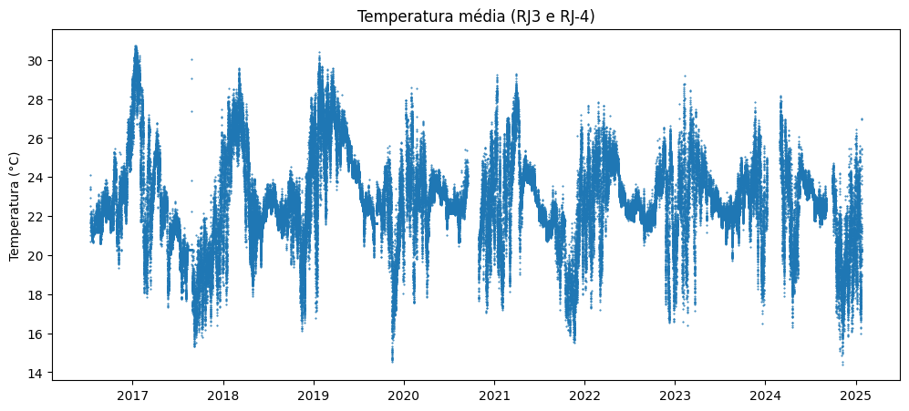

```python
# Dataset with average temperature
df4 = df3[['Dt_Hr']]

df4['TSM'] = Tmed_f
df4.dropna()

display(df4)

```

<table border="1" class="dataframe">
  <thead>
    <tr style="text-align: right;">
      <th></th>
      <th>Dt_Hr</th>
      <th>TSM</th>
    </tr>
    <tr>
      <th>timestamp</th>
      <th></th>
      <th></th>
    </tr>
  </thead>
  <tbody>
    <tr>
      <th>1.468542e+09</th>
      <td>2016-07-15 00:25:00+00:00</td>
      <td>24.090</td>
    </tr>
    <tr>
      <th>1.468546e+09</th>
      <td>2016-07-15 01:25:00+00:00</td>
      <td>23.380</td>
    </tr>
    <tr>
      <th>1.468550e+09</th>
      <td>2016-07-15 02:25:00+00:00</td>
      <td>22.950</td>
    </tr>
    <tr>
      <th>1.468553e+09</th>
      <td>2016-07-15 03:25:00+00:00</td>
      <td>22.520</td>
    </tr>
    <tr>
      <th>1.468557e+09</th>
      <td>2016-07-15 04:25:00+00:00</td>
      <td>22.100</td>
    </tr>
    <tr>
      <th>...</th>
      <td>...</td>
      <td>...</td>
    </tr>
    <tr>
      <th>1.737559e+09</th>
      <td>2025-01-22 15:21:40+00:00</td>
      <td>20.850</td>
    </tr>
    <tr>
      <th>1.737561e+09</th>
      <td>2025-01-22 15:51:40+00:00</td>
      <td>20.280</td>
    </tr>
    <tr>
      <th>1.737563e+09</th>
      <td>2025-01-22 16:21:40+00:00</td>
      <td>24.055</td>
    </tr>
    <tr>
      <th>1.737565e+09</th>
      <td>2025-01-22 16:51:40+00:00</td>
      <td>26.995</td>
    </tr>
    <tr>
      <th>1.737566e+09</th>
      <td>2025-01-22 17:21:40+00:00</td>
      <td>26.950</td>
    </tr>
  </tbody>
</table>
<p>138092 rows × 2 columns</p>


```python
df4.describe().T
```

<table border="1" class="dataframe">
  <thead>
    <tr style="text-align: right;">
      <th></th>
      <th>count</th>
      <th>mean</th>
      <th>std</th>
      <th>min</th>
      <th>25%</th>
      <th>50%</th>
      <th>75%</th>
      <th>max</th>
    </tr>
  </thead>
  <tbody>
    <tr>
      <th>TSM</th>
      <td>138092.0</td>
      <td>22.781425</td>
      <td>2.311649</td>
      <td>14.405</td>
      <td>21.565</td>
      <td>22.605</td>
      <td>24.0725</td>
      <td>30.75</td>
    </tr>
  </tbody>
</table>


## 3.2 Data sampling
Since data from meteorological stations are sampled once an hour, bouys data will be reduced to meet this sampling ratio.

### 3.2.1 Assessing time resolution 

```python
# Minute attribute
Min = df4.Dt_Hr.apply(lambda x: x.minute)
# Unique values
np.sort(Min.unique())
```
> **Output:**   

    array([21, 22, 23, 25, 26, 27, 28, 51, 52, 53, 54, 55, 56, 57],
          dtype=int64)

```python
# Time intervals
delta_t=pd.Series(difer_time(list(df4.Dt_Hr))/60)
delta_t
```

    0          0.0
    1         60.0
    2         60.0
    3         60.0
    4         60.0
              ...
    141683    30.0
    141684    30.0
    141685    30.0
    141686    30.0
    141687    30.0
    Length: 141688, dtype: float64

```python
# Time intervals: frequency
delta_t.value_counts()
```

    30.000000       106271
    2.000000         12027
    28.000000        11918
    60.000000         9179
    90.000000          778
                     ...
    33.333333            1
    56.666667            1
    65190.000000         1
    750.000000           1
    35756.533333         1
    Name: count, Length: 161, dtype: int64

### 3.2.2 Sampling

Timestamps for meteorological stations data are labled to minute zero (o'clock time).
Meanwhile, for buoys data, timestamps range from minute 21 to 57.
To gather data closest to o'clock time, the dataset is first filterd to minutes > 50.

```python
df5 = df4[Min>50]
df5
```

<table border="1" class="dataframe">
  <thead>
    <tr style="text-align: right;">
      <th></th>
      <th>Dt_Hr</th>
      <th>TSM</th>
    </tr>
    <tr>
      <th>timestamp</th>
      <th></th>
      <th></th>
    </tr>
  </thead>
  <tbody>
    <tr>
      <th>1.470686e+09</th>
      <td>2016-08-08 19:55:00+00:00</td>
      <td>22.025</td>
    </tr>
    <tr>
      <th>1.470690e+09</th>
      <td>2016-08-08 20:55:00+00:00</td>
      <td>21.965</td>
    </tr>
    <tr>
      <th>1.470693e+09</th>
      <td>2016-08-08 21:55:00+00:00</td>
      <td>21.970</td>
    </tr>
    <tr>
      <th>1.470697e+09</th>
      <td>2016-08-08 22:55:00+00:00</td>
      <td>21.970</td>
    </tr>
    <tr>
      <th>1.470700e+09</th>
      <td>2016-08-08 23:55:00+00:00</td>
      <td>21.930</td>
    </tr>
    <tr>
      <th>...</th>
      <td>...</td>
      <td>...</td>
    </tr>
    <tr>
      <th>1.737550e+09</th>
      <td>2025-01-22 12:51:40+00:00</td>
      <td>21.190</td>
    </tr>
    <tr>
      <th>1.737554e+09</th>
      <td>2025-01-22 13:51:40+00:00</td>
      <td>20.560</td>
    </tr>
    <tr>
      <th>1.737558e+09</th>
      <td>2025-01-22 14:51:40+00:00</td>
      <td>20.250</td>
    </tr>
    <tr>
      <th>1.737561e+09</th>
      <td>2025-01-22 15:51:40+00:00</td>
      <td>20.280</td>
    </tr>
    <tr>
      <th>1.737565e+09</th>
      <td>2025-01-22 16:51:40+00:00</td>
      <td>26.995</td>
    </tr>
  </tbody>
</table>
<p>68753 rows × 2 columns</p>

The next step is to establish a regular 1 hour interval for sampling.

```python
 
d1, d2 = '2016-08-08 20:00:00', '2025-01-22 16:00:00' # total time range of filterd dataset (adjusted)
d1, d2 = tz.localize(datetime.fromisoformat(d1)), tz.localize(datetime.fromisoformat(d2))
time_r = pd.Series(pd.date_range(d1, d2, freq='1h')) 

# Applying index (timestamp)
ts2 = time_r.apply(datetime.timestamp)
time_r.index=ts2
time_r
```
>**Output:**    

    1.470686e+09   2016-08-08 20:00:00+00:00
    1.470690e+09   2016-08-08 21:00:00+00:00
    1.470694e+09   2016-08-08 22:00:00+00:00
    1.470697e+09   2016-08-08 23:00:00+00:00
    1.470701e+09   2016-08-09 00:00:00+00:00
                          ...           
    1.737551e+09   2025-01-22 13:00:00+00:00
    1.737554e+09   2025-01-22 14:00:00+00:00
    1.737558e+09   2025-01-22 15:00:00+00:00
    1.737562e+09   2025-01-22 16:00:00+00:00
    Length: 74133, dtype: datetime64[ns, UTC]


Finally, the dataset is subsampled.
The strategy is matching the regular interval timesptamps (df6) on filterd dataset (df5) nearest key, with a tolerance of 10 minutes (600 seconds).

```python
# Sampling dataframe to regular time interval
df6 = pd.DataFrame(timerange, columns=['Dt_Hr'])
tol= 600 # tolerance (in seconds)
df6 = pd.merge_asof(df6, df5, left_index=True, right_index=True, tolerance = tol) 

# Trend (sampled dataset)

plt.figure(figsize=(12,5))
plt.plot(df6.Dt_Hr_x, df6.TSM, '.', markersize=1)
plt.ylabel('Temperatura (°C)')
plt.title('Temperatura média (RJ3 e RJ-4)')
```

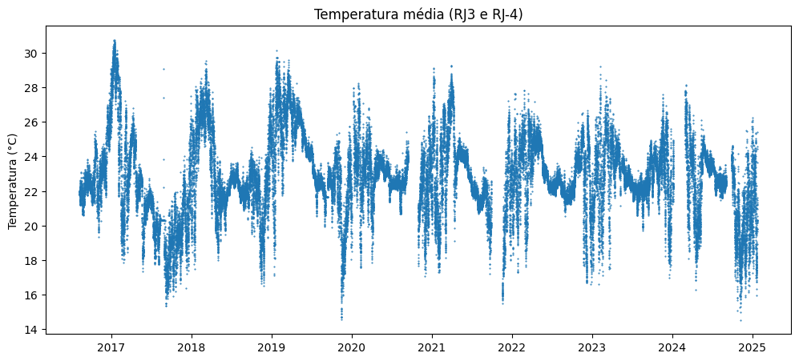

```python
(df6.Dt_Hr_x-df6.Dt_Hr_y).describe()
```

    count                        62781
    mean     0 days 00:06:37.881859161
    std      0 days 00:01:39.264061545
    min                0 days 00:02:25
    25%                0 days 00:05:00
    50%                0 days 00:05:00
    75%                0 days 00:08:20
    max                0 days 00:08:20
    dtype: object

# Export

```python
Arquivo = 'TSM_concat.csv'
df6.to_csv(Arquivo, sep=';')
```
