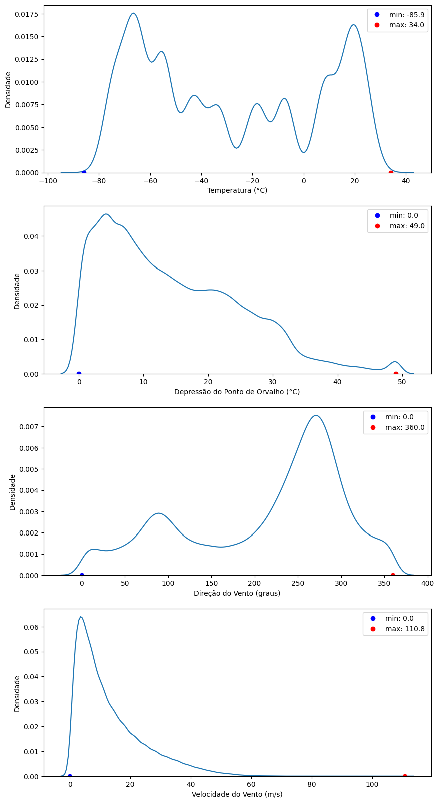
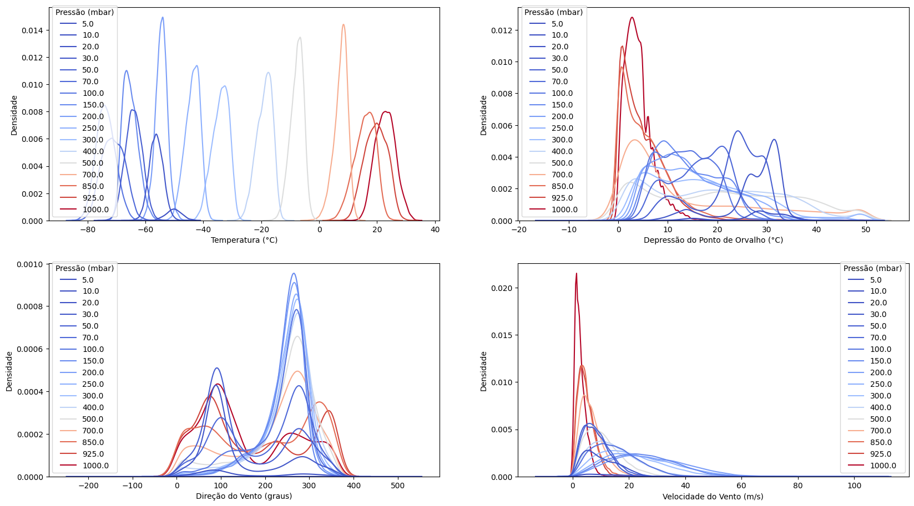

# Setup

```python
import pandas as pd
import numpy as np
from datetime import datetime, time
import pytz
import matplotlib.pyplot as plt
import seaborn as sns
import os
```

```python
# Customized functions (find files in ..\utils folder)
import Setup_RSoundings as stp
from Setup_Met_Stations import Unicos, difer_time
```

# 1. Import Data

## 1.1 Load data

```python
# Gerar dataframe
ID = 'BRM00083746' # ID for Galeão Air Force Base soundings

arquivo='BRM00083746-data.txt'

df=stp.read_sounding(arquivo, ID)
df
```

<table border="1" class="dataframe">
  <thead>
    <tr style="text-align: right;">
      <th></th>
      <th>Ano</th>
      <th>Mes</th>
      <th>Dia</th>
      <th>Hora</th>
      <th>Hora_lanc</th>
      <th>Lat</th>
      <th>Long</th>
      <th>LVLTYP1</th>
      <th>LVLTYP2</th>
      <th>dt</th>
      <th>Press</th>
      <th>PFLAG</th>
      <th>Alt</th>
      <th>ZFLAG</th>
      <th>TEMP</th>
      <th>TFLAG</th>
      <th>Umid</th>
      <th>POv_dep</th>
      <th>Vento_dir</th>
      <th>Vento_vel</th>
    </tr>
  </thead>
  <tbody>
    <tr>
      <th>0</th>
      <td>1961</td>
      <td>01</td>
      <td>02</td>
      <td>13</td>
      <td>9999</td>
      <td>-228167</td>
      <td>-432500</td>
      <td>1</td>
      <td>1</td>
      <td>-9999</td>
      <td>100000</td>
      <td>B</td>
      <td>42</td>
      <td></td>
      <td>300</td>
      <td>B</td>
      <td>700</td>
      <td>-9999</td>
      <td>0</td>
      <td>0</td>
    </tr>
    <tr>
      <th>1</th>
      <td>1961</td>
      <td>01</td>
      <td>02</td>
      <td>13</td>
      <td>9999</td>
      <td>-228167</td>
      <td>-432500</td>
      <td>1</td>
      <td>0</td>
      <td>-9999</td>
      <td>85000</td>
      <td></td>
      <td>1468</td>
      <td>B</td>
      <td>179</td>
      <td>B</td>
      <td>890</td>
      <td>-9999</td>
      <td>320</td>
      <td>110</td>
    </tr>
    <tr>
      <th>2</th>
      <td>1961</td>
      <td>01</td>
      <td>02</td>
      <td>13</td>
      <td>9999</td>
      <td>-228167</td>
      <td>-432500</td>
      <td>1</td>
      <td>0</td>
      <td>-9999</td>
      <td>70000</td>
      <td></td>
      <td>3110</td>
      <td>B</td>
      <td>85</td>
      <td>B</td>
      <td>970</td>
      <td>-9999</td>
      <td>330</td>
      <td>100</td>
    </tr>
    <tr>
      <th>3</th>
      <td>1961</td>
      <td>01</td>
      <td>02</td>
      <td>13</td>
      <td>9999</td>
      <td>-228167</td>
      <td>-432500</td>
      <td>1</td>
      <td>0</td>
      <td>-9999</td>
      <td>50000</td>
      <td></td>
      <td>5817</td>
      <td>B</td>
      <td>-63</td>
      <td>B</td>
      <td>1000</td>
      <td>-9999</td>
      <td>300</td>
      <td>130</td>
    </tr>
    <tr>
      <th>4</th>
      <td>1961</td>
      <td>01</td>
      <td>02</td>
      <td>13</td>
      <td>9999</td>
      <td>-228167</td>
      <td>-432500</td>
      <td>1</td>
      <td>0</td>
      <td>-9999</td>
      <td>40000</td>
      <td></td>
      <td>7536</td>
      <td>B</td>
      <td>-162</td>
      <td>B</td>
      <td>940</td>
      <td>-9999</td>
      <td>310</td>
      <td>110</td>
    </tr>
    <tr>
      <th>...</th>
      <td>...</td>
      <td>...</td>
      <td>...</td>
      <td>...</td>
      <td>...</td>
      <td>...</td>
      <td>...</td>
      <td>...</td>
      <td>...</td>
      <td>...</td>
      <td>...</td>
      <td>...</td>
      <td>...</td>
      <td>...</td>
      <td>...</td>
      <td>...</td>
      <td>...</td>
      <td>...</td>
      <td>...</td>
      <td>...</td>
    </tr>
    <tr>
      <th>1975830</th>
      <td>2024</td>
      <td>11</td>
      <td>27</td>
      <td>00</td>
      <td>2330</td>
      <td>-228167</td>
      <td>-432500</td>
      <td>3</td>
      <td>0</td>
      <td>-9999</td>
      <td>-9999</td>
      <td></td>
      <td>20700</td>
      <td></td>
      <td>-9999</td>
      <td></td>
      <td>-9999</td>
      <td>-9999</td>
      <td>240</td>
      <td>57</td>
    </tr>
    <tr>
      <th>1975831</th>
      <td>2024</td>
      <td>11</td>
      <td>27</td>
      <td>00</td>
      <td>2330</td>
      <td>-228167</td>
      <td>-432500</td>
      <td>3</td>
      <td>0</td>
      <td>-9999</td>
      <td>-9999</td>
      <td></td>
      <td>22500</td>
      <td></td>
      <td>-9999</td>
      <td></td>
      <td>-9999</td>
      <td>-9999</td>
      <td>70</td>
      <td>62</td>
    </tr>
    <tr>
      <th>1975832</th>
      <td>2024</td>
      <td>11</td>
      <td>27</td>
      <td>00</td>
      <td>2330</td>
      <td>-228167</td>
      <td>-432500</td>
      <td>3</td>
      <td>0</td>
      <td>-9999</td>
      <td>-9999</td>
      <td></td>
      <td>22800</td>
      <td></td>
      <td>-9999</td>
      <td></td>
      <td>-9999</td>
      <td>-9999</td>
      <td>80</td>
      <td>87</td>
    </tr>
    <tr>
      <th>1975833</th>
      <td>2024</td>
      <td>11</td>
      <td>27</td>
      <td>00</td>
      <td>2330</td>
      <td>-228167</td>
      <td>-432500</td>
      <td>3</td>
      <td>0</td>
      <td>-9999</td>
      <td>-9999</td>
      <td></td>
      <td>23700</td>
      <td></td>
      <td>-9999</td>
      <td></td>
      <td>-9999</td>
      <td>-9999</td>
      <td>40</td>
      <td>51</td>
    </tr>
    <tr>
      <th>1975834</th>
      <td>2024</td>
      <td>11</td>
      <td>27</td>
      <td>00</td>
      <td>2330</td>
      <td>-228167</td>
      <td>-432500</td>
      <td>3</td>
      <td>0</td>
      <td>-9999</td>
      <td>-9999</td>
      <td></td>
      <td>24000</td>
      <td></td>
      <td>-9999</td>
      <td></td>
      <td>-9999</td>
      <td>-9999</td>
      <td>55</td>
      <td>51</td>
    </tr>
  </tbody>
</table>
<p>1975835 rows × 20 columns</p>


```python
df.describe().T
```

<table border="1" class="dataframe">
  <thead>
    <tr style="text-align: right;">
      <th></th>
      <th>count</th>
      <th>unique</th>
      <th>top</th>
      <th>freq</th>
    </tr>
  </thead>
  <tbody>
    <tr>
      <th>Ano</th>
      <td>1975835</td>
      <td>64</td>
      <td>2021</td>
      <td>82891</td>
    </tr>
    <tr>
      <th>Mes</th>
      <td>1975835</td>
      <td>12</td>
      <td>08</td>
      <td>184642</td>
    </tr>
    <tr>
      <th>Dia</th>
      <td>1975835</td>
      <td>31</td>
      <td>05</td>
      <td>66445</td>
    </tr>
    <tr>
      <th>Hora</th>
      <td>1975835</td>
      <td>14</td>
      <td>12</td>
      <td>1128694</td>
    </tr>
    <tr>
      <th>Hora_lanc</th>
      <td>1975835</td>
      <td>318</td>
      <td>9999</td>
      <td>675104</td>
    </tr>
    <tr>
      <th>Lat</th>
      <td>1975835</td>
      <td>1</td>
      <td>-228167</td>
      <td>1975835</td>
    </tr>
    <tr>
      <th>Long</th>
      <td>1975835</td>
      <td>1</td>
      <td>-432500</td>
      <td>1975835</td>
    </tr>
    <tr>
      <th>LVLTYP1</th>
      <td>1975835</td>
      <td>4</td>
      <td>2</td>
      <td>1268174</td>
    </tr>
    <tr>
      <th>LVLTYP2</th>
      <td>1975835</td>
      <td>3</td>
      <td>0</td>
      <td>1914389</td>
    </tr>
    <tr>
      <th>dt</th>
      <td>1975835</td>
      <td>1</td>
      <td>-9999</td>
      <td>1975835</td>
    </tr>
    <tr>
      <th>Press</th>
      <td>1975835</td>
      <td>3887</td>
      <td>-9999</td>
      <td>269813</td>
    </tr>
    <tr>
      <th>PFLAG</th>
      <td>1975835</td>
      <td>3</td>
      <td></td>
      <td>1941143</td>
    </tr>
    <tr>
      <th>Alt</th>
      <td>1975835</td>
      <td>30110</td>
      <td>-9999</td>
      <td>968016</td>
    </tr>
    <tr>
      <th>ZFLAG</th>
      <td>1975835</td>
      <td>3</td>
      <td></td>
      <td>1265382</td>
    </tr>
    <tr>
      <th>TEMP</th>
      <td>1975835</td>
      <td>1199</td>
      <td>-9999</td>
      <td>880326</td>
    </tr>
    <tr>
      <th>TFLAG</th>
      <td>1975835</td>
      <td>3</td>
      <td>B</td>
      <td>1091108</td>
    </tr>
    <tr>
      <th>Umid</th>
      <td>1975835</td>
      <td>978</td>
      <td>-9999</td>
      <td>1894801</td>
    </tr>
    <tr>
      <th>POv_dep</th>
      <td>1975835</td>
      <td>396</td>
      <td>-9999</td>
      <td>1067217</td>
    </tr>
    <tr>
      <th>Vento_dir</th>
      <td>1975835</td>
      <td>75</td>
      <td>-9999</td>
      <td>575688</td>
    </tr>
    <tr>
      <th>Vento_vel</th>
      <td>1975835</td>
      <td>397</td>
      <td>-9999</td>
      <td>574184</td>
    </tr>
  </tbody>
</table>


## 1.2 Handling error/non-valid values

```python
# Inspecionar valores das colunas 
unique = Unicos(df)
unique
```
>**Output:**   
>  
 <details>
  <summary>Show/Hide</summary>

```
{'Ano': array(['1961', '1962', '1963', '1964', '1965', '1966', '1967', '1968',
        '1969', '1970', '1971', '1972', '1973', '1974', '1975', '1976',
        '1977', '1978', '1979', '1980', '1981', '1982', '1983', '1984',
        '1985', '1986', '1987', '1988', '1989', '1990', '1991', '1992',
        '1993', '1994', '1995', '1996', '1997', '1998', '1999', '2000',
        '2001', '2002', '2003', '2004', '2005', '2006', '2007', '2008',
        '2009', '2010', '2011', '2012', '2013', '2014', '2015', '2016',
        '2017', '2018', '2019', '2020', '2021', '2022', '2023', '2024'],
       dtype='<U4'),
 'Mes': array(['01', '02', '03', '04', '05', '06', '07', '08', '09', '10', '11',
        '12'], dtype='<U2'),
 'Dia': array(['01', '02', '03', '04', '05', '06', '07', '08', '09', '10', '11',
        '12', '13', '14', '15', '16', '17', '18', '19', '20', '21', '22',
        '23', '24', '25', '26', '27', '28', '29', '30', '31'], dtype='<U2'),
 'Hora': array(['00', '01', '03', '06', '10', '11', '12', '13', '14', '15', '16',
        '18', '22', '23'], dtype='<U2'),
 'Hora_lanc': array(['0000', '0001', '0002', '0003', '0004', '0005', '0006', '0007',
        '0008', '0009', '0010', '0011', '0012', '0013', '0014', '0015',
        '0016', '0017', '0018', '0019', '0020', '0021', '0022', '0023',
        '0024', '0025', '0026', '0027', '0028', '0029', '0030', '0031',
        '0033', '0034', '0035', '0036', '0037', '0038', '0039', '0040',
        '0041', '0043', '0044', '0045', '0047', '0048', '0050', '0051',
        '0052', '0053', '0055', '0057', '0058', '0100', '0101', '0103',
        '0104', '0108', '0110', '0112', '0114', '0115', '0118', '0119',
        '0120', '0127', '0131', '0136', '0141', '0142', '0145', '0235',
        '0922', '0952', '1023', '1026', '1031', '1032', '1040', '1046',
        '1050', '1051', '1056', '1057', '1058', '1100', '1101', '1102',
        '1103', '1104', '1105', '1106', '1107', '1108', '1109', '1110',
        '1111', '1112', '1113', '1114', '1115', '1116', '1117', '1118',
        '1119', '1120', '1121', '1122', '1123', '1124', '1125', '1126',
        '1127', '1128', '1129', '1130', '1131', '1132', '1133', '1134',
        '1135', '1136', '1137', '1138', '1139', '1140', '1141', '1142',
        '1143', '1144', '1145', '1146', '1147', '1148', '1149', '1150',
        '1151', '1152', '1153', '1154', '1155', '1156', '1157', '1158',
        '1159', '1200', '1201', '1202', '1203', '1204', '1205', '1206',
        '1207', '1208', '1209', '1210', '1211', '1212', '1213', '1214',
        '1215', '1216', '1217', '1218', '1219', '1220', '1221', '1222',
        '1223', '1224', '1225', '1226', '1227', '1228', '1229', '1230',
        '1231', '1232', '1233', '1234', '1235', '1236', '1237', '1238',
        '1239', '1240', '1241', '1243', '1244', '1245', '1246', '1247',
        '1248', '1251', '1252', '1253', '1255', '1256', '1257', '1258',
        '1301', '1303', '1304', '1305', '1306', '1309', '1310', '1311',
        '1312', '1313', '1315', '1316', '1317', '1318', '1321', '1322',
        '1323', '1324', '1326', '1328', '1329', '1331', '1333', '1335',
        '1338', '1344', '1349', '1351', '1352', '1353', '1356', '1402',
        '1412', '1437', '1448', '2130', '2131', '2142', '2205', '2207',
        '2210', '2212', '2220', '2225', '2228', '2238', '2240', '2242',
        '2244', '2245', '2246', '2250', '2251', '2252', '2253', '2254',
        '2258', '2259', '2300', '2301', '2302', '2303', '2304', '2305',
        '2306', '2308', '2309', '2310', '2311', '2312', '2313', '2314',
        '2315', '2316', '2317', '2318', '2319', '2320', '2321', '2322',
        '2323', '2324', '2325', '2326', '2327', '2328', '2329', '2330',
        '2331', '2332', '2333', '2334', '2335', '2336', '2337', '2338',
        '2339', '2340', '2341', '2342', '2343', '2344', '2345', '2346',
        '2347', '2348', '2349', '2350', '2351', '2352', '2353', '2354',
        '2355', '2356', '2357', '2358', '2359', '9999'], dtype='<U4'),
 'Lat': array(['-228167'], dtype='<U7'),
 'Long': array([' -432500'], dtype='<U8'),
 'LVLTYP1': array(['0', '1', '2', '3'], dtype='<U1'),
 'LVLTYP2': array(['0', '1', '2'], dtype='<U1'),
 'dt': array(['-9999'], dtype='<U5'),
 'Press': array(['-9999', '100', '1000', ..., '9990', '99900', '99950'], dtype='<U6'),
 'PFLAG': array(['', 'A', 'B'], dtype='<U1'),
 'Alt': array(['-8888', '-9999', '0', ..., '9997', '9998', '9999'], dtype='<U5'),
 'ZFLAG': array(['', 'A', 'B'], dtype='<U1'),
 'TEMP': array(['-1', '-10', '-100', ..., '97', '98', '99'], dtype='<U5'),
 'TFLAG': array(['', 'A', 'B'], dtype='<U1'),
 'Umid': array(['-8888', '-9999', '0', '10', '100', '1000', '101', '102', '103',
        '104', '105', '106', '107', '108', '109', '110', '111', '112',
        '113', '114', '115', '116', '117', '118', '119', '120', '121',
        '122', '123', '124', '125', '126', '127', '128', '129', '130',
        '131', '132', '133', '134', '135', '136', '137', '138', '139',
        '140', '141', '142', '143', '144', '145', '146', '147', '148',
        '149', '150', '151', '152', '153', '154', '155', '156', '157',
        '158', '159', '160', '161', '162', '163', '164', '165', '166',
        '167', '168', '169', '170', '171', '172', '173', '174', '175',
        '176', '177', '178', '179', '180', '181', '182', '183', '184',
        '185', '186', '187', '188', '189', '190', '191', '192', '193',
        '194', '195', '196', '197', '198', '199', '200', '201', '202',
        '203', '204', '205', '206', '207', '208', '209', '21', '210',
        '211', '212', '213', '214', '215', '216', '217', '218', '219',
        '22', '220', '221', '222', '223', '224', '225', '226', '227',
        '228', '229', '23', '230', '231', '232', '233', '234', '235',
        '236', '237', '238', '239', '24', '240', '241', '242', '243',
        '244', '245', '246', '247', '248', '249', '25', '250', '251',
        '252', '253', '254', '255', '256', '257', '258', '259', '26',
        '260', '261', '262', '263', '264', '265', '266', '267', '268',
        '269', '27', '270', '271', '272', '273', '274', '275', '276',
        '277', '278', '279', '28', '280', '281', '282', '283', '284',
        '285', '286', '287', '288', '289', '29', '290', '291', '292',
        '293', '294', '295', '296', '297', '298', '299', '30', '300',
        '301', '302', '303', '304', '305', '306', '307', '308', '309',
        '31', '310', '311', '312', '313', '314', '315', '316', '317',
        '318', '319', '32', '320', '321', '322', '323', '324', '325',
        '326', '327', '328', '329', '33', '330', '331', '332', '333',
        '334', '335', '336', '337', '338', '339', '34', '340', '341',
        '342', '343', '344', '345', '346', '347', '348', '349', '35',
        '350', '351', '352', '353', '354', '355', '356', '357', '358',
        '359', '36', '360', '361', '362', '363', '364', '365', '366',
        '367', '368', '369', '37', '370', '371', '372', '373', '374',
        '375', '376', '377', '378', '379', '38', '380', '381', '382',
        '383', '384', '385', '386', '387', '388', '389', '39', '390',
        '391', '392', '393', '394', '395', '396', '397', '398', '399',
        '40', '400', '401', '402', '403', '404', '405', '406', '407',
        '408', '409', '41', '410', '411', '412', '413', '414', '415',
        '416', '417', '418', '419', '42', '420', '421', '422', '423',
        '424', '425', '426', '427', '428', '429', '43', '430', '431',
        '432', '433', '434', '435', '436', '437', '438', '439', '44',
        '440', '441', '442', '443', '444', '445', '446', '447', '448',
        '449', '45', '450', '451', '452', '453', '454', '455', '456',
        '457', '458', '459', '46', '460', '461', '462', '463', '464',
        '465', '466', '467', '468', '469', '47', '470', '471', '472',
        '473', '474', '475', '476', '477', '478', '479', '48', '480',
        '481', '482', '483', '484', '485', '486', '487', '488', '489',
        '49', '490', '491', '492', '493', '494', '495', '496', '497',
        '498', '499', '5', '50', '500', '501', '502', '503', '504', '505',
        '506', '507', '508', '509', '51', '510', '511', '512', '513',
        '514', '515', '516', '517', '518', '519', '52', '520', '521',
        '522', '523', '524', '525', '526', '527', '528', '529', '53',
        '530', '531', '532', '533', '534', '535', '536', '537', '538',
        '539', '54', '540', '541', '542', '543', '544', '545', '546',
        '547', '548', '549', '55', '550', '551', '552', '553', '554',
        '555', '556', '557', '558', '559', '56', '560', '561', '562',
        '563', '564', '565', '566', '567', '568', '569', '57', '570',
        '571', '572', '573', '574', '575', '576', '577', '578', '579',
        '58', '580', '581', '582', '583', '584', '585', '586', '587',
        '588', '589', '59', '590', '591', '592', '593', '594', '595',
        '596', '597', '598', '599', '60', '600', '601', '602', '603',
        '604', '605', '606', '607', '608', '609', '61', '610', '611',
        '612', '613', '614', '615', '616', '617', '618', '619', '62',
        '620', '621', '622', '623', '624', '625', '626', '627', '628',
        '629', '63', '630', '631', '632', '633', '634', '635', '636',
        '637', '638', '639', '64', '640', '641', '642', '643', '644',
        '645', '646', '647', '648', '649', '65', '650', '651', '652',
        '653', '654', '655', '656', '657', '658', '659', '66', '660',
        '661', '662', '663', '664', '665', '666', '667', '668', '669',
        '67', '670', '671', '672', '673', '674', '675', '676', '677',
        '678', '679', '68', '680', '681', '682', '683', '684', '685',
        '686', '687', '688', '689', '69', '690', '691', '692', '693',
        '694', '695', '696', '697', '698', '699', '70', '700', '701',
        '702', '703', '704', '705', '706', '707', '708', '709', '71',
        '710', '711', '712', '713', '714', '715', '716', '717', '718',
        '719', '72', '720', '721', '722', '723', '724', '725', '726',
        '727', '728', '729', '73', '730', '731', '732', '733', '734',
        '735', '736', '737', '738', '739', '74', '740', '741', '742',
        '743', '744', '745', '746', '747', '748', '749', '75', '750',
        '751', '752', '753', '754', '755', '756', '757', '758', '759',
        '76', '760', '761', '762', '763', '764', '765', '766', '767',
        '768', '769', '77', '770', '771', '772', '773', '774', '775',
        '776', '777', '778', '779', '78', '780', '781', '782', '783',
        '784', '785', '786', '787', '788', '789', '79', '790', '791',
        '792', '793', '794', '795', '796', '797', '798', '799', '80',
        '800', '801', '802', '803', '804', '805', '806', '807', '808',
        '809', '81', '810', '811', '812', '813', '814', '815', '816',
        '817', '818', '819', '82', '820', '821', '822', '823', '824',
        '825', '826', '827', '828', '829', '83', '830', '831', '832',
        '833', '834', '835', '836', '837', '838', '839', '84', '840',
        '841', '842', '843', '844', '845', '846', '847', '848', '849',
        '85', '850', '851', '852', '853', '854', '855', '856', '857',
        '858', '859', '86', '860', '861', '862', '863', '864', '865',
        '866', '867', '868', '869', '87', '870', '871', '872', '873',
        '874', '875', '876', '877', '878', '879', '88', '880', '881',
        '882', '883', '884', '885', '886', '887', '888', '889', '89',
        '890', '891', '892', '893', '894', '895', '896', '897', '898',
        '899', '90', '900', '901', '902', '903', '904', '905', '906',
        '907', '908', '909', '91', '910', '911', '912', '913', '914',
        '915', '916', '917', '918', '919', '92', '920', '921', '922',
        '923', '924', '925', '926', '927', '928', '929', '93', '930',
        '931', '932', '933', '934', '935', '936', '937', '938', '939',
        '94', '940', '941', '942', '943', '944', '945', '946', '947',
        '948', '949', '95', '950', '951', '952', '953', '954', '955',
        '956', '957', '958', '959', '96', '960', '961', '962', '963',
        '964', '965', '966', '967', '968', '969', '97', '970', '971',
        '972', '973', '974', '975', '976', '977', '978', '979', '98',
        '980', '981', '982', '984', '985', '986', '987', '988', '99',
        '990', '991', '992', '993', '994'], dtype='<U5'),
 'POv_dep': array(['-8888', '-9999', '0', '1', '10', '100', '101', '102', '103',
        '104', '105', '106', '107', '108', '109', '11', '110', '111',
        '112', '113', '114', '115', '116', '117', '118', '119', '12',
        '120', '121', '122', '123', '124', '125', '126', '127', '128',
        '129', '13', '130', '131', '132', '133', '134', '135', '136',
        '137', '138', '139', '14', '140', '141', '142', '143', '144',
        '145', '146', '147', '148', '149', '15', '150', '151', '152',
        '153', '154', '155', '156', '157', '158', '159', '16', '160',
        '161', '162', '163', '164', '165', '166', '167', '168', '169',
        '17', '170', '171', '172', '173', '174', '175', '176', '177',
        '178', '179', '18', '180', '181', '182', '183', '184', '185',
        '186', '187', '188', '189', '19', '190', '191', '192', '193',
        '194', '195', '196', '197', '198', '199', '2', '20', '200', '201',
        '202', '203', '204', '205', '206', '207', '208', '209', '21',
        '210', '211', '212', '213', '214', '215', '216', '217', '218',
        '219', '22', '220', '221', '222', '224', '225', '226', '227',
        '228', '229', '23', '230', '231', '232', '233', '234', '235',
        '236', '237', '238', '239', '24', '240', '241', '242', '243',
        '244', '245', '246', '247', '248', '249', '25', '250', '251',
        '252', '253', '254', '255', '256', '257', '258', '259', '26',
        '260', '261', '262', '263', '264', '265', '266', '267', '268',
        '269', '27', '270', '271', '272', '273', '275', '276', '277', '28',
        '280', '284', '285', '286', '287', '288', '29', '290', '291',
        '292', '293', '294', '295', '296', '297', '298', '299', '3', '30',
        '300', '301', '302', '303', '304', '305', '306', '307', '308',
        '31', '310', '311', '312', '313', '314', '316', '317', '318',
        '319', '32', '320', '321', '325', '326', '327', '328', '33', '330',
        '334', '335', '336', '337', '338', '34', '340', '341', '344',
        '345', '346', '348', '349', '35', '350', '351', '353', '354',
        '355', '357', '358', '359', '36', '360', '365', '366', '367',
        '369', '37', '370', '373', '378', '379', '38', '380', '381', '382',
        '387', '388', '39', '390', '392', '395', '398', '399', '4', '40',
        '400', '401', '403', '404', '405', '406', '409', '41', '410',
        '411', '413', '419', '42', '420', '422', '425', '43', '430', '431',
        '432', '435', '439', '44', '440', '442', '445', '446', '447',
        '448', '45', '450', '453', '458', '459', '46', '460', '465', '47',
        '470', '475', '477', '48', '480', '489', '49', '490', '498', '5',
        '50', '51', '52', '53', '54', '55', '56', '57', '58', '59', '6',
        '60', '61', '62', '63', '64', '65', '66', '67', '68', '69', '7',
        '70', '71', '72', '73', '74', '75', '76', '77', '78', '79', '8',
        '80', '81', '82', '83', '84', '85', '86', '87', '88', '89', '9',
        '90', '91', '92', '93', '94', '95', '96', '97', '98', '99'],
       dtype='<U5'),
 'Vento_dir': array(['-8888', '-9999', '0', '10', '100', '105', '110', '115', '120',
        '125', '130', '135', '140', '145', '15', '150', '155', '160',
        '165', '170', '175', '180', '185', '190', '195', '20', '200',
        '205', '210', '215', '220', '225', '230', '235', '240', '245',
        '25', '250', '255', '260', '265', '270', '275', '280', '285',
        '290', '295', '30', '300', '305', '310', '315', '320', '325',
        '330', '335', '340', '345', '35', '350', '355', '360', '40', '45',
        '5', '50', '55', '60', '65', '70', '75', '80', '85', '90', '95'],
       dtype='<U5'),
 'Vento_vel': array(['-8888', '-9999', '0', '10', '100', '103', '1030', '1040', '1050',
        '1056', '1061', '108', '1087', '1090', '1091', '110', '1108',
        '1110', '1128', '113', '1134', '1138', '1150', '1179', '118',
        '1180', '119', '1190', '1199', '120', '1210', '1216', '123', '124',
        '1240', '1262', '128', '1281', '1287', '129', '1291', '1293',
        '130', '1302', '1314', '134', '139', '140', '1430', '144', '1466',
        '149', '15', '150', '154', '155', '159', '160', '164', '165',
        '170', '175', '180', '185', '186', '190', '191', '195', '196',
        '20', '200', '201', '206', '21', '210', '211', '216', '22', '220',
        '221', '222', '226', '227', '230', '231', '232', '237', '240',
        '242', '247', '25', '250', '252', '253', '257', '258', '26', '260',
        '262', '263', '268', '270', '273', '278', '280', '283', '284',
        '288', '289', '290', '293', '294', '298', '299', '30', '300',
        '304', '309', '31', '310', '314', '319', '320', '324', '325',
        '329', '330', '334', '335', '340', '345', '350', '351', '355',
        '356', '36', '360', '361', '365', '366', '370', '371', '376',
        '380', '381', '386', '387', '390', '391', '392', '396', '397',
        '40', '400', '401', '402', '406', '407', '41', '410', '412', '417',
        '418', '420', '422', '423', '427', '428', '43', '430', '432',
        '433', '437', '438', '440', '442', '443', '448', '450', '453',
        '454', '458', '459', '46', '460', '463', '464', '468', '469',
        '470', '473', '474', '478', '479', '480', '484', '485', '489',
        '490', '494', '495', '499', '5', '50', '500', '504', '505', '509',
        '51', '510', '514', '515', '52', '520', '521', '525', '526', '530',
        '531', '535', '536', '540', '541', '545', '546', '550', '551',
        '552', '556', '557', '56', '560', '561', '562', '566', '567', '57',
        '570', '571', '572', '576', '577', '580', '581', '582', '586',
        '587', '588', '590', '592', '593', '597', '598', '60', '600',
        '602', '603', '607', '608', '61', '610', '612', '613', '617',
        '618', '619', '62', '620', '622', '623', '624', '628', '629', '63',
        '630', '633', '634', '638', '639', '640', '643', '644', '648',
        '649', '650', '653', '654', '655', '658', '659', '660', '664',
        '665', '669', '67', '670', '674', '675', '679', '680', '684',
        '685', '686', '689', '690', '691', '694', '695', '70', '700',
        '701', '705', '706', '710', '711', '715', '716', '72', '720',
        '721', '725', '726', '730', '731', '737', '740', '741', '742',
        '747', '750', '751', '752', '757', '758', '760', '762', '767',
        '768', '77', '770', '773', '778', '780', '782', '783', '788',
        '790', '793', '798', '80', '803', '804', '809', '813', '814',
        '819', '82', '824', '829', '835', '839', '840', '844', '845',
        '850', '855', '860', '87', '871', '875', '88', '880', '881', '891',
        '896', '90', '902', '910', '912', '92', '920', '922', '927', '93',
        '932', '943', '948', '952', '953', '958', '963', '967', '969',
        '97', '974', '98', '983'], dtype='<U5')}

```
</details>
<br>

```python
df_limp = df.copy()

# Type conversion

cols = ['Ano', 'Mes', 'Dia', 'Hora', 'Hora_lanc', 'Lat', 'Long', 'LVLTYP1',
       'LVLTYP2', 'dt', 'Press', 'Alt', 'TEMP', 'Umid', 'POv_dep', 'Vento_dir', 'Vento_vel'] # columns to handle

df_limp[cols] = df_limp[cols].apply(pd.to_numeric, errors='coerce')

df_limp.describe().T
```

<table border="1" class="dataframe">
  <thead>
    <tr style="text-align: right;">
      <th></th>
      <th>count</th>
      <th>mean</th>
      <th>std</th>
      <th>min</th>
      <th>25%</th>
      <th>50%</th>
      <th>75%</th>
      <th>max</th>
    </tr>
  </thead>
  <tbody>
    <tr>
      <th>Ano</th>
      <td>1975835.0</td>
      <td>2005.430234</td>
      <td>15.024671</td>
      <td>1961.0</td>
      <td>1996.0</td>
      <td>2009.0</td>
      <td>2018.0</td>
      <td>2024.0</td>
    </tr>
    <tr>
      <th>Mes</th>
      <td>1975835.0</td>
      <td>6.630412</td>
      <td>3.414999</td>
      <td>1.0</td>
      <td>4.0</td>
      <td>7.0</td>
      <td>10.0</td>
      <td>12.0</td>
    </tr>
    <tr>
      <th>Dia</th>
      <td>1975835.0</td>
      <td>15.714754</td>
      <td>8.803332</td>
      <td>1.0</td>
      <td>8.0</td>
      <td>16.0</td>
      <td>23.0</td>
      <td>31.0</td>
    </tr>
    <tr>
      <th>Hora</th>
      <td>1975835.0</td>
      <td>7.141152</td>
      <td>6.003681</td>
      <td>0.0</td>
      <td>0.0</td>
      <td>12.0</td>
      <td>12.0</td>
      <td>23.0</td>
    </tr>
    <tr>
      <th>Hora_lanc</th>
      <td>1975835.0</td>
      <td>4501.755846</td>
      <td>3993.018685</td>
      <td>0.0</td>
      <td>1138.0</td>
      <td>2332.0</td>
      <td>9999.0</td>
      <td>9999.0</td>
    </tr>
    <tr>
      <th>Lat</th>
      <td>1975835.0</td>
      <td>-228167.000000</td>
      <td>0.000000</td>
      <td>-228167.0</td>
      <td>-228167.0</td>
      <td>-228167.0</td>
      <td>-228167.0</td>
      <td>-228167.0</td>
    </tr>
    <tr>
      <th>Long</th>
      <td>1975835.0</td>
      <td>-432500.000000</td>
      <td>0.000000</td>
      <td>-432500.0</td>
      <td>-432500.0</td>
      <td>-432500.0</td>
      <td>-432500.0</td>
      <td>-432500.0</td>
    </tr>
    <tr>
      <th>LVLTYP1</th>
      <td>1975835.0</td>
      <td>1.914829</td>
      <td>0.592478</td>
      <td>0.0</td>
      <td>2.0</td>
      <td>2.0</td>
      <td>2.0</td>
      <td>3.0</td>
    </tr>
    <tr>
      <th>LVLTYP2</th>
      <td>1975835.0</td>
      <td>0.045025</td>
      <td>0.266174</td>
      <td>0.0</td>
      <td>0.0</td>
      <td>0.0</td>
      <td>0.0</td>
      <td>2.0</td>
    </tr>
    <tr>
      <th>dt</th>
      <td>1975835.0</td>
      <td>-9999.000000</td>
      <td>0.000000</td>
      <td>-9999.0</td>
      <td>-9999.0</td>
      <td>-9999.0</td>
      <td>-9999.0</td>
      <td>-9999.0</td>
    </tr>
    <tr>
      <th>Press</th>
      <td>1975835.0</td>
      <td>30344.827535</td>
      <td>33501.539826</td>
      <td>-9999.0</td>
      <td>5000.0</td>
      <td>18400.0</td>
      <td>54400.0</td>
      <td>103200.0</td>
    </tr>
    <tr>
      <th>Alt</th>
      <td>1975835.0</td>
      <td>186.496655</td>
      <td>11503.442437</td>
      <td>-9999.0</td>
      <td>-9999.0</td>
      <td>42.0</td>
      <td>9300.0</td>
      <td>59500.0</td>
    </tr>
    <tr>
      <th>TEMP</th>
      <td>1975835.0</td>
      <td>-4614.555035</td>
      <td>4836.025003</td>
      <td>-9999.0</td>
      <td>-9999.0</td>
      <td>-711.0</td>
      <td>-211.0</td>
      <td>364.0</td>
    </tr>
    <tr>
      <th>Umid</th>
      <td>1975835.0</td>
      <td>-9572.003919</td>
      <td>2067.724391</td>
      <td>-9999.0</td>
      <td>-9999.0</td>
      <td>-9999.0</td>
      <td>-9999.0</td>
      <td>1000.0</td>
    </tr>
    <tr>
      <th>POv_dep</th>
      <td>1975835.0</td>
      <td>-5337.090055</td>
      <td>5054.272713</td>
      <td>-9999.0</td>
      <td>-9999.0</td>
      <td>-9999.0</td>
      <td>100.0</td>
      <td>498.0</td>
    </tr>
    <tr>
      <th>Vento_dir</th>
      <td>1975835.0</td>
      <td>-2767.915422</td>
      <td>4637.706310</td>
      <td>-9999.0</td>
      <td>-9999.0</td>
      <td>135.0</td>
      <td>265.0</td>
      <td>360.0</td>
    </tr>
    <tr>
      <th>Vento_vel</th>
      <td>1975835.0</td>
      <td>-2831.582653</td>
      <td>4595.140223</td>
      <td>-9999.0</td>
      <td>-9999.0</td>
      <td>57.0</td>
      <td>118.0</td>
      <td>1466.0</td>
    </tr>
  </tbody>
</table>

```python
df_limp.dtypes
```
>**Output:**   

 <details>
  <summary>Show/Hide</summary>

```
Ano           int64
Mes           int64
Dia           int64
Hora          int64
Hora_lanc     int64
Lat           int64
Long          int64
LVLTYP1       int64
LVLTYP2       int64
dt            int64
Press         int64
PFLAG        object
Alt           int64
ZFLAG        object
TEMP          int64
TFLAG        object
Umid          int64
POv_dep       int64
Vento_dir     int64
Vento_vel     int64
dtype: object

```
</details>
<br>

```python
# Handle error/non-valid values 
subst=[-9999,-8888,9999]
df_limp.replace(subst, np.nan, inplace=True)
df_limp.describe().T
```

<table border="1" class="dataframe">
  <thead>
    <tr style="text-align: right;">
      <th></th>
      <th>count</th>
      <th>mean</th>
      <th>std</th>
      <th>min</th>
      <th>25%</th>
      <th>50%</th>
      <th>75%</th>
      <th>max</th>
    </tr>
  </thead>
  <tbody>
    <tr>
      <th>Ano</th>
      <td>1975835.0</td>
      <td>2005.430234</td>
      <td>15.024671</td>
      <td>1961.0</td>
      <td>1996.0</td>
      <td>2009.0</td>
      <td>2018.0</td>
      <td>2024.0</td>
    </tr>
    <tr>
      <th>Mes</th>
      <td>1975835.0</td>
      <td>6.630412</td>
      <td>3.414999</td>
      <td>1.0</td>
      <td>4.0</td>
      <td>7.0</td>
      <td>10.0</td>
      <td>12.0</td>
    </tr>
    <tr>
      <th>Dia</th>
      <td>1975835.0</td>
      <td>15.714754</td>
      <td>8.803332</td>
      <td>1.0</td>
      <td>8.0</td>
      <td>16.0</td>
      <td>23.0</td>
      <td>31.0</td>
    </tr>
    <tr>
      <th>Hora</th>
      <td>1975835.0</td>
      <td>7.141152</td>
      <td>6.003681</td>
      <td>0.0</td>
      <td>0.0</td>
      <td>12.0</td>
      <td>12.0</td>
      <td>23.0</td>
    </tr>
    <tr>
      <th>Hora_lanc</th>
      <td>1300731.0</td>
      <td>1648.582117</td>
      <td>627.960104</td>
      <td>0.0</td>
      <td>1133.0</td>
      <td>1153.0</td>
      <td>2332.0</td>
      <td>2359.0</td>
    </tr>
    <tr>
      <th>Lat</th>
      <td>1975835.0</td>
      <td>-228167.000000</td>
      <td>0.000000</td>
      <td>-228167.0</td>
      <td>-228167.0</td>
      <td>-228167.0</td>
      <td>-228167.0</td>
      <td>-228167.0</td>
    </tr>
    <tr>
      <th>Long</th>
      <td>1975835.0</td>
      <td>-432500.000000</td>
      <td>0.000000</td>
      <td>-432500.0</td>
      <td>-432500.0</td>
      <td>-432500.0</td>
      <td>-432500.0</td>
      <td>-432500.0</td>
    </tr>
    <tr>
      <th>LVLTYP1</th>
      <td>1975835.0</td>
      <td>1.914829</td>
      <td>0.592478</td>
      <td>0.0</td>
      <td>2.0</td>
      <td>2.0</td>
      <td>2.0</td>
      <td>3.0</td>
    </tr>
    <tr>
      <th>LVLTYP2</th>
      <td>1975835.0</td>
      <td>0.045025</td>
      <td>0.266174</td>
      <td>0.0</td>
      <td>0.0</td>
      <td>0.0</td>
      <td>0.0</td>
      <td>2.0</td>
    </tr>
    <tr>
      <th>dt</th>
      <td>0.0</td>
      <td>NaN</td>
      <td>NaN</td>
      <td>NaN</td>
      <td>NaN</td>
      <td>NaN</td>
      <td>NaN</td>
      <td>NaN</td>
    </tr>
    <tr>
      <th>Press</th>
      <td>1706022.0</td>
      <td>36725.336778</td>
      <td>31650.148326</td>
      <td>20.0</td>
      <td>8040.0</td>
      <td>25900.0</td>
      <td>62000.0</td>
      <td>103200.0</td>
    </tr>
    <tr>
      <th>Alt</th>
      <td>999291.0</td>
      <td>10130.412397</td>
      <td>7846.288981</td>
      <td>0.0</td>
      <td>2945.0</td>
      <td>8745.0</td>
      <td>16620.0</td>
      <td>59500.0</td>
    </tr>
    <tr>
      <th>TEMP</th>
      <td>1094861.0</td>
      <td>-282.647979</td>
      <td>343.405092</td>
      <td>-877.0</td>
      <td>-615.0</td>
      <td>-321.0</td>
      <td>56.0</td>
      <td>364.0</td>
    </tr>
    <tr>
      <th>Umid</th>
      <td>80843.0</td>
      <td>434.328798</td>
      <td>305.487986</td>
      <td>0.0</td>
      <td>157.0</td>
      <td>360.0</td>
      <td>727.0</td>
      <td>1000.0</td>
    </tr>
    <tr>
      <th>POv_dep</th>
      <td>908290.0</td>
      <td>141.814528</td>
      <td>106.001857</td>
      <td>0.0</td>
      <td>60.0</td>
      <td>120.0</td>
      <td>220.0</td>
      <td>498.0</td>
    </tr>
    <tr>
      <th>Vento_dir</th>
      <td>1400082.0</td>
      <td>205.657858</td>
      <td>95.638690</td>
      <td>0.0</td>
      <td>115.0</td>
      <td>240.0</td>
      <td>280.0</td>
      <td>360.0</td>
    </tr>
    <tr>
      <th>Vento_vel</th>
      <td>1400082.0</td>
      <td>114.615413</td>
      <td>96.614278</td>
      <td>0.0</td>
      <td>51.0</td>
      <td>87.0</td>
      <td>149.0</td>
      <td>1466.0</td>
    </tr>
  </tbody>
</table>

```python
# Update dataset
df=df_limp.copy()
```

## 1.3 Date/Hour formatting

```python
tz=pytz.utc

# Date/Hour
Dt_Hr= pd.to_datetime(dict(year=df.Ano, month=df.Mes, day=df.Dia, hour=df.Hora)).dt.tz_localize(tz)
df.insert(0,'Dt_Hr', Dt_Hr)

# Timestamp
ts =  df.Dt_Hr.apply(datetime.timestamp)
df.insert(loc=1, column='timestamp', value=ts)

df.head)
```

<table border="1" class="dataframe">
  <thead>
    <tr style="text-align: right;">
      <th></th>
      <th>Dt_Hr</th>
      <th>timestamp</th>
      <th>Ano</th>
      <th>Mes</th>
      <th>Dia</th>
      <th>Hora</th>
      <th>Hora_lanc</th>
      <th>Lat</th>
      <th>Long</th>
      <th>LVLTYP1</th>
      <th>...</th>
      <th>Press</th>
      <th>PFLAG</th>
      <th>Alt</th>
      <th>ZFLAG</th>
      <th>TEMP</th>
      <th>TFLAG</th>
      <th>Umid</th>
      <th>POv_dep</th>
      <th>Vento_dir</th>
      <th>Vento_vel</th>
    </tr>
  </thead>
  <tbody>
    <tr>
      <th>0</th>
      <td>1961-01-02 13:00:00+00:00</td>
      <td>-283863600.0</td>
      <td>1961</td>
      <td>1</td>
      <td>2</td>
      <td>13</td>
      <td>NaN</td>
      <td>-228167</td>
      <td>-432500</td>
      <td>1</td>
      <td>...</td>
      <td>100000.0</td>
      <td>B</td>
      <td>42.0</td>
      <td></td>
      <td>300.0</td>
      <td>B</td>
      <td>700.0</td>
      <td>NaN</td>
      <td>0.0</td>
      <td>0.0</td>
    </tr>
    <tr>
      <th>1</th>
      <td>1961-01-02 13:00:00+00:00</td>
      <td>-283863600.0</td>
      <td>1961</td>
      <td>1</td>
      <td>2</td>
      <td>13</td>
      <td>NaN</td>
      <td>-228167</td>
      <td>-432500</td>
      <td>1</td>
      <td>...</td>
      <td>85000.0</td>
      <td></td>
      <td>1468.0</td>
      <td>B</td>
      <td>179.0</td>
      <td>B</td>
      <td>890.0</td>
      <td>NaN</td>
      <td>320.0</td>
      <td>110.0</td>
    </tr>
    <tr>
      <th>2</th>
      <td>1961-01-02 13:00:00+00:00</td>
      <td>-283863600.0</td>
      <td>1961</td>
      <td>1</td>
      <td>2</td>
      <td>13</td>
      <td>NaN</td>
      <td>-228167</td>
      <td>-432500</td>
      <td>1</td>
      <td>...</td>
      <td>70000.0</td>
      <td></td>
      <td>3110.0</td>
      <td>B</td>
      <td>85.0</td>
      <td>B</td>
      <td>970.0</td>
      <td>NaN</td>
      <td>330.0</td>
      <td>100.0</td>
    </tr>
    <tr>
      <th>3</th>
      <td>1961-01-02 13:00:00+00:00</td>
      <td>-283863600.0</td>
      <td>1961</td>
      <td>1</td>
      <td>2</td>
      <td>13</td>
      <td>NaN</td>
      <td>-228167</td>
      <td>-432500</td>
      <td>1</td>
      <td>...</td>
      <td>50000.0</td>
      <td></td>
      <td>5817.0</td>
      <td>B</td>
      <td>-63.0</td>
      <td>B</td>
      <td>1000.0</td>
      <td>NaN</td>
      <td>300.0</td>
      <td>130.0</td>
    </tr>
    <tr>
      <th>4</th>
      <td>1961-01-02 13:00:00+00:00</td>
      <td>-283863600.0</td>
      <td>1961</td>
      <td>1</td>
      <td>2</td>
      <td>13</td>
      <td>NaN</td>
      <td>-228167</td>
      <td>-432500</td>
      <td>1</td>
      <td>...</td>
      <td>40000.0</td>
      <td></td>
      <td>7536.0</td>
      <td>B</td>
      <td>-162.0</td>
      <td>B</td>
      <td>940.0</td>
      <td>NaN</td>
      <td>310.0</td>
      <td>110.0</td>
    </tr>
  </tbody>
</table>
<p>5 rows × 22 columns</p>


## 1.4 Units correction

Radisoundings file contains numerical data whitout decimal separator.   
The values need adjustment, according to the description of each variable, as indicated by the file provider.  

```python
df_aj=df.copy()
```

```python
# Launch time
Hrlc = df.Hora_lanc//100
Minlc =100*(df.Hora_lanc/100-df.Hora_lanc//100)
HrMin = pd.Series(map(lambda h, m: np.nan if pd.isna(h) else tz.localize(time(int(h), int(m))) , Hrlc, Minlc))
df.Hora_lanc = HrMin
```

```
#Latitude/Longitude
df_aj[['Lat', 'Long']]=df_aj[['Lat', 'Long']]/10000
```

```python
# Meteorological variables
df_aj[['Press']]=df_limp[['Press']]/100
df_aj[['TEMP', 'Umid', 'POv_dep', 'Vento_vel']]=df_limp[['TEMP', 'Umid', 'POv_dep', 'Vento_vel']]/10
df_aj
```

```python
# Updating dataset
df=df_aj.copy()
df.describe().T.style.format("{:.2f}")
```

<style type="text/css">
</style>
<table id="T_8c790">
  <thead>
    <tr>
      <th class="blank level0" >&nbsp;</th>
      <th id="T_8c790_level0_col0" class="col_heading level0 col0" >count</th>
      <th id="T_8c790_level0_col1" class="col_heading level0 col1" >mean</th>
      <th id="T_8c790_level0_col2" class="col_heading level0 col2" >std</th>
      <th id="T_8c790_level0_col3" class="col_heading level0 col3" >min</th>
      <th id="T_8c790_level0_col4" class="col_heading level0 col4" >25%</th>
      <th id="T_8c790_level0_col5" class="col_heading level0 col5" >50%</th>
      <th id="T_8c790_level0_col6" class="col_heading level0 col6" >75%</th>
      <th id="T_8c790_level0_col7" class="col_heading level0 col7" >max</th>
    </tr>
  </thead>
  <tbody>
    <tr>
      <th id="T_8c790_level0_row0" class="row_heading level0 row0" >timestamp</th>
      <td id="T_8c790_row0_col0" class="data row0 col0" >1975835.00</td>
      <td id="T_8c790_row0_col1" class="data row0 col1" >1134124786.22</td>
      <td id="T_8c790_row0_col2" class="data row0 col2" >474221946.44</td>
      <td id="T_8c790_row0_col3" class="data row0 col3" >-283863600.00</td>
      <td id="T_8c790_row0_col4" class="data row0 col4" >844084800.00</td>
      <td id="T_8c790_row0_col5" class="data row0 col5" >1248652800.00</td>
      <td id="T_8c790_row0_col6" class="data row0 col6" >1525176000.00</td>
      <td id="T_8c790_row0_col7" class="data row0 col7" >1732665600.00</td>
    </tr>
    <tr>
      <th id="T_8c790_level0_row1" class="row_heading level0 row1" >Ano</th>
      <td id="T_8c790_row1_col0" class="data row1 col0" >1975835.00</td>
      <td id="T_8c790_row1_col1" class="data row1 col1" >2005.43</td>
      <td id="T_8c790_row1_col2" class="data row1 col2" >15.02</td>
      <td id="T_8c790_row1_col3" class="data row1 col3" >1961.00</td>
      <td id="T_8c790_row1_col4" class="data row1 col4" >1996.00</td>
      <td id="T_8c790_row1_col5" class="data row1 col5" >2009.00</td>
      <td id="T_8c790_row1_col6" class="data row1 col6" >2018.00</td>
      <td id="T_8c790_row1_col7" class="data row1 col7" >2024.00</td>
    </tr>
    <tr>
      <th id="T_8c790_level0_row2" class="row_heading level0 row2" >Mes</th>
      <td id="T_8c790_row2_col0" class="data row2 col0" >1975835.00</td>
      <td id="T_8c790_row2_col1" class="data row2 col1" >6.63</td>
      <td id="T_8c790_row2_col2" class="data row2 col2" >3.41</td>
      <td id="T_8c790_row2_col3" class="data row2 col3" >1.00</td>
      <td id="T_8c790_row2_col4" class="data row2 col4" >4.00</td>
      <td id="T_8c790_row2_col5" class="data row2 col5" >7.00</td>
      <td id="T_8c790_row2_col6" class="data row2 col6" >10.00</td>
      <td id="T_8c790_row2_col7" class="data row2 col7" >12.00</td>
    </tr>
    <tr>
      <th id="T_8c790_level0_row3" class="row_heading level0 row3" >Dia</th>
      <td id="T_8c790_row3_col0" class="data row3 col0" >1975835.00</td>
      <td id="T_8c790_row3_col1" class="data row3 col1" >15.71</td>
      <td id="T_8c790_row3_col2" class="data row3 col2" >8.80</td>
      <td id="T_8c790_row3_col3" class="data row3 col3" >1.00</td>
      <td id="T_8c790_row3_col4" class="data row3 col4" >8.00</td>
      <td id="T_8c790_row3_col5" class="data row3 col5" >16.00</td>
      <td id="T_8c790_row3_col6" class="data row3 col6" >23.00</td>
      <td id="T_8c790_row3_col7" class="data row3 col7" >31.00</td>
    </tr>
    <tr>
      <th id="T_8c790_level0_row4" class="row_heading level0 row4" >Hora</th>
      <td id="T_8c790_row4_col0" class="data row4 col0" >1975835.00</td>
      <td id="T_8c790_row4_col1" class="data row4 col1" >7.14</td>
      <td id="T_8c790_row4_col2" class="data row4 col2" >6.00</td>
      <td id="T_8c790_row4_col3" class="data row4 col3" >0.00</td>
      <td id="T_8c790_row4_col4" class="data row4 col4" >0.00</td>
      <td id="T_8c790_row4_col5" class="data row4 col5" >12.00</td>
      <td id="T_8c790_row4_col6" class="data row4 col6" >12.00</td>
      <td id="T_8c790_row4_col7" class="data row4 col7" >23.00</td>
    </tr>
    <tr>
      <th id="T_8c790_level0_row5" class="row_heading level0 row5" >Lat</th>
      <td id="T_8c790_row5_col0" class="data row5 col0" >1975835.00</td>
      <td id="T_8c790_row5_col1" class="data row5 col1" >-22.82</td>
      <td id="T_8c790_row5_col2" class="data row5 col2" >0.00</td>
      <td id="T_8c790_row5_col3" class="data row5 col3" >-22.82</td>
      <td id="T_8c790_row5_col4" class="data row5 col4" >-22.82</td>
      <td id="T_8c790_row5_col5" class="data row5 col5" >-22.82</td>
      <td id="T_8c790_row5_col6" class="data row5 col6" >-22.82</td>
      <td id="T_8c790_row5_col7" class="data row5 col7" >-22.82</td>
    </tr>
    <tr>
      <th id="T_8c790_level0_row6" class="row_heading level0 row6" >Long</th>
      <td id="T_8c790_row6_col0" class="data row6 col0" >1975835.00</td>
      <td id="T_8c790_row6_col1" class="data row6 col1" >-43.25</td>
      <td id="T_8c790_row6_col2" class="data row6 col2" >0.00</td>
      <td id="T_8c790_row6_col3" class="data row6 col3" >-43.25</td>
      <td id="T_8c790_row6_col4" class="data row6 col4" >-43.25</td>
      <td id="T_8c790_row6_col5" class="data row6 col5" >-43.25</td>
      <td id="T_8c790_row6_col6" class="data row6 col6" >-43.25</td>
      <td id="T_8c790_row6_col7" class="data row6 col7" >-43.25</td>
    </tr>
    <tr>
      <th id="T_8c790_level0_row7" class="row_heading level0 row7" >LVLTYP1</th>
      <td id="T_8c790_row7_col0" class="data row7 col0" >1975835.00</td>
      <td id="T_8c790_row7_col1" class="data row7 col1" >1.91</td>
      <td id="T_8c790_row7_col2" class="data row7 col2" >0.59</td>
      <td id="T_8c790_row7_col3" class="data row7 col3" >0.00</td>
      <td id="T_8c790_row7_col4" class="data row7 col4" >2.00</td>
      <td id="T_8c790_row7_col5" class="data row7 col5" >2.00</td>
      <td id="T_8c790_row7_col6" class="data row7 col6" >2.00</td>
      <td id="T_8c790_row7_col7" class="data row7 col7" >3.00</td>
    </tr>
    <tr>
      <th id="T_8c790_level0_row8" class="row_heading level0 row8" >LVLTYP2</th>
      <td id="T_8c790_row8_col0" class="data row8 col0" >1975835.00</td>
      <td id="T_8c790_row8_col1" class="data row8 col1" >0.05</td>
      <td id="T_8c790_row8_col2" class="data row8 col2" >0.27</td>
      <td id="T_8c790_row8_col3" class="data row8 col3" >0.00</td>
      <td id="T_8c790_row8_col4" class="data row8 col4" >0.00</td>
      <td id="T_8c790_row8_col5" class="data row8 col5" >0.00</td>
      <td id="T_8c790_row8_col6" class="data row8 col6" >0.00</td>
      <td id="T_8c790_row8_col7" class="data row8 col7" >2.00</td>
    </tr>
    <tr>
      <th id="T_8c790_level0_row9" class="row_heading level0 row9" >dt</th>
      <td id="T_8c790_row9_col0" class="data row9 col0" >0.00</td>
      <td id="T_8c790_row9_col1" class="data row9 col1" >nan</td>
      <td id="T_8c790_row9_col2" class="data row9 col2" >nan</td>
      <td id="T_8c790_row9_col3" class="data row9 col3" >nan</td>
      <td id="T_8c790_row9_col4" class="data row9 col4" >nan</td>
      <td id="T_8c790_row9_col5" class="data row9 col5" >nan</td>
      <td id="T_8c790_row9_col6" class="data row9 col6" >nan</td>
      <td id="T_8c790_row9_col7" class="data row9 col7" >nan</td>
    </tr>
    <tr>
      <th id="T_8c790_level0_row10" class="row_heading level0 row10" >Press</th>
      <td id="T_8c790_row10_col0" class="data row10 col0" >1706022.00</td>
      <td id="T_8c790_row10_col1" class="data row10 col1" >367.25</td>
      <td id="T_8c790_row10_col2" class="data row10 col2" >316.50</td>
      <td id="T_8c790_row10_col3" class="data row10 col3" >0.20</td>
      <td id="T_8c790_row10_col4" class="data row10 col4" >80.40</td>
      <td id="T_8c790_row10_col5" class="data row10 col5" >259.00</td>
      <td id="T_8c790_row10_col6" class="data row10 col6" >620.00</td>
      <td id="T_8c790_row10_col7" class="data row10 col7" >1032.00</td>
    </tr>
    <tr>
      <th id="T_8c790_level0_row11" class="row_heading level0 row11" >Alt</th>
      <td id="T_8c790_row11_col0" class="data row11 col0" >999291.00</td>
      <td id="T_8c790_row11_col1" class="data row11 col1" >10130.41</td>
      <td id="T_8c790_row11_col2" class="data row11 col2" >7846.29</td>
      <td id="T_8c790_row11_col3" class="data row11 col3" >0.00</td>
      <td id="T_8c790_row11_col4" class="data row11 col4" >2945.00</td>
      <td id="T_8c790_row11_col5" class="data row11 col5" >8745.00</td>
      <td id="T_8c790_row11_col6" class="data row11 col6" >16620.00</td>
      <td id="T_8c790_row11_col7" class="data row11 col7" >59500.00</td>
    </tr>
    <tr>
      <th id="T_8c790_level0_row12" class="row_heading level0 row12" >TEMP</th>
      <td id="T_8c790_row12_col0" class="data row12 col0" >1094861.00</td>
      <td id="T_8c790_row12_col1" class="data row12 col1" >-28.26</td>
      <td id="T_8c790_row12_col2" class="data row12 col2" >34.34</td>
      <td id="T_8c790_row12_col3" class="data row12 col3" >-87.70</td>
      <td id="T_8c790_row12_col4" class="data row12 col4" >-61.50</td>
      <td id="T_8c790_row12_col5" class="data row12 col5" >-32.10</td>
      <td id="T_8c790_row12_col6" class="data row12 col6" >5.60</td>
      <td id="T_8c790_row12_col7" class="data row12 col7" >36.40</td>
    </tr>
    <tr>
      <th id="T_8c790_level0_row13" class="row_heading level0 row13" >Umid</th>
      <td id="T_8c790_row13_col0" class="data row13 col0" >80843.00</td>
      <td id="T_8c790_row13_col1" class="data row13 col1" >43.43</td>
      <td id="T_8c790_row13_col2" class="data row13 col2" >30.55</td>
      <td id="T_8c790_row13_col3" class="data row13 col3" >0.00</td>
      <td id="T_8c790_row13_col4" class="data row13 col4" >15.70</td>
      <td id="T_8c790_row13_col5" class="data row13 col5" >36.00</td>
      <td id="T_8c790_row13_col6" class="data row13 col6" >72.70</td>
      <td id="T_8c790_row13_col7" class="data row13 col7" >100.00</td>
    </tr>
    <tr>
      <th id="T_8c790_level0_row14" class="row_heading level0 row14" >POv_dep</th>
      <td id="T_8c790_row14_col0" class="data row14 col0" >908290.00</td>
      <td id="T_8c790_row14_col1" class="data row14 col1" >14.18</td>
      <td id="T_8c790_row14_col2" class="data row14 col2" >10.60</td>
      <td id="T_8c790_row14_col3" class="data row14 col3" >0.00</td>
      <td id="T_8c790_row14_col4" class="data row14 col4" >6.00</td>
      <td id="T_8c790_row14_col5" class="data row14 col5" >12.00</td>
      <td id="T_8c790_row14_col6" class="data row14 col6" >22.00</td>
      <td id="T_8c790_row14_col7" class="data row14 col7" >49.80</td>
    </tr>
    <tr>
      <th id="T_8c790_level0_row15" class="row_heading level0 row15" >Vento_dir</th>
      <td id="T_8c790_row15_col0" class="data row15 col0" >1400082.00</td>
      <td id="T_8c790_row15_col1" class="data row15 col1" >205.66</td>
      <td id="T_8c790_row15_col2" class="data row15 col2" >95.64</td>
      <td id="T_8c790_row15_col3" class="data row15 col3" >0.00</td>
      <td id="T_8c790_row15_col4" class="data row15 col4" >115.00</td>
      <td id="T_8c790_row15_col5" class="data row15 col5" >240.00</td>
      <td id="T_8c790_row15_col6" class="data row15 col6" >280.00</td>
      <td id="T_8c790_row15_col7" class="data row15 col7" >360.00</td>
    </tr>
    <tr>
      <th id="T_8c790_level0_row16" class="row_heading level0 row16" >Vento_vel</th>
      <td id="T_8c790_row16_col0" class="data row16 col0" >1400082.00</td>
      <td id="T_8c790_row16_col1" class="data row16 col1" >11.46</td>
      <td id="T_8c790_row16_col2" class="data row16 col2" >9.66</td>
      <td id="T_8c790_row16_col3" class="data row16 col3" >0.00</td>
      <td id="T_8c790_row16_col4" class="data row16 col4" >5.10</td>
      <td id="T_8c790_row16_col5" class="data row16 col5" >8.70</td>
      <td id="T_8c790_row16_col6" class="data row16 col6" >14.90</td>
      <td id="T_8c790_row16_col7" class="data row16 col7" >146.60</td>
    </tr>
  </tbody>
</table>


```python
# Types
df.dtypes
```
> **Output:**
 <details>
  <summary>Show/Hide</summary>

  ```

    Dt_Hr         object
    timestamp    float64
    Ano            int64
    Mes            int64
    Dia            int64
    Hora           int64
    Hora_lanc     object
    Lat          float64
    Long         float64
    LVLTYP1        int64
    LVLTYP2        int64
    dt           float64
    Press        float64
    PFLAG         object
    Alt          float64
    ZFLAG         object
    TEMP         float64
    TFLAG         object
    Umid         float64
    POv_dep      float64
    Vento_dir    float64
    Vento_vel    float64
    dtype: object
```
</details>
<br>

Dataset reduction to the same dates of oter sources

```python
df_red = df[df.Ano>=1997]
print(f"Original: {len(df)}; Reduced: {len(df_red)}")
```
> **Output:**  
>
>    Original: 1975835; Reduced: 1469741
    

# 2. Exploratory analysis and data formatting

## 2.1 Filter by pressure levels


Radio soundings are recorded by pressure levels.  
Attribute LVLTYP1 indicates major pressure level type: 1 for Standard levels, 2 for non-standard level or 3 for non-pressure level   

```python
# Level type counting
df_red.LVLTYP1.value_counts()
```
> **Output:**   

    LVLTYP1
    2    973486
    3    267157
    1    229015
    0        83
    Name: count, dtype: int64

Note that 83 instances are labled LVLTYP1 = 0

```python
# Assessing data for LVLTYP1 0 or 3 (non-pressure levels)

var = ['dt', 'Press', 'Alt', 'TEMP', 'Umid', 'POv_dep', 'Vento_dir', 'Vento_vel']
df_red.query('LVLTYP1 in [0,3]')[var].describe().T.style.format("{:.2f}")
```

<table id="T_72c6f">
  <thead>
    <tr>
      <th class="blank level0" >&nbsp;</th>
      <th id="T_72c6f_level0_col0" class="col_heading level0 col0" >count</th>
      <th id="T_72c6f_level0_col1" class="col_heading level0 col1" >mean</th>
      <th id="T_72c6f_level0_col2" class="col_heading level0 col2" >std</th>
      <th id="T_72c6f_level0_col3" class="col_heading level0 col3" >min</th>
      <th id="T_72c6f_level0_col4" class="col_heading level0 col4" >25%</th>
      <th id="T_72c6f_level0_col5" class="col_heading level0 col5" >50%</th>
      <th id="T_72c6f_level0_col6" class="col_heading level0 col6" >75%</th>
      <th id="T_72c6f_level0_col7" class="col_heading level0 col7" >max</th>
    </tr>
  </thead>
  <tbody>
    <tr>
      <th id="T_72c6f_level0_row0" class="row_heading level0 row0" >Press</th>
      <td id="T_72c6f_row0_col0" class="data row0 col0" >0.00</td>
      <td id="T_72c6f_row0_col1" class="data row0 col1" >nan</td>
      <td id="T_72c6f_row0_col2" class="data row0 col2" >nan</td>
      <td id="T_72c6f_row0_col3" class="data row0 col3" >nan</td>
      <td id="T_72c6f_row0_col4" class="data row0 col4" >nan</td>
      <td id="T_72c6f_row0_col5" class="data row0 col5" >nan</td>
      <td id="T_72c6f_row0_col6" class="data row0 col6" >nan</td>
      <td id="T_72c6f_row0_col7" class="data row0 col7" >nan</td>
    </tr>
    <tr>
      <th id="T_72c6f_level0_row1" class="row_heading level0 row1" >Alt</th>
      <td id="T_72c6f_row1_col0" class="data row1 col0" >267157.00</td>
      <td id="T_72c6f_row1_col1" class="data row1 col1" >10362.38</td>
      <td id="T_72c6f_row1_col2" class="data row1 col2" >8322.16</td>
      <td id="T_72c6f_row1_col3" class="data row1 col3" >0.00</td>
      <td id="T_72c6f_row1_col4" class="data row1 col4" >2400.00</td>
      <td id="T_72c6f_row1_col5" class="data row1 col5" >8100.00</td>
      <td id="T_72c6f_row1_col6" class="data row1 col6" >18000.00</td>
      <td id="T_72c6f_row1_col7" class="data row1 col7" >51900.00</td>
    </tr>
    <tr>
      <th id="T_72c6f_level0_row2" class="row_heading level0 row2" >TEMP</th>
      <td id="T_72c6f_row2_col0" class="data row2 col0" >0.00</td>
      <td id="T_72c6f_row2_col1" class="data row2 col1" >nan</td>
      <td id="T_72c6f_row2_col2" class="data row2 col2" >nan</td>
      <td id="T_72c6f_row2_col3" class="data row2 col3" >nan</td>
      <td id="T_72c6f_row2_col4" class="data row2 col4" >nan</td>
      <td id="T_72c6f_row2_col5" class="data row2 col5" >nan</td>
      <td id="T_72c6f_row2_col6" class="data row2 col6" >nan</td>
      <td id="T_72c6f_row2_col7" class="data row2 col7" >nan</td>
    </tr>
    <tr>
      <th id="T_72c6f_level0_row3" class="row_heading level0 row3" >Umid</th>
      <td id="T_72c6f_row3_col0" class="data row3 col0" >0.00</td>
      <td id="T_72c6f_row3_col1" class="data row3 col1" >nan</td>
      <td id="T_72c6f_row3_col2" class="data row3 col2" >nan</td>
      <td id="T_72c6f_row3_col3" class="data row3 col3" >nan</td>
      <td id="T_72c6f_row3_col4" class="data row3 col4" >nan</td>
      <td id="T_72c6f_row3_col5" class="data row3 col5" >nan</td>
      <td id="T_72c6f_row3_col6" class="data row3 col6" >nan</td>
      <td id="T_72c6f_row3_col7" class="data row3 col7" >nan</td>
    </tr>
    <tr>
      <th id="T_72c6f_level0_row4" class="row_heading level0 row4" >POv_dep</th>
      <td id="T_72c6f_row4_col0" class="data row4 col0" >0.00</td>
      <td id="T_72c6f_row4_col1" class="data row4 col1" >nan</td>
      <td id="T_72c6f_row4_col2" class="data row4 col2" >nan</td>
      <td id="T_72c6f_row4_col3" class="data row4 col3" >nan</td>
      <td id="T_72c6f_row4_col4" class="data row4 col4" >nan</td>
      <td id="T_72c6f_row4_col5" class="data row4 col5" >nan</td>
      <td id="T_72c6f_row4_col6" class="data row4 col6" >nan</td>
      <td id="T_72c6f_row4_col7" class="data row4 col7" >nan</td>
    </tr>
    <tr>
      <th id="T_72c6f_level0_row5" class="row_heading level0 row5" >Vento_dir</th>
      <td id="T_72c6f_row5_col0" class="data row5 col0" >267240.00</td>
      <td id="T_72c6f_row5_col1" class="data row5 col1" >202.99</td>
      <td id="T_72c6f_row5_col2" class="data row5 col2" >98.22</td>
      <td id="T_72c6f_row5_col3" class="data row5 col3" >0.00</td>
      <td id="T_72c6f_row5_col4" class="data row5 col4" >105.00</td>
      <td id="T_72c6f_row5_col5" class="data row5 col5" >235.00</td>
      <td id="T_72c6f_row5_col6" class="data row5 col6" >280.00</td>
      <td id="T_72c6f_row5_col7" class="data row5 col7" >360.00</td>
    </tr>
    <tr>
      <th id="T_72c6f_level0_row6" class="row_heading level0 row6" >Vento_vel</th>
      <td id="T_72c6f_row6_col0" class="data row6 col0" >267240.00</td>
      <td id="T_72c6f_row6_col1" class="data row6 col1" >10.04</td>
      <td id="T_72c6f_row6_col2" class="data row6 col2" >8.03</td>
      <td id="T_72c6f_row6_col3" class="data row6 col3" >0.00</td>
      <td id="T_72c6f_row6_col4" class="data row6 col4" >5.10</td>
      <td id="T_72c6f_row6_col5" class="data row6 col5" >7.70</td>
      <td id="T_72c6f_row6_col6" class="data row6 col6" >12.90</td>
      <td id="T_72c6f_row6_col7" class="data row6 col7" >128.10</td>
    </tr>
  </tbody>
</table>


```python
# Assessing data for LVLTYP1 1 or 2 (standard/non-standard pressure levels)

df_red.query('LVLTYP1 in [1,2]')[var].describe().T.style.format("{:.2f}")
```

<table id="T_e1431">
  <thead>
    <tr>
      <th class="blank level0" >&nbsp;</th>
      <th id="T_e1431_level0_col0" class="col_heading level0 col0" >count</th>
      <th id="T_e1431_level0_col1" class="col_heading level0 col1" >mean</th>
      <th id="T_e1431_level0_col2" class="col_heading level0 col2" >std</th>
      <th id="T_e1431_level0_col3" class="col_heading level0 col3" >min</th>
      <th id="T_e1431_level0_col4" class="col_heading level0 col4" >25%</th>
      <th id="T_e1431_level0_col5" class="col_heading level0 col5" >50%</th>
      <th id="T_e1431_level0_col6" class="col_heading level0 col6" >75%</th>
      <th id="T_e1431_level0_col7" class="col_heading level0 col7" >max</th>
    </tr>
  </thead>
  <tbody>
    <tr>
      <th id="T_e1431_level0_row0" class="row_heading level0 row0" >Press</th>
      <td id="T_e1431_row0_col0" class="data row0 col0" >1202501.00</td>
      <td id="T_e1431_row0_col1" class="data row0 col1" >353.66</td>
      <td id="T_e1431_row0_col2" class="data row0 col2" >309.86</td>
      <td id="T_e1431_row0_col3" class="data row0 col3" >5.00</td>
      <td id="T_e1431_row0_col4" class="data row0 col4" >76.80</td>
      <td id="T_e1431_row0_col5" class="data row0 col5" >250.00</td>
      <td id="T_e1431_row0_col6" class="data row0 col6" >592.00</td>
      <td id="T_e1431_row0_col7" class="data row0 col7" >1032.00</td>
    </tr>
    <tr>
      <th id="T_e1431_level0_row1" class="row_heading level0 row1" >Alt</th>
      <td id="T_e1431_row1_col0" class="data row1 col0" >314099.00</td>
      <td id="T_e1431_row1_col1" class="data row1 col1" >9824.27</td>
      <td id="T_e1431_row1_col2" class="data row1 col2" >7273.49</td>
      <td id="T_e1431_row1_col3" class="data row1 col3" >11.00</td>
      <td id="T_e1431_row1_col4" class="data row1 col4" >3159.00</td>
      <td id="T_e1431_row1_col5" class="data row1 col5" >9610.00</td>
      <td id="T_e1431_row1_col6" class="data row1 col6" >16480.00</td>
      <td id="T_e1431_row1_col7" class="data row1 col7" >30830.00</td>
    </tr>
    <tr>
      <th id="T_e1431_level0_row2" class="row_heading level0 row2" >TEMP</th>
      <td id="T_e1431_row2_col0" class="data row2 col0" >680082.00</td>
      <td id="T_e1431_row2_col1" class="data row2 col1" >-28.17</td>
      <td id="T_e1431_row2_col2" class="data row2 col2" >34.63</td>
      <td id="T_e1431_row2_col3" class="data row2 col3" >-87.70</td>
      <td id="T_e1431_row2_col4" class="data row2 col4" >-62.30</td>
      <td id="T_e1431_row2_col5" class="data row2 col5" >-29.70</td>
      <td id="T_e1431_row2_col6" class="data row2 col6" >5.60</td>
      <td id="T_e1431_row2_col7" class="data row2 col7" >35.20</td>
    </tr>
    <tr>
      <th id="T_e1431_level0_row3" class="row_heading level0 row3" >Umid</th>
      <td id="T_e1431_row3_col0" class="data row3 col0" >0.00</td>
      <td id="T_e1431_row3_col1" class="data row3 col1" >nan</td>
      <td id="T_e1431_row3_col2" class="data row3 col2" >nan</td>
      <td id="T_e1431_row3_col3" class="data row3 col3" >nan</td>
      <td id="T_e1431_row3_col4" class="data row3 col4" >nan</td>
      <td id="T_e1431_row3_col5" class="data row3 col5" >nan</td>
      <td id="T_e1431_row3_col6" class="data row3 col6" >nan</td>
      <td id="T_e1431_row3_col7" class="data row3 col7" >nan</td>
    </tr>
    <tr>
      <th id="T_e1431_level0_row4" class="row_heading level0 row4" >POv_dep</th>
      <td id="T_e1431_row4_col0" class="data row4 col0" >678304.00</td>
      <td id="T_e1431_row4_col1" class="data row4 col1" >14.83</td>
      <td id="T_e1431_row4_col2" class="data row4 col2" >11.01</td>
      <td id="T_e1431_row4_col3" class="data row4 col3" >0.00</td>
      <td id="T_e1431_row4_col4" class="data row4 col4" >6.00</td>
      <td id="T_e1431_row4_col5" class="data row4 col5" >12.00</td>
      <td id="T_e1431_row4_col6" class="data row4 col6" >22.00</td>
      <td id="T_e1431_row4_col7" class="data row4 col7" >49.00</td>
    </tr>
    <tr>
      <th id="T_e1431_level0_row5" class="row_heading level0 row5" >Vento_dir</th>
      <td id="T_e1431_row5_col0" class="data row5 col0" >815675.00</td>
      <td id="T_e1431_row5_col1" class="data row5 col1" >207.51</td>
      <td id="T_e1431_row5_col2" class="data row5 col2" >94.03</td>
      <td id="T_e1431_row5_col3" class="data row5 col3" >0.00</td>
      <td id="T_e1431_row5_col4" class="data row5 col4" >120.00</td>
      <td id="T_e1431_row5_col5" class="data row5 col5" >240.00</td>
      <td id="T_e1431_row5_col6" class="data row5 col6" >280.00</td>
      <td id="T_e1431_row5_col7" class="data row5 col7" >360.00</td>
    </tr>
    <tr>
      <th id="T_e1431_level0_row6" class="row_heading level0 row6" >Vento_vel</th>
      <td id="T_e1431_row6_col0" class="data row6 col0" >815675.00</td>
      <td id="T_e1431_row6_col1" class="data row6 col1" >11.88</td>
      <td id="T_e1431_row6_col2" class="data row6 col2" >9.64</td>
      <td id="T_e1431_row6_col3" class="data row6 col3" >0.00</td>
      <td id="T_e1431_row6_col4" class="data row6 col4" >5.70</td>
      <td id="T_e1431_row6_col5" class="data row6 col5" >8.70</td>
      <td id="T_e1431_row6_col6" class="data row6 col6" >15.40</td>
      <td id="T_e1431_row6_col7" class="data row6 col7" >146.60</td>
    </tr>
  </tbody>
</table>

As relative humidity is NaN for all intances in the reduced dataset, the hole dataset was verifyed.   
RH values was recorded up to 1993:

```python
df[~df.Umid.isna()].Ano.describe().astype(int)
```
> **Output:**

    count    80843
    mean      1980
    std         11
    min       1961
    25%       1970
    50%       1990
    75%       1991
    max       1993
    Name: Ano, dtype: int32


**Note:** Only standard pressure levels data will be used as information forthe models.

```python
# Filter for standard levels
df_red2 = df_red.query('LVLTYP1 == 1')
df_red2.describe().Tstyle.format("{:.2f}")
```

<table id="T_07a98">
  <thead>
    <tr>
      <th class="blank level0" >&nbsp;</th>
      <th id="T_07a98_level0_col0" class="col_heading level0 col0" >count</th>
      <th id="T_07a98_level0_col1" class="col_heading level0 col1" >mean</th>
      <th id="T_07a98_level0_col2" class="col_heading level0 col2" >std</th>
      <th id="T_07a98_level0_col3" class="col_heading level0 col3" >min</th>
      <th id="T_07a98_level0_col4" class="col_heading level0 col4" >25%</th>
      <th id="T_07a98_level0_col5" class="col_heading level0 col5" >50%</th>
      <th id="T_07a98_level0_col6" class="col_heading level0 col6" >75%</th>
      <th id="T_07a98_level0_col7" class="col_heading level0 col7" >max</th>
    </tr>
  </thead>
  <tbody>
    <tr>
      <th id="T_07a98_level0_row0" class="row_heading level0 row0" >Press</th>
      <td id="T_07a98_row0_col0" class="data row0 col0" >229015.00</td>
      <td id="T_07a98_row0_col1" class="data row0 col1" >415.81</td>
      <td id="T_07a98_row0_col2" class="data row0 col2" >329.44</td>
      <td id="T_07a98_row0_col3" class="data row0 col3" >5.00</td>
      <td id="T_07a98_row0_col4" class="data row0 col4" >150.00</td>
      <td id="T_07a98_row0_col5" class="data row0 col5" >300.00</td>
      <td id="T_07a98_row0_col6" class="data row0 col6" >700.00</td>
      <td id="T_07a98_row0_col7" class="data row0 col7" >1000.00</td>
    </tr>
    <tr>
      <th id="T_07a98_level0_row1" class="row_heading level0 row1" >Alt</th>
      <td id="T_07a98_row1_col0" class="data row1 col0" >223667.00</td>
      <td id="T_07a98_row1_col1" class="data row1 col1" >9676.26</td>
      <td id="T_07a98_row1_col2" class="data row1 col2" >7090.12</td>
      <td id="T_07a98_row1_col3" class="data row1 col3" >11.00</td>
      <td id="T_07a98_row1_col4" class="data row1 col4" >3158.00</td>
      <td id="T_07a98_row1_col5" class="data row1 col5" >9660.00</td>
      <td id="T_07a98_row1_col6" class="data row1 col6" >14250.00</td>
      <td id="T_07a98_row1_col7" class="data row1 col7" >30830.00</td>
    </tr>
    <tr>
      <th id="T_07a98_level0_row2" class="row_heading level0 row2" >TEMP</th>
      <td id="T_07a98_row2_col0" class="data row2 col0" >227515.00</td>
      <td id="T_07a98_row2_col1" class="data row2 col1" >-28.15</td>
      <td id="T_07a98_row2_col2" class="data row2 col2" >34.99</td>
      <td id="T_07a98_row2_col3" class="data row2 col3" >-85.90</td>
      <td id="T_07a98_row2_col4" class="data row2 col4" >-61.90</td>
      <td id="T_07a98_row2_col5" class="data row2 col5" >-34.30</td>
      <td id="T_07a98_row2_col6" class="data row2 col6" >8.80</td>
      <td id="T_07a98_row2_col7" class="data row2 col7" >34.00</td>
    </tr>
    <tr>
      <th id="T_07a98_level0_row3" class="row_heading level0 row3" >Umid</th>
      <td id="T_07a98_row3_col0" class="data row3 col0" >0.00</td>
      <td id="T_07a98_row3_col1" class="data row3 col1" >nan</td>
      <td id="T_07a98_row3_col2" class="data row3 col2" >nan</td>
      <td id="T_07a98_row3_col3" class="data row3 col3" >nan</td>
      <td id="T_07a98_row3_col4" class="data row3 col4" >nan</td>
      <td id="T_07a98_row3_col5" class="data row3 col5" >nan</td>
      <td id="T_07a98_row3_col6" class="data row3 col6" >nan</td>
      <td id="T_07a98_row3_col7" class="data row3 col7" >nan</td>
    </tr>
    <tr>
      <th id="T_07a98_level0_row4" class="row_heading level0 row4" >POv_dep</th>
      <td id="T_07a98_row4_col0" class="data row4 col0" >226801.00</td>
      <td id="T_07a98_row4_col1" class="data row4 col1" >14.43</td>
      <td id="T_07a98_row4_col2" class="data row4 col2" >10.74</td>
      <td id="T_07a98_row4_col3" class="data row4 col3" >0.00</td>
      <td id="T_07a98_row4_col4" class="data row4 col4" >6.00</td>
      <td id="T_07a98_row4_col5" class="data row4 col5" >12.00</td>
      <td id="T_07a98_row4_col6" class="data row4 col6" >22.00</td>
      <td id="T_07a98_row4_col7" class="data row4 col7" >49.00</td>
    </tr>
    <tr>
      <th id="T_07a98_level0_row5" class="row_heading level0 row5" >Vento_dir</th>
      <td id="T_07a98_row5_col0" class="data row5 col0" >216203.00</td>
      <td id="T_07a98_row5_col1" class="data row5 col1" >213.51</td>
      <td id="T_07a98_row5_col2" class="data row5 col2" >92.12</td>
      <td id="T_07a98_row5_col3" class="data row5 col3" >0.00</td>
      <td id="T_07a98_row5_col4" class="data row5 col4" >135.00</td>
      <td id="T_07a98_row5_col5" class="data row5 col5" >245.00</td>
      <td id="T_07a98_row5_col6" class="data row5 col6" >280.00</td>
      <td id="T_07a98_row5_col7" class="data row5 col7" >360.00</td>
    </tr>
    <tr>
      <th id="T_07a98_level0_row6" class="row_heading level0 row6" >Vento_vel</th>
      <td id="T_07a98_row6_col0" class="data row6 col0" >216203.00</td>
      <td id="T_07a98_row6_col1" class="data row6 col1" >13.13</td>
      <td id="T_07a98_row6_col2" class="data row6 col2" >11.17</td>
      <td id="T_07a98_row6_col3" class="data row6 col3" >0.00</td>
      <td id="T_07a98_row6_col4" class="data row6 col4" >4.60</td>
      <td id="T_07a98_row6_col5" class="data row6 col5" >9.80</td>
      <td id="T_07a98_row6_col6" class="data row6 col6" >18.50</td>
      <td id="T_07a98_row6_col7" class="data row6 col7" >110.80</td>
    </tr>
  </tbody>
</table>


```python
# Dropping empty columns
df_red2 = df_red2.drop(columns=['dt', 'Umid'])
```

## 2.2 Altitudes correponding to Standard Pressure Levels  


```python
# Standard Pressure Levels
Press_L = df_red2.Press.unique()
Press_L
```
> **Output:**   

    array([1000.,  925.,  850.,  700.,  500.,  400.,  300.,  250.,  200.,
            150.,  100.,   70.,   50.,   30.,   20.,   10.,    5.])


```python
# Mean Altitude by pressure level
Alt_m={}
for l in Press_L:
    filter = df_red2.query(f'Press=={l}')

    Alt_m[l]=filter.Alt.mean()

Alt_table = pd.DataFrame({'Press (hPa)': Alt_m.keys(), 'Alt (m)': Alt_m.values()})
Alt_table.style.format("{:,.2f}")
```

<table id="T_c06bb">
  <thead>
    <tr>
      <th class="blank level0" >&nbsp;</th>
      <th id="T_c06bb_level0_col0" class="col_heading level0 col0" >Press (hPa)</th>
      <th id="T_c06bb_level0_col1" class="col_heading level0 col1" >Alt (m)</th>
    </tr>
  </thead>
  <tbody>
    <tr>
      <th id="T_c06bb_level0_row0" class="row_heading level0 row0" >0</th>
      <td id="T_c06bb_row0_col0" class="data row0 col0" >1,000.00</td>
      <td id="T_c06bb_row0_col1" class="data row0 col1" >147.07</td>
    </tr>
    <tr>
      <th id="T_c06bb_level0_row1" class="row_heading level0 row1" >1</th>
      <td id="T_c06bb_row1_col0" class="data row1 col0" >925.00</td>
      <td id="T_c06bb_row1_col1" class="data row1 col1" >824.37</td>
    </tr>
    <tr>
      <th id="T_c06bb_level0_row2" class="row_heading level0 row2" >2</th>
      <td id="T_c06bb_row2_col0" class="data row2 col0" >850.00</td>
      <td id="T_c06bb_row2_col1" class="data row2 col1" >1,549.11</td>
    </tr>
    <tr>
      <th id="T_c06bb_level0_row3" class="row_heading level0 row3" >3</th>
      <td id="T_c06bb_row3_col0" class="data row3 col0" >700.00</td>
      <td id="T_c06bb_row3_col1" class="data row3 col1" >3,175.61</td>
    </tr>
    <tr>
      <th id="T_c06bb_level0_row4" class="row_heading level0 row4" >4</th>
      <td id="T_c06bb_row4_col0" class="data row4 col0" >500.00</td>
      <td id="T_c06bb_row4_col1" class="data row4 col1" >5,872.03</td>
    </tr>
    <tr>
      <th id="T_c06bb_level0_row5" class="row_heading level0 row5" >5</th>
      <td id="T_c06bb_row5_col0" class="data row5 col0" >400.00</td>
      <td id="T_c06bb_row5_col1" class="data row5 col1" >7,571.20</td>
    </tr>
    <tr>
      <th id="T_c06bb_level0_row6" class="row_heading level0 row6" >6</th>
      <td id="T_c06bb_row6_col0" class="data row6 col0" >300.00</td>
      <td id="T_c06bb_row6_col1" class="data row6 col1" >9,649.03</td>
    </tr>
    <tr>
      <th id="T_c06bb_level0_row7" class="row_heading level0 row7" >7</th>
      <td id="T_c06bb_row7_col0" class="data row7 col0" >250.00</td>
      <td id="T_c06bb_row7_col1" class="data row7 col1" >10,898.51</td>
    </tr>
    <tr>
      <th id="T_c06bb_level0_row8" class="row_heading level0 row8" >8</th>
      <td id="T_c06bb_row8_col0" class="data row8 col0" >200.00</td>
      <td id="T_c06bb_row8_col1" class="data row8 col1" >12,360.95</td>
    </tr>
    <tr>
      <th id="T_c06bb_level0_row9" class="row_heading level0 row9" >9</th>
      <td id="T_c06bb_row9_col0" class="data row9 col0" >150.00</td>
      <td id="T_c06bb_row9_col1" class="data row9 col1" >14,154.00</td>
    </tr>
    <tr>
      <th id="T_c06bb_level0_row10" class="row_heading level0 row10" >10</th>
      <td id="T_c06bb_row10_col0" class="data row10 col0" >100.00</td>
      <td id="T_c06bb_row10_col1" class="data row10 col1" >16,564.29</td>
    </tr>
    <tr>
      <th id="T_c06bb_level0_row11" class="row_heading level0 row11" >11</th>
      <td id="T_c06bb_row11_col0" class="data row11 col0" >70.00</td>
      <td id="T_c06bb_row11_col1" class="data row11 col1" >18,650.55</td>
    </tr>
    <tr>
      <th id="T_c06bb_level0_row12" class="row_heading level0 row12" >12</th>
      <td id="T_c06bb_row12_col0" class="data row12 col0" >50.00</td>
      <td id="T_c06bb_row12_col1" class="data row12 col1" >20,677.66</td>
    </tr>
    <tr>
      <th id="T_c06bb_level0_row13" class="row_heading level0 row13" >13</th>
      <td id="T_c06bb_row13_col0" class="data row13 col0" >30.00</td>
      <td id="T_c06bb_row13_col1" class="data row13 col1" >23,868.01</td>
    </tr>
    <tr>
      <th id="T_c06bb_level0_row14" class="row_heading level0 row14" >14</th>
      <td id="T_c06bb_row14_col0" class="data row14 col0" >20.00</td>
      <td id="T_c06bb_row14_col1" class="data row14 col1" >26,501.46</td>
    </tr>
    <tr>
      <th id="T_c06bb_level0_row15" class="row_heading level0 row15" >15</th>
      <td id="T_c06bb_row15_col0" class="data row15 col0" >10.00</td>
      <td id="T_c06bb_row15_col1" class="data row15 col1" >30,830.00</td>
    </tr>
    <tr>
      <th id="T_c06bb_level0_row16" class="row_heading level0 row16" >16</th>
      <td id="T_c06bb_row16_col0" class="data row16 col0" >5.00</td>
      <td id="T_c06bb_row16_col1" class="data row16 col1" >nan</td>
    </tr>
  </tbody>
</table>

## 2.3 Statistics

```python
var.remove('Umid')
stats_r = df_red2[var].describe().T
stats_r.style.format("{:,.2f}")
```

<table id="T_0c629">
  <thead>
    <tr>
      <th class="blank level0" >&nbsp;</th>
      <th id="T_0c629_level0_col0" class="col_heading level0 col0" >count</th>
      <th id="T_0c629_level0_col1" class="col_heading level0 col1" >mean</th>
      <th id="T_0c629_level0_col2" class="col_heading level0 col2" >std</th>
      <th id="T_0c629_level0_col3" class="col_heading level0 col3" >min</th>
      <th id="T_0c629_level0_col4" class="col_heading level0 col4" >25%</th>
      <th id="T_0c629_level0_col5" class="col_heading level0 col5" >50%</th>
      <th id="T_0c629_level0_col6" class="col_heading level0 col6" >75%</th>
      <th id="T_0c629_level0_col7" class="col_heading level0 col7" >max</th>
    </tr>
  </thead>
  <tbody>
    <tr>
      <th id="T_0c629_level0_row0" class="row_heading level0 row0" >Press</th>
      <td id="T_0c629_row0_col0" class="data row0 col0" >229,015.00</td>
      <td id="T_0c629_row0_col1" class="data row0 col1" >415.81</td>
      <td id="T_0c629_row0_col2" class="data row0 col2" >329.44</td>
      <td id="T_0c629_row0_col3" class="data row0 col3" >5.00</td>
      <td id="T_0c629_row0_col4" class="data row0 col4" >150.00</td>
      <td id="T_0c629_row0_col5" class="data row0 col5" >300.00</td>
      <td id="T_0c629_row0_col6" class="data row0 col6" >700.00</td>
      <td id="T_0c629_row0_col7" class="data row0 col7" >1,000.00</td>
    </tr>
    <tr>
      <th id="T_0c629_level0_row1" class="row_heading level0 row1" >Alt</th>
      <td id="T_0c629_row1_col0" class="data row1 col0" >223,667.00</td>
      <td id="T_0c629_row1_col1" class="data row1 col1" >9,676.26</td>
      <td id="T_0c629_row1_col2" class="data row1 col2" >7,090.12</td>
      <td id="T_0c629_row1_col3" class="data row1 col3" >11.00</td>
      <td id="T_0c629_row1_col4" class="data row1 col4" >3,158.00</td>
      <td id="T_0c629_row1_col5" class="data row1 col5" >9,660.00</td>
      <td id="T_0c629_row1_col6" class="data row1 col6" >14,250.00</td>
      <td id="T_0c629_row1_col7" class="data row1 col7" >30,830.00</td>
    </tr>
    <tr>
      <th id="T_0c629_level0_row2" class="row_heading level0 row2" >TEMP</th>
      <td id="T_0c629_row2_col0" class="data row2 col0" >227,515.00</td>
      <td id="T_0c629_row2_col1" class="data row2 col1" >-28.15</td>
      <td id="T_0c629_row2_col2" class="data row2 col2" >34.99</td>
      <td id="T_0c629_row2_col3" class="data row2 col3" >-85.90</td>
      <td id="T_0c629_row2_col4" class="data row2 col4" >-61.90</td>
      <td id="T_0c629_row2_col5" class="data row2 col5" >-34.30</td>
      <td id="T_0c629_row2_col6" class="data row2 col6" >8.80</td>
      <td id="T_0c629_row2_col7" class="data row2 col7" >34.00</td>
    </tr>
    <tr>
      <th id="T_0c629_level0_row3" class="row_heading level0 row3" >POv_dep</th>
      <td id="T_0c629_row3_col0" class="data row3 col0" >226,801.00</td>
      <td id="T_0c629_row3_col1" class="data row3 col1" >14.43</td>
      <td id="T_0c629_row3_col2" class="data row3 col2" >10.74</td>
      <td id="T_0c629_row3_col3" class="data row3 col3" >0.00</td>
      <td id="T_0c629_row3_col4" class="data row3 col4" >6.00</td>
      <td id="T_0c629_row3_col5" class="data row3 col5" >12.00</td>
      <td id="T_0c629_row3_col6" class="data row3 col6" >22.00</td>
      <td id="T_0c629_row3_col7" class="data row3 col7" >49.00</td>
    </tr>
    <tr>
      <th id="T_0c629_level0_row4" class="row_heading level0 row4" >Vento_dir</th>
      <td id="T_0c629_row4_col0" class="data row4 col0" >216,203.00</td>
      <td id="T_0c629_row4_col1" class="data row4 col1" >213.51</td>
      <td id="T_0c629_row4_col2" class="data row4 col2" >92.12</td>
      <td id="T_0c629_row4_col3" class="data row4 col3" >0.00</td>
      <td id="T_0c629_row4_col4" class="data row4 col4" >135.00</td>
      <td id="T_0c629_row4_col5" class="data row4 col5" >245.00</td>
      <td id="T_0c629_row4_col6" class="data row4 col6" >280.00</td>
      <td id="T_0c629_row4_col7" class="data row4 col7" >360.00</td>
    </tr>
    <tr>
      <th id="T_0c629_level0_row5" class="row_heading level0 row5" >Vento_vel</th>
      <td id="T_0c629_row5_col0" class="data row5 col0" >216,203.00</td>
      <td id="T_0c629_row5_col1" class="data row5 col1" >13.13</td>
      <td id="T_0c629_row5_col2" class="data row5 col2" >11.17</td>
      <td id="T_0c629_row5_col3" class="data row5 col3" >0.00</td>
      <td id="T_0c629_row5_col4" class="data row5 col4" >4.60</td>
      <td id="T_0c629_row5_col5" class="data row5 col5" >9.80</td>
      <td id="T_0c629_row5_col6" class="data row5 col6" >18.50</td>
      <td id="T_0c629_row5_col7" class="data row5 col7" >110.80</td>
    </tr>
  </tbody>
</table>
<br>


```python
# Probability Density Funcion (PDF)
labels=['Temperatura (°C)', 'Depressão do Ponto de Orvalho (°C)', 'Direção do Vento (graus)', 'Velocidade do Vento (m/s)']
fig, axes = plt.subplots(len(stats_r[2:]),1, figsize=(10,20))
for l in range(len(stats_r[2:])):
    plt.sca(axes[l])
    label = stats_r[2:].iloc[l].name
    S = df_red2[[label]]
    min_, max_ = stats_r.loc[label,'min'], stats_r.loc[label,'max']
    sns.kdeplot(S)
    plt.xlabel(labels[l])
    plt.ylabel('Densidade')
    plt.plot(min_,0, 'bo', label='min: '+str(min_))
    plt.plot(max_,0, 'ro', label='max: '+str(max_))
    plt.legend()
    plt.subplots_adjust(hspace=0.2)
```
 <details>
  <summary>Show/Hide</summary>
  
  

 </details> 
 <br>  

```python
# PDF by pressure level
ngrafs= len(stats_r)-2
cols = 2
lins = int(ngrafs/cols) 
fig, axes = plt.subplots(lins, cols, figsize=(10*cols, 5.5*lins))
for l in range(lins):
    for c in range(cols):
        i = int(cols*(l+c/cols))
        plt.sca(axes[l,c])
        label = stats_r[2:].iloc[i].name
        plot = sns.kdeplot(data=df_red2, x=label, hue='Press', palette='coolwarm')
        plt.xlabel(labels[i])
        plt.ylabel('Densidade')
        plot.legend_.set_title("Pressão (mbar)")
        plt.subplots_adjust(hspace=0.2)
        
```
 <details>
  <summary>Show/Hide</summary>
    

    
 </details> 
 <br>  


```python
# Showing statistics by pressure level

stats_niv = {}
for nivel in Press_L:
    stats_niv[nivel] = df_red2.query(f'Press=={nivel}')[['Alt', 'TEMP', 'POv_dep', 'Vento_dir', 'Vento_vel']].describe().T
    z_min = (stats_niv[1000.0]['min']-stats_niv[1000.0]['mean'])/stats_niv[1000.0]['std']
    z_max = (stats_niv[1000.0]['max']-stats_niv[1000.0]['mean'])/stats_niv[1000.0]['std']
    stats_niv[nivel]['Z_min']=z_min
    stats_niv[nivel]['Z_max']=z_max
    print(f'Pressure Level: {nivel}')
    display(stats_niv[nivel])

```
 <details>
  <summary>Show/Hide</summary>

    Pressure Level: 1000.0
    

<table border="1" class="dataframe">
  <thead>
    <tr style="text-align: right;">
      <th></th>
      <th>count</th>
      <th>mean</th>
      <th>std</th>
      <th>min</th>
      <th>25%</th>
      <th>50%</th>
      <th>75%</th>
      <th>max</th>
      <th>Z_min</th>
      <th>Z_max</th>
    </tr>
  </thead>
  <tbody>
    <tr>
      <th>Alt</th>
      <td>17256.0</td>
      <td>147.066238</td>
      <td>40.936037</td>
      <td>11.0</td>
      <td>118.0</td>
      <td>145.0</td>
      <td>175.0</td>
      <td>300.0</td>
      <td>-3.323874</td>
      <td>3.735920</td>
    </tr>
    <tr>
      <th>TEMP</th>
      <td>17324.0</td>
      <td>22.888455</td>
      <td>3.445044</td>
      <td>9.2</td>
      <td>20.4</td>
      <td>22.8</td>
      <td>25.2</td>
      <td>34.0</td>
      <td>-3.973376</td>
      <td>3.225371</td>
    </tr>
    <tr>
      <th>POv_dep</th>
      <td>17322.0</td>
      <td>4.073964</td>
      <td>2.789463</td>
      <td>0.0</td>
      <td>2.1</td>
      <td>3.6</td>
      <td>5.0</td>
      <td>32.0</td>
      <td>-1.460483</td>
      <td>10.011260</td>
    </tr>
    <tr>
      <th>Vento_dir</th>
      <td>16415.0</td>
      <td>156.598233</td>
      <td>105.620572</td>
      <td>0.0</td>
      <td>75.0</td>
      <td>120.0</td>
      <td>255.0</td>
      <td>360.0</td>
      <td>-1.482649</td>
      <td>1.925778</td>
    </tr>
    <tr>
      <th>Vento_vel</th>
      <td>16415.0</td>
      <td>2.790832</td>
      <td>2.058569</td>
      <td>0.0</td>
      <td>1.5</td>
      <td>2.1</td>
      <td>3.6</td>
      <td>63.8</td>
      <td>-1.355715</td>
      <td>29.636693</td>
    </tr>
  </tbody>
</table>

    Pressure Level: 925.0
    

<table border="1" class="dataframe">
  <thead>
    <tr style="text-align: right;">
      <th></th>
      <th>count</th>
      <th>mean</th>
      <th>std</th>
      <th>min</th>
      <th>25%</th>
      <th>50%</th>
      <th>75%</th>
      <th>max</th>
      <th>Z_min</th>
      <th>Z_max</th>
    </tr>
  </thead>
  <tbody>
    <tr>
      <th>Alt</th>
      <td>17288.0</td>
      <td>824.365629</td>
      <td>34.995564</td>
      <td>699.0</td>
      <td>800.0</td>
      <td>823.0</td>
      <td>848.0</td>
      <td>950.0</td>
      <td>-3.323874</td>
      <td>3.735920</td>
    </tr>
    <tr>
      <th>TEMP</th>
      <td>17371.0</td>
      <td>19.610788</td>
      <td>3.830590</td>
      <td>5.2</td>
      <td>16.8</td>
      <td>19.6</td>
      <td>22.6</td>
      <td>32.4</td>
      <td>-3.973376</td>
      <td>3.225371</td>
    </tr>
    <tr>
      <th>POv_dep</th>
      <td>17368.0</td>
      <td>4.837771</td>
      <td>4.168738</td>
      <td>0.0</td>
      <td>1.4</td>
      <td>3.8</td>
      <td>7.0</td>
      <td>49.0</td>
      <td>-1.460483</td>
      <td>10.011260</td>
    </tr>
    <tr>
      <th>Vento_dir</th>
      <td>16456.0</td>
      <td>172.493316</td>
      <td>118.884182</td>
      <td>0.0</td>
      <td>70.0</td>
      <td>140.0</td>
      <td>295.0</td>
      <td>360.0</td>
      <td>-1.482649</td>
      <td>1.925778</td>
    </tr>
    <tr>
      <th>Vento_vel</th>
      <td>16456.0</td>
      <td>4.741553</td>
      <td>2.841545</td>
      <td>0.0</td>
      <td>2.6</td>
      <td>4.1</td>
      <td>6.7</td>
      <td>56.1</td>
      <td>-1.355715</td>
      <td>29.636693</td>
    </tr>
  </tbody>
</table>

    Pressure Level: 850.0
   

<table border="1" class="dataframe">
  <thead>
    <tr style="text-align: right;">
      <th></th>
      <th>count</th>
      <th>mean</th>
      <th>std</th>
      <th>min</th>
      <th>25%</th>
      <th>50%</th>
      <th>75%</th>
      <th>max</th>
      <th>Z_min</th>
      <th>Z_max</th>
    </tr>
  </thead>
  <tbody>
    <tr>
      <th>Alt</th>
      <td>17285.0</td>
      <td>1549.106451</td>
      <td>29.900305</td>
      <td>1429.0</td>
      <td>1530.0</td>
      <td>1549.0</td>
      <td>1569.0</td>
      <td>1660.0</td>
      <td>-3.323874</td>
      <td>3.735920</td>
    </tr>
    <tr>
      <th>TEMP</th>
      <td>17370.0</td>
      <td>15.796200</td>
      <td>3.633797</td>
      <td>0.8</td>
      <td>13.4</td>
      <td>16.2</td>
      <td>18.6</td>
      <td>27.2</td>
      <td>-3.973376</td>
      <td>3.225371</td>
    </tr>
    <tr>
      <th>POv_dep</th>
      <td>17366.0</td>
      <td>5.522751</td>
      <td>5.495707</td>
      <td>0.0</td>
      <td>1.4</td>
      <td>4.3</td>
      <td>8.0</td>
      <td>49.0</td>
      <td>-1.460483</td>
      <td>10.011260</td>
    </tr>
    <tr>
      <th>Vento_dir</th>
      <td>16544.0</td>
      <td>193.365268</td>
      <td>118.312186</td>
      <td>0.0</td>
      <td>75.0</td>
      <td>210.0</td>
      <td>310.0</td>
      <td>360.0</td>
      <td>-1.482649</td>
      <td>1.925778</td>
    </tr>
    <tr>
      <th>Vento_vel</th>
      <td>16544.0</td>
      <td>5.001390</td>
      <td>3.122791</td>
      <td>0.0</td>
      <td>2.6</td>
      <td>4.6</td>
      <td>6.7</td>
      <td>35.5</td>
      <td>-1.355715</td>
      <td>29.636693</td>
    </tr>
  </tbody>
</table>

    Pressure Level: 700.0
    

<table border="1" class="dataframe">
  <thead>
    <tr style="text-align: right;">
      <th></th>
      <th>count</th>
      <th>mean</th>
      <th>std</th>
      <th>min</th>
      <th>25%</th>
      <th>50%</th>
      <th>75%</th>
      <th>max</th>
      <th>Z_min</th>
      <th>Z_max</th>
    </tr>
  </thead>
  <tbody>
    <tr>
      <th>Alt</th>
      <td>17262.0</td>
      <td>3175.606882</td>
      <td>27.320430</td>
      <td>3035.0</td>
      <td>3159.0</td>
      <td>3177.0</td>
      <td>3194.0</td>
      <td>3300.0</td>
      <td>-3.323874</td>
      <td>3.735920</td>
    </tr>
    <tr>
      <th>TEMP</th>
      <td>17370.0</td>
      <td>7.505699</td>
      <td>2.410770</td>
      <td>-5.3</td>
      <td>6.2</td>
      <td>7.8</td>
      <td>9.2</td>
      <td>14.8</td>
      <td>-3.973376</td>
      <td>3.225371</td>
    </tr>
    <tr>
      <th>POv_dep</th>
      <td>17341.0</td>
      <td>13.801701</td>
      <td>14.054737</td>
      <td>0.0</td>
      <td>3.3</td>
      <td>7.0</td>
      <td>22.0</td>
      <td>49.0</td>
      <td>-1.460483</td>
      <td>10.011260</td>
    </tr>
    <tr>
      <th>Vento_dir</th>
      <td>16563.0</td>
      <td>219.363944</td>
      <td>96.619820</td>
      <td>0.0</td>
      <td>160.0</td>
      <td>250.0</td>
      <td>290.0</td>
      <td>360.0</td>
      <td>-1.482649</td>
      <td>1.925778</td>
    </tr>
    <tr>
      <th>Vento_vel</th>
      <td>16563.0</td>
      <td>6.834631</td>
      <td>4.176935</td>
      <td>0.0</td>
      <td>3.6</td>
      <td>6.2</td>
      <td>9.3</td>
      <td>32.4</td>
      <td>-1.355715</td>
      <td>29.636693</td>
    </tr>
  </tbody>
</table>

    Pressure Level: 500.0
    

<table border="1" class="dataframe">
  <thead>
    <tr style="text-align: right;">
      <th></th>
      <th>count</th>
      <th>mean</th>
      <th>std</th>
      <th>min</th>
      <th>25%</th>
      <th>50%</th>
      <th>75%</th>
      <th>max</th>
      <th>Z_min</th>
      <th>Z_max</th>
    </tr>
  </thead>
  <tbody>
    <tr>
      <th>Alt</th>
      <td>17189.0</td>
      <td>5872.032230</td>
      <td>35.523100</td>
      <td>5670.0</td>
      <td>5850.0</td>
      <td>5870.0</td>
      <td>5900.0</td>
      <td>6020.0</td>
      <td>-3.323874</td>
      <td>3.735920</td>
    </tr>
    <tr>
      <th>TEMP</th>
      <td>17324.0</td>
      <td>-7.660904</td>
      <td>2.313837</td>
      <td>-18.3</td>
      <td>-9.1</td>
      <td>-7.5</td>
      <td>-5.9</td>
      <td>-0.1</td>
      <td>-3.973376</td>
      <td>3.225371</td>
    </tr>
    <tr>
      <th>POv_dep</th>
      <td>17263.0</td>
      <td>21.040816</td>
      <td>14.133318</td>
      <td>0.0</td>
      <td>8.0</td>
      <td>21.0</td>
      <td>33.0</td>
      <td>49.0</td>
      <td>-1.460483</td>
      <td>10.011260</td>
    </tr>
    <tr>
      <th>Vento_dir</th>
      <td>16531.0</td>
      <td>241.034723</td>
      <td>78.673949</td>
      <td>0.0</td>
      <td>215.0</td>
      <td>265.0</td>
      <td>290.0</td>
      <td>360.0</td>
      <td>-1.482649</td>
      <td>1.925778</td>
    </tr>
    <tr>
      <th>Vento_vel</th>
      <td>16531.0</td>
      <td>10.763656</td>
      <td>6.336737</td>
      <td>0.0</td>
      <td>6.2</td>
      <td>9.8</td>
      <td>14.4</td>
      <td>47.3</td>
      <td>-1.355715</td>
      <td>29.636693</td>
    </tr>
  </tbody>
</table>

    Pressure Level: 400.0
    

<table border="1" class="dataframe">
  <thead>
    <tr style="text-align: right;">
      <th></th>
      <th>count</th>
      <th>mean</th>
      <th>std</th>
      <th>min</th>
      <th>25%</th>
      <th>50%</th>
      <th>75%</th>
      <th>max</th>
      <th>Z_min</th>
      <th>Z_max</th>
    </tr>
  </thead>
  <tbody>
    <tr>
      <th>Alt</th>
      <td>17002.0</td>
      <td>7571.204564</td>
      <td>45.192684</td>
      <td>7300.0</td>
      <td>7540.0</td>
      <td>7570.0</td>
      <td>7600.0</td>
      <td>7760.0</td>
      <td>-3.323874</td>
      <td>3.735920</td>
    </tr>
    <tr>
      <th>TEMP</th>
      <td>17243.0</td>
      <td>-18.891962</td>
      <td>2.747066</td>
      <td>-30.5</td>
      <td>-20.7</td>
      <td>-18.5</td>
      <td>-16.9</td>
      <td>-9.9</td>
      <td>-3.973376</td>
      <td>3.225371</td>
    </tr>
    <tr>
      <th>POv_dep</th>
      <td>17188.0</td>
      <td>19.716849</td>
      <td>12.635208</td>
      <td>0.0</td>
      <td>8.0</td>
      <td>19.0</td>
      <td>30.0</td>
      <td>49.0</td>
      <td>-1.460483</td>
      <td>10.011260</td>
    </tr>
    <tr>
      <th>Vento_dir</th>
      <td>16389.0</td>
      <td>247.525169</td>
      <td>66.417956</td>
      <td>0.0</td>
      <td>230.0</td>
      <td>265.0</td>
      <td>290.0</td>
      <td>360.0</td>
      <td>-1.482649</td>
      <td>1.925778</td>
    </tr>
    <tr>
      <th>Vento_vel</th>
      <td>16389.0</td>
      <td>14.513399</td>
      <td>8.254028</td>
      <td>0.0</td>
      <td>8.2</td>
      <td>13.4</td>
      <td>19.5</td>
      <td>57.6</td>
      <td>-1.355715</td>
      <td>29.636693</td>
    </tr>
  </tbody>
</table>

    Pressure Level: 300.0
    

<table border="1" class="dataframe">
  <thead>
    <tr style="text-align: right;">
      <th></th>
      <th>count</th>
      <th>mean</th>
      <th>std</th>
      <th>min</th>
      <th>25%</th>
      <th>50%</th>
      <th>75%</th>
      <th>max</th>
      <th>Z_min</th>
      <th>Z_max</th>
    </tr>
  </thead>
  <tbody>
    <tr>
      <th>Alt</th>
      <td>16809.0</td>
      <td>9649.029211</td>
      <td>61.710082</td>
      <td>9350.0</td>
      <td>9610.0</td>
      <td>9656.0</td>
      <td>9690.0</td>
      <td>9881.0</td>
      <td>-3.323874</td>
      <td>3.735920</td>
    </tr>
    <tr>
      <th>TEMP</th>
      <td>17135.0</td>
      <td>-34.059113</td>
      <td>2.888385</td>
      <td>-45.1</td>
      <td>-36.1</td>
      <td>-33.7</td>
      <td>-31.9</td>
      <td>-24.9</td>
      <td>-3.973376</td>
      <td>3.225371</td>
    </tr>
    <tr>
      <th>POv_dep</th>
      <td>17107.0</td>
      <td>17.156959</td>
      <td>10.547894</td>
      <td>0.0</td>
      <td>8.0</td>
      <td>16.0</td>
      <td>24.0</td>
      <td>49.0</td>
      <td>-1.460483</td>
      <td>10.011260</td>
    </tr>
    <tr>
      <th>Vento_dir</th>
      <td>16353.0</td>
      <td>248.621965</td>
      <td>56.501190</td>
      <td>0.0</td>
      <td>230.0</td>
      <td>260.0</td>
      <td>285.0</td>
      <td>360.0</td>
      <td>-1.482649</td>
      <td>1.925778</td>
    </tr>
    <tr>
      <th>Vento_vel</th>
      <td>16353.0</td>
      <td>20.022033</td>
      <td>10.919228</td>
      <td>0.0</td>
      <td>11.3</td>
      <td>18.5</td>
      <td>27.3</td>
      <td>66.9</td>
      <td>-1.355715</td>
      <td>29.636693</td>
    </tr>
  </tbody>
</table>


    Pressure Level: 250.0
    

<table border="1" class="dataframe">
  <thead>
    <tr style="text-align: right;">
      <th></th>
      <th>count</th>
      <th>mean</th>
      <th>std</th>
      <th>min</th>
      <th>25%</th>
      <th>50%</th>
      <th>75%</th>
      <th>max</th>
      <th>Z_min</th>
      <th>Z_max</th>
    </tr>
  </thead>
  <tbody>
    <tr>
      <th>Alt</th>
      <td>16634.0</td>
      <td>10898.509619</td>
      <td>72.231646</td>
      <td>10540.0</td>
      <td>10850.0</td>
      <td>10900.0</td>
      <td>10950.0</td>
      <td>11161.0</td>
      <td>-3.323874</td>
      <td>3.735920</td>
    </tr>
    <tr>
      <th>TEMP</th>
      <td>17055.0</td>
      <td>-43.693521</td>
      <td>2.560068</td>
      <td>-53.7</td>
      <td>-45.5</td>
      <td>-43.5</td>
      <td>-41.9</td>
      <td>-34.5</td>
      <td>-3.973376</td>
      <td>3.225371</td>
    </tr>
    <tr>
      <th>POv_dep</th>
      <td>16944.0</td>
      <td>15.458103</td>
      <td>8.885411</td>
      <td>0.0</td>
      <td>8.0</td>
      <td>14.0</td>
      <td>21.0</td>
      <td>49.0</td>
      <td>-1.460483</td>
      <td>10.011260</td>
    </tr>
    <tr>
      <th>Vento_dir</th>
      <td>16291.0</td>
      <td>247.460868</td>
      <td>52.312745</td>
      <td>0.0</td>
      <td>225.0</td>
      <td>260.0</td>
      <td>280.0</td>
      <td>360.0</td>
      <td>-1.482649</td>
      <td>1.925778</td>
    </tr>
    <tr>
      <th>Vento_vel</th>
      <td>16291.0</td>
      <td>23.808084</td>
      <td>12.242376</td>
      <td>0.0</td>
      <td>14.4</td>
      <td>22.1</td>
      <td>31.9</td>
      <td>71.5</td>
      <td>-1.355715</td>
      <td>29.636693</td>
    </tr>
  </tbody>
</table>

    Pressure Level: 200.0


<table border="1" class="dataframe">
  <thead>
    <tr style="text-align: right;">
      <th></th>
      <th>count</th>
      <th>mean</th>
      <th>std</th>
      <th>min</th>
      <th>25%</th>
      <th>50%</th>
      <th>75%</th>
      <th>max</th>
      <th>Z_min</th>
      <th>Z_max</th>
    </tr>
  </thead>
  <tbody>
    <tr>
      <th>Alt</th>
      <td>16494.0</td>
      <td>12360.948224</td>
      <td>80.410874</td>
      <td>12010.0</td>
      <td>12310.0</td>
      <td>12370.0</td>
      <td>12420.0</td>
      <td>12654.0</td>
      <td>-3.323874</td>
      <td>3.735920</td>
    </tr>
    <tr>
      <th>TEMP</th>
      <td>16932.0</td>
      <td>-54.491100</td>
      <td>2.081894</td>
      <td>-62.5</td>
      <td>-55.9</td>
      <td>-54.5</td>
      <td>-53.1</td>
      <td>-43.5</td>
      <td>-3.973376</td>
      <td>3.225371</td>
    </tr>
    <tr>
      <th>POv_dep</th>
      <td>16806.0</td>
      <td>14.165256</td>
      <td>7.140783</td>
      <td>0.0</td>
      <td>8.0</td>
      <td>13.0</td>
      <td>19.0</td>
      <td>39.0</td>
      <td>-1.460483</td>
      <td>10.011260</td>
    </tr>
    <tr>
      <th>Vento_dir</th>
      <td>16085.0</td>
      <td>245.718682</td>
      <td>47.375730</td>
      <td>0.0</td>
      <td>225.0</td>
      <td>255.0</td>
      <td>275.0</td>
      <td>360.0</td>
      <td>-1.482649</td>
      <td>1.925778</td>
    </tr>
    <tr>
      <th>Vento_vel</th>
      <td>16085.0</td>
      <td>27.147746</td>
      <td>12.813970</td>
      <td>0.0</td>
      <td>17.5</td>
      <td>25.7</td>
      <td>36.0</td>
      <td>74.1</td>
      <td>-1.355715</td>
      <td>29.636693</td>
    </tr>
  </tbody>
</table>

    Pressure Level: 150.0
    

<table border="1" class="dataframe">
  <thead>
    <tr style="text-align: right;">
      <th></th>
      <th>count</th>
      <th>mean</th>
      <th>std</th>
      <th>min</th>
      <th>25%</th>
      <th>50%</th>
      <th>75%</th>
      <th>max</th>
      <th>Z_min</th>
      <th>Z_max</th>
    </tr>
  </thead>
  <tbody>
    <tr>
      <th>Alt</th>
      <td>16287.0</td>
      <td>14153.997912</td>
      <td>79.187935</td>
      <td>13790.0</td>
      <td>14100.0</td>
      <td>14160.0</td>
      <td>14210.0</td>
      <td>14510.0</td>
      <td>-3.323874</td>
      <td>3.735920</td>
    </tr>
    <tr>
      <th>TEMP</th>
      <td>16737.0</td>
      <td>-65.273813</td>
      <td>2.660130</td>
      <td>-73.5</td>
      <td>-67.3</td>
      <td>-65.5</td>
      <td>-63.5</td>
      <td>-53.1</td>
      <td>-3.973376</td>
      <td>3.225371</td>
    </tr>
    <tr>
      <th>POv_dep</th>
      <td>16615.0</td>
      <td>13.648282</td>
      <td>6.073521</td>
      <td>0.0</td>
      <td>9.0</td>
      <td>13.0</td>
      <td>18.0</td>
      <td>33.0</td>
      <td>-1.460483</td>
      <td>10.011260</td>
    </tr>
    <tr>
      <th>Vento_dir</th>
      <td>15966.0</td>
      <td>242.605224</td>
      <td>48.068493</td>
      <td>0.0</td>
      <td>225.0</td>
      <td>255.0</td>
      <td>275.0</td>
      <td>360.0</td>
      <td>-1.482649</td>
      <td>1.925778</td>
    </tr>
    <tr>
      <th>Vento_vel</th>
      <td>15966.0</td>
      <td>24.519285</td>
      <td>11.397292</td>
      <td>0.0</td>
      <td>15.9</td>
      <td>23.7</td>
      <td>32.4</td>
      <td>95.2</td>
      <td>-1.355715</td>
      <td>29.636693</td>
    </tr>
  </tbody>
</table>

    Pressure Level: 100.0   


<table border="1" class="dataframe">
  <thead>
    <tr style="text-align: right;">
      <th></th>
      <th>count</th>
      <th>mean</th>
      <th>std</th>
      <th>min</th>
      <th>25%</th>
      <th>50%</th>
      <th>75%</th>
      <th>max</th>
      <th>Z_min</th>
      <th>Z_max</th>
    </tr>
  </thead>
  <tbody>
    <tr>
      <th>Alt</th>
      <td>15925.0</td>
      <td>16564.286091</td>
      <td>61.885635</td>
      <td>16310.0</td>
      <td>16520.0</td>
      <td>16560.0</td>
      <td>16610.0</td>
      <td>16900.0</td>
      <td>-3.323874</td>
      <td>3.735920</td>
    </tr>
    <tr>
      <th>TEMP</th>
      <td>16394.0</td>
      <td>-73.726449</td>
      <td>3.340120</td>
      <td>-85.9</td>
      <td>-76.1</td>
      <td>-73.9</td>
      <td>-71.5</td>
      <td>-57.9</td>
      <td>-3.973376</td>
      <td>3.225371</td>
    </tr>
    <tr>
      <th>POv_dep</th>
      <td>16326.0</td>
      <td>13.338135</td>
      <td>5.257098</td>
      <td>0.0</td>
      <td>9.0</td>
      <td>13.0</td>
      <td>18.0</td>
      <td>49.0</td>
      <td>-1.460483</td>
      <td>10.011260</td>
    </tr>
    <tr>
      <th>Vento_dir</th>
      <td>15619.0</td>
      <td>234.333824</td>
      <td>65.891200</td>
      <td>0.0</td>
      <td>210.0</td>
      <td>255.0</td>
      <td>280.0</td>
      <td>360.0</td>
      <td>-1.482649</td>
      <td>1.925778</td>
    </tr>
    <tr>
      <th>Vento_vel</th>
      <td>15619.0</td>
      <td>14.977912</td>
      <td>8.113363</td>
      <td>0.0</td>
      <td>8.7</td>
      <td>13.9</td>
      <td>20.1</td>
      <td>75.8</td>
      <td>-1.355715</td>
      <td>29.636693</td>
    </tr>
  </tbody>
</table>

    Pressure Level: 70.0
    

<table border="1" class="dataframe">
  <thead>
    <tr style="text-align: right;">
      <th></th>
      <th>count</th>
      <th>mean</th>
      <th>std</th>
      <th>min</th>
      <th>25%</th>
      <th>50%</th>
      <th>75%</th>
      <th>max</th>
      <th>Z_min</th>
      <th>Z_max</th>
    </tr>
  </thead>
  <tbody>
    <tr>
      <th>Alt</th>
      <td>14786.0</td>
      <td>18650.547207</td>
      <td>46.449504</td>
      <td>18410.0</td>
      <td>18620.0</td>
      <td>18650.0</td>
      <td>18680.0</td>
      <td>18980.0</td>
      <td>-3.323874</td>
      <td>3.735920</td>
    </tr>
    <tr>
      <th>TEMP</th>
      <td>15113.0</td>
      <td>-71.178581</td>
      <td>3.868203</td>
      <td>-83.5</td>
      <td>-74.1</td>
      <td>-71.3</td>
      <td>-68.3</td>
      <td>-58.5</td>
      <td>-3.973376</td>
      <td>3.225371</td>
    </tr>
    <tr>
      <th>POv_dep</th>
      <td>15074.0</td>
      <td>16.483448</td>
      <td>5.812252</td>
      <td>0.2</td>
      <td>12.0</td>
      <td>17.0</td>
      <td>21.0</td>
      <td>49.0</td>
      <td>-1.460483</td>
      <td>10.011260</td>
    </tr>
    <tr>
      <th>Vento_dir</th>
      <td>14398.0</td>
      <td>199.876719</td>
      <td>93.854935</td>
      <td>0.0</td>
      <td>110.0</td>
      <td>230.0</td>
      <td>280.0</td>
      <td>360.0</td>
      <td>-1.482649</td>
      <td>1.925778</td>
    </tr>
    <tr>
      <th>Vento_vel</th>
      <td>14398.0</td>
      <td>8.732463</td>
      <td>5.079008</td>
      <td>0.0</td>
      <td>5.1</td>
      <td>8.2</td>
      <td>11.8</td>
      <td>110.8</td>
      <td>-1.355715</td>
      <td>29.636693</td>
    </tr>
  </tbody>
</table>

    Pressure Level: 50.0
    

<table border="1" class="dataframe">
  <thead>
    <tr style="text-align: right;">
      <th></th>
      <th>count</th>
      <th>mean</th>
      <th>std</th>
      <th>min</th>
      <th>25%</th>
      <th>50%</th>
      <th>75%</th>
      <th>max</th>
      <th>Z_min</th>
      <th>Z_max</th>
    </tr>
  </thead>
  <tbody>
    <tr>
      <th>Alt</th>
      <td>13772.0</td>
      <td>20677.655969</td>
      <td>47.877863</td>
      <td>20450.0</td>
      <td>20640.0</td>
      <td>20680.0</td>
      <td>20710.0</td>
      <td>21020.0</td>
      <td>-3.323874</td>
      <td>3.735920</td>
    </tr>
    <tr>
      <th>TEMP</th>
      <td>14072.0</td>
      <td>-64.040222</td>
      <td>2.906525</td>
      <td>-75.1</td>
      <td>-66.1</td>
      <td>-64.1</td>
      <td>-62.1</td>
      <td>-53.5</td>
      <td>-3.973376</td>
      <td>3.225371</td>
    </tr>
    <tr>
      <th>POv_dep</th>
      <td>14032.0</td>
      <td>22.591883</td>
      <td>6.561533</td>
      <td>0.6</td>
      <td>21.0</td>
      <td>24.0</td>
      <td>27.0</td>
      <td>37.0</td>
      <td>-1.460483</td>
      <td>10.011260</td>
    </tr>
    <tr>
      <th>Vento_dir</th>
      <td>13487.0</td>
      <td>159.337139</td>
      <td>97.600541</td>
      <td>0.0</td>
      <td>85.0</td>
      <td>115.0</td>
      <td>260.0</td>
      <td>360.0</td>
      <td>-1.482649</td>
      <td>1.925778</td>
    </tr>
    <tr>
      <th>Vento_vel</th>
      <td>13487.0</td>
      <td>7.966716</td>
      <td>4.427512</td>
      <td>0.0</td>
      <td>4.6</td>
      <td>7.2</td>
      <td>10.8</td>
      <td>30.9</td>
      <td>-1.355715</td>
      <td>29.636693</td>
    </tr>
  </tbody>
</table>

    Pressure Level: 30.0  


<table border="1" class="dataframe">
  <thead>
    <tr style="text-align: right;">
      <th></th>
      <th>count</th>
      <th>mean</th>
      <th>std</th>
      <th>min</th>
      <th>25%</th>
      <th>50%</th>
      <th>75%</th>
      <th>max</th>
      <th>Z_min</th>
      <th>Z_max</th>
    </tr>
  </thead>
  <tbody>
    <tr>
      <th>Alt</th>
      <td>8536.0</td>
      <td>23868.014644</td>
      <td>62.674158</td>
      <td>23460.0</td>
      <td>23820.0</td>
      <td>23870.0</td>
      <td>23910.0</td>
      <td>24300.0</td>
      <td>-3.323874</td>
      <td>3.735920</td>
    </tr>
    <tr>
      <th>TEMP</th>
      <td>8808.0</td>
      <td>-56.304553</td>
      <td>2.398071</td>
      <td>-67.1</td>
      <td>-57.9</td>
      <td>-56.3</td>
      <td>-54.7</td>
      <td>-46.3</td>
      <td>-3.973376</td>
      <td>3.225371</td>
    </tr>
    <tr>
      <th>POv_dep</th>
      <td>8786.0</td>
      <td>27.405987</td>
      <td>5.938655</td>
      <td>1.2</td>
      <td>26.0</td>
      <td>29.0</td>
      <td>32.0</td>
      <td>39.0</td>
      <td>-1.460483</td>
      <td>10.011260</td>
    </tr>
    <tr>
      <th>Vento_dir</th>
      <td>8226.0</td>
      <td>138.310844</td>
      <td>91.141064</td>
      <td>0.0</td>
      <td>80.0</td>
      <td>95.0</td>
      <td>205.0</td>
      <td>360.0</td>
      <td>-1.482649</td>
      <td>1.925778</td>
    </tr>
    <tr>
      <th>Vento_vel</th>
      <td>8226.0</td>
      <td>9.953525</td>
      <td>6.054465</td>
      <td>0.0</td>
      <td>5.1</td>
      <td>8.7</td>
      <td>14.4</td>
      <td>109.1</td>
      <td>-1.355715</td>
      <td>29.636693</td>
    </tr>
  </tbody>
</table>

    Pressure Level: 20.0
    

<table border="1" class="dataframe">
  <thead>
    <tr style="text-align: right;">
      <th></th>
      <th>count</th>
      <th>mean</th>
      <th>std</th>
      <th>min</th>
      <th>25%</th>
      <th>50%</th>
      <th>75%</th>
      <th>max</th>
      <th>Z_min</th>
      <th>Z_max</th>
    </tr>
  </thead>
  <tbody>
    <tr>
      <th>Alt</th>
      <td>1141.0</td>
      <td>26501.460123</td>
      <td>86.583483</td>
      <td>26270.0</td>
      <td>26440.000</td>
      <td>26490.0</td>
      <td>26560.00</td>
      <td>26990.0</td>
      <td>-3.323874</td>
      <td>3.735920</td>
    </tr>
    <tr>
      <th>TEMP</th>
      <td>1264.0</td>
      <td>-50.180380</td>
      <td>2.640643</td>
      <td>-58.7</td>
      <td>-51.900</td>
      <td>-50.1</td>
      <td>-48.45</td>
      <td>-42.9</td>
      <td>-3.973376</td>
      <td>3.225371</td>
    </tr>
    <tr>
      <th>POv_dep</th>
      <td>1260.0</td>
      <td>28.171746</td>
      <td>6.108233</td>
      <td>1.3</td>
      <td>27.000</td>
      <td>29.0</td>
      <td>32.00</td>
      <td>41.0</td>
      <td>-1.460483</td>
      <td>10.011260</td>
    </tr>
    <tr>
      <th>Vento_dir</th>
      <td>874.0</td>
      <td>149.256293</td>
      <td>100.828848</td>
      <td>0.0</td>
      <td>80.000</td>
      <td>95.0</td>
      <td>265.00</td>
      <td>360.0</td>
      <td>-1.482649</td>
      <td>1.925778</td>
    </tr>
    <tr>
      <th>Vento_vel</th>
      <td>874.0</td>
      <td>11.465675</td>
      <td>6.627537</td>
      <td>0.0</td>
      <td>6.025</td>
      <td>10.8</td>
      <td>16.50</td>
      <td>32.4</td>
      <td>-1.355715</td>
      <td>29.636693</td>
    </tr>
  </tbody>
</table>

    Pressure Level: 10.0
    

<table border="1" class="dataframe">
  <thead>
    <tr style="text-align: right;">
      <th></th>
      <th>count</th>
      <th>mean</th>
      <th>std</th>
      <th>min</th>
      <th>25%</th>
      <th>50%</th>
      <th>75%</th>
      <th>max</th>
      <th>Z_min</th>
      <th>Z_max</th>
    </tr>
  </thead>
  <tbody>
    <tr>
      <th>Alt</th>
      <td>1.0</td>
      <td>30830.000000</td>
      <td>NaN</td>
      <td>30830.0</td>
      <td>30830.00</td>
      <td>30830.00</td>
      <td>30830.000</td>
      <td>30830.0</td>
      <td>-3.323874</td>
      <td>3.735920</td>
    </tr>
    <tr>
      <th>TEMP</th>
      <td>2.0</td>
      <td>-59.400000</td>
      <td>5.515433</td>
      <td>-63.3</td>
      <td>-61.35</td>
      <td>-59.40</td>
      <td>-57.450</td>
      <td>-55.5</td>
      <td>-3.973376</td>
      <td>3.225371</td>
    </tr>
    <tr>
      <th>POv_dep</th>
      <td>2.0</td>
      <td>18.500000</td>
      <td>10.606602</td>
      <td>11.0</td>
      <td>14.75</td>
      <td>18.50</td>
      <td>22.250</td>
      <td>26.0</td>
      <td>-1.460483</td>
      <td>10.011260</td>
    </tr>
    <tr>
      <th>Vento_dir</th>
      <td>6.0</td>
      <td>203.333333</td>
      <td>123.800915</td>
      <td>10.0</td>
      <td>127.50</td>
      <td>270.00</td>
      <td>288.750</td>
      <td>295.0</td>
      <td>-1.482649</td>
      <td>1.925778</td>
    </tr>
    <tr>
      <th>Vento_vel</th>
      <td>6.0</td>
      <td>15.600000</td>
      <td>8.990662</td>
      <td>5.7</td>
      <td>8.10</td>
      <td>15.65</td>
      <td>20.575</td>
      <td>28.8</td>
      <td>-1.355715</td>
      <td>29.636693</td>
    </tr>
  </tbody>
</table>

    Pressure Level: 5.0
    

<table border="1" class="dataframe">
  <thead>
    <tr style="text-align: right;">
      <th></th>
      <th>count</th>
      <th>mean</th>
      <th>std</th>
      <th>min</th>
      <th>25%</th>
      <th>50%</th>
      <th>75%</th>
      <th>max</th>
      <th>Z_min</th>
      <th>Z_max</th>
    </tr>
  </thead>
  <tbody>
    <tr>
      <th>Alt</th>
      <td>0.0</td>
      <td>NaN</td>
      <td>NaN</td>
      <td>NaN</td>
      <td>NaN</td>
      <td>NaN</td>
      <td>NaN</td>
      <td>NaN</td>
      <td>-3.323874</td>
      <td>3.735920</td>
    </tr>
    <tr>
      <th>TEMP</th>
      <td>1.0</td>
      <td>-66.5</td>
      <td>NaN</td>
      <td>-66.5</td>
      <td>-66.5</td>
      <td>-66.5</td>
      <td>-66.5</td>
      <td>-66.5</td>
      <td>-3.973376</td>
      <td>3.225371</td>
    </tr>
    <tr>
      <th>POv_dep</th>
      <td>1.0</td>
      <td>41.0</td>
      <td>NaN</td>
      <td>41.0</td>
      <td>41.0</td>
      <td>41.0</td>
      <td>41.0</td>
      <td>41.0</td>
      <td>-1.460483</td>
      <td>10.011260</td>
    </tr>
    <tr>
      <th>Vento_dir</th>
      <td>0.0</td>
      <td>NaN</td>
      <td>NaN</td>
      <td>NaN</td>
      <td>NaN</td>
      <td>NaN</td>
      <td>NaN</td>
      <td>NaN</td>
      <td>-1.482649</td>
      <td>1.925778</td>
    </tr>
    <tr>
      <th>Vento_vel</th>
      <td>0.0</td>
      <td>NaN</td>
      <td>NaN</td>
      <td>NaN</td>
      <td>NaN</td>
      <td>NaN</td>
      <td>NaN</td>
      <td>NaN</td>
      <td>-1.355715</td>
      <td>29.636693</td>
    </tr>
  </tbody>
</table>

 </details> 
 <br>  

# 3 Data Transformation

In the current dataset `df-red2`, each sounding record (identified by an specific timestamp) contains one row per pressure level (up to 17 rows).   
Aiming to integrate radiosoundings data with other sources, the dataset will be transformed, so that it contains in one row per timestamp.   
To do so, the dataset will be pivoted, resulting in columns per attribute and pressure levels.

Also, wind spedd/direction atributtes will be transformed, as explained bellow.

## 3.1 Wind speed/direction

The wind direction attribute, originally scaled in degrees, is not the most suitable option for use in mmachine Leraning applications, since the extreme values ​​of the scale (0° and 360°), which would be weighted by a model as distinct conditions, actually represent the same value. 

An alternative is to represent wind direction and speed as vector components:   

$V_x = V\dot cos(\theta)$   
$V_x = V\dot cos(\theta)$   


```python
# Vector components x and y

# Conversion to radians.
Vento_rad = df_red2.Vento_dir*np.pi / 180

# Calcular as componentes do vetor.
Vento_x = df_red2.Vento_vel*np.cos(Vento_rad)
Vento_y = df_red2.Vento_vel*np.sin(Vento_rad)

df_red2['Vento_x'] = Vento_x
df_red2['Vento_y'] = Vento_y

```
    
## 3.2 Table pivoting

```python

var = ['TEMP', 'POv_dep', 'Vento_dir', 'Vento_vel', 'Vento_x', 'Vento_y']

# Assessing data per pressure level
Num_ts = len(df_red2.timestamp.unique()) # number of sounding recordings

for l in Press_L:
    
    filter = df_red3.Press==l
    df_filt = df_red2.loc[filter, var]

    shape = df_filt.shape
    perc_ts = shape[0]/Num_ts # % of total recorndigs
    
    conts =  df_filt.count()
    perc_filter = conts.sum()/(shape[0]*shape[1]) 
    
    perc_general=round(100*perc_ts*perc_filter,2)
    
    print(f'Press: {l}hPa; Timestamps: {shape[0]}, {round(100*perc_ts,2)}%;  Not NaN: {conts.sum()}, {round(100*perc_filter,2)}%; % General: {perc_general}%')
    print('\n')
```
> **Output:**   
 <details>
  <summary>Show/Hide</summary>

```

Press: 5.0hPa; Timestamps: 1, 0.01%;  Not NaN: 2, 33.33%; % General: 0.0%


Press: 10.0hPa; Timestamps: 8, 0.05%;  Not NaN: 28, 58.33%; % General: 0.03%


Press: 20.0hPa; Timestamps: 1276, 7.31%;  Not NaN: 6020, 78.63%; % General: 5.75%


Press: 30.0hPa; Timestamps: 8940, 51.2%;  Not NaN: 50498, 94.14%; % General: 48.2%


Press: 50.0hPa; Timestamps: 14277, 81.77%;  Not NaN: 82052, 95.79%; % General: 78.32%


Press: 70.0hPa; Timestamps: 15279, 87.51%;  Not NaN: 87779, 95.75%; % General: 83.79%


Press: 100.0hPa; Timestamps: 16537, 94.71%;  Not NaN: 95196, 95.94%; % General: 90.87%


Press: 150.0hPa; Timestamps: 16893, 96.75%;  Not NaN: 97216, 95.91%; % General: 92.8%


Press: 200.0hPa; Timestamps: 17037, 97.58%;  Not NaN: 98078, 95.95%; % General: 93.62%


Press: 250.0hPa; Timestamps: 17174, 98.36%;  Not NaN: 99163, 96.23%; % General: 94.66%


Press: 300.0hPa; Timestamps: 17241, 98.75%;  Not NaN: 99654, 96.33%; % General: 95.13%


Press: 400.0hPa; Timestamps: 17323, 99.22%;  Not NaN: 99987, 96.2%; % General: 95.44%


Press: 500.0hPa; Timestamps: 17426, 99.81%;  Not NaN: 100711, 96.32%; % General: 96.13%


Press: 700.0hPa; Timestamps: 17454, 99.97%;  Not NaN: 100963, 96.41%; % General: 96.38%


Press: 850.0hPa; Timestamps: 17440, 99.89%;  Not NaN: 100912, 96.44%; % General: 96.33%


Press: 925.0hPa; Timestamps: 17377, 99.52%;  Not NaN: 100563, 96.45%; % General: 95.99%


Press: 1000.0hPa; Timestamps: 17332, 99.27%;  Not NaN: 100306, 96.46%; % General: 95.75%

```

 </details> 
 <br>  
    

```python
# Filter by pressure level

# Dataset filtered to levels presents in at least 90% of total sounding recordings.

df_filt = df_red2.query('Press>=100')

# Pivot Dataset

df_red3 = df_filt.pivot(index=['timestamp', 'Dt_Hr'], columns='Press', values=var)

# Grouping  level in pivot table (Concatenating multilevl columns)
l0 = df_red3.columns.get_level_values(0)
l1 = df_red3.columns.get_level_values(1).astype(str) 

cols = ['_'.join((a,b)) for a, b in zip(l0,l1)]

df_red4 = df_red3.copy()
df_red4.columns = cols
df_red4 = df_red4.reset_index().set_index('timestamp')
df_red4
```

<table border="1" class="dataframe">
  <thead>
    <tr style="text-align: right;">
      <th></th>
      <th>Dt_Hr</th>
      <th>TEMP_100.0</th>
      <th>TEMP_150.0</th>
      <th>TEMP_200.0</th>
      <th>TEMP_250.0</th>
      <th>TEMP_300.0</th>
      <th>TEMP_400.0</th>
      <th>TEMP_500.0</th>
      <th>TEMP_700.0</th>
      <th>TEMP_850.0</th>
      <th>...</th>
      <th>Vento_y_150.0</th>
      <th>Vento_y_200.0</th>
      <th>Vento_y_250.0</th>
      <th>Vento_y_300.0</th>
      <th>Vento_y_400.0</th>
      <th>Vento_y_500.0</th>
      <th>Vento_y_700.0</th>
      <th>Vento_y_850.0</th>
      <th>Vento_y_925.0</th>
      <th>Vento_y_1000.0</th>
    </tr>
    <tr>
      <th>timestamp</th>
      <th></th>
      <th></th>
      <th></th>
      <th></th>
      <th></th>
      <th></th>
      <th></th>
      <th></th>
      <th></th>
      <th></th>
      <th></th>
      <th></th>
      <th></th>
      <th></th>
      <th></th>
      <th></th>
      <th></th>
      <th></th>
      <th></th>
      <th></th>
      <th></th>
    </tr>
  </thead>
  <tbody>
    <tr>
      <th>8.520768e+08</th>
      <td>1997-01-01 00:00:00+00:00</td>
      <td>-76.9</td>
      <td>-66.7</td>
      <td>-52.9</td>
      <td>-40.5</td>
      <td>-30.1</td>
      <td>-14.5</td>
      <td>-4.5</td>
      <td>10.8</td>
      <td>15.8</td>
      <td>...</td>
      <td>-12.962827</td>
      <td>-1.086129e+01</td>
      <td>-5.096100e+00</td>
      <td>-4.035838</td>
      <td>-5.802370</td>
      <td>-6.700000</td>
      <td>4.169016</td>
      <td>3.550704</td>
      <td>2.300000</td>
      <td>1.231273</td>
    </tr>
    <tr>
      <th>8.521200e+08</th>
      <td>1997-01-01 12:00:00+00:00</td>
      <td>-75.9</td>
      <td>-67.9</td>
      <td>-53.1</td>
      <td>-40.9</td>
      <td>-31.5</td>
      <td>-15.1</td>
      <td>-5.7</td>
      <td>9.2</td>
      <td>15.6</td>
      <td>...</td>
      <td>-11.252463</td>
      <td>-1.002119e+01</td>
      <td>-7.395820e+00</td>
      <td>-7.200000</td>
      <td>-5.091169</td>
      <td>-10.300000</td>
      <td>5.898542</td>
      <td>1.969616</td>
      <td>4.177675</td>
      <td>2.757760</td>
    </tr>
    <tr>
      <th>8.521632e+08</th>
      <td>1997-01-02 00:00:00+00:00</td>
      <td>-77.3</td>
      <td>-67.5</td>
      <td>-52.9</td>
      <td>-40.9</td>
      <td>-30.7</td>
      <td>-14.5</td>
      <td>-5.9</td>
      <td>8.4</td>
      <td>14.6</td>
      <td>...</td>
      <td>-20.011122</td>
      <td>-1.688750e+01</td>
      <td>-1.821679e+01</td>
      <td>-16.741732</td>
      <td>-10.260805</td>
      <td>-8.791186</td>
      <td>1.147153</td>
      <td>2.956823</td>
      <td>0.400916</td>
      <td>1.231273</td>
    </tr>
    <tr>
      <th>8.522064e+08</th>
      <td>1997-01-02 12:00:00+00:00</td>
      <td>-75.1</td>
      <td>-67.5</td>
      <td>-52.5</td>
      <td>-39.9</td>
      <td>-29.9</td>
      <td>-15.7</td>
      <td>-5.3</td>
      <td>8.2</td>
      <td>12.6</td>
      <td>...</td>
      <td>NaN</td>
      <td>-2.780000e+01</td>
      <td>-1.743341e+01</td>
      <td>-20.779444</td>
      <td>25.886812</td>
      <td>-21.764251</td>
      <td>-1.337091</td>
      <td>7.437629</td>
      <td>8.168797</td>
      <td>0.500000</td>
    </tr>
    <tr>
      <th>8.522496e+08</th>
      <td>1997-01-03 00:00:00+00:00</td>
      <td>-76.5</td>
      <td>-69.3</td>
      <td>-53.5</td>
      <td>-40.9</td>
      <td>-29.9</td>
      <td>-15.5</td>
      <td>-6.5</td>
      <td>7.8</td>
      <td>13.4</td>
      <td>...</td>
      <td>-31.400000</td>
      <td>-2.781866e+01</td>
      <td>-2.434133e+01</td>
      <td>-17.219848</td>
      <td>-4.099397</td>
      <td>-5.515520</td>
      <td>4.530116</td>
      <td>8.400446</td>
      <td>3.600000</td>
      <td>1.409539</td>
    </tr>
    <tr>
      <th>...</th>
      <td>...</td>
      <td>...</td>
      <td>...</td>
      <td>...</td>
      <td>...</td>
      <td>...</td>
      <td>...</td>
      <td>...</td>
      <td>...</td>
      <td>...</td>
      <td>...</td>
      <td>...</td>
      <td>...</td>
      <td>...</td>
      <td>...</td>
      <td>...</td>
      <td>...</td>
      <td>...</td>
      <td>...</td>
      <td>...</td>
      <td>...</td>
    </tr>
    <tr>
      <th>1.732493e+09</th>
      <td>2024-11-25 00:00:00+00:00</td>
      <td>-71.3</td>
      <td>-59.3</td>
      <td>-56.1</td>
      <td>-46.3</td>
      <td>-36.7</td>
      <td>-18.9</td>
      <td>-7.7</td>
      <td>4.2</td>
      <td>11.2</td>
      <td>...</td>
      <td>-13.543998</td>
      <td>2.736690e+00</td>
      <td>3.277056e+00</td>
      <td>-2.553663</td>
      <td>-4.917562</td>
      <td>-6.481414</td>
      <td>-4.749476</td>
      <td>4.582496</td>
      <td>9.300000</td>
      <td>6.176407</td>
    </tr>
    <tr>
      <th>1.732536e+09</th>
      <td>2024-11-25 12:00:00+00:00</td>
      <td>-72.1</td>
      <td>-63.9</td>
      <td>-54.5</td>
      <td>-43.7</td>
      <td>-34.3</td>
      <td>-19.3</td>
      <td>-5.5</td>
      <td>6.2</td>
      <td>12.2</td>
      <td>...</td>
      <td>-3.494945</td>
      <td>3.948155e+00</td>
      <td>3.588215e-15</td>
      <td>-6.522240</td>
      <td>-2.240061</td>
      <td>-0.897704</td>
      <td>1.494292</td>
      <td>2.757760</td>
      <td>-0.451485</td>
      <td>2.511407</td>
    </tr>
    <tr>
      <th>1.732579e+09</th>
      <td>2024-11-26 00:00:00+00:00</td>
      <td>-74.9</td>
      <td>-60.7</td>
      <td>-54.7</td>
      <td>-43.7</td>
      <td>-33.1</td>
      <td>-17.5</td>
      <td>-4.9</td>
      <td>9.2</td>
      <td>15.2</td>
      <td>...</td>
      <td>7.558645</td>
      <td>5.290474e-15</td>
      <td>-3.924449e+00</td>
      <td>-10.652112</td>
      <td>-4.703327</td>
      <td>-7.990307</td>
      <td>-2.550000</td>
      <td>-1.732735</td>
      <td>4.169016</td>
      <td>5.022520</td>
    </tr>
    <tr>
      <th>1.732622e+09</th>
      <td>2024-11-26 12:00:00+00:00</td>
      <td>-77.1</td>
      <td>-65.5</td>
      <td>-54.9</td>
      <td>-42.1</td>
      <td>-30.3</td>
      <td>-16.5</td>
      <td>-4.3</td>
      <td>10.2</td>
      <td>16.6</td>
      <td>...</td>
      <td>-1.481648</td>
      <td>-5.590491e+00</td>
      <td>-2.413710e+00</td>
      <td>-5.985353</td>
      <td>-9.334970</td>
      <td>-6.768202</td>
      <td>-0.750000</td>
      <td>-6.717047</td>
      <td>-2.536427</td>
      <td>-0.984808</td>
    </tr>
    <tr>
      <th>1.732666e+09</th>
      <td>2024-11-27 00:00:00+00:00</td>
      <td>-76.5</td>
      <td>-64.3</td>
      <td>-53.9</td>
      <td>-42.1</td>
      <td>-30.3</td>
      <td>-14.1</td>
      <td>-6.3</td>
      <td>6.8</td>
      <td>19.4</td>
      <td>...</td>
      <td>-5.202263</td>
      <td>-6.651649e+00</td>
      <td>-7.890258e+00</td>
      <td>-8.027690</td>
      <td>-2.251726</td>
      <td>-5.515520</td>
      <td>-7.235633</td>
      <td>-1.992642</td>
      <td>3.052904</td>
      <td>2.809554</td>
    </tr>
  </tbody>
</table>
<p>17460 rows × 67 columns</p>


# Export
```python

arq = 'RSound.csv'
df_red5.to_csv(arq)