# Integration, Imputation and Feature Engineering

This file presents the prodedures to untegrate data from radiosounds and meteorological buoys to data from meteorologial station.    
ALso, missing data are imputed by means of different strategies and new fetaures are created with the aim to improve quality of the information provied to the models.

# Setup

```python
import math
import glob
import numpy as np
import matplotlib.pyplot as plt
import warnings
import tensorflow as tf
import pandas as pd
from datetime import date, datetime
import pytz
from scipy.spatial.distance import pdist, squareform
from geopy.distance import geodesic
from sklearn.experimental import enable_iterative_imputer
from sklearn.impute import KNNImputer
import tensorflow as tf
```

```python
# Customized functions (find file in folder '..\utils')
import Setup_FE as stp
```

# 1. Import data

```python
# FLie list
path = '.\stage1' # path for the folder with the exported files (Section 1.1 named 'XXXX_stage1.csv')
f_list = glob.glob(path + "/*.csv")
f_list

```
>**Output:**   
>
```output 
   ['.\\stage1\\01_GR_stage1.csv',     
   '.\\stage1\\02_SC_stage1.csv',   
   '.\\stage1\\09_MB_stage1.csv',   
   '.\\stage1\\10_VM_stage1.csv',   
   '.\\stage1\\11_FC_stage1.csv',   
   '.\\stage1\\12_JP_stage1.csv']
```
>
**Note:**   

Codes for Meteorological Stations:
GR: Guaratiba (GeoRio)   
SC: São Cristóvão (GeoRio)   
MB: Marambaia (INMET)   
VM: Vila Militar (INMET)   
FC: Forte de Copacabana (INMET)   
JP: Jacarepaguá (INMET)   
   

```python
# columns to keep in the dataset
keep_cols = ['Dt_Hr', 'Lat', 'Long', 'Alt', 'Vento_dir', 'Vento_vel', 'Temp_Amb', 'Pres_Atm', 'Umidade', 'Precip', 'Rad']

suf = '_stage1.csv'

datasets = {}

for f in f_list:
    
    df = pd.read_csv(f, index_col=[0])    
        
    for col in df.columns:
        if not col in keep_cols: df.drop(columns=col, inplace=True)
    name = f.removeprefix(path + '\\').removesuffix(suf)
    
    df['Fonte']=name
    df['Dt_Hr'] = df['Dt_Hr'].apply(datetime.fromisoformat)
    df = df.set_index([df.index, 'Dt_Hr', 'Fonte'])

    datasets[name] = df

# Concat Dataset 
dataset = pd.concat(datasets.values())
dataset.
```

<table border="1" class="dataframe">
  <thead>
    <tr style="text-align: right;">
      <th></th>
      <th></th>
      <th></th>
      <th>Lat</th>
      <th>Long</th>
      <th>Alt</th>
      <th>Vento_dir</th>
      <th>Vento_vel</th>
      <th>Temp_Amb</th>
      <th>Pres_Atm</th>
      <th>Umidade</th>
      <th>Precip</th>
      <th>Rad</th>
    </tr>
    <tr>
      <th>timestamp</th>
      <th>Dt_Hr</th>
      <th>Fonte</th>
      <th></th>
      <th></th>
      <th></th>
      <th></th>
      <th></th>
      <th></th>
      <th></th>
      <th></th>
      <th></th>
      <th></th>
    </tr>
  </thead>
  <tbody>
    <tr>
      <th>1.274803e+09</th>
      <th>2010-05-25 16:00:00+00:00</th>
      <th>01_GR</th>
      <td>-23.05028</td>
      <td>-43.594720</td>
      <td>0.0</td>
      <td>NaN</td>
      <td>0.0</td>
      <td>25.4</td>
      <td>1008.8</td>
      <td>77.0</td>
      <td>0.0</td>
      <td>NaN</td>
    </tr>
    <tr>
      <th>1.274807e+09</th>
      <th>2010-05-25 17:00:00+00:00</th>
      <th>01_GR</th>
      <td>-23.05028</td>
      <td>-43.594720</td>
      <td>0.0</td>
      <td>NaN</td>
      <td>0.0</td>
      <td>27.4</td>
      <td>1007.8</td>
      <td>72.0</td>
      <td>0.0</td>
      <td>NaN</td>
    </tr>
    <tr>
      <th>1.274810e+09</th>
      <th>2010-05-25 18:00:00+00:00</th>
      <th>01_GR</th>
      <td>-23.05028</td>
      <td>-43.594720</td>
      <td>0.0</td>
      <td>85.0</td>
      <td>1.5</td>
      <td>26.4</td>
      <td>1008.0</td>
      <td>76.0</td>
      <td>0.0</td>
      <td>NaN</td>
    </tr>
    <tr>
      <th>1.274814e+09</th>
      <th>2010-05-25 19:00:00+00:00</th>
      <th>01_GR</th>
      <td>-23.05028</td>
      <td>-43.594720</td>
      <td>0.0</td>
      <td>77.0</td>
      <td>1.9</td>
      <td>24.6</td>
      <td>1008.2</td>
      <td>80.0</td>
      <td>0.0</td>
      <td>NaN</td>
    </tr>
    <tr>
      <th>1.274818e+09</th>
      <th>2010-05-25 20:00:00+00:00</th>
      <th>01_GR</th>
      <td>-23.05028</td>
      <td>-43.594720</td>
      <td>0.0</td>
      <td>75.0</td>
      <td>2.3</td>
      <td>24.0</td>
      <td>1008.1</td>
      <td>83.0</td>
      <td>0.0</td>
      <td>NaN</td>
    </tr>
    <tr>
      <th>...</th>
      <th>...</th>
      <th>...</th>
      <td>...</td>
      <td>...</td>
      <td>...</td>
      <td>...</td>
      <td>...</td>
      <td>...</td>
      <td>...</td>
      <td>...</td>
      <td>...</td>
      <td>...</td>
    </tr>
    <tr>
      <th>1.732993e+09</th>
      <th>2024-11-30 19:00:00+00:00</th>
      <th>12_JP</th>
      <td>-22.94000</td>
      <td>-43.402778</td>
      <td>20.0</td>
      <td>100.0</td>
      <td>1.6</td>
      <td>25.8</td>
      <td>1008.7</td>
      <td>83.0</td>
      <td>0.0</td>
      <td>1395.4</td>
    </tr>
    <tr>
      <th>1.732997e+09</th>
      <th>2024-11-30 20:00:00+00:00</th>
      <th>12_JP</th>
      <td>-22.94000</td>
      <td>-43.402778</td>
      <td>20.0</td>
      <td>132.0</td>
      <td>1.3</td>
      <td>25.5</td>
      <td>1009.3</td>
      <td>82.0</td>
      <td>0.0</td>
      <td>467.7</td>
    </tr>
    <tr>
      <th>1.733000e+09</th>
      <th>2024-11-30 21:00:00+00:00</th>
      <th>12_JP</th>
      <td>-22.94000</td>
      <td>-43.402778</td>
      <td>20.0</td>
      <td>122.0</td>
      <td>0.5</td>
      <td>25.2</td>
      <td>1010.0</td>
      <td>84.0</td>
      <td>0.0</td>
      <td>122.5</td>
    </tr>
    <tr>
      <th>1.733004e+09</th>
      <th>2024-11-30 22:00:00+00:00</th>
      <th>12_JP</th>
      <td>-22.94000</td>
      <td>-43.402778</td>
      <td>20.0</td>
      <td>228.0</td>
      <td>0.7</td>
      <td>25.2</td>
      <td>1010.8</td>
      <td>86.0</td>
      <td>0.0</td>
      <td>10.4</td>
    </tr>
    <tr>
      <th>1.733008e+09</th>
      <th>2024-11-30 23:00:00+00:00</th>
      <th>12_JP</th>
      <td>-22.94000</td>
      <td>-43.402778</td>
      <td>20.0</td>
      <td>227.0</td>
      <td>0.3</td>
      <td>24.9</td>
      <td>1011.2</td>
      <td>87.0</td>
      <td>0.0</td>
      <td>NaN</td>
    </tr>
  </tbody>
</table>
<p>896488 rows × 10 columns</p>

# 2. Initial transformations (time feature engineering)
Before perform imputation procedures, dataset time attributes are transformed. <br>
New attributes are built, with the aim to add seasonal information to imputer algorithm.  

```python

Dt_Hr = dataset.index.get_level_values(1)

# day of year (1 to 365)
Dia_do_ano =  pd.Series(map(lambda t: t.day_of_year, Dt_Hr)) 

# hour of day (0 to 24, ajusted from UTC to local time)
Hora_do_dia =  pd.Series(map(lambda t: (t.hour-3)%24, Dt_Hr)) 

# Time as cyclic coordinates
# Day of year 
Dia_do_ano_rad = (2*math.pi*(Dia_do_ano-1)/365) # -1 to adjust day 1 as 0 radians

cos_dia = Dia_do_ano_rad.apply(math.cos)
sen_dia = Dia_do_ano_rad.apply(math.sin)

# Hour of day (coordenadas cíclicas)
Hora_do_dia_rad = (2*math.pi*(Hora_do_dia)/24)

cos_hora = Hora_do_dia_rad.apply(math.cos)
sen_hora = Hora_do_dia_rad.apply(math.sin)
```

```python
# Insert new attributes

dataset.insert(loc=0, column='Dia_ano', value=Dia_do_ano.values)
dataset.insert(loc=1, column='s_dia', value=sen_dia.values)
dataset.insert(loc=2, column='c_dia', value=cos_dia.values)
dataset.insert(loc=3, column='Hora', value=Hora_do_dia.values)
dataset.insert(loc=4, column='s_hora', value=sen_hora.values)
dataset.insert(loc=5, column='c_hora', value=cos_hora.values)

```

# 3. Source Integration - Part 1 (Sea Surface Temperature)
Data from Meteorological Buoys are loaded and integrated to data from Meteorological Station at this step, as Sea Surface Temperature data will also pass trough imputation procedures.

```python
path2 = './Buoys/'
f_buoys = 'TSM_concat.csv'

df_TSM = pd.read_csv(path2 + f_buoys, sep=';', index_col = 0)
df_TSM.head()
```

<table border="1" class="dataframe">
  <thead>
    <tr style="text-align: right;">
      <th></th>
      <th>Dt_Hr_x</th>
      <th>Dt_Hr_y</th>
      <th>TSM</th>
    </tr>
  </thead>
  <tbody>
    <tr>
      <th>1.470686e+09</th>
      <td>2016-08-08 20:00:00+00:00</td>
      <td>2016-08-08 19:55:00+00:00</td>
      <td>22.025</td>
    </tr>
    <tr>
      <th>1.470690e+09</th>
      <td>2016-08-08 21:00:00+00:00</td>
      <td>2016-08-08 20:55:00+00:00</td>
      <td>21.965</td>
    </tr>
    <tr>
      <th>1.470694e+09</th>
      <td>2016-08-08 22:00:00+00:00</td>
      <td>2016-08-08 21:55:00+00:00</td>
      <td>21.970</td>
    </tr>
    <tr>
      <th>1.470697e+09</th>
      <td>2016-08-08 23:00:00+00:00</td>
      <td>2016-08-08 22:55:00+00:00</td>
      <td>21.970</td>
    </tr>
    <tr>
      <th>1.470701e+09</th>
      <td>2016-08-09 00:00:00+00:00</td>
      <td>2016-08-08 23:55:00+00:00</td>
      <td>21.930</td>
    </tr>
  </tbody>
</table>


**Note:** `df_TSM` index is a timestamp. `Dt_Hr_x` is the time correspondent to the timestamp and `Dt_Hr_y` is the original time (when data was colected). `TSM` is sea surface temperature (°C).


```python
# Midpoint of RJ-3 and RJ-4 coordinates (for TSM location)
RJ3 = np.array([-22.98306, -43.17444])
RJ4 = np.array([-22.97167, -43.15028])
loc_TSM = (RJ3+RJ4)/2
loc_TSM
```
>**Output:**   
> `array([-22.977365, -43.16236 ])`

```python
# Stations coordinates

Fontes = dataset.index.levels[2] # Index related to station names

Coords = {}
for F in Fontes:
    lat = dataset.xs(F, level="Fonte")['Lat'].mean()
    long = dataset.xs(F, level="Fonte")['Long'].mean()
    Coords[F] = (lat, long)

Coords    
```
> **Output:**   
  
    {'01_GR': (-23.05027999999999, -43.59472000000002),
     '02_SC': (-22.896669999999986, -43.22167),
     '09_MB': (-23.050074483306865, -43.59880823223105),
     '10_VM': (-22.86101969192952, -43.41120428928748),
     '  11_FC': (-22.988333329999993, -43.19037146167786),
     '12_JP': (-22.939915005089883, -43.40281041311986)}
   

```python
# Distances (km) from each station to buoys midpoint

for F in Fontes:
    Dist = geodesic(loc_TSM, Coords[F]).kilometers
    dataset.loc[pd.IndexSlice[:, :, F], 'Dist_TSM'] = Dist

# Display distances per station:
dataset.Dist_TSM.groupby(level='Fonte').mean()
```

>**Output:**

    Fonte
    01_GR    45.051676
    02_SC    10.810534
    09_MB    45.460040
    10_VM    28.594600
    11_FC     3.118459
    12_JP    25.005420
    Name: Dist_TSM, dtype: float64`

>

```python
# Integrate buoys data in dataset
dataset = pd.merge(dataset, df_TSM.TSM, how='left', left_on='timestamp', right_index=True)
dataset.info()
```
>**Output:**
```
MultiIndex: 896488 entries, (1274803200.0, Timestamp('2010-05-25 16:00:00+0000', tz='UTC'), '01_GR') to (1733007600.0, Timestamp('2024-11-30 23:00:00+0000', tz='UTC'), '12_JP')
Data columns (total 18 columns):
 #   Column     Non-Null Count   Dtype  
---  ------     --------------   -----  
 0   Dia_ano    896488 non-null  int64  
 1   s_dia      896488 non-null  float64
 2   c_dia      896488 non-null  float64
 3   Hora       896488 non-null  int64  
 4   s_hora     896488 non-null  float64
 5   c_hora     896488 non-null  float64
 6   Lat        896488 non-null  float64
 7   Long       896488 non-null  float64
 8   Alt        896488 non-null  float64
 9   Vento_dir  738570 non-null  float64
 10  Vento_vel  842009 non-null  float64
 11  Temp_Amb   837606 non-null  float64
 12  Pres_Atm   856842 non-null  float64
 13  Umidade    791807 non-null  float64
 14  Precip     863986 non-null  float64
 15  Rad        337043 non-null  float64
 16  Dist_TSM   896488 non-null  float64
 17  TSM        348758 non-null  float64
dtypes: float64(16), int64(2)
memory usage: 150.1+ MB
```


# 4. Data Imputation

## 4.1 Assess missing data

```python
# Attributes to verify
var_data = list(dataset.columns[0:6])
var_loc = list(dataset.columns[6:9])
var_orig = ['Vento_vel', 'Vento_dir', 'Temp_Amb', 'Pres_Atm', 'Umidade',  'Rad', 'TSM']
alvo = 'Precip'
```


```python
# Percentage of Non-null data

def cobertura(data): return 100*(data.notna().sum()/len(data))

cobdf = pd.DataFrame()

for level in dataset.index.levels[2]:
    cond = dataset.index.get_level_values(2)==level
    cobdf[level] = cobertura(dataset[cond][var_orig])
cobdf.T.style.applymap(lambda x: 'background-color: red' if x <= 90 else 'background-color: grey' if pd.isna(x) else '')
```

<style type="text/css">
#T_ec7c4_row0_col1, #T_ec7c4_row0_col2, #T_ec7c4_row0_col4, #T_ec7c4_row0_col5, #T_ec7c4_row0_col6, #T_ec7c4_row1_col1, #T_ec7c4_row1_col5, #T_ec7c4_row1_col6, #T_ec7c4_row2_col0, #T_ec7c4_row2_col1, #T_ec7c4_row2_col4, #T_ec7c4_row2_col5, #T_ec7c4_row2_col6, #T_ec7c4_row3_col5, #T_ec7c4_row3_col6, #T_ec7c4_row4_col5, #T_ec7c4_row4_col6, #T_ec7c4_row5_col5, #T_ec7c4_row5_col6 {
  background-color: red;
}
</style>
<table id="T_ec7c4">
  <thead>
    <tr>
      <th class="blank level0" >&nbsp;</th>
      <th id="T_ec7c4_level0_col0" class="col_heading level0 col0" >Vento_vel</th>
      <th id="T_ec7c4_level0_col1" class="col_heading level0 col1" >Vento_dir</th>
      <th id="T_ec7c4_level0_col2" class="col_heading level0 col2" >Temp_Amb</th>
      <th id="T_ec7c4_level0_col3" class="col_heading level0 col3" >Pres_Atm</th>
      <th id="T_ec7c4_level0_col4" class="col_heading level0 col4" >Umidade</th>
      <th id="T_ec7c4_level0_col5" class="col_heading level0 col5" >Rad</th>
      <th id="T_ec7c4_level0_col6" class="col_heading level0 col6" >TSM</th>
    </tr>
  </thead>
  <tbody>
    <tr>
      <th id="T_ec7c4_level0_row0" class="row_heading level0 row0" >01_GR</th>
      <td id="T_ec7c4_row0_col0" class="data row0 col0" >99.967067</td>
      <td id="T_ec7c4_row0_col1" class="data row0 col1" >83.872704</td>
      <td id="T_ec7c4_row0_col2" class="data row0 col2" >85.419729</td>
      <td id="T_ec7c4_row0_col3" class="data row0 col3" >99.473883</td>
      <td id="T_ec7c4_row0_col4" class="data row0 col4" >79.984257</td>
      <td id="T_ec7c4_row0_col5" class="data row0 col5" >0.000000</td>
      <td id="T_ec7c4_row0_col6" class="data row0 col6" >46.987478</td>
    </tr>
    <tr>
      <th id="T_ec7c4_level0_row1" class="row_heading level0 row1" >02_SC</th>
      <td id="T_ec7c4_row1_col0" class="data row1 col0" >92.434467</td>
      <td id="T_ec7c4_row1_col1" class="data row1 col1" >56.032195</td>
      <td id="T_ec7c4_row1_col2" class="data row1 col2" >93.173846</td>
      <td id="T_ec7c4_row1_col3" class="data row1 col3" >94.140763</td>
      <td id="T_ec7c4_row1_col4" class="data row1 col4" >90.861590</td>
      <td id="T_ec7c4_row1_col5" class="data row1 col5" >0.000000</td>
      <td id="T_ec7c4_row1_col6" class="data row1 col6" >28.335088</td>
    </tr>
    <tr>
      <th id="T_ec7c4_level0_row2" class="row_heading level0 row2" >09_MB</th>
      <td id="T_ec7c4_row2_col0" class="data row2 col0" >84.846652</td>
      <td id="T_ec7c4_row2_col1" class="data row2 col1" >84.859060</td>
      <td id="T_ec7c4_row2_col2" class="data row2 col2" >91.474852</td>
      <td id="T_ec7c4_row2_col3" class="data row2 col3" >91.923626</td>
      <td id="T_ec7c4_row2_col4" class="data row2 col4" >79.813976</td>
      <td id="T_ec7c4_row2_col5" class="data row2 col5" >55.324792</td>
      <td id="T_ec7c4_row2_col6" class="data row2 col6" >30.961761</td>
    </tr>
    <tr>
      <th id="T_ec7c4_level0_row3" class="row_heading level0 row3" >10_VM</th>
      <td id="T_ec7c4_row3_col0" class="data row3 col0" >96.775717</td>
      <td id="T_ec7c4_row3_col1" class="data row3 col1" >96.775717</td>
      <td id="T_ec7c4_row3_col2" class="data row3 col2" >96.940003</td>
      <td id="T_ec7c4_row3_col3" class="data row3 col3" >97.013738</td>
      <td id="T_ec7c4_row3_col4" class="data row3 col4" >94.741540</td>
      <td id="T_ec7c4_row3_col5" class="data row3 col5" >63.736676</td>
      <td id="T_ec7c4_row3_col6" class="data row3 col6" >38.733442</td>
    </tr>
    <tr>
      <th id="T_ec7c4_level0_row4" class="row_heading level0 row4" >11_FC</th>
      <td id="T_ec7c4_row4_col0" class="data row4 col0" >97.519640</td>
      <td id="T_ec7c4_row4_col1" class="data row4 col1" >92.060767</td>
      <td id="T_ec7c4_row4_col2" class="data row4 col2" >96.936944</td>
      <td id="T_ec7c4_row4_col3" class="data row4 col3" >98.065917</td>
      <td id="T_ec7c4_row4_col4" class="data row4 col4" >91.533349</td>
      <td id="T_ec7c4_row4_col5" class="data row4 col5" >60.203683</td>
      <td id="T_ec7c4_row4_col6" class="data row4 col6" >38.945034</td>
    </tr>
    <tr>
      <th id="T_ec7c4_level0_row5" class="row_heading level0 row5" >12_JP</th>
      <td id="T_ec7c4_row5_col0" class="data row5 col0" >98.851436</td>
      <td id="T_ec7c4_row5_col1" class="data row5 col1" >98.851436</td>
      <td id="T_ec7c4_row5_col2" class="data row5 col2" >98.860799</td>
      <td id="T_ec7c4_row5_col3" class="data row5 col3" >94.222846</td>
      <td id="T_ec7c4_row5_col4" class="data row5 col4" >98.854557</td>
      <td id="T_ec7c4_row5_col5" class="data row5 col5" >60.736579</td>
      <td id="T_ec7c4_row5_col6" class="data row5 col6" >81.462235</td>
    </tr>
  </tbody>
</table>

## 4.2 Initial adjustments

### 4.2.1 Solar Radiation - Merge data form nearest station for GR and SC 
Since GeoRio stations do not provide data for solar radiation, the attribute is obtained from the nearest INMET station 

```python
df = dataset.copy()
```

```python
# Distâncias entre as estações
from scipy.spatial.distance import pdist, squareform
def geo(a,b): return geodesic(a,b).kilometers

distances = pdist(list(Coords.values()), metric=geo)
Dist_st = pd.DataFrame(squareform(distances), index=Fontes, columns=Fontes)

Dist_st[Dist_st==0]=np.nan # remove zeros

Dist_st
```

<table border="1" class="dataframe">
  <thead>
    <tr style="text-align: right;">
      <th>Fonte</th>
      <th>01_GR</th>
      <th>02_SC</th>
      <th>09_MB</th>
      <th>10_VM</th>
      <th>11_FC</th>
      <th>12_JP</th>
    </tr>
    <tr>
      <th>Fonte</th>
      <th></th>
      <th></th>
      <th></th>
      <th></th>
      <th></th>
      <th></th>
    </tr>
  </thead>
  <tbody>
    <tr>
      <th>01_GR</th>
      <td>NaN</td>
      <td>41.865422</td>
      <td>0.419599</td>
      <td>28.169297</td>
      <td>42.012809</td>
      <td>23.162882</td>
    </tr>
    <tr>
      <th>02_SC</th>
      <td>41.865422</td>
      <td>NaN</td>
      <td>42.239682</td>
      <td>19.845498</td>
      <td>10.646586</td>
      <td>19.189342</td>
    </tr>
    <tr>
      <th>09_MB</th>
      <td>0.419599</td>
      <td>42.239682</td>
      <td>NaN</td>
      <td>28.434381</td>
      <td>42.422672</td>
      <td>23.508165</td>
    </tr>
    <tr>
      <th>10_VM</th>
      <td>28.169297</td>
      <td>19.845498</td>
      <td>28.434381</td>
      <td>NaN</td>
      <td>26.682149</td>
      <td>8.779414</td>
    </tr>
    <tr>
      <th>11_FC</th>
      <td>42.012809</td>
      <td>10.646586</td>
      <td>42.422672</td>
      <td>26.682149</td>
      <td>NaN</td>
      <td>22.435696</td>
    </tr>
    <tr>
      <th>12_JP</th>
      <td>23.162882</td>
      <td>19.189342</td>
      <td>23.508165</td>
      <td>8.779414</td>
      <td>22.435696</td>
      <td>NaN</td>
    </tr>
  </tbody>
</table>


```python
# Nearest station
Est_prox = Dist_st.idxmin(axis=1)
Est_prox
```
> **Output:**   


    01_GR    09_MB
    02_SC    11_FC
    09_MB    01_GR
    10_VM    12_JP
    11_FC    02_SC
    12_JP    10_VM
    dtype: object


```python
# Merging data to GR and SC

for F in Fontes[:2]:

    importar = Est_prox[F]
    
    c1 = pd.IndexSlice[:, :, F]
       
    Rad1  = df.xs(F,0,2).Rad.copy() # original data (Nan), cross-section, drop_level=True
    Rad2  = df.xs(importar,0,2).Rad.copy() # data from nearest station       
    Rad3 = Rad1.fillna(Rad2) # merged data (.fillna uses pd.Series index (level 0) to merge)
        
    df.loc[c1, 'Rad'] = Rad3 # updating dataframe
```
 
```python
# % of non-null data for solar radiation per staion afetr merging
for F in df.index.levels[2]:
    cond = pd.IndexSlice[:, :, F]
    print(cobertura(df.loc[cond][['Rad']]))
```
> **Output:**      

    Rad    54.838269
    dtype: float64
    Rad    44.128877
    dtype: float64
    Rad    55.324792
    dtype: float64
    Rad    63.736676
    dtype: float64
    Rad    60.203683
    dtype: float64
    Rad    60.736579
    dtype: float64
    

### 4.2.2 Precipitation

NaN valeus are imputed to zero, to avioid convergence problems with models based on Artifitial Neural Networks.   
These instances with the missing target variable could be excluded, avoiding bias when imputing zeros.    
However, since the data will be transformed into sliding windows, exclusion would cause discontinuity in temporal resolution.    
Excluding an instance would lead to the exclusion of all windows containing it.

```python
df.Precip.fillna(0, inplace=True)
```

## 4.3 Univariate Data Imputation 

In this step, each original variable has its missing values ​​imputed based on its own values ​​through interpolation, performed within a 12-hour limit for missing values.   
This is done to reduce computional cost of the next step: multivariate interpolation.

```python
df2 = df.copy()
```

```python
# Linear interpolation

X_int = {}

lim = 12 

met = 'linear'

for f in Fontes:
    X = df2[var_orig].xs(f,0,2)
    X.set_index(X.index.get_level_values(0), inplace=True)   

    X_int[f] = X.interpolate(method=met, limit=lim, limit_area='inside')
t1 = datetime.now()

df_int =pd.concat(X_int).set_index(df2.index)
```
**Plotting examples. Red dots are imputed values**

```python
f = Fontes[1] # São Cristovão station

Y = df_int.xs(f,0,2) # dataset w/ interpolated data
X  = df2.xs(f,0,2) # original data

dates = Y.index.get_level_values(1)

for v in var_orig: 
    # mask for imputed instances:  
    c1  = X[v].isna() 
    intrp = c1*Y[v]
    intrp[intrp==0]=np.nan

    plt.plot(dates, X[v].values, '.', markersize=1)
    plt.plot(dates, intrp.values, 'r.', markersize=0.5 )
    plt.title(f'Estação: {f}; Variável: {v}')
    plt.show()
```
   
<details>
<summary>Show/Hide</summary>

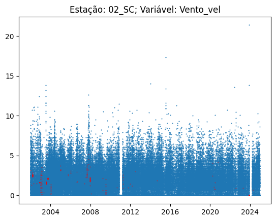
       
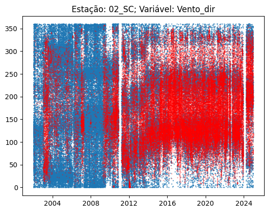
       
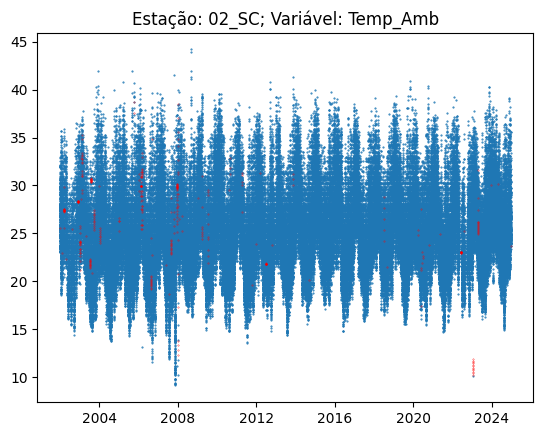
    
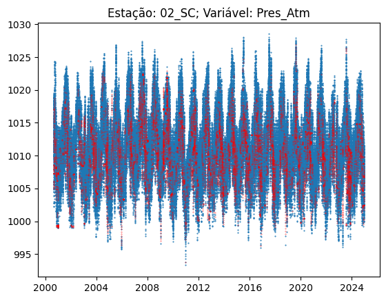
    
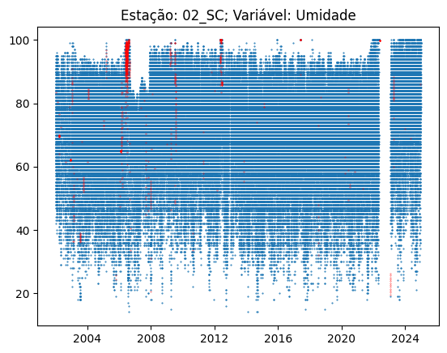
    
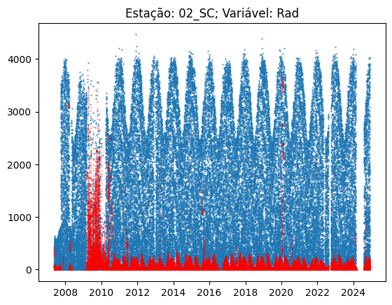
    
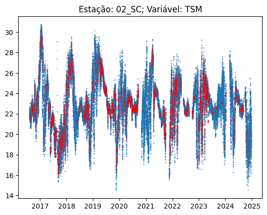  

</details> 
<br>  


```python
# Update
df2[var_orig] = df_int[var_orig]

## % of non-null values
cobdf2 = pd.DataFrame()

for F in Fontes:
    cond = pd.IndexSlice[:, :, F]
    cobdf2[F] = cobertura(df2.loc[cond][var_orig])
cobdf2.T.style.applymap(lambda x: 'background-color: red' if x <= 90 else 'background-color: grey' if pd.isna(x) else '')
```
<style type="text/css">
#T_d08a9_row0_col2, #T_d08a9_row0_col4, #T_d08a9_row0_col6, #T_d08a9_row1_col1, #T_d08a9_row1_col5, #T_d08a9_row1_col6, #T_d08a9_row2_col0, #T_d08a9_row2_col1, #T_d08a9_row2_col4, #T_d08a9_row2_col6, #T_d08a9_row3_col6, #T_d08a9_row4_col6 {
  background-color: red;
}
</style>
<table id="T_d08a9">
  <thead>
    <tr>
      <th class="blank level0" >&nbsp;</th>
      <th id="T_d08a9_level0_col0" class="col_heading level0 col0" >Vento_vel</th>
      <th id="T_d08a9_level0_col1" class="col_heading level0 col1" >Vento_dir</th>
      <th id="T_d08a9_level0_col2" class="col_heading level0 col2" >Temp_Amb</th>
      <th id="T_d08a9_level0_col3" class="col_heading level0 col3" >Pres_Atm</th>
      <th id="T_d08a9_level0_col4" class="col_heading level0 col4" >Umidade</th>
      <th id="T_d08a9_level0_col5" class="col_heading level0 col5" >Rad</th>
      <th id="T_d08a9_level0_col6" class="col_heading level0 col6" >TSM</th>
    </tr>
  </thead>
  <tbody>
    <tr>
      <th id="T_d08a9_level0_row0" class="row_heading level0 row0" >01_GR</th>
      <td id="T_d08a9_row0_col0" class="data row0 col0" >100.000000</td>
      <td id="T_d08a9_row0_col1" class="data row0 col1" >99.370266</td>
      <td id="T_d08a9_row0_col2" class="data row0 col2" >85.571540</td>
      <td id="T_d08a9_row0_col3" class="data row0 col3" >99.963855</td>
      <td id="T_d08a9_row0_col4" class="data row0 col4" >82.393150</td>
      <td id="T_d08a9_row0_col5" class="data row0 col5" >98.259396</td>
      <td id="T_d08a9_row0_col6" class="data row0 col6" >53.288834</td>
    </tr>
    <tr>
      <th id="T_d08a9_level0_row1" class="row_heading level0 row1" >02_SC</th>
      <td id="T_d08a9_row1_col0" class="data row1 col0" >92.542657</td>
      <td id="T_d08a9_row1_col1" class="data row1 col1" >87.777449</td>
      <td id="T_d08a9_row1_col2" class="data row1 col2" >93.348988</td>
      <td id="T_d08a9_row1_col3" class="data row1 col3" >99.029687</td>
      <td id="T_d08a9_row1_col4" class="data row1 col4" >91.305023</td>
      <td id="T_d08a9_row1_col5" class="data row1 col5" >68.824805</td>
      <td id="T_d08a9_row1_col6" class="data row1 col6" >32.161033</td>
    </tr>
    <tr>
      <th id="T_d08a9_level0_row2" class="row_heading level0 row2" >09_MB</th>
      <td id="T_d08a9_row2_col0" class="data row2 col0" >85.974273</td>
      <td id="T_d08a9_row2_col1" class="data row2 col1" >85.974273</td>
      <td id="T_d08a9_row2_col2" class="data row2 col2" >92.599888</td>
      <td id="T_d08a9_row2_col3" class="data row2 col3" >93.032634</td>
      <td id="T_d08a9_row2_col4" class="data row2 col4" >82.026306</td>
      <td id="T_d08a9_row2_col5" class="data row2 col5" >92.255036</td>
      <td id="T_d08a9_row2_col6" class="data row2 col6" >35.123258</td>
    </tr>
    <tr>
      <th id="T_d08a9_level0_row3" class="row_heading level0 row3" >10_VM</th>
      <td id="T_d08a9_row3_col0" class="data row3 col0" >98.677300</td>
      <td id="T_d08a9_row3_col1" class="data row3 col1" >98.677300</td>
      <td id="T_d08a9_row3_col2" class="data row3 col2" >98.642373</td>
      <td id="T_d08a9_row3_col3" class="data row3 col3" >98.728397</td>
      <td id="T_d08a9_row3_col4" class="data row3 col4" >98.549234</td>
      <td id="T_d08a9_row3_col5" class="data row3 col5" >97.383059</td>
      <td id="T_d08a9_row3_col6" class="data row3 col6" >43.939512</td>
    </tr>
    <tr>
      <th id="T_d08a9_level0_row4" class="row_heading level0 row4" >11_FC</th>
      <td id="T_d08a9_row4_col0" class="data row4 col0" >98.367020</td>
      <td id="T_d08a9_row4_col1" class="data row4 col1" >92.906196</td>
      <td id="T_d08a9_row4_col2" class="data row4 col2" >97.461110</td>
      <td id="T_d08a9_row4_col3" class="data row4 col3" >98.668123</td>
      <td id="T_d08a9_row4_col4" class="data row4 col4" >93.449222</td>
      <td id="T_d08a9_row4_col5" class="data row4 col5" >94.447479</td>
      <td id="T_d08a9_row4_col6" class="data row4 col6" >44.179543</td>
    </tr>
    <tr>
      <th id="T_d08a9_level0_row5" class="row_heading level0 row5" >12_JP</th>
      <td id="T_d08a9_row5_col0" class="data row5 col0" >99.689451</td>
      <td id="T_d08a9_row5_col1" class="data row5 col1" >99.689451</td>
      <td id="T_d08a9_row5_col2" class="data row5 col2" >99.695693</td>
      <td id="T_d08a9_row5_col3" class="data row5 col3" >95.057740</td>
      <td id="T_d08a9_row5_col4" class="data row5 col4" >99.695693</td>
      <td id="T_d08a9_row5_col5" class="data row5 col5" >99.655119</td>
      <td id="T_d08a9_row5_col6" class="data row5 col6" >92.362672</td>
    </tr>
  </tbody>
</table>


## 4.4 Multivariate Data Imputation

```python
df3 = df2.copy()
```

```python
# Obter valores mínimos e máximos por variável
var_imp = var_data + var_loc + var_orig + [alvo]

X = df3[var_imp]

# Fitting KNN Imputer
Imputer = KNNImputer( n_neighbors=5)
Imputer.fit(X)
```
**Note:**
Imputation process with KNN Imputer can take a long time, depending on hardware configurations.
Data will be processed in batches for memory saving.

```python
warnings.filterwarnings('ignore')

X_imput = []
ds = tf.data.Dataset.from_tensor_slices(X).batch(100)

lds = tf.data.experimental.cardinality(ds).numpy() # number of batches
b=0

for batch in ds:
    b+=1
    p = round(100*b/lds, 2)
    X_imput.append(Imputer.transform(batch))
    print(f'Processing: {p}%', end='\r')

X_imput = np.concatenate(X_imput)    
```

```python
df_imp = pd.DataFrame(X_imput, columns = var_imp, index = df2.index)
df_imp
```

<table border="1" class="dataframe">
  <thead>
    <tr style="text-align: right;">
      <th></th>
      <th></th>
      <th></th>
      <th>Dia_ano</th>
      <th>s_dia</th>
      <th>c_dia</th>
      <th>Hora</th>
      <th>s_hora</th>
      <th>c_hora</th>
      <th>Lat</th>
      <th>Long</th>
      <th>Alt</th>
      <th>Vento_vel</th>
      <th>Vento_dir</th>
      <th>Temp_Amb</th>
      <th>Pres_Atm</th>
      <th>Umidade</th>
      <th>Rad</th>
      <th>TSM</th>
      <th>Precip</th>
    </tr>
    <tr>
      <th>timestamp</th>
      <th>Dt_Hr</th>
      <th>Fonte</th>
      <th></th>
      <th></th>
      <th></th>
      <th></th>
      <th></th>
      <th></th>
      <th></th>
      <th></th>
      <th></th>
      <th></th>
      <th></th>
      <th></th>
      <th></th>
      <th></th>
      <th></th>
      <th></th>
      <th></th>
    </tr>
  </thead>
  <tbody>
    <tr>
      <th>1.274803e+09</th>
      <th>2010-05-25 16:00:00+00:00</th>
      <th>01_GR</th>
      <td>145.0</td>
      <td>0.615285</td>
      <td>-0.788305</td>
      <td>13.0</td>
      <td>-0.258819</td>
      <td>-9.659258e-01</td>
      <td>-23.05028</td>
      <td>-43.594720</td>
      <td>0.0</td>
      <td>0.0</td>
      <td>204.00</td>
      <td>25.4</td>
      <td>1008.8</td>
      <td>77.0</td>
      <td>1321.900000</td>
      <td>23.31700</td>
      <td>0.0</td>
    </tr>
    <tr>
      <th>1.274807e+09</th>
      <th>2010-05-25 17:00:00+00:00</th>
      <th>01_GR</th>
      <td>145.0</td>
      <td>0.615285</td>
      <td>-0.788305</td>
      <td>14.0</td>
      <td>-0.500000</td>
      <td>-8.660254e-01</td>
      <td>-23.05028</td>
      <td>-43.594720</td>
      <td>0.0</td>
      <td>0.0</td>
      <td>181.46</td>
      <td>27.4</td>
      <td>1007.8</td>
      <td>72.0</td>
      <td>957.600000</td>
      <td>23.18625</td>
      <td>0.0</td>
    </tr>
    <tr>
      <th>1.274810e+09</th>
      <th>2010-05-25 18:00:00+00:00</th>
      <th>01_GR</th>
      <td>145.0</td>
      <td>0.615285</td>
      <td>-0.788305</td>
      <td>15.0</td>
      <td>-0.707107</td>
      <td>-7.071068e-01</td>
      <td>-23.05028</td>
      <td>-43.594720</td>
      <td>0.0</td>
      <td>1.5</td>
      <td>85.00</td>
      <td>26.4</td>
      <td>1008.0</td>
      <td>76.0</td>
      <td>1249.500000</td>
      <td>23.27000</td>
      <td>0.0</td>
    </tr>
    <tr>
      <th>1.274814e+09</th>
      <th>2010-05-25 19:00:00+00:00</th>
      <th>01_GR</th>
      <td>145.0</td>
      <td>0.615285</td>
      <td>-0.788305</td>
      <td>16.0</td>
      <td>-0.866025</td>
      <td>-5.000000e-01</td>
      <td>-23.05028</td>
      <td>-43.594720</td>
      <td>0.0</td>
      <td>1.9</td>
      <td>77.00</td>
      <td>24.6</td>
      <td>1008.2</td>
      <td>80.0</td>
      <td>911.900000</td>
      <td>23.63450</td>
      <td>0.0</td>
    </tr>
    <tr>
      <th>1.274818e+09</th>
      <th>2010-05-25 20:00:00+00:00</th>
      <th>01_GR</th>
      <td>145.0</td>
      <td>0.615285</td>
      <td>-0.788305</td>
      <td>17.0</td>
      <td>-0.965926</td>
      <td>-2.588190e-01</td>
      <td>-23.05028</td>
      <td>-43.594720</td>
      <td>0.0</td>
      <td>2.3</td>
      <td>75.00</td>
      <td>24.0</td>
      <td>1008.1</td>
      <td>83.0</td>
      <td>255.300000</td>
      <td>23.04000</td>
      <td>0.0</td>
    </tr>
    <tr>
      <th>...</th>
      <th>...</th>
      <th>...</th>
      <td>...</td>
      <td>...</td>
      <td>...</td>
      <td>...</td>
      <td>...</td>
      <td>...</td>
      <td>...</td>
      <td>...</td>
      <td>...</td>
      <td>...</td>
      <td>...</td>
      <td>...</td>
      <td>...</td>
      <td>...</td>
      <td>...</td>
      <td>...</td>
      <td>...</td>
    </tr>
    <tr>
      <th>1.732993e+09</th>
      <th>2024-11-30 19:00:00+00:00</th>
      <th>12_JP</th>
      <td>335.0</td>
      <td>-0.508671</td>
      <td>0.860961</td>
      <td>16.0</td>
      <td>-0.866025</td>
      <td>-5.000000e-01</td>
      <td>-22.94000</td>
      <td>-43.402778</td>
      <td>20.0</td>
      <td>1.6</td>
      <td>100.00</td>
      <td>25.8</td>
      <td>1008.7</td>
      <td>83.0</td>
      <td>1395.400000</td>
      <td>20.36000</td>
      <td>0.0</td>
    </tr>
    <tr>
      <th>1.732997e+09</th>
      <th>2024-11-30 20:00:00+00:00</th>
      <th>12_JP</th>
      <td>335.0</td>
      <td>-0.508671</td>
      <td>0.860961</td>
      <td>17.0</td>
      <td>-0.965926</td>
      <td>-2.588190e-01</td>
      <td>-22.94000</td>
      <td>-43.402778</td>
      <td>20.0</td>
      <td>1.3</td>
      <td>132.00</td>
      <td>25.5</td>
      <td>1009.3</td>
      <td>82.0</td>
      <td>467.700000</td>
      <td>18.08000</td>
      <td>0.0</td>
    </tr>
    <tr>
      <th>1.733000e+09</th>
      <th>2024-11-30 21:00:00+00:00</th>
      <th>12_JP</th>
      <td>335.0</td>
      <td>-0.508671</td>
      <td>0.860961</td>
      <td>18.0</td>
      <td>-1.000000</td>
      <td>-1.836970e-16</td>
      <td>-22.94000</td>
      <td>-43.402778</td>
      <td>20.0</td>
      <td>0.5</td>
      <td>122.00</td>
      <td>25.2</td>
      <td>1010.0</td>
      <td>84.0</td>
      <td>122.500000</td>
      <td>17.16000</td>
      <td>0.0</td>
    </tr>
    <tr>
      <th>1.733004e+09</th>
      <th>2024-11-30 22:00:00+00:00</th>
      <th>12_JP</th>
      <td>335.0</td>
      <td>-0.508671</td>
      <td>0.860961</td>
      <td>19.0</td>
      <td>-0.965926</td>
      <td>2.588190e-01</td>
      <td>-22.94000</td>
      <td>-43.402778</td>
      <td>20.0</td>
      <td>0.7</td>
      <td>228.00</td>
      <td>25.2</td>
      <td>1010.8</td>
      <td>86.0</td>
      <td>10.400000</td>
      <td>17.04000</td>
      <td>0.0</td>
    </tr>
    <tr>
      <th>1.733008e+09</th>
      <th>2024-11-30 23:00:00+00:00</th>
      <th>12_JP</th>
      <td>335.0</td>
      <td>-0.508671</td>
      <td>0.860961</td>
      <td>20.0</td>
      <td>-0.866025</td>
      <td>5.000000e-01</td>
      <td>-22.94000</td>
      <td>-43.402778</td>
      <td>20.0</td>
      <td>0.3</td>
      <td>227.00</td>
      <td>24.9</td>
      <td>1011.2</td>
      <td>87.0</td>
      <td>18.436364</td>
      <td>17.14000</td>
      <td>0.0</td>
    </tr>
  </tbody>
</table>
<p>896488 rows × 17 columns</p>

**Plotting examples after multivariate imputation (imputed data in black)**

```python
f = Fontes[1]

X = df3[var_orig].xs(f,0,2,drop_level=False) # orig. data
Y = df_imp[var_orig].xs(f,0,2,drop_level=False) # imputed dat

dates = Y.index.get_level_values(1)

for v in var_orig:
  # masking imputed data:
    c1  = X[v].isna()
    imp = c1*Y[v]
    imp[imp==0]=np.nan

    plt.plot(dates, X[v].values, '.', markersize=1)
    plt.plot(dates, imp.values, 'k.', markersize=0.5 )
    plt.title(f'Estação: {f}; Variável: {v}')
    plt.show()
```

<details>
<summary>Show/Hide</summary>    
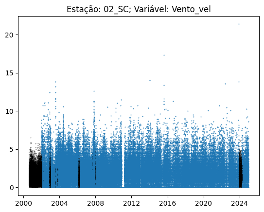
    
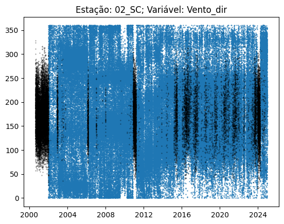
    
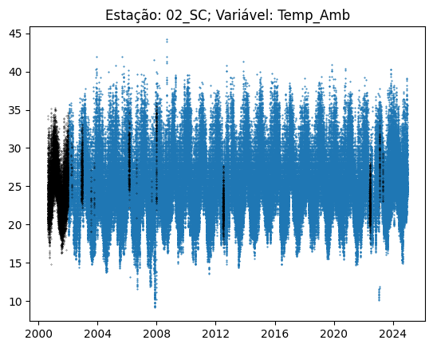
    
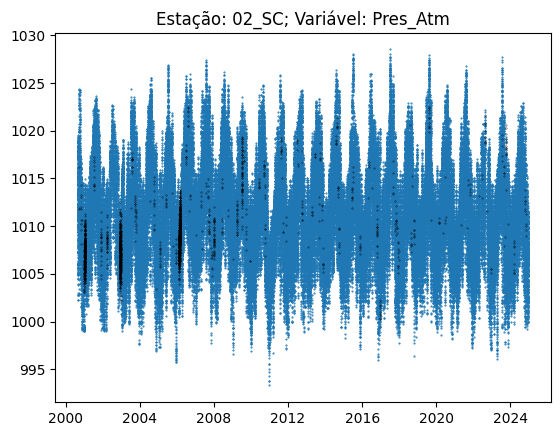
    
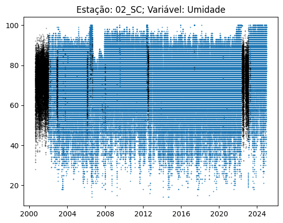
    
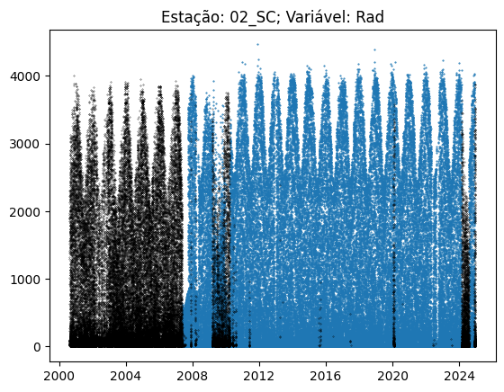
    
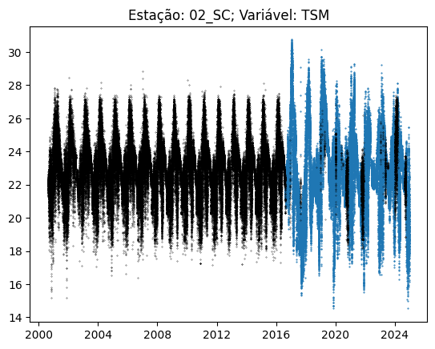
</details>
<br>

```python
# Update dataset 
df3[var_orig] = df_imp[var_orig]
```

# 5 Feature engineering 

```python
df4 = df3.copy()
```

## 5.1 Dew Point and Dew Poimt Depression

```python
POv = df4.apply(lambda lin: stp.Pto_orv(lin.Temp_Amb, lin.Umidade), axis=1)
loc=len(df4.columns)-1
df4.insert(loc, 'POv_Calc', POv)
POv
```
> **Output: **   

    timestamp     Dt_Hr                      Fonte
    1.274803e+09  2010-05-25 16:00:00+00:00  01_GR    21.078281
    1.274807e+09  2010-05-25 17:00:00+00:00  01_GR    21.910506
    1.274810e+09  2010-05-25 18:00:00+00:00  01_GR    21.832276
    1.274814e+09  2010-05-25 19:00:00+00:00  01_GR    20.923407
    1.274818e+09  2010-05-25 20:00:00+00:00  01_GR    20.936684
                                                        ...    
    1.732993e+09  2024-11-30 19:00:00+00:00  12_JP    22.695559
    1.732997e+09  2024-11-30 20:00:00+00:00  12_JP    22.203394
    1.733000e+09  2024-11-30 21:00:00+00:00  12_JP    22.305810
    1.733004e+09  2024-11-30 22:00:00+00:00  12_JP    22.692761
    1.733008e+09  2024-11-30 23:00:00+00:00  12_JP    22.588436
    Length: 896488, dtype: float64


```python
# Dew Point Depression

Tpov_dif = df4.Temp_Amb-df4.POv_Calc
loc=len(df4.columns)-1
df4.insert(loc, 'Tpov_dif', Tpov_dif)
Tpov_dif
```
> **Output: **   

    timestamp     Dt_Hr                      Fonte
    1.274803e+09  2010-05-25 16:00:00+00:00  01_GR    4.321719
    1.274807e+09  2010-05-25 17:00:00+00:00  01_GR    5.489494
    1.274810e+09  2010-05-25 18:00:00+00:00  01_GR    4.567724
    1.274814e+09  2010-05-25 19:00:00+00:00  01_GR    3.676593
    1.274818e+09  2010-05-25 20:00:00+00:00  01_GR    3.063316
                                                        ...   
    1.732993e+09  2024-11-30 19:00:00+00:00  12_JP    3.104441
    1.732997e+09  2024-11-30 20:00:00+00:00  12_JP    3.296606
    1.733000e+09  2024-11-30 21:00:00+00:00  12_JP    2.894190
    1.733004e+09  2024-11-30 22:00:00+00:00  12_JP    2.507239
    1.733008e+09  2024-11-30 23:00:00+00:00  12_JP    2.311564
    Length: 896488, dtype: float64


## 5.2 Wind attributes

### 5.2.1 Vector components x e y

```python
# Degrees to radians
Vento_rad = df4.Vento_dir*np.pi / 180

Vento_x = df4.Vento_vel*np.cos(Vento_rad)
Vento_y = df4.Vento_vel*np.sin(Vento_rad)
``` 

```python
loc=len(df4.columns)-1
df4.insert(loc, 'Vento_y', Vento_x)
df4.insert(loc, 'Vento_x', Vento_y)
```

### 5.2.2 Variation of wind speed

Variaton of wind speed considering lags of 1, 3, 6,12, 18 an 24 hours.

```python
Vento_dv1, Vento_dv3, Vento_dv6, Vento_dv12, Vento_dv18, Vento_dv24 = {},{},{},{},{},{}

Vdvcols =  ['Vento_dv_01h', 'Vento_dv_03h', 'Vento_dv_06h', 'Vento_dv_12h', 'Vento_dv_18h', 'Vento_dv_24h']

# Differentiations are computed regarding each station
for F in Fontes:
    X = df4.xs(F,0,2,drop_level=False)
    
    Vento_dv1[F] = X.Vento_vel.diff(1)
    Vento_dv3[F] = X.Vento_vel.diff(3)
    Vento_dv6[F] = X.Vento_vel.diff(6)
    Vento_dv12[F] = X.Vento_vel.diff(12)
    Vento_dv18[F] = X.Vento_vel.diff(18)
    Vento_dv24[F] = X.Vento_vel.diff(24)

Vdv = [Vento_dv1, Vento_dv3, Vento_dv6, Vento_dv12, Vento_dv18, Vento_dv24]
V = []
for d in Vdv:
    V.append(pd.concat(d.values()))

df_Vento_dv = pd.concat(V, axis=1)
df_Vento_dv.columns = Vdvcols

df_Vento_dv.fillna(0, inplace=True)

df4 = pd.concat([df4, df_Vento_dv], axis=1)
df4
```

### 5.2.3 Variation of wind direction

Variaton of wind direction considering lags of 1, 3, 6,12, 18 an 24 hours.

```python
# wind speed

Vento_ddir1, Vento_ddir3, Vento_ddir6, Vento_ddir12, Vento_ddir18, Vento_ddir24 = {},{},{},{},{},{}

Vddircols =  ['Vento_ddir_01h', 'Vento_ddir_03h', 'Vento_ddir_06h', 'Vento_ddir_12h', 'Vento_ddir_18h', 'Vento_ddir_24h']

for F in Fontes:
    X = df4.xs(F,0,2,drop_level=False)
    ind = X.index
    Vento_ddir1[F] = pd.Series(stp.difer_ang(X.Vento_dir), index = ind)
    Vento_ddir3[F] = pd.Series(stp.difer_ang(X.Vento_dir, lag=3), index = ind)
    Vento_ddir6[F] = pd.Series(stp.difer_ang(X.Vento_dir, lag=6), index = ind)
    Vento_ddir12[F] = pd.Series(stp.difer_ang(X.Vento_dir, lag=12), index = ind)
    Vento_ddir18[F] = pd.Series(stp.difer_ang(X.Vento_dir, lag=18), index = ind)
    Vento_ddir24[F] = pd.Series(stp.difer_ang(X.Vento_dir, lag=24), index = ind)

Vddr = [Vento_ddir1, Vento_ddir3, Vento_ddir6, Vento_ddir12, Vento_ddir18, Vento_ddir24]
V2 = []
for d in Vddr:
    V2.append(pd.concat(d.values()))

df_Vento_ddir=pd.concat(V2, axis=1)
df_Vento_ddir.columns=Vddircols

df_Vento_ddir.fillna(0, inplace=True)

df4 = pd.concat([df4, df_Vento_ddir], axis=1)
df4
```

## 5.3 Variation of Pressure

Variaton of atmospheric pressure considering lags of 1, 3, 6,12, 18 an 24 hours.

```python

DP1, DP3, DP6, DP12, DP18, DP24 = {},{},{},{},{},{}

DPcols =  ['DP_01h', 'DP_03h', 'DP_06h', 'DP_12h', 'DP_18h', 'DP_24h']

for F in Fontes:
    X = df4.xs(F,0,2,drop_level=False)
    # X.set_index(X.index.get_level_values(0), inplace=True)

    DP1[F] = X.Pres_Atm.diff(1)
    DP3[F] = X.Pres_Atm.diff(3)
    DP6[F] = X.Pres_Atm.diff(6)
    DP12[F] = X.Pres_Atm.diff(12)
    DP18[F] = X.Pres_Atm.diff(18)
    DP24[F] = X.Pres_Atm.diff(24)

DP_ = [DP1, DP3, DP6, DP12, DP18, DP24]
D = []
for d in DP_:
    D.append(pd.concat(d.values()))

df_DP = pd.concat(D, axis=1)
df_DP.columns=DPcols

df_DP.fillna(0, inplace=True)

df4 = pd.concat([df4, df_DP], axis=1)
```

# 6 Source Integration - Part 2 (Radiosoundings)

```python
# Import data
path3 = './Rsoundings/'
f_rsound = 'RSound.csv.csv'

df_sonda = pd.read_csv(path3 + f_rsound, sep=',', index_col = 0)
df_sonda
```

<table border="1" class="dataframe">
  <thead>
    <tr style="text-align: right;">
      <th></th>
      <th>Dt_Hr</th>
      <th>TEMP_100.0</th>
      <th>TEMP_150.0</th>
      <th>TEMP_200.0</th>
      <th>TEMP_250.0</th>
      <th>TEMP_300.0</th>
      <th>TEMP_400.0</th>
      <th>TEMP_500.0</th>
      <th>TEMP_700.0</th>
      <th>TEMP_850.0</th>
      <th>...</th>
      <th>Vento_y_150.0</th>
      <th>Vento_y_200.0</th>
      <th>Vento_y_250.0</th>
      <th>Vento_y_300.0</th>
      <th>Vento_y_400.0</th>
      <th>Vento_y_500.0</th>
      <th>Vento_y_700.0</th>
      <th>Vento_y_850.0</th>
      <th>Vento_y_925.0</th>
      <th>Vento_y_1000.0</th>
    </tr>
    <tr>
      <th>timestamp</th>
      <th></th>
      <th></th>
      <th></th>
      <th></th>
      <th></th>
      <th></th>
      <th></th>
      <th></th>
      <th></th>
      <th></th>
      <th></th>
      <th></th>
      <th></th>
      <th></th>
      <th></th>
      <th></th>
      <th></th>
      <th></th>
      <th></th>
      <th></th>
      <th></th>
    </tr>
  </thead>
  <tbody>
    <tr>
      <th>8.520768e+08</th>
      <td>1997-01-01 00:00:00+00:00</td>
      <td>-76.9</td>
      <td>-66.7</td>
      <td>-52.9</td>
      <td>-40.5</td>
      <td>-30.1</td>
      <td>-14.5</td>
      <td>-4.5</td>
      <td>10.8</td>
      <td>15.8</td>
      <td>...</td>
      <td>-12.962827</td>
      <td>-1.086129e+01</td>
      <td>-5.096100e+00</td>
      <td>-4.035838</td>
      <td>-5.802370</td>
      <td>-6.700000</td>
      <td>4.169016</td>
      <td>3.550704</td>
      <td>2.300000</td>
      <td>1.231273</td>
    </tr>
    <tr>
      <th>8.521200e+08</th>
      <td>1997-01-01 12:00:00+00:00</td>
      <td>-75.9</td>
      <td>-67.9</td>
      <td>-53.1</td>
      <td>-40.9</td>
      <td>-31.5</td>
      <td>-15.1</td>
      <td>-5.7</td>
      <td>9.2</td>
      <td>15.6</td>
      <td>...</td>
      <td>-11.252463</td>
      <td>-1.002119e+01</td>
      <td>-7.395820e+00</td>
      <td>-7.200000</td>
      <td>-5.091169</td>
      <td>-10.300000</td>
      <td>5.898542</td>
      <td>1.969616</td>
      <td>4.177675</td>
      <td>2.757760</td>
    </tr>
    <tr>
      <th>8.521632e+08</th>
      <td>1997-01-02 00:00:00+00:00</td>
      <td>-77.3</td>
      <td>-67.5</td>
      <td>-52.9</td>
      <td>-40.9</td>
      <td>-30.7</td>
      <td>-14.5</td>
      <td>-5.9</td>
      <td>8.4</td>
      <td>14.6</td>
      <td>...</td>
      <td>-20.011122</td>
      <td>-1.688750e+01</td>
      <td>-1.821679e+01</td>
      <td>-16.741732</td>
      <td>-10.260805</td>
      <td>-8.791186</td>
      <td>1.147153</td>
      <td>2.956823</td>
      <td>0.400916</td>
      <td>1.231273</td>
    </tr>
    <tr>
      <th>8.522064e+08</th>
      <td>1997-01-02 12:00:00+00:00</td>
      <td>-75.1</td>
      <td>-67.5</td>
      <td>-52.5</td>
      <td>-39.9</td>
      <td>-29.9</td>
      <td>-15.7</td>
      <td>-5.3</td>
      <td>8.2</td>
      <td>12.6</td>
      <td>...</td>
      <td>NaN</td>
      <td>-2.780000e+01</td>
      <td>-1.743341e+01</td>
      <td>-20.779444</td>
      <td>25.886812</td>
      <td>-21.764251</td>
      <td>-1.337091</td>
      <td>7.437629</td>
      <td>8.168797</td>
      <td>0.500000</td>
    </tr>
    <tr>
      <th>8.522496e+08</th>
      <td>1997-01-03 00:00:00+00:00</td>
      <td>-76.5</td>
      <td>-69.3</td>
      <td>-53.5</td>
      <td>-40.9</td>
      <td>-29.9</td>
      <td>-15.5</td>
      <td>-6.5</td>
      <td>7.8</td>
      <td>13.4</td>
      <td>...</td>
      <td>-31.400000</td>
      <td>-2.781866e+01</td>
      <td>-2.434133e+01</td>
      <td>-17.219848</td>
      <td>-4.099397</td>
      <td>-5.515520</td>
      <td>4.530116</td>
      <td>8.400446</td>
      <td>3.600000</td>
      <td>1.409539</td>
    </tr>
    <tr>
      <th>...</th>
      <td>...</td>
      <td>...</td>
      <td>...</td>
      <td>...</td>
      <td>...</td>
      <td>...</td>
      <td>...</td>
      <td>...</td>
      <td>...</td>
      <td>...</td>
      <td>...</td>
      <td>...</td>
      <td>...</td>
      <td>...</td>
      <td>...</td>
      <td>...</td>
      <td>...</td>
      <td>...</td>
      <td>...</td>
      <td>...</td>
      <td>...</td>
    </tr>
    <tr>
      <th>1.732493e+09</th>
      <td>2024-11-25 00:00:00+00:00</td>
      <td>-71.3</td>
      <td>-59.3</td>
      <td>-56.1</td>
      <td>-46.3</td>
      <td>-36.7</td>
      <td>-18.9</td>
      <td>-7.7</td>
      <td>4.2</td>
      <td>11.2</td>
      <td>...</td>
      <td>-13.543998</td>
      <td>2.736690e+00</td>
      <td>3.277056e+00</td>
      <td>-2.553663</td>
      <td>-4.917562</td>
      <td>-6.481414</td>
      <td>-4.749476</td>
      <td>4.582496</td>
      <td>9.300000</td>
      <td>6.176407</td>
    </tr>
    <tr>
      <th>1.732536e+09</th>
      <td>2024-11-25 12:00:00+00:00</td>
      <td>-72.1</td>
      <td>-63.9</td>
      <td>-54.5</td>
      <td>-43.7</td>
      <td>-34.3</td>
      <td>-19.3</td>
      <td>-5.5</td>
      <td>6.2</td>
      <td>12.2</td>
      <td>...</td>
      <td>-3.494945</td>
      <td>3.948155e+00</td>
      <td>3.588215e-15</td>
      <td>-6.522240</td>
      <td>-2.240061</td>
      <td>-0.897704</td>
      <td>1.494292</td>
      <td>2.757760</td>
      <td>-0.451485</td>
      <td>2.511407</td>
    </tr>
    <tr>
      <th>1.732579e+09</th>
      <td>2024-11-26 00:00:00+00:00</td>
      <td>-74.9</td>
      <td>-60.7</td>
      <td>-54.7</td>
      <td>-43.7</td>
      <td>-33.1</td>
      <td>-17.5</td>
      <td>-4.9</td>
      <td>9.2</td>
      <td>15.2</td>
      <td>...</td>
      <td>7.558645</td>
      <td>5.290474e-15</td>
      <td>-3.924449e+00</td>
      <td>-10.652112</td>
      <td>-4.703327</td>
      <td>-7.990307</td>
      <td>-2.550000</td>
      <td>-1.732735</td>
      <td>4.169016</td>
      <td>5.022520</td>
    </tr>
    <tr>
      <th>1.732622e+09</th>
      <td>2024-11-26 12:00:00+00:00</td>
      <td>-77.1</td>
      <td>-65.5</td>
      <td>-54.9</td>
      <td>-42.1</td>
      <td>-30.3</td>
      <td>-16.5</td>
      <td>-4.3</td>
      <td>10.2</td>
      <td>16.6</td>
      <td>...</td>
      <td>-1.481648</td>
      <td>-5.590491e+00</td>
      <td>-2.413710e+00</td>
      <td>-5.985353</td>
      <td>-9.334970</td>
      <td>-6.768202</td>
      <td>-0.750000</td>
      <td>-6.717047</td>
      <td>-2.536427</td>
      <td>-0.984808</td>
    </tr>
    <tr>
      <th>1.732666e+09</th>
      <td>2024-11-27 00:00:00+00:00</td>
      <td>-76.5</td>
      <td>-64.3</td>
      <td>-53.9</td>
      <td>-42.1</td>
      <td>-30.3</td>
      <td>-14.1</td>
      <td>-6.3</td>
      <td>6.8</td>
      <td>19.4</td>
      <td>...</td>
      <td>-5.202263</td>
      <td>-6.651649e+00</td>
      <td>-7.890258e+00</td>
      <td>-8.027690</td>
      <td>-2.251726</td>
      <td>-5.515520</td>
      <td>-7.235633</td>
      <td>-1.992642</td>
      <td>3.052904</td>
      <td>2.809554</td>
    </tr>
  </tbody>
</table>
<p>17460 rows × 67 columns</p>


To integrate radiodoundings data, merging is done using timestame as index, searching last sounding record with a tolerance of 48 hours.

```python
# data merging
tol = 3600*48 # 48 hours (converte to seconds)
D_int = {}

for F in Fontes:

    X =  df4.xs(F,0,2, drop_level=False)
    D_int[F] =  pd.merge_asof(X, df_sonda, left_on='timestamp', right_index=True, tolerance=tol)

df5 = pd.concat(D_int.values())    
```
As soundings records and meteorological observations have different time resolution (12h and 1h, respectively) same sounding data are repeated for many station observation.
To inform the models the delay between them, a new feature is created.

```python
# Sounding launch time:
hr_sonda = df5.Dt_Hr
hr_sonda = pd.to_datetime(hr_sonda) 
df5.drop(columns='Dt_Hr', inplace=True)

# Station observation time (from df index):
hr_est = df5.index.get_level_values(1)

# Delta between hr_sonda and hr_est
df5['dt_sond'] = pd.Series(map(lambda x, y: (x-y).total_seconds()/3600, hr_est, hr_sonda))
```

```python
# Radiodoundings attributes with NaN are filled with zero (no imputation is done). 
var_sonda = list(df_sonda.columns)
var_sonda.remove('Dt_Hr')
var_sonda += ['dt_sond']

df5[var_sonda] = df5[var_sonda].fillna()

df5
```
<table border="1" class="dataframe">
  <thead>
    <tr style="text-align: right;">
      <th></th>
      <th></th>
      <th></th>
      <th>Dia_ano</th>
      <th>s_dia</th>
      <th>c_dia</th>
      <th>Hora</th>
      <th>s_hora</th>
      <th>c_hora</th>
      <th>Lat</th>
      <th>Long</th>
      <th>Alt</th>
      <th>Vento_vel</th>
      <th>...</th>
      <th>Vento_y_200.0</th>
      <th>Vento_y_250.0</th>
      <th>Vento_y_300.0</th>
      <th>Vento_y_400.0</th>
      <th>Vento_y_500.0</th>
      <th>Vento_y_700.0</th>
      <th>Vento_y_850.0</th>
      <th>Vento_y_925.0</th>
      <th>Vento_y_1000.0</th>
      <th>dt_sond</th>
    </tr>
    <tr>
      <th>timestamp</th>
      <th>Dt_Hr</th>
      <th>Fonte</th>
      <th></th>
      <th></th>
      <th></th>
      <th></th>
      <th></th>
      <th></th>
      <th></th>
      <th></th>
      <th></th>
      <th></th>
      <th></th>
      <th></th>
      <th></th>
      <th></th>
      <th></th>
      <th></th>
      <th></th>
      <th></th>
      <th></th>
      <th></th>
      <th></th>
    </tr>
  </thead>
  <tbody>
    <tr>
      <th>1.274803e+09</th>
      <th>2010-05-25 16:00:00+00:00</th>
      <th>01_GR</th>
      <td>145</td>
      <td>0.615285</td>
      <td>-0.788305</td>
      <td>13</td>
      <td>-0.258819</td>
      <td>-9.659258e-01</td>
      <td>-23.05028</td>
      <td>-43.594720</td>
      <td>0.0</td>
      <td>0.0</td>
      <td>...</td>
      <td>0.0</td>
      <td>0.0</td>
      <td>0.0</td>
      <td>0.0</td>
      <td>0.0</td>
      <td>0.0</td>
      <td>0.0</td>
      <td>0.0</td>
      <td>0.0</td>
      <td>0.0</td>
    </tr>
    <tr>
      <th>1.274807e+09</th>
      <th>2010-05-25 17:00:00+00:00</th>
      <th>01_GR</th>
      <td>145</td>
      <td>0.615285</td>
      <td>-0.788305</td>
      <td>14</td>
      <td>-0.500000</td>
      <td>-8.660254e-01</td>
      <td>-23.05028</td>
      <td>-43.594720</td>
      <td>0.0</td>
      <td>0.0</td>
      <td>...</td>
      <td>0.0</td>
      <td>0.0</td>
      <td>0.0</td>
      <td>0.0</td>
      <td>0.0</td>
      <td>0.0</td>
      <td>0.0</td>
      <td>0.0</td>
      <td>0.0</td>
      <td>0.0</td>
    </tr>
    <tr>
      <th>1.274810e+09</th>
      <th>2010-05-25 18:00:00+00:00</th>
      <th>01_GR</th>
      <td>145</td>
      <td>0.615285</td>
      <td>-0.788305</td>
      <td>15</td>
      <td>-0.707107</td>
      <td>-7.071068e-01</td>
      <td>-23.05028</td>
      <td>-43.594720</td>
      <td>0.0</td>
      <td>1.5</td>
      <td>...</td>
      <td>0.0</td>
      <td>0.0</td>
      <td>0.0</td>
      <td>0.0</td>
      <td>0.0</td>
      <td>0.0</td>
      <td>0.0</td>
      <td>0.0</td>
      <td>0.0</td>
      <td>0.0</td>
    </tr>
    <tr>
      <th>1.274814e+09</th>
      <th>2010-05-25 19:00:00+00:00</th>
      <th>01_GR</th>
      <td>145</td>
      <td>0.615285</td>
      <td>-0.788305</td>
      <td>16</td>
      <td>-0.866025</td>
      <td>-5.000000e-01</td>
      <td>-23.05028</td>
      <td>-43.594720</td>
      <td>0.0</td>
      <td>1.9</td>
      <td>...</td>
      <td>0.0</td>
      <td>0.0</td>
      <td>0.0</td>
      <td>0.0</td>
      <td>0.0</td>
      <td>0.0</td>
      <td>0.0</td>
      <td>0.0</td>
      <td>0.0</td>
      <td>0.0</td>
    </tr>
    <tr>
      <th>1.274818e+09</th>
      <th>2010-05-25 20:00:00+00:00</th>
      <th>01_GR</th>
      <td>145</td>
      <td>0.615285</td>
      <td>-0.788305</td>
      <td>17</td>
      <td>-0.965926</td>
      <td>-2.588190e-01</td>
      <td>-23.05028</td>
      <td>-43.594720</td>
      <td>0.0</td>
      <td>2.3</td>
      <td>...</td>
      <td>0.0</td>
      <td>0.0</td>
      <td>0.0</td>
      <td>0.0</td>
      <td>0.0</td>
      <td>0.0</td>
      <td>0.0</td>
      <td>0.0</td>
      <td>0.0</td>
      <td>0.0</td>
    </tr>
    <tr>
      <th>...</th>
      <th>...</th>
      <th>...</th>
      <td>...</td>
      <td>...</td>
      <td>...</td>
      <td>...</td>
      <td>...</td>
      <td>...</td>
      <td>...</td>
      <td>...</td>
      <td>...</td>
      <td>...</td>
      <td>...</td>
      <td>...</td>
      <td>...</td>
      <td>...</td>
      <td>...</td>
      <td>...</td>
      <td>...</td>
      <td>...</td>
      <td>...</td>
      <td>...</td>
      <td>...</td>
    </tr>
    <tr>
      <th>1.732993e+09</th>
      <th>2024-11-30 19:00:00+00:00</th>
      <th>12_JP</th>
      <td>335</td>
      <td>-0.508671</td>
      <td>0.860961</td>
      <td>16</td>
      <td>-0.866025</td>
      <td>-5.000000e-01</td>
      <td>-22.94000</td>
      <td>-43.402778</td>
      <td>20.0</td>
      <td>1.6</td>
      <td>...</td>
      <td>0.0</td>
      <td>0.0</td>
      <td>0.0</td>
      <td>0.0</td>
      <td>0.0</td>
      <td>0.0</td>
      <td>0.0</td>
      <td>0.0</td>
      <td>0.0</td>
      <td>0.0</td>
    </tr>
    <tr>
      <th>1.732997e+09</th>
      <th>2024-11-30 20:00:00+00:00</th>
      <th>12_JP</th>
      <td>335</td>
      <td>-0.508671</td>
      <td>0.860961</td>
      <td>17</td>
      <td>-0.965926</td>
      <td>-2.588190e-01</td>
      <td>-22.94000</td>
      <td>-43.402778</td>
      <td>20.0</td>
      <td>1.3</td>
      <td>...</td>
      <td>0.0</td>
      <td>0.0</td>
      <td>0.0</td>
      <td>0.0</td>
      <td>0.0</td>
      <td>0.0</td>
      <td>0.0</td>
      <td>0.0</td>
      <td>0.0</td>
      <td>0.0</td>
    </tr>
    <tr>
      <th>1.733000e+09</th>
      <th>2024-11-30 21:00:00+00:00</th>
      <th>12_JP</th>
      <td>335</td>
      <td>-0.508671</td>
      <td>0.860961</td>
      <td>18</td>
      <td>-1.000000</td>
      <td>-1.836970e-16</td>
      <td>-22.94000</td>
      <td>-43.402778</td>
      <td>20.0</td>
      <td>0.5</td>
      <td>...</td>
      <td>0.0</td>
      <td>0.0</td>
      <td>0.0</td>
      <td>0.0</td>
      <td>0.0</td>
      <td>0.0</td>
      <td>0.0</td>
      <td>0.0</td>
      <td>0.0</td>
      <td>0.0</td>
    </tr>
    <tr>
      <th>1.733004e+09</th>
      <th>2024-11-30 22:00:00+00:00</th>
      <th>12_JP</th>
      <td>335</td>
      <td>-0.508671</td>
      <td>0.860961</td>
      <td>19</td>
      <td>-0.965926</td>
      <td>2.588190e-01</td>
      <td>-22.94000</td>
      <td>-43.402778</td>
      <td>20.0</td>
      <td>0.7</td>
      <td>...</td>
      <td>0.0</td>
      <td>0.0</td>
      <td>0.0</td>
      <td>0.0</td>
      <td>0.0</td>
      <td>0.0</td>
      <td>0.0</td>
      <td>0.0</td>
      <td>0.0</td>
      <td>0.0</td>
    </tr>
    <tr>
      <th>1.733008e+09</th>
      <th>2024-11-30 23:00:00+00:00</th>
      <th>12_JP</th>
      <td>335</td>
      <td>-0.508671</td>
      <td>0.860961</td>
      <td>20</td>
      <td>-0.866025</td>
      <td>5.000000e-01</td>
      <td>-22.94000</td>
      <td>-43.402778</td>
      <td>20.0</td>
      <td>0.3</td>
      <td>...</td>
      <td>0.0</td>
      <td>0.0</td>
      <td>0.0</td>
      <td>0.0</td>
      <td>0.0</td>
      <td>0.0</td>
      <td>0.0</td>
      <td>0.0</td>
      <td>0.0</td>
      <td>0.0</td>
    </tr>
  </tbody>
</table>
<p>896488 rows × 113 columns</p>
 
# Export dataset

```python
Arquivo = 'Dados Tratados.parquet'
df5.to_parquet(Arquivo)
```
