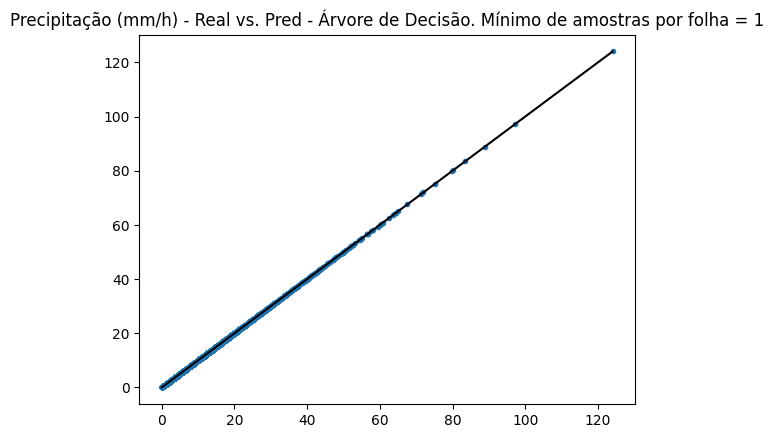
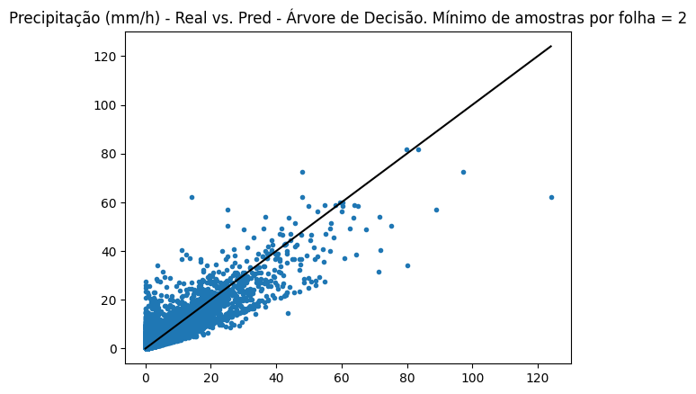
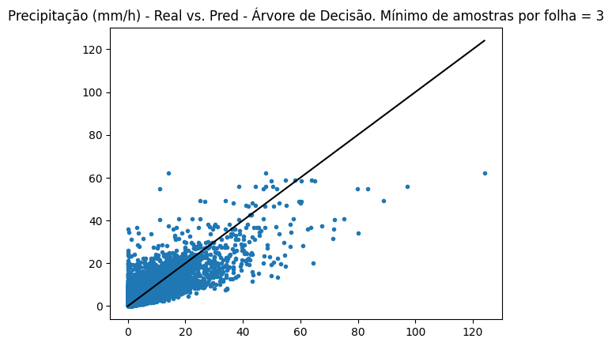
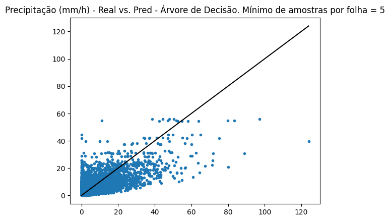
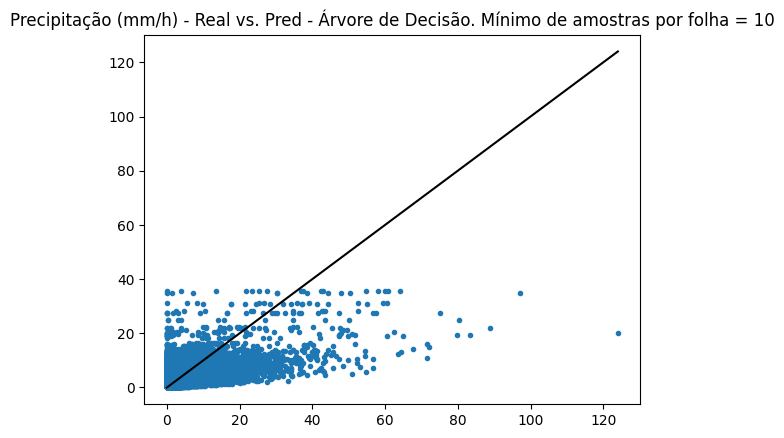
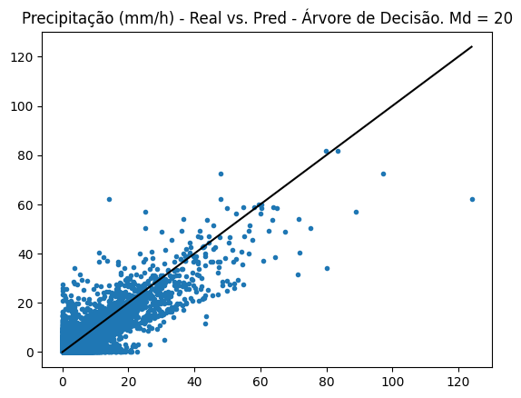
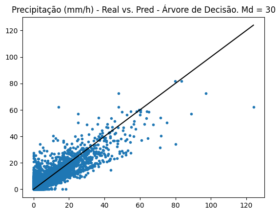
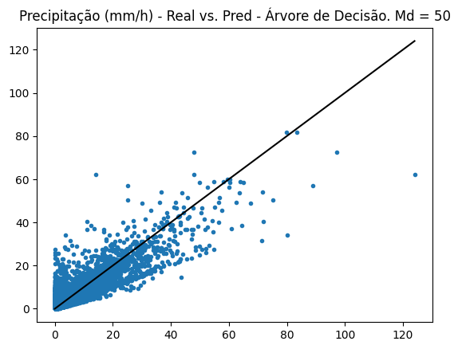
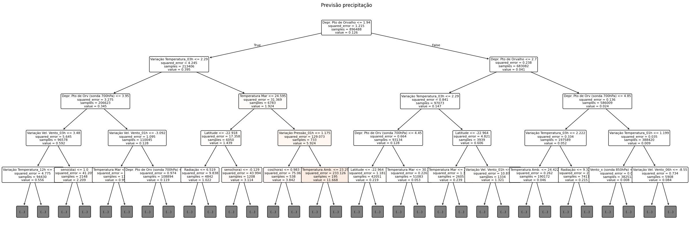
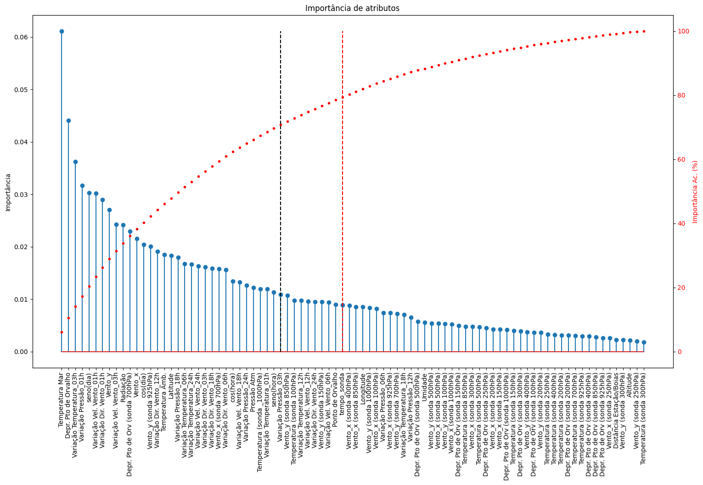

# Feature Importance Evealuation

This file present the procedure used to assess feature importance.   
A Decision Tree Regressor model is used (only) for that purpose (not for prediction).

As a result, features are ranked in two different ways:
- by Feature Importance
- by tree level (regarding the first 5 levels)

These rankings can be used for feature reduction (to aviod problems related to dimensionality).

In the experiments section, one of the evaluated scenarios consider the Feature Importance ranking to select attributes.  


# Setup


```python
import numpy as np
import matplotlib.pyplot as plt
from sklearn.tree import DecisionTreeRegressor, export_text, plot_tree
from sklearn.model_selection import train_test_split
from sklearn.metrics import mean_squared_error
import pandas as pd
```

```python
def exporta_arvore(Modelo):
    '''
    Returns a DataFrame with parameters of model (decision tree) by node
    '''
    Arvore = Modelo.tree_
    atribs = Modelo.feature_names_in_ # fearture list
    
    f_esq = Arvore.children_left # index of child nodes - left
    f_dir = Arvore.children_right # index of child nodes - right 
    
    niveis = Arvore.compute_node_depths() # node level
    
    no_atrib_ind = Arvore.feature # node feature index
    no_atrib = [atribs[x] for x in no_atrib_ind] # node feature name
    
    limiar = Arvore.threshold # node threshold
    valor = Arvore.value.ravel() # node value
    imp = Arvore.impurity # node impurity
    Nos = pd.DataFrame({'Level': niveis, 'left':f_esq, 'right': f_dir,  'Atributo':no_atrib, 'limiar':limiar, 'value':valor, 'impurity':imp})  
    Nos.index.name = 'No'
    
    return Nos
```

# 1. Import dataset

```python
# Datasets

Arquivo = 'Dados Tratados.parquet'

df = pd.read_parquet(Dir+Arquivo)
df
```

<table border="1" class="dataframe">
  <thead>
    <tr style="text-align: right;">
      <th></th>
      <th></th>
      <th></th>
      <th>Dia_ano</th>
      <th>s_dia</th>
      <th>c_dia</th>
      <th>Hora</th>
      <th>s_hora</th>
      <th>c_hora</th>
      <th>Lat</th>
      <th>Long</th>
      <th>Alt</th>
      <th>Vento_vel</th>
      <th>...</th>
      <th>Vento_y_200.0</th>
      <th>Vento_y_250.0</th>
      <th>Vento_y_300.0</th>
      <th>Vento_y_400.0</th>
      <th>Vento_y_500.0</th>
      <th>Vento_y_700.0</th>
      <th>Vento_y_850.0</th>
      <th>Vento_y_925.0</th>
      <th>Vento_y_1000.0</th>
      <th>dt_sond</th>
    </tr>
    <tr>
      <th>timestamp</th>
      <th>Dt_Hr</th>
      <th>Fonte</th>
      <th></th>
      <th></th>
      <th></th>
      <th></th>
      <th></th>
      <th></th>
      <th></th>
      <th></th>
      <th></th>
      <th></th>
      <th></th>
      <th></th>
      <th></th>
      <th></th>
      <th></th>
      <th></th>
      <th></th>
      <th></th>
      <th></th>
      <th></th>
      <th></th>
    </tr>
  </thead>
  <tbody>
    <tr>
      <th>1.274803e+09</th>
      <th>2010-05-25 16:00:00+00:00</th>
      <th>01_GR</th>
      <td>145</td>
      <td>0.615285</td>
      <td>-0.788305</td>
      <td>13</td>
      <td>-0.258819</td>
      <td>-9.659258e-01</td>
      <td>-23.05028</td>
      <td>-43.594720</td>
      <td>0.0</td>
      <td>0.0</td>
      <td>...</td>
      <td>0.0</td>
      <td>0.0</td>
      <td>0.0</td>
      <td>0.0</td>
      <td>0.0</td>
      <td>0.0</td>
      <td>0.0</td>
      <td>0.0</td>
      <td>0.0</td>
      <td>0.0</td>
    </tr>
    <tr>
      <th>1.274807e+09</th>
      <th>2010-05-25 17:00:00+00:00</th>
      <th>01_GR</th>
      <td>145</td>
      <td>0.615285</td>
      <td>-0.788305</td>
      <td>14</td>
      <td>-0.500000</td>
      <td>-8.660254e-01</td>
      <td>-23.05028</td>
      <td>-43.594720</td>
      <td>0.0</td>
      <td>0.0</td>
      <td>...</td>
      <td>0.0</td>
      <td>0.0</td>
      <td>0.0</td>
      <td>0.0</td>
      <td>0.0</td>
      <td>0.0</td>
      <td>0.0</td>
      <td>0.0</td>
      <td>0.0</td>
      <td>0.0</td>
    </tr>
    <tr>
      <th>1.274810e+09</th>
      <th>2010-05-25 18:00:00+00:00</th>
      <th>01_GR</th>
      <td>145</td>
      <td>0.615285</td>
      <td>-0.788305</td>
      <td>15</td>
      <td>-0.707107</td>
      <td>-7.071068e-01</td>
      <td>-23.05028</td>
      <td>-43.594720</td>
      <td>0.0</td>
      <td>1.5</td>
      <td>...</td>
      <td>0.0</td>
      <td>0.0</td>
      <td>0.0</td>
      <td>0.0</td>
      <td>0.0</td>
      <td>0.0</td>
      <td>0.0</td>
      <td>0.0</td>
      <td>0.0</td>
      <td>0.0</td>
    </tr>
    <tr>
      <th>1.274814e+09</th>
      <th>2010-05-25 19:00:00+00:00</th>
      <th>01_GR</th>
      <td>145</td>
      <td>0.615285</td>
      <td>-0.788305</td>
      <td>16</td>
      <td>-0.866025</td>
      <td>-5.000000e-01</td>
      <td>-23.05028</td>
      <td>-43.594720</td>
      <td>0.0</td>
      <td>1.9</td>
      <td>...</td>
      <td>0.0</td>
      <td>0.0</td>
      <td>0.0</td>
      <td>0.0</td>
      <td>0.0</td>
      <td>0.0</td>
      <td>0.0</td>
      <td>0.0</td>
      <td>0.0</td>
      <td>0.0</td>
    </tr>
    <tr>
      <th>1.274818e+09</th>
      <th>2010-05-25 20:00:00+00:00</th>
      <th>01_GR</th>
      <td>145</td>
      <td>0.615285</td>
      <td>-0.788305</td>
      <td>17</td>
      <td>-0.965926</td>
      <td>-2.588190e-01</td>
      <td>-23.05028</td>
      <td>-43.594720</td>
      <td>0.0</td>
      <td>2.3</td>
      <td>...</td>
      <td>0.0</td>
      <td>0.0</td>
      <td>0.0</td>
      <td>0.0</td>
      <td>0.0</td>
      <td>0.0</td>
      <td>0.0</td>
      <td>0.0</td>
      <td>0.0</td>
      <td>0.0</td>
    </tr>
    <tr>
      <th>...</th>
      <th>...</th>
      <th>...</th>
      <td>...</td>
      <td>...</td>
      <td>...</td>
      <td>...</td>
      <td>...</td>
      <td>...</td>
      <td>...</td>
      <td>...</td>
      <td>...</td>
      <td>...</td>
      <td>...</td>
      <td>...</td>
      <td>...</td>
      <td>...</td>
      <td>...</td>
      <td>...</td>
      <td>...</td>
      <td>...</td>
      <td>...</td>
      <td>...</td>
      <td>...</td>
    </tr>
    <tr>
      <th>1.732993e+09</th>
      <th>2024-11-30 19:00:00+00:00</th>
      <th>12_JP</th>
      <td>335</td>
      <td>-0.508671</td>
      <td>0.860961</td>
      <td>16</td>
      <td>-0.866025</td>
      <td>-5.000000e-01</td>
      <td>-22.94000</td>
      <td>-43.402778</td>
      <td>20.0</td>
      <td>1.6</td>
      <td>...</td>
      <td>0.0</td>
      <td>0.0</td>
      <td>0.0</td>
      <td>0.0</td>
      <td>0.0</td>
      <td>0.0</td>
      <td>0.0</td>
      <td>0.0</td>
      <td>0.0</td>
      <td>0.0</td>
    </tr>
    <tr>
      <th>1.732997e+09</th>
      <th>2024-11-30 20:00:00+00:00</th>
      <th>12_JP</th>
      <td>335</td>
      <td>-0.508671</td>
      <td>0.860961</td>
      <td>17</td>
      <td>-0.965926</td>
      <td>-2.588190e-01</td>
      <td>-22.94000</td>
      <td>-43.402778</td>
      <td>20.0</td>
      <td>1.3</td>
      <td>...</td>
      <td>0.0</td>
      <td>0.0</td>
      <td>0.0</td>
      <td>0.0</td>
      <td>0.0</td>
      <td>0.0</td>
      <td>0.0</td>
      <td>0.0</td>
      <td>0.0</td>
      <td>0.0</td>
    </tr>
    <tr>
      <th>1.733000e+09</th>
      <th>2024-11-30 21:00:00+00:00</th>
      <th>12_JP</th>
      <td>335</td>
      <td>-0.508671</td>
      <td>0.860961</td>
      <td>18</td>
      <td>-1.000000</td>
      <td>-1.836970e-16</td>
      <td>-22.94000</td>
      <td>-43.402778</td>
      <td>20.0</td>
      <td>0.5</td>
      <td>...</td>
      <td>0.0</td>
      <td>0.0</td>
      <td>0.0</td>
      <td>0.0</td>
      <td>0.0</td>
      <td>0.0</td>
      <td>0.0</td>
      <td>0.0</td>
      <td>0.0</td>
      <td>0.0</td>
    </tr>
    <tr>
      <th>1.733004e+09</th>
      <th>2024-11-30 22:00:00+00:00</th>
      <th>12_JP</th>
      <td>335</td>
      <td>-0.508671</td>
      <td>0.860961</td>
      <td>19</td>
      <td>-0.965926</td>
      <td>2.588190e-01</td>
      <td>-22.94000</td>
      <td>-43.402778</td>
      <td>20.0</td>
      <td>0.7</td>
      <td>...</td>
      <td>0.0</td>
      <td>0.0</td>
      <td>0.0</td>
      <td>0.0</td>
      <td>0.0</td>
      <td>0.0</td>
      <td>0.0</td>
      <td>0.0</td>
      <td>0.0</td>
      <td>0.0</td>
    </tr>
    <tr>
      <th>1.733008e+09</th>
      <th>2024-11-30 23:00:00+00:00</th>
      <th>12_JP</th>
      <td>335</td>
      <td>-0.508671</td>
      <td>0.860961</td>
      <td>20</td>
      <td>-0.866025</td>
      <td>5.000000e-01</td>
      <td>-22.94000</td>
      <td>-43.402778</td>
      <td>20.0</td>
      <td>0.3</td>
      <td>...</td>
      <td>0.0</td>
      <td>0.0</td>
      <td>0.0</td>
      <td>0.0</td>
      <td>0.0</td>
      <td>0.0</td>
      <td>0.0</td>
      <td>0.0</td>
      <td>0.0</td>
      <td>0.0</td>
    </tr>
  </tbody>
</table>
<p>896488 rows × 113 columns</p>
 

# 2. Prepare data


```python
# Features
alvo = 'Precip'

var_orig = ['Dia_ano',  'Hora', 'Vento_vel', 'Vento_dir'] # not used

var_data_mod = ['s_dia', 'c_dia',  's_hora', 'c_hora']

var_loc = ['Lat', 'Long', 'Alt']

var_est = [ 'Temp_Amb', 'Pres_Atm', 'Umidade',  'Rad', 'POv_Calc', 'Tpov_dif', 'Vento_x', 'Vento_y']

var_boias = ['TSM', 'Dist_TSM']

var_difs  =  ['Vento_dv_01h',  'Vento_dv_03h',  'Vento_dv_06h',  'Vento_dv_12h',  'Vento_dv_18h', 'Vento_dv_24h',  
              'Vento_ddir_01h',  'Vento_ddir_03h', 'Vento_ddir_06h', 'Vento_ddir_12h', 'Vento_ddir_18h', 'Vento_ddir_24h',
             'DP_01h', 'DP_03h', 'DP_06h', 'DP_12h', 'DP_18h', 'DP_24h', 
             'DTemp_01h', 'DTemp_03h', 'DTemp_06h', 'DTemp_12h', 'DTemp_18h', 'DTemp_24h']

var_sonda = ['TEMP_100.0', 'TEMP_150.0', 'TEMP_200.0', 'TEMP_250.0', 'TEMP_300.0', 'TEMP_400.0', 'TEMP_500.0', 'TEMP_700.0', 'TEMP_850.0', 'TEMP_925.0','TEMP_1000.0',
             'POv_dep_100.0', 'POv_dep_150.0', 'POv_dep_200.0', 'POv_dep_250.0', 'POv_dep_300.0', 'POv_dep_400.0', 'POv_dep_500.0','POv_dep_700.0', 'POv_dep_850.0', 'POv_dep_925.0', 'POv_dep_1000.0', 
             'Vento_x_100.0', 'Vento_x_150.0', 'Vento_x_200.0', 'Vento_x_250.0', 'Vento_x_300.0', 'Vento_x_400.0', 'Vento_x_500.0','Vento_x_700.0', 'Vento_x_850.0', 'Vento_x_925.0', 'Vento_x_1000.0',
             'Vento_y_100.0', 'Vento_y_150.0', 'Vento_y_200.0', 'Vento_y_250.0', 'Vento_y_300.0', 'Vento_y_400.0', 'Vento_y_500.0', 'Vento_y_700.0', 'Vento_y_850.0', 'Vento_y_925.0', 'Vento_y_1000.0', 'dt_sond']

atributos = var_data_mod + var_loc + var_est + var_boias + var_difs + var_sonda
```


```python
X, y = df[atributos], df[alvo]
datas = df.index.get_level_values('Dt_Hr')
```

# 3. Generating Decision Tree Regressor model

## 3.1 Hyperparameter tuning

Hyperparameter are tunned by grid search.   
Models are evaluated in two ways:
- Qualitatively: comparing real versus predicted values (pairplots), assessing the dispersion between them
- Quantitatively: using metrics R2-Score, Mean Absolute Error and  Mean Squared Error.

### 3.1.1 Minimum number of samples per leaf (MSL)

```python
MSL = [1,2,3,5,10] # grid search
DTR_ml = {}

for msl in MSL:
    DTR_ml[msl] = DecisionTreeRegressor(min_samples_leaf = msl)
    DTR_ml[msl].fit(X, y)
```
**Results**

```python
pred_ml, Result_ml = {}, {}
for msl in MSL:
    pred_ml[msl] = DTR_ml[msl].predict(X)

    Result_ml[msl] = pd.DataFrame({'y':y, 'pred':pred_ml[msl]})
    Result_ml[msl]['Dt_Hr'] = datas    

```

```python
# Pairplots (real vs. predicted)
for m in MSL:
    plt.plot(Result_ml[m].y, Result_ml[m].pred, '.')
    _max = max(max(Result_ml[m].y), max(Result_ml[m].pred))
    plt.plot([0,_max], [0,_max],'k')
    plt.title(f'Precipitação (mm/h) - Real vs. Pred - Árvore de Decisão. Mínimo de amostras por folha = {m}')
    plt.show()
```
<details>
<summary>Show/Hide</summary>
    
  
    
  
    
  
    
  
    
  

 </details> 
 <br>      


R2 Score: $R^2 = 1- \frac{\sum(y_i-\hat{y}_i)^2}{\sum(y_i-\bar{y})^2}$ (compares squared error with mean squared deviation) <br>
where: $y_i$, $\hat{y}_i$ and $\bar{y}$ are respectively real values, predicted vales and the average of real values.


```python

score_ = []
for m in MSL:
    score_.append(DTR_ml[m].score(X,y))

score_    
```
>**Output:**   
```output
  [1.0,
  0.8492643104443398,
  0.7516535398115807,
  0.6250769920546451,
  0.45357605935458956]
```
>

Mean Absolute Error (MAE)

```python
err_ = []
for m in MSL:
    MAE = np.mean(abs(Result_ml[m].y-Result_ml[m].pred))
    err_.append(MAE)
err_    
```
>**Output:**   
```output
 [3.653010823221343e-19,
  0.042075000818006844,
  0.06320919707421256,
  0.0884460961100693,
  0.11773772682286605]
```

Mean Squared Error (MSE)

```python
err2_ = []
for m in MSL:
    MSE = np.mean((Result_ml[m].y-Result_ml[m].pred)**2)
    err2_.append(MSE)
err2_    
```
>**Output:**   
```output
  [5.027979715335468e-35,
  0.1831175282509824,
  0.3016975612984595,
  0.45546595303181664,
  0.6638096238727943]
```
>

**Notes:** 
After evaluating plots and metrics:
- Model with `msl = 1` is overfitted;   
- Increasing `msl` produces models progressively underfitted.
   
Therefore, `msl = 2` is chosen.

### 3.1.2 Maximum depth (MD)

```python
msl = 2
DTR = {}
md = [20,30,40,50] # grid search
for depth in md:
    DTR[depth] = DecisionTreeRegressor(max_depth=depth, min_samples_leaf = msl)
    DTR[depth].fit(X, y)
```

**Results**

```python
pred, Result = {}, {}
for depth in md:
    pred[depth] = DTR[depth].predict(X)

    Result[depth] = pd.DataFrame({'y':y, 'pred':pred[depth]})
    Result[depth]['Dt_Hr'] = datas
```

```python
# Pairplots
for depth in md:
    plt.plot(Result[depth].y, Result[depth].pred, '.')
    _max = max(max(Result[depth].y), max(Result[depth].pred))
    plt.plot([0,_max], [0,_max],'k')
    plt.title(f'Precipitação (mm/h) - Real vs. Pred - Árvore de Decisão. Md = {depth}')
    plt.show()
```

<details>
<summary>Show/Hide</summary>
    

       

    

    

    
 </details> 
 <br>  

R2 Score:

```python
score = []
for depth in md:
    score.append(DTR[depth].score(X,y))

score    
```
>**Output:**   
```output
 [0.7556605403617637,
 0.8378100696403818,
 0.8484798720328067,
 0.8492112657852204]
```
>

MAE

```python
err = []
for depth in md:
    MAE = np.mean(abs(Result[depth].y-Result[depth].pred))
    err.append(MAE)
err    
```
>**Output:**   
```output
  [0.1025531758032832,
  0.05931048326859513,
  0.04519784221647313,
  0.042519508686810696]
```
>

MSE

```python
err2 = []
for depth in md:
    MSE = np.mean((Result[depth].y-Result[depth].pred)**2)
    err2.append(MSE)
err2  
```
>**Output:**   
```output
  [0.2968297556804748,
  0.19703242969333662,
  0.18407048387422267,
  0.18318196824454647]
```


**Notes:** 
After evaluating plots and metrics:
Increasing `md` resulted in a progressively better fit, but with no significant difference between the values ​​40 and 50.
   
Therefore, `md = 40` is chosen.


# 4 Assessing Feature Importance (F.I.)

```python
# Feature names
atrib_= ['seno(dia)', 'cos(dia)',  'seno(hora)', 'cos(hora)', 'Latitude', 'Longitude', 'Altitude',
        'Temperatura Amb.', 'Pressão Atm', 'Umidade',  'Radiação', 'Ponto de Orvalho', 'Depr. Pto de Orvalho', 'Vento_x', 'Vento_y','Temperatura Mar', 'Distância Estação/Boias', 
        
        'Variação Vel. Vento_01h',  'Variação Vel. Vento_03h', 'Variação Vel. Vento_06h',  'Variação Vel. Vento_12h',  'Variação Vel. Vento_18h', 'Variação Vel. Vento_24h', 
        'Variação Dir. Vento_01h',  'Variação Dir. Vento_03h', 'Variação Dir. Vento_06h', 'Variação Dir. Vento_12h', 'Variação Dir. Vento_18h', 'Variação Dir. Vento_24h',
        'Variação Pressão_01h', 'Variação Pressão_03h', 'Variação Pressão_06h', 'Variação Pressão_12h', 'Variação Pressão_18h', 'Variação Pressão_24h', 
        'Variação Temperatura_01h', 'Variação Temperatura_03h', 'Variação Temperatura_06h', 'Variação Temperatura_12h', 'Variação Temperatura_18h', 'Variação Temperatura_24h',
        
        'Temperatura (sonda 100hPa)', 'Temperatura (sonda 150hPa)', 'Temperatura (sonda 200hPa)', 'Temperatura (sonda 250hPa)', 'Temperatura (sonda 300hPa)', 'Temperatura (sonda 400hPa)',
        'Temperatura (sonda 500hPa)', 'Temperatura (sonda 700hPa)', 'Temperatura (sonda 850hPa)', 'Temperatura (sonda 925hPa)',  'Temperatura (sonda _1000hPa)', 
        
        'Depr. Pto de Orv (sonda 100hPa)', 'Depr. Pto de Orv (sonda 150hPa)', 'Depr. Pto de Orv (sonda 200hPa)', 'Depr. Pto de Orv (sonda 250hPa)', 'Depr. Pto de Orv (sonda 300hPa)', 
        'Depr. Pto de Orv (sonda 400hPa)', 'Depr. Pto de Orv (sonda 500hPa)', 'Depr. Pto de Orv (sonda 700hPa)', 'Depr. Pto de Orv (sonda 850hPa)', 'Depr. Pto de Orv (sonda 925hPa)', 'Depr. Pto de Orv (sonda 1000hPa)',       
        
        'Vento_x (sonda 100hPa)', 'Vento_x (sonda 150hPa)', 'Vento_x (sonda 200hPa)', 'Vento_x (sonda 250hPa)', 'Vento_x (sonda 300hPa)', 'Vento_x (sonda 400hPa)',
        'Vento_x (sonda 500hPa)', 'Vento_x (sonda 700hPa)', 'Vento_x (sonda 850hPa)', 'Vento_x (sonda 925hPa)', 'Vento_x (sonda 1000hPa)', 

        'Vento_y (sonda 100hPa)', 'Vento_y (sonda 150hPa)', 'Vento_y (sonda 200hPa)', 'Vento_y (sonda 250hPa)', 'Vento_y (sonda 300hPa)', 'Vento_y (sonda 400hPa)',
        'Vento_y (sonda 500hPa)', 'Vento_y (sonda 700hPa)', 'Vento_y (sonda 850hPa)', 'Vento_y (sonda 925hPa)', 'Vento_y (sonda 1000hPa)', 'tempo_sonda']
```

```python
md=40
modelo = DTR[md]
```

```python
# Plotting Decision Tree (first 5 levels)

plt.figure(figsize=(30, 10))
plot_tree(
    modelo,
    feature_names = atrib_,
    class_names = ['Precipitação'],
    filled = True,
    rounded = True,
    fontsize = 8,
    max_depth = 4
)
plt.title("Previsão precipitação")
plt.show()
```
<details>
  <summary>Show/Hide</summary>

  

</details> 
<br>      

```python
# Features orderd by importance

lim = 80 # 80% of accmulated feature importance
corte = 1 # 1% diff. in feature importance

fi  = modelo.feature_importances_
sort_FI_ =  pd.Series(fi, index=atrib_).sort_values(ascending=False)

# accmulated feature importance
Ac_FI_ = 100*sort_FI_.cumsum()
l1 = len(Ac_FI_[Ac_FI_<=lim])

# feature importance differences
dif_AFI_ = abs(Ac_FI_.diff())
l2 = len(dif_AFI_[dif_AFI_>=corte])

Ls = [l1,l2]
```


```python
# Plotting Feature Importance

fig, ax1 = plt.subplots(figsize=(18, 10))

ax1.stem(sort_FI_.index,sort_FI_)
ax1.set_ylabel('Importância',  color='k')
plt.xticks(rotation=90)
ax1.tick_params(axis='y', labelcolor='k')

ax2 = ax1.twinx()
ax2.plot(Ac_FI_, 'r.')
ax2.set_ylabel('Importância Ac. (%)',  color='r')
ax2.tick_params(axis='y', labelcolor='r')

plt.plot([l1-1,l1-1],[0,100], 'r--') # red dot line: features < 80% acc. F.I.
plt.plot([l2-1,l2-1],[0,100], 'k--') # flack dot line: feature where acc. F.I. increases less than 1%

plt.title("Importância de atributos")
plt.show()
```
<details>
<summary>Show/Hide</summary>


    
</details> 
<br>  

```python
# Features orderd by importance (using column names)

sort_FI =  pd.Series(fi, index=atributos).sort_values(ascending=False)

# accmulated feature importance
Ac_FI = 100*sort_FI.cumsum()

# feature importance differences
dif_AFI = abs(Ac_FI.diff())
```

Ranking of Feature Importance (limited to 80% Acc. F.I.)

```python

Ranking_FI = pd.concat([sort_FI, Ac_FI, dif_AFI], axis=1)
Ranking_FI.columns=['FI','AFI', 'dif_AFI']
# print('Ranking para '+k)
maxL=max(Ls)
Rank_FI_sel_t= Ranking_FI[:maxL]
display(Rank_FI_sel_t)
```
<details>
<summary>Show/Hide</summary>

<table border="1" class="dataframe">
  <thead>
    <tr style="text-align: right;">
      <th></th>
      <th>FI</th>
      <th>AFI</th>
      <th>dif_AFI</th>
    </tr>
  </thead>
  <tbody>
    <tr>
      <th>TSM</th>
      <td>0.061128</td>
      <td>6.112805</td>
      <td>NaN</td>
    </tr>
    <tr>
      <th>Tpov_dif</th>
      <td>0.044115</td>
      <td>10.524281</td>
      <td>4.411476</td>
    </tr>
    <tr>
      <th>DTemp_03h</th>
      <td>0.036181</td>
      <td>14.142414</td>
      <td>3.618133</td>
    </tr>
    <tr>
      <th>DP_01h</th>
      <td>0.031704</td>
      <td>17.312860</td>
      <td>3.170446</td>
    </tr>
    <tr>
      <th>s_dia</th>
      <td>0.030286</td>
      <td>20.341457</td>
      <td>3.028597</td>
    </tr>
    <tr>
      <th>Vento_dv_01h</th>
      <td>0.030171</td>
      <td>23.358525</td>
      <td>3.017067</td>
    </tr>
    <tr>
      <th>Vento_ddir_01h</th>
      <td>0.028995</td>
      <td>26.258040</td>
      <td>2.899515</td>
    </tr>
    <tr>
      <th>Vento_y</th>
      <td>0.027057</td>
      <td>28.963709</td>
      <td>2.705669</td>
    </tr>
    <tr>
      <th>Vento_dv_03h</th>
      <td>0.024254</td>
      <td>31.389129</td>
      <td>2.425419</td>
    </tr>
    <tr>
      <th>Rad</th>
      <td>0.024194</td>
      <td>33.808508</td>
      <td>2.419380</td>
    </tr>
    <tr>
      <th>POv_dep_700.0</th>
      <td>0.022921</td>
      <td>36.100595</td>
      <td>2.292086</td>
    </tr>
    <tr>
      <th>Vento_x</th>
      <td>0.021552</td>
      <td>38.255765</td>
      <td>2.155171</td>
    </tr>
    <tr>
      <th>c_dia</th>
      <td>0.020417</td>
      <td>40.297455</td>
      <td>2.041689</td>
    </tr>
    <tr>
      <th>Vento_y_925.0</th>
      <td>0.020028</td>
      <td>42.300263</td>
      <td>2.002808</td>
    </tr>
    <tr>
      <th>Vento_ddir_12h</th>
      <td>0.019075</td>
      <td>44.207789</td>
      <td>1.907526</td>
    </tr>
    <tr>
      <th>Temp_Amb</th>
      <td>0.018530</td>
      <td>46.060831</td>
      <td>1.853042</td>
    </tr>
    <tr>
      <th>Lat</th>
      <td>0.018346</td>
      <td>47.895466</td>
      <td>1.834634</td>
    </tr>
    <tr>
      <th>DP_18h</th>
      <td>0.017976</td>
      <td>49.693016</td>
      <td>1.797550</td>
    </tr>
    <tr>
      <th>DTemp_06h</th>
      <td>0.016755</td>
      <td>51.368474</td>
      <td>1.675458</td>
    </tr>
    <tr>
      <th>DTemp_24h</th>
      <td>0.016675</td>
      <td>53.035952</td>
      <td>1.667478</td>
    </tr>
    <tr>
      <th>Vento_dv_24h</th>
      <td>0.016350</td>
      <td>54.670909</td>
      <td>1.634956</td>
    </tr>
    <tr>
      <th>Vento_ddir_03h</th>
      <td>0.016134</td>
      <td>56.284307</td>
      <td>1.613398</td>
    </tr>
    <tr>
      <th>Vento_ddir_18h</th>
      <td>0.015881</td>
      <td>57.872412</td>
      <td>1.588105</td>
    </tr>
    <tr>
      <th>Vento_x_700.0</th>
      <td>0.015775</td>
      <td>59.449931</td>
      <td>1.577519</td>
    </tr>
    <tr>
      <th>Vento_ddir_06h</th>
      <td>0.015585</td>
      <td>61.008398</td>
      <td>1.558467</td>
    </tr>
    <tr>
      <th>c_hora</th>
      <td>0.013422</td>
      <td>62.350612</td>
      <td>1.342214</td>
    </tr>
    <tr>
      <th>Vento_dv_18h</th>
      <td>0.013249</td>
      <td>63.675501</td>
      <td>1.324889</td>
    </tr>
    <tr>
      <th>DP_24h</th>
      <td>0.012654</td>
      <td>64.940909</td>
      <td>1.265408</td>
    </tr>
    <tr>
      <th>Pres_Atm</th>
      <td>0.012209</td>
      <td>66.161839</td>
      <td>1.220930</td>
    </tr>
    <tr>
      <th>TEMP_1000.0</th>
      <td>0.011931</td>
      <td>67.354965</td>
      <td>1.193126</td>
    </tr>
    <tr>
      <th>DTemp_01h</th>
      <td>0.011903</td>
      <td>68.545229</td>
      <td>1.190264</td>
    </tr>
    <tr>
      <th>s_hora</th>
      <td>0.011368</td>
      <td>69.682026</td>
      <td>1.136797</td>
    </tr>
    <tr>
      <th>DP_03h</th>
      <td>0.010857</td>
      <td>70.767748</td>
      <td>1.085721</td>
    </tr>
    <tr>
      <th>Vento_y_850.0</th>
      <td>0.010726</td>
      <td>71.840306</td>
      <td>1.072559</td>
    </tr>
    <tr>
      <th>TEMP_100.0</th>
      <td>0.009796</td>
      <td>72.819876</td>
      <td>0.979570</td>
    </tr>
    <tr>
      <th>DTemp_12h</th>
      <td>0.009791</td>
      <td>73.798957</td>
      <td>0.979081</td>
    </tr>
    <tr>
      <th>Vento_dv_12h</th>
      <td>0.009583</td>
      <td>74.757299</td>
      <td>0.958342</td>
    </tr>
    <tr>
      <th>Vento_ddir_24h</th>
      <td>0.009491</td>
      <td>75.706371</td>
      <td>0.949072</td>
    </tr>
    <tr>
      <th>Vento_y_150.0</th>
      <td>0.009470</td>
      <td>76.653384</td>
      <td>0.947013</td>
    </tr>
    <tr>
      <th>Vento_dv_06h</th>
      <td>0.009425</td>
      <td>77.595905</td>
      <td>0.942521</td>
    </tr>
    <tr>
      <th>POv_Calc</th>
      <td>0.008957</td>
      <td>78.491573</td>
      <td>0.895668</td>
    </tr>
    <tr>
      <th>dt_sond</th>
      <td>0.008928</td>
      <td>79.384346</td>
      <td>0.892772</td>
    </tr>
  </tbody>
</table>

</details> 
<br>  


Assessing features at firts 5 levels

```python
# Displaying nodes parameters (first 5 levels)

prof = 5 # depth to display

Arvore =  exporta_arvore(modelo)
Arv_filtro_t = Arvore[Arvore.nivel<=prof].sort_values(by=['Level', 'Node']) # Primeiros 'prof' níveis
display(Arv_filtro_t)

# Generate festures list
cond = Arv_filtro_t.valor!=-2 # desconsiderar folhas
Rank_Niveis_t = Arv_filtro_t[cond].Atributo.unique()

Rank_Niveis_t
```
>**Outputs:**

<details>
<summary>Show/Hide (table)</summary>

<table border="1" class="dataframe">
  <thead>
    <tr style="text-align: right;">
      <th></th>
      <th>Level</th>
      <th>left</th>
      <th>right</th>
      <th>Feature</th>
      <th>threshould</th>
      <th>value</th>
      <th>impurity</th>
    </tr>
    <tr>
      <th>Node</th>
      <th></th>
      <th></th>
      <th></th>
      <th></th>
      <th></th>
      <th></th>
      <th></th>
    </tr>
  </thead>
  <tbody>
    <tr>
      <th>0</th>
      <td>1</td>
      <td>1</td>
      <td>46012</td>
      <td>Tpov_dif</td>
      <td>1.939918</td>
      <td>0.125546</td>
      <td>1.214825</td>
    </tr>
    <tr>
      <th>1</th>
      <td>2</td>
      <td>2</td>
      <td>42789</td>
      <td>DTemp_03h</td>
      <td>2.290000</td>
      <td>0.395328</td>
      <td>4.244639</td>
    </tr>
    <tr>
      <th>46012</th>
      <td>2</td>
      <td>46013</td>
      <td>59206</td>
      <td>Tpov_dif</td>
      <td>2.700431</td>
      <td>0.041262</td>
      <td>0.238420</td>
    </tr>
    <tr>
      <th>2</th>
      <td>3</td>
      <td>3</td>
      <td>31522</td>
      <td>POv_dep_700.0</td>
      <td>3.950000</td>
      <td>0.345144</td>
      <td>3.274977</td>
    </tr>
    <tr>
      <th>42789</th>
      <td>3</td>
      <td>42790</td>
      <td>45513</td>
      <td>TSM</td>
      <td>24.595000</td>
      <td>1.924045</td>
      <td>31.368667</td>
    </tr>
    <tr>
      <th>46013</th>
      <td>3</td>
      <td>46014</td>
      <td>58007</td>
      <td>DTemp_03h</td>
      <td>2.290000</td>
      <td>0.147180</td>
      <td>0.841496</td>
    </tr>
    <tr>
      <th>59206</th>
      <td>3</td>
      <td>59207</td>
      <td>73112</td>
      <td>POv_dep_700.0</td>
      <td>4.850000</td>
      <td>0.023717</td>
      <td>0.136353</td>
    </tr>
    <tr>
      <th>3</th>
      <td>4</td>
      <td>4</td>
      <td>30215</td>
      <td>Vento_dv_03h</td>
      <td>3.480000</td>
      <td>0.592282</td>
      <td>5.644667</td>
    </tr>
    <tr>
      <th>31522</th>
      <td>4</td>
      <td>31523</td>
      <td>31920</td>
      <td>Vento_dv_01h</td>
      <td>-3.092353</td>
      <td>0.128249</td>
      <td>1.094638</td>
    </tr>
    <tr>
      <th>42790</th>
      <td>4</td>
      <td>42791</td>
      <td>44742</td>
      <td>Lat</td>
      <td>-22.918196</td>
      <td>1.439438</td>
      <td>17.357896</td>
    </tr>
    <tr>
      <th>45513</th>
      <td>4</td>
      <td>45514</td>
      <td>45857</td>
      <td>DP_01h</td>
      <td>1.175000</td>
      <td>5.923874</td>
      <td>129.073114</td>
    </tr>
    <tr>
      <th>46014</th>
      <td>4</td>
      <td>46015</td>
      <td>54474</td>
      <td>POv_dep_700.0</td>
      <td>4.450000</td>
      <td>0.127792</td>
      <td>0.663911</td>
    </tr>
    <tr>
      <th>58007</th>
      <td>4</td>
      <td>58008</td>
      <td>58543</td>
      <td>Lat</td>
      <td>-22.964167</td>
      <td>0.605585</td>
      <td>4.821314</td>
    </tr>
    <tr>
      <th>59207</th>
      <td>4</td>
      <td>59208</td>
      <td>71845</td>
      <td>DTemp_03h</td>
      <td>2.222500</td>
      <td>0.052392</td>
      <td>0.333764</td>
    </tr>
    <tr>
      <th>73112</th>
      <td>4</td>
      <td>73113</td>
      <td>80000</td>
      <td>DTemp_01h</td>
      <td>1.199474</td>
      <td>0.009130</td>
      <td>0.035299</td>
    </tr>
    <tr>
      <th>4</th>
      <td>5</td>
      <td>5</td>
      <td>18782</td>
      <td>DTemp_12h</td>
      <td>1.492857</td>
      <td>0.555512</td>
      <td>4.774980</td>
    </tr>
    <tr>
      <th>30215</th>
      <td>5</td>
      <td>30216</td>
      <td>31497</td>
      <td>s_dia</td>
      <td>0.999509</td>
      <td>2.208752</td>
      <td>41.205249</td>
    </tr>
    <tr>
      <th>31523</th>
      <td>5</td>
      <td>31524</td>
      <td>31905</td>
      <td>TSM</td>
      <td>26.485000</td>
      <td>0.957602</td>
      <td>11.824440</td>
    </tr>
    <tr>
      <th>31920</th>
      <td>5</td>
      <td>31921</td>
      <td>38366</td>
      <td>POv_dep_700.0</td>
      <td>7.500000</td>
      <td>0.119483</td>
      <td>0.973878</td>
    </tr>
    <tr>
      <th>42791</th>
      <td>5</td>
      <td>42792</td>
      <td>43449</td>
      <td>Rad</td>
      <td>6.519231</td>
      <td>1.021603</td>
      <td>9.838137</td>
    </tr>
    <tr>
      <th>44742</th>
      <td>5</td>
      <td>44743</td>
      <td>45248</td>
      <td>s_hora</td>
      <td>-0.129410</td>
      <td>3.114238</td>
      <td>43.994433</td>
    </tr>
    <tr>
      <th>45514</th>
      <td>5</td>
      <td>45515</td>
      <td>45856</td>
      <td>c_hora</td>
      <td>0.982963</td>
      <td>3.842007</td>
      <td>75.066711</td>
    </tr>
    <tr>
      <th>45857</th>
      <td>5</td>
      <td>45858</td>
      <td>45933</td>
      <td>Temp_Amb</td>
      <td>23.250000</td>
      <td>11.667692</td>
      <td>233.126084</td>
    </tr>
    <tr>
      <th>46015</th>
      <td>5</td>
      <td>46016</td>
      <td>49597</td>
      <td>Lat</td>
      <td>-22.964167</td>
      <td>0.218887</td>
      <td>1.180702</td>
    </tr>
    <tr>
      <th>54474</th>
      <td>5</td>
      <td>54475</td>
      <td>58004</td>
      <td>TSM</td>
      <td>30.260000</td>
      <td>0.052804</td>
      <td>0.226040</td>
    </tr>
    <tr>
      <th>58008</th>
      <td>5</td>
      <td>58009</td>
      <td>58542</td>
      <td>TSM</td>
      <td>29.660000</td>
      <td>0.239232</td>
      <td>1.323835</td>
    </tr>
    <tr>
      <th>58543</th>
      <td>5</td>
      <td>58544</td>
      <td>58637</td>
      <td>Vento_dv_01h</td>
      <td>-1.650000</td>
      <td>1.320990</td>
      <td>10.877206</td>
    </tr>
    <tr>
      <th>59208</th>
      <td>5</td>
      <td>59209</td>
      <td>67146</td>
      <td>Temp_Amb</td>
      <td>24.422500</td>
      <td>0.046032</td>
      <td>0.261863</td>
    </tr>
    <tr>
      <th>71845</th>
      <td>5</td>
      <td>71846</td>
      <td>72251</td>
      <td>Rad</td>
      <td>9.328706</td>
      <td>0.215451</td>
      <td>2.149693</td>
    </tr>
    <tr>
      <th>73113</th>
      <td>5</td>
      <td>73114</td>
      <td>73353</td>
      <td>Vento_x_850.0</td>
      <td>-9.448789</td>
      <td>0.007976</td>
      <td>0.024413</td>
    </tr>
    <tr>
      <th>80000</th>
      <td>5</td>
      <td>80001</td>
      <td>80004</td>
      <td>Vento_dv_06h</td>
      <td>-8.550000</td>
      <td>0.083819</td>
      <td>0.734450</td>
    </tr>
  </tbody>
</table>

</details>
<br>

```output
array(['Tpov_dif', 'DTemp_03h', 'POv_dep_700.0', 'TSM', 'Vento_dv_03h',
       'Vento_dv_01h', 'Lat', 'DP_01h', 'DTemp_01h', 'DTemp_12h', 's_dia',
       'Rad', 's_hora', 'c_hora', 'Temp_Amb', 'Vento_x_850.0',
       'Vento_dv_06h'], dtype=object)
```

Ranking features by F.I. and first 5 levels

```python

RFI = pd.Series(Rank_FI_sel_t.index)
RN = pd.Series(Rank_Niveis_t)
RK_t = pd.DataFrame({'Rank_FI':RFI, 'Rank_Niv':RN})
display(RK_t)

```

<details>
<summary>Show/Hide</summary>

<table border="1" class="dataframe">
  <thead>
    <tr style="text-align: right;">
      <th></th>
      <th>Rank_FI</th>
      <th>Rank_Niv</th>
    </tr>
  </thead>
  <tbody>
    <tr>
      <th>0</th>
      <td>TSM</td>
      <td>Tpov_dif</td>
    </tr>
    <tr>
      <th>1</th>
      <td>Tpov_dif</td>
      <td>DTemp_03h</td>
    </tr>
    <tr>
      <th>2</th>
      <td>DTemp_03h</td>
      <td>POv_dep_700.0</td>
    </tr>
    <tr>
      <th>3</th>
      <td>DP_01h</td>
      <td>TSM</td>
    </tr>
    <tr>
      <th>4</th>
      <td>s_dia</td>
      <td>Vento_dv_03h</td>
    </tr>
    <tr>
      <th>5</th>
      <td>Vento_dv_01h</td>
      <td>Vento_dv_01h</td>
    </tr>
    <tr>
      <th>6</th>
      <td>Vento_ddir_01h</td>
      <td>Lat</td>
    </tr>
    <tr>
      <th>7</th>
      <td>Vento_y</td>
      <td>DP_01h</td>
    </tr>
    <tr>
      <th>8</th>
      <td>Vento_dv_03h</td>
      <td>DTemp_01h</td>
    </tr>
    <tr>
      <th>9</th>
      <td>Rad</td>
      <td>DTemp_12h</td>
    </tr>
    <tr>
      <th>10</th>
      <td>POv_dep_700.0</td>
      <td>s_dia</td>
    </tr>
    <tr>
      <th>11</th>
      <td>Vento_x</td>
      <td>Rad</td>
    </tr>
    <tr>
      <th>12</th>
      <td>c_dia</td>
      <td>s_hora</td>
    </tr>
    <tr>
      <th>13</th>
      <td>Vento_y_925.0</td>
      <td>c_hora</td>
    </tr>
    <tr>
      <th>14</th>
      <td>Vento_ddir_12h</td>
      <td>Temp_Amb</td>
    </tr>
    <tr>
      <th>15</th>
      <td>Temp_Amb</td>
      <td>Vento_x_850.0</td>
    </tr>
    <tr>
      <th>16</th>
      <td>Lat</td>
      <td>Vento_dv_06h</td>
    </tr>
    <tr>
      <th>17</th>
      <td>DP_18h</td>
      <td>NaN</td>
    </tr>
    <tr>
      <th>18</th>
      <td>DTemp_06h</td>
      <td>NaN</td>
    </tr>
    <tr>
      <th>19</th>
      <td>DTemp_24h</td>
      <td>NaN</td>
    </tr>
    <tr>
      <th>20</th>
      <td>Vento_dv_24h</td>
      <td>NaN</td>
    </tr>
    <tr>
      <th>21</th>
      <td>Vento_ddir_03h</td>
      <td>NaN</td>
    </tr>
    <tr>
      <th>22</th>
      <td>Vento_ddir_18h</td>
      <td>NaN</td>
    </tr>
    <tr>
      <th>23</th>
      <td>Vento_x_700.0</td>
      <td>NaN</td>
    </tr>
    <tr>
      <th>24</th>
      <td>Vento_ddir_06h</td>
      <td>NaN</td>
    </tr>
    <tr>
      <th>25</th>
      <td>c_hora</td>
      <td>NaN</td>
    </tr>
    <tr>
      <th>26</th>
      <td>Vento_dv_18h</td>
      <td>NaN</td>
    </tr>
    <tr>
      <th>27</th>
      <td>DP_24h</td>
      <td>NaN</td>
    </tr>
    <tr>
      <th>28</th>
      <td>Pres_Atm</td>
      <td>NaN</td>
    </tr>
    <tr>
      <th>29</th>
      <td>TEMP_1000.0</td>
      <td>NaN</td>
    </tr>
    <tr>
      <th>30</th>
      <td>DTemp_01h</td>
      <td>NaN</td>
    </tr>
    <tr>
      <th>31</th>
      <td>s_hora</td>
      <td>NaN</td>
    </tr>
    <tr>
      <th>32</th>
      <td>DP_03h</td>
      <td>NaN</td>
    </tr>
    <tr>
      <th>33</th>
      <td>Vento_y_850.0</td>
      <td>NaN</td>
    </tr>
    <tr>
      <th>34</th>
      <td>TEMP_100.0</td>
      <td>NaN</td>
    </tr>
    <tr>
      <th>35</th>
      <td>DTemp_12h</td>
      <td>NaN</td>
    </tr>
    <tr>
      <th>36</th>
      <td>Vento_dv_12h</td>
      <td>NaN</td>
    </tr>
    <tr>
      <th>37</th>
      <td>Vento_ddir_24h</td>
      <td>NaN</td>
    </tr>
    <tr>
      <th>38</th>
      <td>Vento_y_150.0</td>
      <td>NaN</td>
    </tr>
    <tr>
      <th>39</th>
      <td>Vento_dv_06h</td>
      <td>NaN</td>
    </tr>
    <tr>
      <th>40</th>
      <td>POv_Calc</td>
      <td>NaN</td>
    </tr>
    <tr>
      <th>41</th>
      <td>dt_sond</td>
      <td>NaN</td>
    </tr>
  </tbody>
</table>

 </details> 
 <br>  

# Export ranking

```python
arq = 'Feature_Importance_rank.xlsx'
RK_t.to_excel(arq)
```


