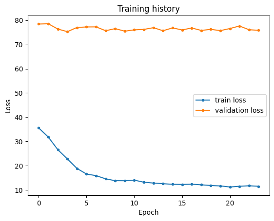

# Experiments

This file presents the procedure for train/test the models implemented with Tensorflow/keras and XGBoost libraries (FC-ANN, XGBoost, 1D-CNN, LSTM and CNN-LSTM).
Procedure for DLinear and PatchTST (implemented with Pytorch) will be presented in next file.
This part of the pipeline consists in the following steps:

- Load tensors from .h5 file
- Architecture selection
- Model building, train, validation and test

NOTE: RNN architectures (LSTM and CNN-LSTM) run better with GPU.

# Settings

```python
import tensorflow as tf
import numpy as np
import random
import pickle
import xgboost as xgb

import matplotlib.pyplot as plt
import pandas as pd
from datetime import datetime

gpus = tf.config.list_physical_devices('GPU')
for gpu in gpus:
    tf.config.experimental.set_memory_growth(gpu, True)

from utils import Models as mdl, Exp_Methods as ex_mt
```

# 1 Import Data

## 1.1 Select model architecture

```python
Model_types = ['FC-ANN', 'XGBoost', '1D-CNN', 'LSTM', 'CNN-LSTM']

while True:
    arc =  int(input("Choose architecture option: 0: 'FC-ANN', 1: 'XGBoost', 2: '1D-CNN', 3: 'LSTM', 4: 'CNN-LSTM'") or 5)
    if arc in range(5): break
    else: print("Please, choose a valid option (0 - 4)")

Arch = Model_types[arc] # Architecture. FC-ANN selected for this example

Arch
```

> **Outputs:**
>
> ```
>  'FC-ANN'
> ```

## 1.2 Import tensors

In this example, the tensors were built with the following options (see Section 4 - Feature Selection and Tensor Generation):

- Features: selection SC4 (meteorological stations and radiosondes)
- Data balancing: Option 2
- Meteorological stations: All
- Sliding windows sequence type: sequence-to-vector (suitable for FC-ANN Model)

```python

# tensors file (prefix 'SC4' indicates subset, 'B2' indicates balance option 2 ant 'T' indicates all stations)
file = 'SC4_B2_T_vec.h5' 

strategy = tf.distribute.MirroredStrategy()
with strategy.scope(): Tensors = ex_mt.ler_h5(file)
```

> **Outputs:**
>
> ```ouput
>  X_test
>  X_train
>  X_val
>  Y_test
>  Y_train
>  Y_val
> ```

```python
# Verifying tensor shapes:

f'Arq: {file}', [(k, v.shape) for k, v in Tensors.items()]
```

> **Outputs:**
>
> ```text
>  ('Arq: SC4_B2_T_vec.h5',
>    [('X_test', TensorShape([68678, 48, 83])),
>    ('X_train', TensorShape([33911, 48, 83])),
>    ('X_val', TensorShape([12791, 48, 83])),
>    ('Y_test', TensorShape([68678, 12, 1])),
>    ('Y_train', TensorShape([33911, 12, 1])),
>    ('Y_val', TensorShape([12791, 12, 1]))])
> ```

```python
# Set tensors to specific variables

with strategy.scope():
  if Arch != 'XGBoost': 
    Xts, Xtr, Xval, Yts, Ytr, Yval = Tensors.values()
  else:
    # For XGBoost: (flatten tensors)
    [Xts, Xtr, Xval, Yts, Ytr, Yval] = [ex_mt.tensor_flat(T) for T in Tensors.values()]
    for T in [Xtr, Ytr, Xval, Yval, Xts, Yts]:
      print(T.shape)
      print('----------')

del Tensors
```

## 1.3 Import train dataset statistics

Files created in Section 4 (part 3 - Data Scaling)

```python

sc, bal, est, ts = file.split('_') # file substrings: subsset, data balancing option, station, type of sequence (See Section 4, part 7 - Export)

if sc in ['SC3','SC5'] and est in ['T','GR', 'SC', 'MB', 'VM', 'FC']: sufix = '_boias'
else: sufix = '_geral'

stats = 'Tr_stats_'+ est + sufix +'.parquet'
print(stats)

tr_est = ex_mt.import_parquet(None, stats)

tr_med = tr_est.loc['med']
tr_desv = tr_est.loc['desv']
tr_min = tr_est.loc['min']
tr_max = tr_est.loc['max']
```

> **Outputs:**
>
> ```
> Tr_stats_T_geral.parquet
> ```

# 2 Experiments

## 2.1 Model Training

### 2.1.1 wMSE Loss function parameters

**Note:**
When using wMSE loss function, parameters $\lambda$ and $P_k$ must be set.
wMSE was implemented in such a way that one or more pairs $(P_k, \lambda)$ may be used (defining weights for different thresholds).
In this study, one pair is used.

```python
alvo = 'Precip' # target variable (must be same used to generate tensor file)

while True:
    esc = input("Enter scaling option used in tensors: 'n' for normalization (max/min) or 'p' for standardization (x-mean/std-dev): (default - p)") or 'p'
    if esc in ['n', 'p']: break
    else: print("Enter a valid option")

Pk = [25] # Extreme value(s) (thresholds) in mm/h
lambda_ = [20] # Weight(s)

# Extreme value (threshold), scaled value
if esc == 'p': lim_p = [ex_mt.padr(x,tr_med[alvo], tr_desv[alvo]) for x in Pk] 
else: lim_p = [ex_mt.norm(x,tr_max[alvo], tr_min[alvo]) for x in Pk] 

W = {k:v for k, v in zip(lim_p, lambda_)}
```

### 2.1.2 Building Model

The `build_model` method asks user to set specific architecture hyper-parameters.
The example shown uses 2 layers of 4096 units for a FC-ANN model.

```python
# Loss function

losses = {'0': 'mse', '1': 'wmse'}

while True:
    option = input("Enter loss function option: '0': 'MSE', '1': 'wMSE' (default: 'mse')") or '0'
    if option not in losses.keys(): print("Invalid Option")
    else: break

loss_name = losses[option]

print(loss_name)
```

> **Outputs:**
>
> ```
>  wmse
> ```

```python
try: del(model) 
except: pass
tf.keras.backend.clear_session()

# Model parameters
ativ = 'relu' # activation function (use 'Linear' for 1D-CNN)

with strategy.scope():
  model, params = mdl.build_model(Arch, loss_name, Xtr.Shape, Ytr.shape, ativ=ativ, W=W)
```

<!-- #region Outputs: Dados do modelo -->

> **Outputs:**
>
> <pre style="white-space:pre;overflow-x:auto;line-height:normal;font-family:Menlo,'DejaVu Sans Mono',consolas,'Courier New',monospace"><span style="font-weight: bold">Model: "sequential"</span>
> </pre>
>
> <pre style="white-space:pre;overflow-x:auto;line-height:normal;font-family:Menlo,'DejaVu Sans Mono',consolas,'Courier New',monospace">┏━━━━━━━━━━━━━━━━━━━━━━━━━━━━━━━━━┳━━━━━━━━━━━━━━━━━━━━━━━━┳━━━━━━━━━━━━━━━┓
> ┃<span style="font-weight: bold"> Layer (type)                    </span>┃<span style="font-weight: bold"> Output Shape           </span>┃<span style="font-weight: bold">       Param # </span>┃
> ┡━━━━━━━━━━━━━━━━━━━━━━━━━━━━━━━━━╇━━━━━━━━━━━━━━━━━━━━━━━━╇━━━━━━━━━━━━━━━┩
> │ flatten (<span style="color: #0087ff; text-decoration-color: #0087ff">Flatten</span>)               │ (<span style="color: #00d7ff; text-decoration-color: #00d7ff">None</span>, <span style="color: #00af00; text-decoration-color: #00af00">3984</span>)           │             <span style="color: #00af00; text-decoration-color: #00af00">0</span> │
> ├─────────────────────────────────┼────────────────────────┼───────────────┤
> │ dense (<span style="color: #0087ff; text-decoration-color: #0087ff">Dense</span>)                   │ (<span style="color: #00d7ff; text-decoration-color: #00d7ff">None</span>, <span style="color: #00af00; text-decoration-color: #00af00">4096</span>)           │    <span style="color: #00af00; text-decoration-color: #00af00">16,322,560</span> │
> ├─────────────────────────────────┼────────────────────────┼───────────────┤
> │ dense_1 (<span style="color: #0087ff; text-decoration-color: #0087ff">Dense</span>)                 │ (<span style="color: #00d7ff; text-decoration-color: #00d7ff">None</span>, <span style="color: #00af00; text-decoration-color: #00af00">4096</span>)           │    <span style="color: #00af00; text-decoration-color: #00af00">16,781,312</span> │
> ├─────────────────────────────────┼────────────────────────┼───────────────┤
> │ dense_2 (<span style="color: #0087ff; text-decoration-color: #0087ff">Dense</span>)                 │ (<span style="color: #00d7ff; text-decoration-color: #00d7ff">None</span>, <span style="color: #00af00; text-decoration-color: #00af00">12</span>)             │        <span style="color: #00af00; text-decoration-color: #00af00">49,164</span> │
> ├─────────────────────────────────┼────────────────────────┼───────────────┤
> │ reshape (<span style="color: #0087ff; text-decoration-color: #0087ff">Reshape</span>)               │ (<span style="color: #00d7ff; text-decoration-color: #00d7ff">None</span>, <span style="color: #00af00; text-decoration-color: #00af00">12</span>, <span style="color: #00af00; text-decoration-color: #00af00">1</span>)          │             <span style="color: #00af00; text-decoration-color: #00af00">0</span> │
> └─────────────────────────────────┴────────────────────────┴───────────────┘
> </pre>
>
> <pre style="white-space:pre;overflow-x:auto;line-height:normal;font-family:Menlo,'DejaVu Sans Mono',consolas,'Courier New',monospace"><span style="font-weight: bold"> Total params: </span><span style="color: #00af00; text-decoration-color: #00af00">33,153,036</span> (126.47 MB)
> </pre>
>
> <pre style="white-space:pre;overflow-x:auto;line-height:normal;font-family:Menlo,'DejaVu Sans Mono',consolas,'Courier New',monospace"><span style="font-weight: bold"> Trainable params: </span><span style="color: #00af00; text-decoration-color: #00af00">33,153,036</span> (126.47 MB)
> </pre>
>
> <pre style="white-space:pre;overflow-x:auto;line-height:normal;font-family:Menlo,'DejaVu Sans Mono',consolas,'Courier New',monospace"><span style="font-weight: bold"> Non-trainable params: </span><span style="color: #00af00; text-decoration-color: #00af00">0</span> (0.00 B)
> </pre>

<!-- #endregion -->

### 2.1.3 Training

```python
# Training Parameters

seed = 2025
random.seed(seed)
np.random.seed(seed)
tf.random.set_seed(seed)

# min. delta
if esc=='p': md = 1e-3
if esc=='n': md = 1e-7

bs=64 # batch size
epoc=100 # epochs
pac=20 # patience

early_stop = tf.keras.callbacks.EarlyStopping(min_delta=md, patience=pac, verbose=1)
```

```python
# Experiment ID

n = input("Experiment code: ") # a sequential number for result recordings

p_name = Arch + '_' + n # project name
f_name = 'Exp_'+ Arch + '.csv' # file name (Code Carbon recordings)
```

**Note:**   
Code carbon tracker  estimates energy consumption and cabon emission of training procedures.   
Results are recorded as a `.csv` file (`f_name`).

```python
# Code Carbon tracker setting
try: del tracker
except: pass  

# If you are not running this experiment in Brazil, set the 'country' parameter to the correct option (see Code Carbon documentation).
tracker = ex_mt.init_tracker(p_name, f_name, country="BRA") 
tracker.start()

t0 = datetime.now()

if Arch != 'XGBoost': 
  h1 = model.fit(Xtr, Ytr, epochs=epoc,
                validation_data=(Xval, Yval), batch_size=bs, verbose=1, callbacks=early_stop)

else:
  dtrain = xgb.DMatrix(Xtr, label=Ytr)
  dval = xgb.DMatrix(Xval, label=Yval)
  res = {}

  model = xgb.train(
    params = {k: params[k] for k in ['max_depth', 'learning_rate', 'eval_metric']},
    dtrain = dtrain,
    num_boost_round = params['epoc'],
    obj= params['loss'],
    custom_metric = params['eval'],
    evals = [(dtrain, "train"), (dval, "val")],
    verbose_eval = True,
    evals_result = res,
    early_stopping_rounds= params['pac']
    )

t1 = datetime.now()

print(t1-t0)

emissions: float = tracker.stop()
print(f"emissions={emissions}")
```

> **Outputs:**
>
> <details>
> <summary>Show/Hide (Training epochs data)</summary>
>
> <pre><code>
>    [codecarbon INFO @ 11:40:34] offline tracker init
>    [codecarbon WARNING @ 11:40:34] Multiple instances of codecarbon are allowed to run at the same time.
>
>    Epoch 1/100
>     530/530   <span style="color: #28a745;">━━━━━━━━━━━━━━━━━━━━</span> 103s  191ms/step - loss: 41.0781 - mae: 1.7773 - mse: 12.4031 - val_loss: 78.4167 - val_mae: 1.4237 - val_mse: 9.9198
>    Epoch 2/100
>     530/530   <span style="color: #28a745;">━━━━━━━━━━━━━━━━━━━━</span>  104s  197ms/step - loss: 32.7659 - mae: 1.4563 - mse: 10.1160 - val_loss: 78.5309 - val_mae: 1.3866 - val_mse: 10.9640
>    Epoch 3/100
>     530/530   <span style="color: #28a745;">━━━━━━━━━━━━━━━━━━━━</span>  106s  199ms/step - loss: 26.9905 - mae: 1.3239 - mse: 10.4909 - val_loss: 76.3535 - val_mae: 1.3754 - val_mse: 11.4255
>    Epoch 4/100
>     530/530   <span style="color: #28a745;">━━━━━━━━━━━━━━━━━━━━</span>  109s  206ms/step - loss: 23.4328 - mae: 1.2296 - mse: 10.2141 - val_loss: 75.2752 - val_mae: 1.2294 - val_mse: 10.1091
>    Epoch 5/100
>     530/530   <span style="color: #28a745;">━━━━━━━━━━━━━━━━━━━━</span>  107s  202ms/step - loss: 18.6893 - mae: 1.0855 - mse: 8.8590 - val_loss: 77.0122 - val_mae: 1.0409 - val_mse: 9.3260
>    Epoch 6/100
>     530/530   <span style="color: #28a745;">━━━━━━━━━━━━━━━━━━━━</span>  109s  205ms/step - loss: 16.5210 - mae: 1.0316 - mse: 8.0828 - val_loss: 77.2183 - val_mae: 1.1904 - val_mse: 10.5457
>    Epoch 7/100
>     530/530   <span style="color: #28a745;">━━━━━━━━━━━━━━━━━━━━</span>  106s  199ms/step - loss: 15.6308 - mae: 0.9752 - mse: 7.7121 - val_loss: 77.2448 - val_mae: 1.2376 - val_mse: 10.8680
>    Epoch 8/100
>     530/530   <span style="color: #28a745;">━━━━━━━━━━━━━━━━━━━━</span>  107s  201ms/step - loss: 14.3837 - mae: 0.9773 - mse: 7.4655 - val_loss: 75.6722 - val_mae: 0.9909 - val_mse: 8.4633
>    Epoch 9/100
>     530/530   <span style="color: #28a745;">━━━━━━━━━━━━━━━━━━━━</span>  105s  198ms/step - loss: 13.6390 - mae: 0.9080 - mse: 6.8580 - val_loss: 76.5264 - val_mae: 0.9220 - val_mse: 7.5443
>    Epoch 10/100
>     530/530   <span style="color: #28a745;">━━━━━━━━━━━━━━━━━━━━</span>  103s  194ms/step - loss: 13.7781 - mae: 0.9221 - mse: 6.6544 - val_loss: 75.4797 - val_mae: 1.0233 - val_mse: 8.3573
>    Epoch 11/100
>     530/530   <span style="color: #28a745;">━━━━━━━━━━━━━━━━━━━━</span>   105s  199ms/step - loss: 14.1334 - mae: 0.8925 - mse: 6.4708 - val_loss: 76.0262 - val_mae: 1.0434 - val_mse: 8.6173
>    Epoch 12/100
>     530/530   <span style="color: #28a745;">━━━━━━━━━━━━━━━━━━━━</span>   108s  203ms/step - loss: 13.4065 - mae: 0.8912 - mse: 6.3557 - val_loss: 76.1976 - val_mae: 1.1741 - val_mse: 9.3476
>    Epoch 13/100
>     530/530   <span style="color: #28a745;">━━━━━━━━━━━━━━━━━━━━</span>   105s  199ms/step - loss: 12.9852 - mae: 0.9064 - mse: 6.4056 - val_loss: 76.9216 - val_mae: 1.0003 - val_mse: 8.0946
>    Epoch 14/100
>     530/530   <span style="color: #28a745;">━━━━━━━━━━━━━━━━━━━━</span>   99s  187ms/step - loss: 12.5116 - mae: 0.9049 - mse: 5.9088 - val_loss: 75.6584 - val_mae: 1.0326 - val_mse: 8.0054
>    Epoch 15/100
>     530/530   <span style="color: #28a745;">━━━━━━━━━━━━━━━━━━━━</span>   97s  183ms/step - loss: 11.8755 - mae: 0.8659 - mse: 5.7214 - val_loss: 76.8317 - val_mae: 1.0252 - val_mse: 8.0212
>    Epoch 16/100
>     530/530   <span style="color: #28a745;">━━━━━━━━━━━━━━━━━━━━</span>   97s  184ms/step - loss: 11.9019 - mae: 0.8480 - mse: 5.5929 - val_loss: 75.9778 - val_mae: 1.0149 - val_mse: 7.7001
>    Epoch 17/100
>     530/530   <span style="color: #28a745;">━━━━━━━━━━━━━━━━━━━━</span>   105s  197ms/step - loss: 12.1447 - mae: 0.8756 - mse: 5.5721 - val_loss: 76.8019 - val_mae: 1.0377 - val_mse: 8.3340
>    Epoch 18/100
>     530/530   <span style="color: #28a745;">━━━━━━━━━━━━━━━━━━━━</span>   124s  235ms/step - loss: 12.0268 - mae: 0.8697 - mse: 5.3549 - val_loss: 75.7869 - val_mae: 1.0452 - val_mse: 7.9034
>    Epoch 19/100
>     530/530   <span style="color: #28a745;">━━━━━━━━━━━━━━━━━━━━</span>   113s  213ms/step - loss: 11.7462 - mae: 0.8739 - mse: 5.2772 - val_loss: 76.2318 - val_mae: 0.9967 - val_mse: 7.6025
>    Epoch 20/100
>     530/530   <span style="color: #28a745;">━━━━━━━━━━━━━━━━━━━━</span>   112s  212ms/step - loss: 11.5950 - mae: 0.9005 - mse: 5.4444 - val_loss: 75.7032 - val_mae: 1.0646 - val_mse: 7.9567
>    Epoch 21/100
>     530/530   <span style="color: #28a745;">━━━━━━━━━━━━━━━━━━━━</span>   114s  214ms/step - loss: 10.3337 - mae: 0.8863 - mse: 5.2089 - val_loss: 76.5652 - val_mae: 0.9849 - val_mse: 7.6754
>    Epoch 22/100
>     530/530   <span style="color: #28a745;">━━━━━━━━━━━━━━━━━━━━</span>   106s  200ms/step - loss: 10.9764 - mae: 0.8851 - mse: 5.3182 - val_loss: 77.6096 - val_mae: 1.2195 - val_mse: 10.6757
>    Epoch 23/100
>     530/530   <span style="color: #28a745;">━━━━━━━━━━━━━━━━━━━━</span>   105s  197ms/step - loss: 11.1011 - mae: 0.8504 - mse: 5.1404 - val_loss: 76.0766 - val_mae: 1.0136 - val_mse: 7.7020
>    Epoch 24/100
>     530/530   <span style="color: #28a745;">━━━━━━━━━━━━━━━━━━━━</span>   103s  194ms/step - loss: 10.7658 - mae: 0.8525 - mse: 4.8716 - val_loss: 75.8308 - val_mae: 0.9820 - val_mse: 7.2969
>    Epoch 24: early stopping
>    0:42:32.525805
>    emissions=0.003373929849225894
> </code></pre>
>
> </details>

<br>

```python
#  Training history plot

# DataFrame
if Arch != 'XGBoost':
  hist = pd.DataFrame(h1.history)

else:
  Data={}
  for base, list_ in res.items():
    for metric, val in list_.items():
      key = base+'_'+ metric 
      Data[key] = val
  
  hist =pd.DataFrame(Data)
  hist.rename(columns={'train_'+loss_name: 'loss', 'val_'+loss_name: 'val_loss'}, inplace=True)


# Plot
plot_ = df.loss.plot(style='.-', label='train loss')
df.val_loss.plot(style='.-', label='validation loss')
plot_.set_xlabel('Epoch')
plot_.set_ylabel('Loss')
plot_.legend()
plot_.set_title('Training history')
plt.show()
```

> **Outputs:**
>
> 

```python
# Export model
formats = {'0': '.pkl', '1': '.weights.h5'} 

while True:
  option = input("Enter file format option: 0: pkl, 1: h5 (default: h5)") or '1'
  if not option in formats.keys(): print "Invalid option"
  else: break

model_file = 'mod_'+ p_name + formats[option]

if bool(option):
  model.save_weights(model_file)
else:
  with open(model_file, 'wb') as file:
      pickle.dump(model, file)
```

### 2.2 Saving Results

#### 2.2.1 Train

```python
with strategy.scope():
  if Arch == 'XGBoost': Ytr_pred = model.predict(dtrain)
  else: Ytr_pred = model.predict(Xtr)
```

> **Outputs:**
>
> <pre><code>
>  1060/1060 <span style="color: #28a745;">━━━━━━━━━━━━━━━━━━━━</span> 21s 20ms/step
> </code></pre>

#### 2.2.2 Validation

```python
with strategy.scope():
  if Arch == 'XGBoost': y_pred_v = model.predict(dval)
  else: y_pred_v = model.predict(Xval)
```

> **Outputs:**
>
> <pre><code>
>  400/400 <span style="color: #28a745;">━━━━━━━━━━━━━━━━━━━━</span> 8s 19ms/step
> </code></pre>

#### 2.2.3 Test

```python
with strategy.scope():
  if Arch == 'XGBoost': 
    dts = xgb.DMatrix(Xts, label=Yts)  
    y_pred_ts = model.predict(dts)
  else: y_pred_ts = model.predict(Xts)
```

> **Outputs:**
>
> <pre><code>
>  2147/2147 <span style="color: #28a745;">━━━━━━━━━━━━━━━━━━━━</span> 43s 20ms/step
> </code></pre>

# 3 Exporting results

```python
results = [Ytr_pred, y_pred_v, y_pred_ts]
labels = ['Ypred_tr', 'Ypred_val', 'Ypred_ts']

exp_file = p_name + 'pred'
 
ex_mt.exportar_tensores_h5(exp_file, results, nomes=labels,opt=9)
```

> **Outputs:**
>
> ```
> Processando tensor 0,Ypred_tr, (33911, 12, 1)  
> ----- 
> Processando tensor 1,Ypred_val, (12791, 12, 1) 
> -----                                      
> Processando tensor 2,Ypred_ts, (68678, 12, 1)  
> -----
> ```
