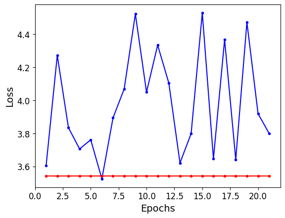

# Experiments

This file presents the procedure for train/test the models implemented with TSAI and Pytorch libraries (DLinear and PacthTST).
This part of the pipeline is similar to that presented in previous file, consisting in the same steps, but with the necessary adaptations.

In this example, a DLinear model is trained.

NOTES:
(1) To properly run the code below, be sure to accomplish with all dependencies (including  ones in `Models` and `Methods`packages),  
cpecially `DLinear` and `TSAI`, to be able to implement  DLinear and PatchTST models. 
(2) PatchTST requires a GPU to run properly.

# Settings

```python

import tensorflow as tf
import numpy as np
import random
import matplotlib.pyplot as plt
import pandas as pd
from datetime import datetime

from tsai.basics import *
from fastai.callback.tracker import EarlyStoppingCallback

gpus = tf.config.list_physical_devices('GPU')
print(gpus)
for gpu in gpus:
    tf.config.experimental.set_memory_growth(gpu, True)

from utils import Models as mdl, Exp_Methods as ex_mt
```

# 1 Import Data

## 1.1 Select model architecture

**Define model type for the experiment**

```python
Model_types = ['DLinear', 'PatchTST']

while True:
    arc =  int(input("Choose architecture option: 0: 'DLinear', 1: 'PatchTST'") or 2)
    if arc in range(2): break
    else: print("Please, choose a valid option (0 or 1)")

Arch = Model_types[arc] # Architecture. DLinear selected for this example

Arch
```

> **Outputs:**
>
> ```
>  'DLinear'
> ```

## 1.2 Import tensors

In this example, the tensors were built with the following options (see Section 4 - Feature Selection and Tensor Generation):

- Features: selection SC5 (meteorological stations and buoys)
- Data balancing: Option 2
- Meteorological stations: All
- Sliding windows sequence type: sequence-to-vector (suitable for DLinear)

```python

# tensors file (prefix 'SC5' indicates subset, 'B2' indicates balance option 2 ant 'T' indicates all stations)
file = 'SC5_B2_T_vec.h5' 

strategy = tf.distribute.MirroredStrategy()
with strategy.scope(): Tensors = ex_mt.ler_h5(file)
```

> **Outputs:**
>
> ```ouput
>  X_test
>  X_train
>  X_val
>  Y_test
>  Y_train
>  Y_val
> ```

```python
# Verifying tensor shapes:

f'Arq: {file}', [(k, v.shape) for k, v in Tensors.items()]
```

> **Outputs:**
>
> ```text
> ('Arquivo: SC5_Ch_T_vec.h5',
> [('X_test', TensorShape([75096, 48, 16])),
>  ('X_train', TensorShape([76655, 48, 16])),
>  ('X_val', TensorShape([14632, 48, 16])),
>  ('Y_test', TensorShape([75096, 12, 1])),
>  ('Y_train', TensorShape([76655, 12, 1])),
>  ('Y_val', TensorShape([14632, 12, 1]))])
> ```

```python
# Set tensors to specific variables

with strategy.scope():
    Xts, Xtr, Xval, Yts, Ytr, Yval = Tensores.values()
for t in Tensores: del t
```

## 1.3 Import train dataset statistics

Files created in Section 4 (part 3 - Data Scaling)

```python

sc, bal, est, ts = file.split('_') # file substrings: subsset, data balancing option, station, type of sequence (See Section 4, part 7 - Export)

if sc in ['SC3','SC5'] and est in ['T','GR', 'SC', 'MB', 'VM', 'FC']: sufix = '_boias'
else: sufix = '_geral'

stats = 'Tr_stats_'+ est + sufix +'.parquet'
print(stats)

tr_est = ex_mt.import_parquet(None, stats)

tr_med = tr_est.loc['med']
tr_desv = tr_est.loc['desv']
tr_min = tr_est.loc['min']
tr_max = tr_est.loc['max']
```

> **Outputs:**
>
> ```
> Tr_stats_T_boias.parquet
> ```

# 2 Experiments

## 2.1 Model Training

### 2.1.1 wMSE Loss function parameters

**Note:**
When using wMSE loss function, parameters $\lambda$ and $P_k$ must be set.
wMSE was implemented in such a way that one or more pairs $(P_k, \lambda)$ may be used (defining weights for different thresholds).
In this study, one pair is used.

```python
alvo = 'Precip' # target variable (must be same used to generate tensor file)

while True:
    esc = input("Enter scaling option used in tensors: 'n' for normalization (max/min) or 'p' for standardization (x-mean/std-dev): (default - p)") or 'p'
    if esc in ['n', 'p']: break
    else: print("Enter a valid option")

Pk = [25] # Extreme value(s) (thresholds) in mm/h
lambda_ = [20] # Weight(s)

# Extreme value (threshold), scaled value
if esc == 'p': lim_p = [ex_mt.padr(x,tr_med[alvo], tr_desv[alvo]) for x in Pk] 
else: lim_p = [ex_mt.norm(x,tr_max[alvo], tr_min[alvo]) for x in Pk] 

W = {k:v for k, v in zip(lim_p, lambda_)}
```

### 2.1.2 Preparing  data for TSForecatser class

The `TSForecaster` class receives a concatenated dataset (containing the training and validation data), along with a dictionary (`splits`) containing the respective indices.

```python
# Train/Validation indexes

len_tr = len(Xtr)
len_vl = len(Xval)

tr_ind = list(range(len_tr))
vl_ind = list(range(len_tr, len_tr+len_vl))

splits = (tr_ind, vl_ind)

print(f'Indexes: train [0, ...{len_tr-1}]; validation: [{len_tr}, ...{len_tr+len_vl-1}]')
```

> **Outputs:**
>
> ```
> Indexes: train [0, ...76654]; validation: [76655, ...91286]
> ```

```python
# Train/Validation base (concatenated)

if Arc == 'PatchTST': ch_1st = True # para uso no PatchTST (Channels First: Samples x Attributes x Time)
else: ch_1st = False

with strategy.scope():

    # Samples x Time x Attributes 
    X = tf.concat([Xtr, Xval], 0)
    Y = tf.concat([Ytr, Yval], 0)

    del Xtr, Xval, Ytr, Yval

    if ch_1st:
        print("Arrays serão transformados para 'Amostras x atributos x tempo'.")
        # amostras x atributos x tempo
        X = tf.transpose(X, perm=[0,2,1])
        Y = tf.transpose(Y, perm=[0,2,1])

    X, Y = X.numpy(), Y.numpy()

X.shape, Y.shape
```

> **Outputs:**
>
> ```
> ((91287, 48, 16), (91287, 12, 1))
> ```

```python
# Test base (to numpy)

with strategy.scope():

    if ch_1st:
        print("Arrays serão transformados para 'Amostras x atributos x tempo'.")
        Xts = tf.transpose(Xts, perm=[0,2,1])
        Yts = tf.transpose(Yts, perm=[0,2,1])

    Xts, Yts = Xts.numpy(), Yts.numpy()

Xts.shape, Yts.shape
```

> **Outputs:**
>
> ```
> ((75096, 48, 16), (75096, 12, 1))
> ```

### 2.1.3 Building Model

The `build_model_TSF` method asks user to set specific architecture hyper-parameters.
DLinear and PatchTST are configured to have an output with only one attribute (channel).
The example shown a DLinear model.

```python
# Loss function

losses = {'0': 'mse', '1': 'wmse'}

while True:
    option = input("Enter loss function option: '0': 'MSE', '1': 'wMSE' (default: 'mse')") or '0'
    if option not in losses.keys(): print("Invalid Option")
    else: break

loss_name = losses[option]

print(loss_name)
```

> **Outputs:**
>
> ```
>  wmse
> ```

```python
try: del(model) 
except: pass

# Model parameters
ativ = 'relu'
bs=64 # batch size

with strategy.scope():
  model, configs = mdl.build_model_TSF(X, Y, Arch, loss_name, splits, ativ=ativ, W=W, bs=bs)
```

> **Outputs:**
>
> <pre><code>
> Forecaster_1target (Input shape: 64 x 48 x 16)
> ============================================================================
> Layer (type)         Output Shape         Param #    Trainable 
> ============================================================================
>                      64 x 16 x 48        
> AvgPool1d                                                      
> ____________________________________________________________________________
>                      64 x 16 x 12        
> Linear                                    588        True      
> Linear                                    588        True      
> ____________________________________________________________________________
>                      64 x 12 x 1         
> Linear                                    17         True      
> ____________________________________________________________________________
>
> Total params: 1,193
> Total trainable params: 1,193
> Total non-trainable params: 0
>
> Optimizer used: <function Adam at 0x000001DDF4B4D480>
> Loss function: torch_wmse()
>
> Callbacks:
>   - TrainEvalCallback
>   - CastToTensor
>   - Recorder
>   - ProgressCallback
>
>  </code></pre>

### 2.1.3 Training

```python
# Training Parameters

seed = 2025
random.seed(seed)
np.random.seed(seed)
tf.random.set_seed(seed)

 # min. delta
if esc=='p': md = 1e-3
if esc=='n': md = 1e-7

lr = float(input("Enter learning ratio (default 0.001): ") or 0.001)

bs=64 # batch size
epoc=100 # epochs
pac=20 # patience

early_stop =  EarlyStoppingCallback (monitor='valid_loss', comp=np.less, min_delta=md, patience=pac, reset_on_fit=True)
```

```python
# Experiment ID

n = input("Experiment code: ") # a sequential number for result recordings

p_name = Arch + '_' + n # project name
f_name = 'Exp_'+ Arch + '.csv' # file name (Code Carbon recordings)
```

```python
# Code Carbon tracker setting
try: del tracker
except: pass  

# If you are not running this experiment in Brazil, set the 'country' parameter to the correct option (see Code Carbon documentation).
tracker = ex_mt.init_tracker(p_name, f_name, country="BRA") 
tracker.start()

t0 = datetime.now()

model.fit(epoc, lr=lr, cbs=[early_stop])

t1 = datetime.now()

print(t1-t0)

emissions: float = tracker.stop()
print(f"emissions={emissions}")
```

> **Outputs:**
>
> <details>
> <summary>Show/Hide (Training epochs data)</summary>
>
> <table border="1" class="dataframe">
>   <thead>
>     <tr style="text-align: left;">
>       <th>epoch</th>
>       <th>train_loss</th>
>       <th>valid_loss</th>
>       <th>mse</th>
>       <th>mae</th>
>       <th>time</th>
>     </tr>
>   </thead>
>   <tbody>
>     <tr>
>       <td>0</td>
>       <td>3.603823</td>
>       <td>3.541766</td>
>       <td>3.541766</td>
>       <td>0.543148</td>
>       <td>00:07</td>
>     </tr>
>     <tr>
>       <td>1</td>
>       <td>4.271040</td>
>       <td>3.541766</td>
>       <td>3.541766</td>
>       <td>0.543148</td>
>       <td>00:07</td>
>     </tr>
>     <tr>
>       <td>2</td>
>       <td>3.834359</td>
>       <td>3.541766</td>
>       <td>3.541766</td>
>       <td>0.543148</td>
>       <td>00:07</td>
>     </tr>
>     <tr>
>       <td>3</td>
>       <td>3.705370</td>
>       <td>3.541766</td>
>       <td>3.541766</td>
>       <td>0.543148</td>
>       <td>00:08</td>
>     </tr>
>     <tr>
>       <td>4</td>
>       <td>3.760772</td>
>       <td>3.541766</td>
>       <td>3.541766</td>
>       <td>0.543148</td>
>       <td>00:06</td>
>     </tr>
>     <tr>
>       <td>5</td>
>       <td>3.524017</td>
>       <td>3.541766</td>
>       <td>3.541766</td>
>       <td>0.543148</td>
>       <td>00:06</td>
>     </tr>
>     <tr>
>       <td>6</td>
>       <td>3.893742</td>
>       <td>3.541766</td>
>       <td>3.541766</td>
>       <td>0.543148</td>
>       <td>00:08</td>
>     </tr>
>     <tr>
>       <td>7</td>
>       <td>4.068787</td>
>       <td>3.541766</td>
>       <td>3.541766</td>
>       <td>0.543148</td>
>       <td>00:06</td>
>     </tr>
>     <tr>
>       <td>8</td>
>       <td>4.521926</td>
>       <td>3.541766</td>
>       <td>3.541766</td>
>       <td>0.543148</td>
>       <td>00:08</td>
>     </tr>
>     <tr>
>       <td>9</td>
>       <td>4.049306</td>
>       <td>3.541766</td>
>       <td>3.541766</td>
>       <td>0.543148</td>
>       <td>00:07</td>
>     </tr>
>     <tr>
>       <td>10</td>
>       <td>4.333496</td>
>       <td>3.541766</td>
>       <td>3.541766</td>
>       <td>0.543148</td>
>       <td>00:07</td>
>     </tr>
>     <tr>
>       <td>11</td>
>       <td>4.103839</td>
>       <td>3.541766</td>
>       <td>3.541766</td>
>       <td>0.543148</td>
>       <td>00:07</td>
>     </tr>
>     <tr>
>       <td>12</td>
>       <td>3.620654</td>
>       <td>3.541766</td>
>       <td>3.541766</td>
>       <td>0.543148</td>
>       <td>00:06</td>
>     </tr>
>     <tr>
>       <td>13</td>
>       <td>3.798141</td>
>       <td>3.541766</td>
>       <td>3.541766</td>
>       <td>0.543148</td>
>       <td>00:07</td>
>     </tr>
>     <tr>
>       <td>14</td>
>       <td>4.528815</td>
>       <td>3.541766</td>
>       <td>3.541766</td>
>       <td>0.543148</td>
>       <td>00:06</td>
>     </tr>
>     <tr>
>       <td>15</td>
>       <td>3.646380</td>
>       <td>3.541766</td>
>       <td>3.541766</td>
>       <td>0.543148</td>
>       <td>00:08</td>
>     </tr>
>     <tr>
>       <td>16</td>
>       <td>4.366946</td>
>       <td>3.541766</td>
>       <td>3.541766</td>
>       <td>0.543148</td>
>       <td>00:07</td>
>     </tr>
>     <tr>
>       <td>17</td>
>       <td>3.640787</td>
>       <td>3.541766</td>
>       <td>3.541766</td>
>       <td>0.543148</td>
>       <td>00:07</td>
>     </tr>
>     <tr>
>       <td>18</td>
>       <td>4.471819</td>
>       <td>3.541766</td>
>       <td>3.541766</td>
>       <td>0.543148</td>
>       <td>00:06</td>
>     </tr>
>     <tr>
>       <td>19</td>
>       <td>3.918508</td>
>       <td>3.541766</td>
>       <td>3.541766</td>
>       <td>0.543148</td>
>       <td>00:06</td>
>     </tr>
>     <tr>
>       <td>20</td>
>       <td>3.798182</td>
>       <td>3.541766</td>
>       <td>3.541766</td>
>       <td>0.543148</td>
>       <td>00:06</td>
>     </tr>
>   </tbody>
> </table>
>
> ```
> No improvement since epoch 0: early stopping
> 2025-10-17 15:21:13.858375
> 0:02:34.362942
> emissions=0.00020403626217074274
> ```
>
> </details>

<br>

```python
#  Training history plot

# DataFrame
hist = pd.DataFrame(model.recorder.values,columns=['train_loss', 'valid_loss', 'mse','mae',])
losses = [f'train loss ({loss_name})',  f'valid loss ({loss_name})']
hist.rename(columns={'train_loss': losses[0], 'valid_loss':losses[1]}, inplace=True)

# Plot
plt.plot(hist.index+1, hist[losses[0]], 'b.-', label='Training loss') 
plt.plot(hist.index+1, hist[losses[1]], 'r.-', label='Validation loss')
plt.xlabel('Epochs')
plt.ylabel('Loss')
plt.show()
```

> **Outputs:**
>
> 

```python
# Export model

model_file = 'mod_'+ p_name
model.save(model_file) # save a .pth file
```

### 2.2 Saving Results

#### 2.2.1 Train


```python
Ytr_pred, *_ = model.get_X_preds(X[splits[0]])
Ytr_pred = to_np(Ytr_pred)
Ytr_pred.shape
```

> **Outputs:**
>
> ```
>  (76655, 12, 1)
> ```

#### 2.2.2 Validation

```python
y_pred_v, *_ = model.get_X_preds(X[splits[1]])
y_pred_v = to_np(y_pred_v)
y_pred_v.shape
```

> **Outputs:**
>
> ```
>  (14632, 12, 1)
> ```

#### 2.2.3 Test

```python
y_pred_ts, *_ = model.get_X_preds(Xts)
y_pred_ts = to_np(y_pred_ts)
y_pred_ts.shape
```

> **Outputs:**
>
> ```
>  (75096, 12, 1)
> ```

# 3 Exporting results

```python
results = [Ytr_pred, y_pred_v, y_pred_ts]
labels = ['Ypred_tr', 'Ypred_val', 'Ypred_ts']

exp_file = 'p_name+'pred'
 
ex_mt.exportar_tensores_h5(exp_file, results, nomes=labels,opt=9)
```

> **Outputs:**
>
> ```
> Processando tensor 0,Ypred_tr, (76655, 12, 1)
> -----
> Processando tensor 1,Ypred_val, (14632, 12, 1)
> -----
> Processando tensor 2,Ypred_ts, (75096, 12, 1)
> -----
> ```
