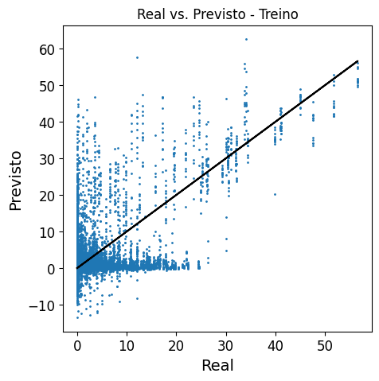
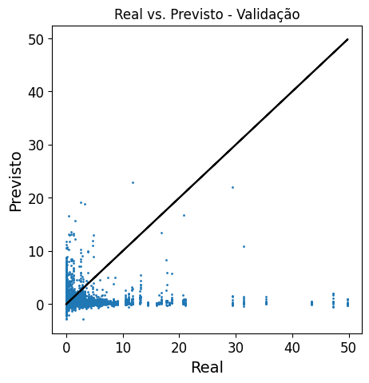
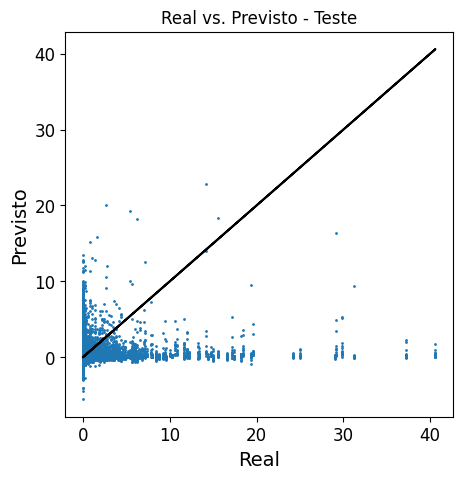

# Evaluate Results

# Setup

```python
import tensorflow as tf

gpus = tf.config.list_physical_devices('GPU')
print(gpus)
for gpu in gpus:
    tf.config.experimental.set_memory_growth(gpu, True)

import numpy as np
import matplotlib.pyplot as plt
import pandas as pd

from utils import Exp_Methods as ex_mt
```

# 1 - Import Data

## 1.1 Real Data 

Import tensors with real data.

In this example, `file` is formed by tensors where:

- Features: selection SC5 (features selected according to Feature Importance - see Section 3)
- Data balancing: Option 1
- Meteorological stations: 'VM' (Vila Militar)
- Sliding windows sequence type: sequence-to-sequence (suitable for recurrent network models)

```python
file = 'SC5_B1_VM_seq.h5'

sc, bal, est, ts = file.split('_')

esc = 'p' # standardization (x-mean)/std_dev
if  ts =='vec': seq=0
elif ts =='seq' in nome: seq=1
else: seq=int(input('Tipo de sequêcia: 0- seq2vec; 1-sec2sec'))

strategy = tf.distribute.MirroredStrategy()

with strategy.scope(): 
    Tensors = ex_mt.ler_h5(file)
    Xts, Xtr, Xval, Yts, Ytr, Yval = Tensors.values()

for t in Tensors: del t
del Tensors
```
> **Outputs:**
> 
>     X_test
>     (12338, 48, 16)
>     X_train
>     (27816, 48, 16)
>     X_val
>     (5296, 48, 16)
>     Y_test
>     (12338, 48, 12, 1)
>     Y_train
>     (27816, 48, 12, 1)
>     Y_val
>     (5296, 48, 12, 1)
>     

## 1.2 Train dataset statistics

Statistics will be used to set values back to original scale.

```python

if sc in ['SC3','SC5'] and est in ['T','GR', 'SC', 'MB', 'VM', 'FC']: sufix = '_boias'
else: sufix = '_geral'

stats = 'Tr_stats_'+ est + sufix +'.parquet'

print(stats)

tr_est = ex_mt.import_parquet(Dir, arq_est)

tr_med = tr_est.loc['med']
tr_desv = tr_est.loc['desv']
tr_min = tr_est.loc['min']
tr_max = tr_est.loc['max']
```

    Tr_stats_VM_boias.parquet
    

## 1.3 Predicted data

Import tensors with predicted values (model outputs).   
In this example, results come from a LSTM model.

```python
# Importar resultados

cod_code = int(input("Enter experiment code: "))

Model_types = ['FC-ANN', 'XGBoost', '1D-CNN', 'LSTM', 'CNN-LSTM', 'DLinear', 'PatchTST']
while True:
    arc =  int(input("Choose architecture option: 0: 'FC-ANN', 1: 'XGBoost', 2: '1D-CNN', 3: 'LSTM', 4: 'CNN-LSTM', 5: 'DLinear', 6: 'PatchTST'") or 7)
    if arc in range(7): break
    else: print("Please, choose a valid option (0 - 6)")

Arch = Model_types[arc]

experiment = Arch + '_'+ str(cod_exp)

results_f = experiment +'pred.h5'

with strategy.scope(): 
    Results = ex_mt.ler_h5(results_f)
    Ytr_pred, Yts_pred, Yval_pred = Results.values()
for r in Results: del r
del Results   

```
> **Outputs:**
> 
>     Ypred_tr
>     (27816, 48, 12, 1)
>     Ypred_ts
>     (12338, 48, 12, 1)
>     Ypred_val
>     (5296, 48, 12, 1)
  

## 1.4 Features

```python

Subsets = ex_ex_mt.Features # Feature names for each subset (SC1 to SC5 - See section 3)

target = ['Precip'] # For temperature prediction experiments, use 'Temp_Amb'
atrib = Subsets[sc]

if est != 'T':
    # Location attributes (constants) are not used when the model is for a specific station.
    for x in ['Lat', 'Long', 'Alt', 'Dist_TSM']:
        try: atrib.remove(x)
        except:pass

if target is not None: 
    target_i = [atrib.index(a) for a in target]
    # if len(target_i)==1: target_i = target_i[0]
    print(f'Target index: {target_i}')

f'Number of attributes: {len(atrib)}', atrib, 
```

> **Outputs:**   
> 
>     Target index: [15]
>     
>     (Number of attributes: 16,
>      ['TSM',
>       'Tpov_dif',
>       'DTemp_03h',
>       'DP_01h',
>       's_dia',
>       'Vento_dv_01h',
>       'Vento_ddir_01h',
>       'Vento_y',
>       'Vento_dv_03h',
>       'Rad',
>       'POv_dep_700.0',
>       'Vento_x',
>       'c_dia',
>       'Vento_y_925.0',
>       'Vento_ddir_12h',
>       'Precip'])

# 2 - Analyzing Results

## 2.1 - Metrics

```python
# Assure Y tensor shape

with strategy.scope(): 

    if Ytr.shape != Ytr_pred.shape:
        if np.prod(Ytr_pred.shape) == np.prod(Ytr.shape):
            Ytr_pred = tf.transpose(Ytr_pred, perm=[0,2,1])
        else: print ('Incompatible dimensions')

    if Yts.shape != Yts_pred.shape:
        if np.prod(Yts_pred.shape) == np.prod(Yts.shape):
            Yts_pred = tf.transpose(Yts_pred, perm=[0,2,1])
        else: print ('Incompatible dimensions')

    if Yval.shape != Yval_pred.shape:
        if np.prod(Yval_pred.shape) == np.prod(Yval.shape):
            Yval_pred = tf.transpose(Yval_pred, perm=[0,2,1])
        else: print ('Incompatible dimensions')

```


```python
# Value ranges for metrics
var = target[0]

lim = [0,5,25,50] # # For temperature prediction experiments, use [-float('inf'),15,25,35]
lim_p = [ex_mt.padr(x,tr_med[var], tr_desv[var]) for x in lim] # scaled values
```


```python
# Bias per range
B_tr, B_vl, B_ts = {}, {}, {}

# General:

# train
B_tr['General'] = ex_mt.mae_despadr(ex_mt.Bias(Ytr, Ytr_pred), tr_desv[var])

# validation
B_vl['General'] = ex_mt.mae_despadr(ex_mt.Bias(Yval, Yval_pred), tr_desv[var])

# test
B_ts['General'] = ex_mt.mae_despadr(ex_mt.Bias(Yts, Yts_pred), tr_desv[var])

L = len(lim)
for l in range(L):

    Li = lim_p[l]
    if l+1 == L: Ls=None  
    else: Ls = lim_p[l+1]

    # train
    B_tr[lim[l]] = ex_mt.mae_despadr(ex_mt.Bias(*ex_mt.filtrar_tensores([Ytr, Ytr_pred], li=Li, ls=Ls, seq=seq)), tr_desv[var])
    
    # validation
    B_vl[lim[l]] = ex_mt.mae_despadr(ex_mt.Bias(*ex_mt.filtrar_tensores([Yval, Yval_pred], li=Li, ls=Ls, seq=seq)), tr_desv[var])

    # test
    B_ts[lim[l]] = ex_mt.mae_despadr(ex_mt.Bias(*ex_mt.filtrar_tensores([Yts, Yts_pred], li=Li, ls=Ls, seq=seq)), tr_desv[var])

Bias_df = pd.DataFrame([B_tr, B_vl, B_ts], index=[['Bias', 'Bias', 'Bias'], ['Train', 'Validation', 'Test']])
Bias_df.columns = ['General', 'Light', 'Moderate', 'Heavy', 'Very Heavy']

Bias_df
```
> **Outputs:**
> 
> </style>
> <table border="1" class="dataframe">
>   <thead>
>     <tr style="text-align: right;">
>       <th></th>
>       <th></th>
>       <th>General</th>
>       <th>Light</th>
>       <th>Moderate</th>
>       <th>Heavy</th>
>       <th>Very Heavy</th>
>     </tr>
>   </thead>
>   <tbody>
>     <tr>
>       <th rowspan="3" valign="top">Bias</th>
>       <th>Train</th>
>       <td>-0.093672</td>
>       <td>-0.101005</td>
>       <td>7.219877</td>
>       <td>0.435785</td>
>       <td>5.527126</td>
>     </tr>
>     <tr>
>       <th>Validation</th>
>       <td>-0.019278</td>
>       <td>-0.078619</td>
>       <td>10.015607</td>
>       <td>38.625934</td>
>       <td>NaN</td>
>     </tr>
>     <tr>
>       <th>Test</th>
>       <td>-0.054588</td>
>       <td>-0.088667</td>
>       <td>8.971184</td>
>       <td>30.807425</td>
>       <td>NaN</td>
>     </tr>
>   </tbody>
> </table>

```python
# MAE per range
MAE_tr, MAE_vl, MAE_ts = {}, {}, {}

# General:

if seq: 
    MAE_tr['General'] = ex_mt.mae_despadr(ex_mt.mae(Ytr[:,-1], Ytr_pred[:,-1]), tr_desv[var]) # train
    MAE_vl['General'] = ex_mt.mae_despadr(ex_mt.mae(Yval[:,-1], Yval_pred[:,-1]), tr_desv[var]) # validation
    MAE_ts['General'] = ex_mt.mae_despadr(ex_mt.mae(Yts[:,-1], Yts_pred[:,-1]), tr_desv[var]) # test

else: 
    MAE_tr['General'] = ex_mt.mae_despadr(ex_mt.mae(Ytr, Ytr_pred), tr_desv[var]) # train
    MAE_vl['General'] = ex_mt.mae_despadr(ex_mt.mae(Yval, Yval_pred), tr_desv[var]) # validation
    MAE_ts['General'] = ex_mt.mae_despadr(ex_mt.mae(Yts, Yts_pred), tr_desv[var]) # test

L = len(lim)
for l in range(L):

    Li = lim_p[l]
    if l+1 == L: Ls=None  
    else: Ls = lim_p[l+1]

    # train
    MAE_tr[lim[l]] = ex_mt.mae_despadr(mae(*ex_mt.filtrar_tensores([Ytr, Ytr_pred], li=Li, ls=Ls, seq=seq)), tr_desv[var])
    
    # validation
    MAE_vl[lim[l]] = ex_mt.mae_despadr(mae(*ex_mt.filtrar_tensores([Yval, Yval_pred], li=Li, ls=Ls, seq=seq)), tr_desv[var])

    # test
    MAE_ts[lim[l]] = ex_mt.mae_despadr(mae(*ex_mt.filtrar_tensores([Yts, Yts_pred], li=Li, ls=Ls, seq=seq)), tr_desv[var])

MAE_df = pd.DataFrame([MAE_tr, MAE_vl, MAE_ts], index=[['MAE', 'MAE', 'MAE'], ['Train', 'Validation', 'Test']], )
MAE_df.columns = ['General', 'Light', 'Moderate', 'Heavy', 'Very Heavy']

MAE_df
```

> **Outputs:**
> 
> </style>
> <table border="1" class="dataframe">
>   <thead>
>     <tr style="text-align: right;">
>       <th></th>
>       <th></th>
>       <th>General</th>
>       <th>Light</th>
>       <th>Moderate</th>
>       <th>Heavy</th>
>       <th>Very Heavy</th>
>     </tr>
>   </thead>
>   <tbody>
>     <tr>
>       <th rowspan="3" valign="top">MAE</th>
>       <th>Train</th>
>       <td>0.456499</td>
>       <td>0.361978</td>
>       <td>9.067306</td>
>       <td>4.846708</td>
>       <td>5.608709</td>
>     </tr>
>     <tr>
>       <th>Validation</th>
>       <td>0.463368</td>
>       <td>0.335559</td>
>       <td>10.055805</td>
>       <td>38.625934</td>
>       <td>0.000000</td>
>     </tr>
>     <tr>
>       <th>Test</th>
>       <td>0.327820</td>
>       <td>0.257531</td>
>       <td>9.086965</td>
>       <td>30.807425</td>
>       <td>0.000000</td>
>     </tr>
>   </tbody>
> </table>


```python
# MSE per range
mse_tr, mse_vl, mse_ts = {}, {}, {}

# General:

if seq: 
    mse_tr['General'] = ex_mt.mse_despadr(ex_mt.mse(Ytr[:,-1], Ytr_pred[:,-1]), tr_desv[var]) # train
    mse_vl['General'] = ex_mt.mse_despadr(ex_mt.mse(Yval[:,-1], Yval_pred[:,-1]), tr_desv[var]) # validation
    mse_ts['General'] = ex_mt.mse_despadr(ex_mt.mse(Yts[:,-1], Yts_pred[:,-1]), tr_desv[var]) # test

else: 
    mse_tr['General'] = ex_mt.mse_despadr(ex_mt.mse(Ytr, Ytr_pred), tr_desv[var]) # train
    mse_vl['General'] = ex_mt.mse_despadr(ex_mt.mse(Yval, Yval_pred), tr_desv[var]) # validation
    mse_ts['General'] = ex_mt.mse_despadr(ex_mt.mse(Yts, Yts_pred), tr_desv[var]) # test

L = len(lim)
for l in range(L):

    Li = lim_p[l]
    if l+1 == L: Ls=None  
    else: Ls = lim_p[l+1]

    # train
    mse_tr[lim[l]] = ex_mt.mse_despadr(ex_mt.mse(*ex_mt.filtrar_tensores([Ytr, Ytr_pred], li=Li, ls=Ls, seq=seq)), tr_desv[var])
    
    # validation
    mse_vl[lim[l]] = ex_mt.mse_despadr(ex_mt.mse(*ex_mt.filtrar_tensores([Yval, Yval_pred], li=Li, ls=Ls, seq=seq)), tr_desv[var])

    # test
    mse_ts[lim[l]] = ex_mt.mse_despadr(ex_mt.mse(*ex_mt.filtrar_tensores([Yts, Yts_pred], li=Li, ls=Ls, seq=seq)), tr_desv[var])

MSE_df = pd.DataFrame([mse_tr, mse_vl, mse_ts], index=[['MSE', 'MSE', 'MSE'], ['Train', 'Validation', 'Test']])
MSE_df.columns = ['General', 'Light', 'Moderate', 'Heavy', 'Very Heavy']

MSE_df
```


> **Outputs:**   
> 
> <table border="1" class="dataframe">
>   <thead>
>     <tr style="text-align: right;">
>       <th></th>
>       <th></th>
>       <th>General</th>
>       <th>Light</th>
>       <th>Moderate</th>
>       <th>Heavy</th>
>       <th>Very Heavy</th>
>     </tr>
>   </thead>
>   <tbody>
>     <tr>
>       <th rowspan="3" valign="top">MSE</th>
>       <th>Train</th>
>       <td>2.154666</td>
>       <td>1.024834</td>
>       <td>105.701538</td>
>       <td>48.292731</td>
>       <td>40.29916</td>
>     </tr>
>     <tr>
>       <th>Validation</th>
>       <td>3.337548</td>
>       <td>0.488649</td>
>       <td>123.848909</td>
>       <td>1569.354525</td>
>       <td>0.00000</td>
>     </tr>
>     <tr>
>       <th>Test</th>
>       <td>1.481642</td>
>       <td>0.305842</td>
>       <td>103.663989</td>
>       <td>980.093423</td>
>       <td>0.00000</td>
>     </tr>
>   </tbody>
> </table>


## 2.2 Plots

```python
# Real vs. Predicted

ex_mt.plot_real_vs_pred(Ytr, Ytr_pred, per_h=0, seq2seq=seq, est=tr_est[var], escala=esc, base='Trein0')

ex_mt.plot_real_vs_pred(Yval, Yval_pred, per_h=0, seq2seq=seq, est=tr_est[var], escala=esc, base='Validação')

ex_mt.plot_real_vs_pred(Yts, Yts_pred, per_h=0, seq2seq=seq, est=tr_est[var], escala=esc, base='Teste')
```
    

    

    

    
  
# 3 Export results (metrics)

```python
metrics = pd.concat([MAE_df, MSE_df, Bias_df]).T
metrics
```

> **Outputs:**
> 
> <table border="1" class="dataframe">
>   <thead>
>     <tr>
>       <th></th>
>       <th colspan="3" halign="left">MAE</th>
>       <th colspan="3" halign="left">MSE</th>
>       <th colspan="3" halign="left">Bias</th>
>     </tr>
>     <tr>
>       <th></th>
>       <th>Train</th>
>       <th>Validation</th>
>       <th>Test</th>
>       <th>Train</th>
>       <th>Validation</th>
>       <th>Test</th>
>       <th>Train</th>
>       <th>Validation</th>
>       <th>Test</th>
>     </tr>
>   </thead>
>   <tbody>
>     <tr>
>       <th>General</th>
>       <td>0.456499</td>
>       <td>0.463368</td>
>       <td>0.327820</td>
>       <td>2.154666</td>
>       <td>3.337548</td>
>       <td>1.481642</td>
>       <td>-0.093672</td>
>       <td>-0.019278</td>
>       <td>-0.054588</td>
>     </tr>
>     <tr>
>       <th>Light</th>
>       <td>0.361978</td>
>       <td>0.335559</td>
>       <td>0.257531</td>
>       <td>1.024834</td>
>       <td>0.488649</td>
>       <td>0.305842</td>
>       <td>-0.101005</td>
>       <td>-0.078619</td>
>       <td>-0.088667</td>
>     </tr>
>     <tr>
>       <th>Moderate</th>
>       <td>9.067306</td>
>       <td>10.055805</td>
>       <td>9.086965</td>
>       <td>105.701538</td>
>       <td>123.848909</td>
>       <td>103.663989</td>
>       <td>7.219877</td>
>       <td>10.015607</td>
>       <td>8.971184</td>
>     </tr>
>     <tr>
>       <th>Heavy</th>
>       <td>4.846708</td>
>       <td>38.625934</td>
>       <td>30.807425</td>
>       <td>48.292731</td>
>       <td>1569.354525</td>
>       <td>980.093423</td>
>       <td>0.435785</td>
>       <td>38.625934</td>
>       <td>30.807425</td>
>     </tr>
>     <tr>
>       <th>Very Heavy</th>
>       <td>5.608709</td>
>       <td>0.000000</td>
>       <td>0.000000</td>
>       <td>40.299160</td>
>       <td>0.000000</td>
>       <td>0.000000</td>
>       <td>5.527126</td>
>       <td>NaN</td>
>       <td>NaN</td>
>     </tr>
>   </tbody>
> </table>

```python
metrics_f = 'metrics.xlsx'
metrics.to_excel(metrics_f)

del Ytr_pred, Yts_pred, Yval_pred
```


